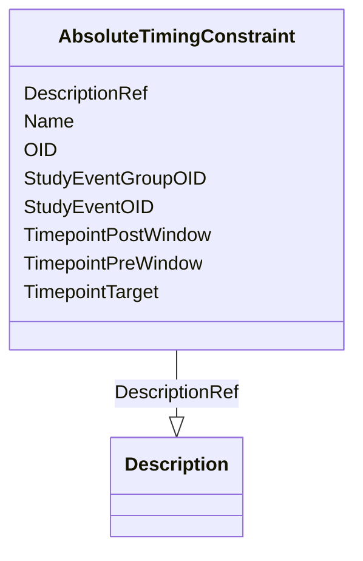

# Class: AbsoluteTimingConstraint


_The element AbsoluteTimingConstraint is used to specify when an activity, represented by either a StudyEventGroup or StudyEvent, can take place. _


URI: [odm:AbsoluteTimingConstraint](http://www.cdisc.org/ns/odm/v2.0/AbsoluteTimingConstraint)





<!-- no inheritance hierarchy -->


## Slots

| Name | Cardinality and Range | Description | Inheritance |
| ---  | --- | --- | --- |
| [OID](OID.md) | 1..1 <br/> [Oid](Oid.md) | Unique identifier | direct |
| [Name](Name.md) | 1..1 <br/> [Name](Name.md) | Human readable name | direct |
| [StudyEventGroupOID](StudyEventGroupOID.md) | 0..1 <br/> [Oidref](Oidref.md) | Reference to StudyEventGroup definition element | direct |
| [StudyEventOID](StudyEventOID.md) | 0..1 <br/> [Oidref](Oidref.md) | Reference to StudyEvent definition element | direct |
| [TimepointTarget](TimepointTarget.md) | 1..1 <br/> [String](String.md) | Specifies the targetted date, time, or datetime | direct |
| [TimepointPreWindow](TimepointPreWindow.md) | 0..1 <br/> [DurationDatetime](DurationDatetime.md) | Specifies the amount of time before the TimepointTarget that the activity may... | direct |
| [TimepointPostWindow](TimepointPostWindow.md) | 0..1 <br/> [DurationDatetime](DurationDatetime.md) | Specifies the amount of time after the TimepointTarget that the activity can ... | direct |
| [DescriptionRef](DescriptionRef.md) | 0..1 <br/> [Description](Description.md) |  | direct |


## Usages

| used by | used in | type | used |
| ---  | --- | --- | --- |
| [StudyTiming](StudyTiming.md) | [AbsoluteTimingConstraintRef](AbsoluteTimingConstraintRef.md) | range | [AbsoluteTimingConstraint](AbsoluteTimingConstraint.md) |


## See Also

* [https://wiki.cdisc.org/display/ODM2/AbsoluteTimingConstraint](https://wiki.cdisc.org/display/ODM2/AbsoluteTimingConstraint)

## Identifier and Mapping Information


### Schema Source


* from schema: http://www.cdisc.org/ns/odm/v2.0


## Mappings

| Mapping Type | Mapped Value |
| ---  | ---  |
| self | odm:AbsoluteTimingConstraint |
| native | odm:AbsoluteTimingConstraint |


## LinkML Source

<!-- TODO: investigate https://stackoverflow.com/questions/37606292/how-to-create-tabbed-code-blocks-in-mkdocs-or-sphinx -->

### Direct

<details>
```yaml
name: AbsoluteTimingConstraint
description: 'The element AbsoluteTimingConstraint is used to specify when an activity,
  represented by either a StudyEventGroup or StudyEvent, can take place. '
from_schema: http://www.cdisc.org/ns/odm/v2.0
see_also:
- https://wiki.cdisc.org/display/ODM2/AbsoluteTimingConstraint
slots:
- OID
- Name
- StudyEventGroupOID
- StudyEventOID
- TimepointTarget
- TimepointPreWindow
- TimepointPostWindow
- DescriptionRef
slot_usage:
  OID:
    name: OID
    description: Unique identifier.
    comments:
    - 'Required

      range:oid'
    domain_of:
    - Study
    - MetaDataVersion
    - Standard
    - ValueListDef
    - WhereClauseDef
    - StudyEventGroupDef
    - StudyEventDef
    - ItemGroupDef
    - ItemDef
    - CodeList
    - MethodDef
    - ConditionDef
    - CommentDef
    - StudyIndication
    - StudyIntervention
    - StudyObjective
    - StudyEndPoint
    - StudyTargetPopulation
    - StudyEstimand
    - Arm
    - Epoch
    - StudyParameter
    - StudyTiming
    - TransitionTimingConstraint
    - AbsoluteTimingConstraint
    - RelativeTimingConstraint
    - DurationTimingConstraint
    - WorkflowDef
    - Transition
    - Branching
    - Criterion
    - ExceptionEvent
    - User
    - Organization
    - Location
    - SignatureDef
    - Query
    range: oid
    required: true
  Name:
    name: Name
    description: Human readable name.
    comments:
    - 'Required

      range:name'
    domain_of:
    - Alias
    - MetaDataVersion
    - Standard
    - StudyEventGroupDef
    - StudyEventDef
    - ItemGroupDef
    - Class
    - SubClass
    - SourceItem
    - Resource
    - ItemDef
    - CodeList
    - MethodDef
    - Parameter
    - ReturnValue
    - ConditionDef
    - StudyObjective
    - StudyEndPoint
    - StudyTargetPopulation
    - StudyEstimand
    - Arm
    - Epoch
    - StudyTiming
    - TransitionTimingConstraint
    - AbsoluteTimingConstraint
    - RelativeTimingConstraint
    - DurationTimingConstraint
    - WorkflowDef
    - Transition
    - Branching
    - Criterion
    - ExceptionEvent
    - Organization
    - Location
    - Query
    range: name
    required: true
  StudyEventGroupOID:
    name: StudyEventGroupOID
    description: Reference to StudyEventGroup definition element.
    comments:
    - 'Optional

      range:oidref'
    domain_of:
    - StudyEventGroupRef
    - AbsoluteTimingConstraint
    range: oidref
  StudyEventOID:
    name: StudyEventOID
    description: Reference to StudyEvent definition element.
    comments:
    - 'Optional

      range:oidref'
    domain_of:
    - StudyEventRef
    - AbsoluteTimingConstraint
    - StudyEventData
    - KeySet
    range: oidref
  TimepointTarget:
    name: TimepointTarget
    description: Specifies the targetted date, time, or datetime.
    comments:
    - 'Required

      enum values:(date, time, datetime, partialDate, partialTime, partialDatetime
      )

      Must be expressed in ISO 8601 format. Note it can be incomplete date/datetime;
      for example: if the activity is planned to be at 9:00 am, the value for TimepointTarget
      may be expressed as "-----T09".'
    domain_of:
    - TransitionTimingConstraint
    - AbsoluteTimingConstraint
    required: true
    any_of:
    - range: date
    - range: time
    - range: datetime
    - range: partialDate
    - range: partialTime
    - range: partialDatetime
  TimepointPreWindow:
    name: TimepointPreWindow
    description: 'Specifies the amount of time before the TimepointTarget that the
      activity may be started. '
    comments:
    - 'Optional

      range:durationDatetime

      Must be expressed as an ISO 8601 duration.'
    domain_of:
    - TransitionTimingConstraint
    - AbsoluteTimingConstraint
    - RelativeTimingConstraint
    range: durationDatetime
  TimepointPostWindow:
    name: TimepointPostWindow
    description: 'Specifies the amount of time after the TimepointTarget that the
      activity can be started. '
    comments:
    - 'Optional

      range:durationDatetime

      Must be expressed as an ISO 8601 duration.'
    domain_of:
    - TransitionTimingConstraint
    - AbsoluteTimingConstraint
    - RelativeTimingConstraint
    range: durationDatetime
  DescriptionRef:
    name: DescriptionRef
    domain_of:
    - Study
    - MetaDataVersion
    - ValueListDef
    - StudyEventGroupRef
    - StudyEventGroupDef
    - StudyEventDef
    - ItemGroupDef
    - Origin
    - ItemDef
    - CodeList
    - CodeListItem
    - MethodDef
    - ConditionDef
    - CommentDef
    - Protocol
    - StudyStructure
    - TrialPhase
    - StudyIndication
    - StudyIntervention
    - StudyObjective
    - StudyEndPoint
    - StudyTargetPopulation
    - StudyEstimand
    - IntercurrentEvent
    - SummaryMeasure
    - Arm
    - Epoch
    - TransitionTimingConstraint
    - AbsoluteTimingConstraint
    - RelativeTimingConstraint
    - DurationTimingConstraint
    - WorkflowDef
    - Criterion
    - ExceptionEvent
    - Organization
    - Location
    - ODMFileMetadata
    range: Description
    maximum_cardinality: 1
class_uri: odm:AbsoluteTimingConstraint

```
</details>

### Induced

<details>
```yaml
name: AbsoluteTimingConstraint
description: 'The element AbsoluteTimingConstraint is used to specify when an activity,
  represented by either a StudyEventGroup or StudyEvent, can take place. '
from_schema: http://www.cdisc.org/ns/odm/v2.0
see_also:
- https://wiki.cdisc.org/display/ODM2/AbsoluteTimingConstraint
slot_usage:
  OID:
    name: OID
    description: Unique identifier.
    comments:
    - 'Required

      range:oid'
    domain_of:
    - Study
    - MetaDataVersion
    - Standard
    - ValueListDef
    - WhereClauseDef
    - StudyEventGroupDef
    - StudyEventDef
    - ItemGroupDef
    - ItemDef
    - CodeList
    - MethodDef
    - ConditionDef
    - CommentDef
    - StudyIndication
    - StudyIntervention
    - StudyObjective
    - StudyEndPoint
    - StudyTargetPopulation
    - StudyEstimand
    - Arm
    - Epoch
    - StudyParameter
    - StudyTiming
    - TransitionTimingConstraint
    - AbsoluteTimingConstraint
    - RelativeTimingConstraint
    - DurationTimingConstraint
    - WorkflowDef
    - Transition
    - Branching
    - Criterion
    - ExceptionEvent
    - User
    - Organization
    - Location
    - SignatureDef
    - Query
    range: oid
    required: true
  Name:
    name: Name
    description: Human readable name.
    comments:
    - 'Required

      range:name'
    domain_of:
    - Alias
    - MetaDataVersion
    - Standard
    - StudyEventGroupDef
    - StudyEventDef
    - ItemGroupDef
    - Class
    - SubClass
    - SourceItem
    - Resource
    - ItemDef
    - CodeList
    - MethodDef
    - Parameter
    - ReturnValue
    - ConditionDef
    - StudyObjective
    - StudyEndPoint
    - StudyTargetPopulation
    - StudyEstimand
    - Arm
    - Epoch
    - StudyTiming
    - TransitionTimingConstraint
    - AbsoluteTimingConstraint
    - RelativeTimingConstraint
    - DurationTimingConstraint
    - WorkflowDef
    - Transition
    - Branching
    - Criterion
    - ExceptionEvent
    - Organization
    - Location
    - Query
    range: name
    required: true
  StudyEventGroupOID:
    name: StudyEventGroupOID
    description: Reference to StudyEventGroup definition element.
    comments:
    - 'Optional

      range:oidref'
    domain_of:
    - StudyEventGroupRef
    - AbsoluteTimingConstraint
    range: oidref
  StudyEventOID:
    name: StudyEventOID
    description: Reference to StudyEvent definition element.
    comments:
    - 'Optional

      range:oidref'
    domain_of:
    - StudyEventRef
    - AbsoluteTimingConstraint
    - StudyEventData
    - KeySet
    range: oidref
  TimepointTarget:
    name: TimepointTarget
    description: Specifies the targetted date, time, or datetime.
    comments:
    - 'Required

      enum values:(date, time, datetime, partialDate, partialTime, partialDatetime
      )

      Must be expressed in ISO 8601 format. Note it can be incomplete date/datetime;
      for example: if the activity is planned to be at 9:00 am, the value for TimepointTarget
      may be expressed as "-----T09".'
    domain_of:
    - TransitionTimingConstraint
    - AbsoluteTimingConstraint
    required: true
    any_of:
    - range: date
    - range: time
    - range: datetime
    - range: partialDate
    - range: partialTime
    - range: partialDatetime
  TimepointPreWindow:
    name: TimepointPreWindow
    description: 'Specifies the amount of time before the TimepointTarget that the
      activity may be started. '
    comments:
    - 'Optional

      range:durationDatetime

      Must be expressed as an ISO 8601 duration.'
    domain_of:
    - TransitionTimingConstraint
    - AbsoluteTimingConstraint
    - RelativeTimingConstraint
    range: durationDatetime
  TimepointPostWindow:
    name: TimepointPostWindow
    description: 'Specifies the amount of time after the TimepointTarget that the
      activity can be started. '
    comments:
    - 'Optional

      range:durationDatetime

      Must be expressed as an ISO 8601 duration.'
    domain_of:
    - TransitionTimingConstraint
    - AbsoluteTimingConstraint
    - RelativeTimingConstraint
    range: durationDatetime
  DescriptionRef:
    name: DescriptionRef
    domain_of:
    - Study
    - MetaDataVersion
    - ValueListDef
    - StudyEventGroupRef
    - StudyEventGroupDef
    - StudyEventDef
    - ItemGroupDef
    - Origin
    - ItemDef
    - CodeList
    - CodeListItem
    - MethodDef
    - ConditionDef
    - CommentDef
    - Protocol
    - StudyStructure
    - TrialPhase
    - StudyIndication
    - StudyIntervention
    - StudyObjective
    - StudyEndPoint
    - StudyTargetPopulation
    - StudyEstimand
    - IntercurrentEvent
    - SummaryMeasure
    - Arm
    - Epoch
    - TransitionTimingConstraint
    - AbsoluteTimingConstraint
    - RelativeTimingConstraint
    - DurationTimingConstraint
    - WorkflowDef
    - Criterion
    - ExceptionEvent
    - Organization
    - Location
    - ODMFileMetadata
    range: Description
    maximum_cardinality: 1
attributes:
  OID:
    name: OID
    description: Unique identifier.
    comments:
    - 'Required

      range:oid'
    from_schema: http://www.cdisc.org/ns/odm/v2.0
    rank: 1000
    identifier: true
    alias: OID
    owner: AbsoluteTimingConstraint
    domain_of:
    - Study
    - MetaDataVersion
    - Standard
    - ValueListDef
    - WhereClauseDef
    - StudyEventGroupDef
    - StudyEventDef
    - ItemGroupDef
    - ItemDef
    - CodeList
    - MethodDef
    - ConditionDef
    - CommentDef
    - StudyIndication
    - StudyIntervention
    - StudyObjective
    - StudyEndPoint
    - StudyTargetPopulation
    - StudyEstimand
    - Arm
    - Epoch
    - StudyParameter
    - StudyTiming
    - TransitionTimingConstraint
    - AbsoluteTimingConstraint
    - RelativeTimingConstraint
    - DurationTimingConstraint
    - WorkflowDef
    - Transition
    - Branching
    - Criterion
    - ExceptionEvent
    - User
    - Organization
    - Location
    - SignatureDef
    - Query
    range: oid
    required: true
  Name:
    name: Name
    description: Human readable name.
    comments:
    - 'Required

      range:name'
    from_schema: http://www.cdisc.org/ns/odm/v2.0
    rank: 1000
    alias: Name
    owner: AbsoluteTimingConstraint
    domain_of:
    - Alias
    - MetaDataVersion
    - Standard
    - StudyEventGroupDef
    - StudyEventDef
    - ItemGroupDef
    - Class
    - SubClass
    - SourceItem
    - Resource
    - ItemDef
    - CodeList
    - MethodDef
    - Parameter
    - ReturnValue
    - ConditionDef
    - StudyObjective
    - StudyEndPoint
    - StudyTargetPopulation
    - StudyEstimand
    - Arm
    - Epoch
    - StudyTiming
    - TransitionTimingConstraint
    - AbsoluteTimingConstraint
    - RelativeTimingConstraint
    - DurationTimingConstraint
    - WorkflowDef
    - Transition
    - Branching
    - Criterion
    - ExceptionEvent
    - Organization
    - Location
    - Query
    range: name
    required: true
  StudyEventGroupOID:
    name: StudyEventGroupOID
    description: Reference to StudyEventGroup definition element.
    comments:
    - 'Optional

      range:oidref'
    from_schema: http://www.cdisc.org/ns/odm/v2.0
    rank: 1000
    alias: StudyEventGroupOID
    owner: AbsoluteTimingConstraint
    domain_of:
    - StudyEventGroupRef
    - AbsoluteTimingConstraint
    range: oidref
  StudyEventOID:
    name: StudyEventOID
    description: Reference to StudyEvent definition element.
    comments:
    - 'Optional

      range:oidref'
    from_schema: http://www.cdisc.org/ns/odm/v2.0
    rank: 1000
    alias: StudyEventOID
    owner: AbsoluteTimingConstraint
    domain_of:
    - StudyEventRef
    - AbsoluteTimingConstraint
    - StudyEventData
    - KeySet
    range: oidref
  TimepointTarget:
    name: TimepointTarget
    description: Specifies the targetted date, time, or datetime.
    comments:
    - 'Required

      enum values:(date, time, datetime, partialDate, partialTime, partialDatetime
      )

      Must be expressed in ISO 8601 format. Note it can be incomplete date/datetime;
      for example: if the activity is planned to be at 9:00 am, the value for TimepointTarget
      may be expressed as "-----T09".'
    from_schema: http://www.cdisc.org/ns/odm/v2.0
    rank: 1000
    alias: TimepointTarget
    owner: AbsoluteTimingConstraint
    domain_of:
    - TransitionTimingConstraint
    - AbsoluteTimingConstraint
    range: string
    required: true
    any_of:
    - range: date
    - range: time
    - range: datetime
    - range: partialDate
    - range: partialTime
    - range: partialDatetime
  TimepointPreWindow:
    name: TimepointPreWindow
    description: 'Specifies the amount of time before the TimepointTarget that the
      activity may be started. '
    comments:
    - 'Optional

      range:durationDatetime

      Must be expressed as an ISO 8601 duration.'
    from_schema: http://www.cdisc.org/ns/odm/v2.0
    rank: 1000
    alias: TimepointPreWindow
    owner: AbsoluteTimingConstraint
    domain_of:
    - TransitionTimingConstraint
    - AbsoluteTimingConstraint
    - RelativeTimingConstraint
    range: durationDatetime
  TimepointPostWindow:
    name: TimepointPostWindow
    description: 'Specifies the amount of time after the TimepointTarget that the
      activity can be started. '
    comments:
    - 'Optional

      range:durationDatetime

      Must be expressed as an ISO 8601 duration.'
    from_schema: http://www.cdisc.org/ns/odm/v2.0
    rank: 1000
    alias: TimepointPostWindow
    owner: AbsoluteTimingConstraint
    domain_of:
    - TransitionTimingConstraint
    - AbsoluteTimingConstraint
    - RelativeTimingConstraint
    range: durationDatetime
  DescriptionRef:
    name: DescriptionRef
    from_schema: http://www.cdisc.org/ns/odm/v2.0
    rank: 1000
    identifier: false
    alias: DescriptionRef
    owner: AbsoluteTimingConstraint
    domain_of:
    - Study
    - MetaDataVersion
    - ValueListDef
    - StudyEventGroupRef
    - StudyEventGroupDef
    - StudyEventDef
    - ItemGroupDef
    - Origin
    - ItemDef
    - CodeList
    - CodeListItem
    - MethodDef
    - ConditionDef
    - CommentDef
    - Protocol
    - StudyStructure
    - TrialPhase
    - StudyIndication
    - StudyIntervention
    - StudyObjective
    - StudyEndPoint
    - StudyTargetPopulation
    - StudyEstimand
    - IntercurrentEvent
    - SummaryMeasure
    - Arm
    - Epoch
    - TransitionTimingConstraint
    - AbsoluteTimingConstraint
    - RelativeTimingConstraint
    - DurationTimingConstraint
    - WorkflowDef
    - Criterion
    - ExceptionEvent
    - Organization
    - Location
    - ODMFileMetadata
    range: Description
    maximum_cardinality: 1
class_uri: odm:AbsoluteTimingConstraint

```
</details>