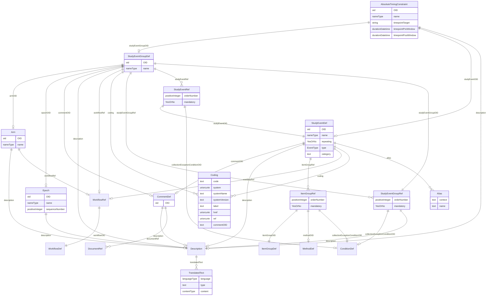

# Class: AbsoluteTimingConstraint

_The element AbsoluteTimingConstraint is used to specify when an activity, represented by either a StudyEventGroup or StudyEvent, can take place._


URI: [odm:AbsoluteTimingConstraint](http://www.cdisc.org/ns/odm/v2.0/AbsoluteTimingConstraint)





<!-- no inheritance hierarchy -->


## Slots

| Name | Cardinality* and Range | Description | Inheritance |
| ---  | --- | --- | --- |
| [OID](OID.md) | 1..1 <br/> [oid](oid.md) | Unique identifier. | direct |
| [name](name.md) | 1..1 <br/> [nameType](nameType.md) | Human readable name. | direct |
| [studyEventGroupOID](studyEventGroupOID.md) | 0..1 <br/> [StudyEventGroupDef](StudyEventGroupDef.md) | Reference to StudyEventGroup definition element. | direct |
| [studyEventOID](studyEventOID.md) | 0..1 <br/> [StudyEventDef](StudyEventDef.md) | Reference to StudyEvent definition element. | direct |
| [timepointTarget](timepointTarget.md) | 1..1 <br/> [string](string.md) | Specifies the targetted date, time, or datetime. | direct |
| [timepointPreWindow](timepointPreWindow.md) | 0..1 <br/> [durationDatetime](durationDatetime.md) | Specifies the amount of time before the TimepointTarget that the activity may... | direct |
| [timepointPostWindow](timepointPostWindow.md) | 0..1 <br/> [durationDatetime](durationDatetime.md) | Specifies the amount of time after the TimepointTarget that the activity can ... | direct |
| [description](description.md) | 0..1 <br/> [Description](Description.md) | Description reference: A free-text description of the containing metadata com... | direct |

_* See [LinkML documentation](https://linkml.io/linkml/schemas/slots.html#slot-cardinality) for cardinality definitions._


## Usages

| used by | used in | type | used |
| ---  | --- | --- | --- |
| [StudyTiming](StudyTiming.md) | [absoluteTimingConstraint](absoluteTimingConstraint.md) | range | [AbsoluteTimingConstraint](AbsoluteTimingConstraint.md) |


## See Also

* [https://wiki.cdisc.org/display/PUB/AbsoluteTimingConstraint](https://wiki.cdisc.org/display/PUB/AbsoluteTimingConstraint)

## Identifier and Mapping Information


### Schema Source


* from schema: http://www.cdisc.org/ns/odm/v2.0


## Mappings

| Mapping Type | Mapped Value |
| ---  | ---  |
| self | odm:AbsoluteTimingConstraint |
| native | odm:AbsoluteTimingConstraint |


## LinkML Source

<!-- TODO: investigate https://stackoverflow.com/questions/37606292/how-to-create-tabbed-code-blocks-in-mkdocs-or-sphinx -->

### Direct

<details>
```yaml
name: AbsoluteTimingConstraint
description: The element AbsoluteTimingConstraint is used to specify when an activity,
  represented by either a StudyEventGroup or StudyEvent, can take place.
from_schema: http://www.cdisc.org/ns/odm/v2.0
see_also:
- https://wiki.cdisc.org/display/PUB/AbsoluteTimingConstraint
rank: 1000
slots:
- OID
- name
- studyEventGroupOID
- studyEventOID
- timepointTarget
- timepointPreWindow
- timepointPostWindow
- description
slot_usage:
  OID:
    name: OID
    description: Unique identifier.
    comments:
    - 'Required

      range: oid'
    identifier: true
    domain_of:
    - Study
    - MetaDataVersion
    - Standard
    - ValueListDef
    - WhereClauseDef
    - StudyEventGroupDef
    - StudyEventDef
    - ItemGroupDef
    - ItemDef
    - CodeList
    - MethodDef
    - ConditionDef
    - CommentDef
    - StudyIndication
    - StudyIntervention
    - StudyObjective
    - StudyEndPoint
    - StudyTargetPopulation
    - StudyEstimand
    - Arm
    - Epoch
    - StudyParameter
    - StudyTiming
    - TransitionTimingConstraint
    - AbsoluteTimingConstraint
    - RelativeTimingConstraint
    - DurationTimingConstraint
    - WorkflowDef
    - Transition
    - Branching
    - Criterion
    - User
    - Organization
    - Location
    - SignatureDef
    - Query
    range: oid
    required: true
  name:
    name: name
    description: Human readable name.
    comments:
    - 'Required

      range: name'
    domain_of:
    - Alias
    - MetaDataVersion
    - Standard
    - StudyEventGroupDef
    - StudyEventDef
    - ItemGroupDef
    - Class
    - SubClass
    - SourceItem
    - Resource
    - ItemDef
    - CodeList
    - MethodDef
    - Parameter
    - ReturnValue
    - ConditionDef
    - StudyObjective
    - StudyEndPoint
    - StudyTargetPopulation
    - StudyEstimand
    - Arm
    - Epoch
    - StudyTiming
    - TransitionTimingConstraint
    - AbsoluteTimingConstraint
    - RelativeTimingConstraint
    - DurationTimingConstraint
    - WorkflowDef
    - Transition
    - Branching
    - Criterion
    - Organization
    - Location
    - Query
    range: nameType
    required: true
  studyEventGroupOID:
    name: studyEventGroupOID
    description: Reference to StudyEventGroup definition element.
    comments:
    - 'Optional

      range: oidref'
    domain_of:
    - StudyEventGroupRef
    - AbsoluteTimingConstraint
    range: StudyEventGroupDef
  studyEventOID:
    name: studyEventOID
    description: Reference to StudyEvent definition element.
    comments:
    - 'Optional

      range: oidref'
    domain_of:
    - StudyEventRef
    - AbsoluteTimingConstraint
    - StudyEventData
    - KeySet
    range: StudyEventDef
  timepointTarget:
    name: timepointTarget
    description: Specifies the targetted date, time, or datetime.
    comments:
    - 'Required

      enum values: ( date , time , datetime , partialDate , partialTime , partialDatetime
      )

      Must be expressed in ISO 8601 format. Note it can be incomplete date/datetime;
      for example: if the activity is planned to be at 9:00 am, the value for TimepointTarget
      may be expressed as "-----T09".'
    domain_of:
    - TransitionTimingConstraint
    - AbsoluteTimingConstraint
    required: true
    any_of:
    - range: date
    - range: time
    - range: datetime
    - range: partialDate
    - range: partialTime
    - range: partialDatetime
  timepointPreWindow:
    name: timepointPreWindow
    description: Specifies the amount of time before the TimepointTarget that the
      activity may be started.
    comments:
    - 'Optional

      range: durationDatetime

      Must be expressed as an ISO 8601 duration.'
    domain_of:
    - TransitionTimingConstraint
    - AbsoluteTimingConstraint
    - RelativeTimingConstraint
    range: durationDatetime
  timepointPostWindow:
    name: timepointPostWindow
    description: Specifies the amount of time after the TimepointTarget that the activity
      can be started.
    comments:
    - 'Optional

      range: durationDatetime

      Must be expressed as an ISO 8601 duration.'
    domain_of:
    - TransitionTimingConstraint
    - AbsoluteTimingConstraint
    - RelativeTimingConstraint
    range: durationDatetime
  description:
    name: description
    domain_of:
    - Study
    - MetaDataVersion
    - ValueListDef
    - StudyEventGroupRef
    - StudyEventGroupDef
    - StudyEventDef
    - ItemGroupDef
    - Origin
    - ItemDef
    - CodeList
    - CodeListItem
    - MethodDef
    - ConditionDef
    - CommentDef
    - Protocol
    - StudyStructure
    - TrialPhase
    - StudyIndication
    - StudyIntervention
    - StudyObjective
    - StudyEndPoint
    - StudyTargetPopulation
    - StudyEstimand
    - IntercurrentEvent
    - SummaryMeasure
    - Arm
    - Epoch
    - TransitionTimingConstraint
    - AbsoluteTimingConstraint
    - RelativeTimingConstraint
    - DurationTimingConstraint
    - WorkflowDef
    - Criterion
    - Organization
    - Location
    - ODMFileMetadata
    range: Description
    maximum_cardinality: 1
class_uri: odm:AbsoluteTimingConstraint

```
</details>

### Induced

<details>
```yaml
name: AbsoluteTimingConstraint
description: The element AbsoluteTimingConstraint is used to specify when an activity,
  represented by either a StudyEventGroup or StudyEvent, can take place.
from_schema: http://www.cdisc.org/ns/odm/v2.0
see_also:
- https://wiki.cdisc.org/display/PUB/AbsoluteTimingConstraint
rank: 1000
slot_usage:
  OID:
    name: OID
    description: Unique identifier.
    comments:
    - 'Required

      range: oid'
    identifier: true
    domain_of:
    - Study
    - MetaDataVersion
    - Standard
    - ValueListDef
    - WhereClauseDef
    - StudyEventGroupDef
    - StudyEventDef
    - ItemGroupDef
    - ItemDef
    - CodeList
    - MethodDef
    - ConditionDef
    - CommentDef
    - StudyIndication
    - StudyIntervention
    - StudyObjective
    - StudyEndPoint
    - StudyTargetPopulation
    - StudyEstimand
    - Arm
    - Epoch
    - StudyParameter
    - StudyTiming
    - TransitionTimingConstraint
    - AbsoluteTimingConstraint
    - RelativeTimingConstraint
    - DurationTimingConstraint
    - WorkflowDef
    - Transition
    - Branching
    - Criterion
    - User
    - Organization
    - Location
    - SignatureDef
    - Query
    range: oid
    required: true
  name:
    name: name
    description: Human readable name.
    comments:
    - 'Required

      range: name'
    domain_of:
    - Alias
    - MetaDataVersion
    - Standard
    - StudyEventGroupDef
    - StudyEventDef
    - ItemGroupDef
    - Class
    - SubClass
    - SourceItem
    - Resource
    - ItemDef
    - CodeList
    - MethodDef
    - Parameter
    - ReturnValue
    - ConditionDef
    - StudyObjective
    - StudyEndPoint
    - StudyTargetPopulation
    - StudyEstimand
    - Arm
    - Epoch
    - StudyTiming
    - TransitionTimingConstraint
    - AbsoluteTimingConstraint
    - RelativeTimingConstraint
    - DurationTimingConstraint
    - WorkflowDef
    - Transition
    - Branching
    - Criterion
    - Organization
    - Location
    - Query
    range: nameType
    required: true
  studyEventGroupOID:
    name: studyEventGroupOID
    description: Reference to StudyEventGroup definition element.
    comments:
    - 'Optional

      range: oidref'
    domain_of:
    - StudyEventGroupRef
    - AbsoluteTimingConstraint
    range: StudyEventGroupDef
  studyEventOID:
    name: studyEventOID
    description: Reference to StudyEvent definition element.
    comments:
    - 'Optional

      range: oidref'
    domain_of:
    - StudyEventRef
    - AbsoluteTimingConstraint
    - StudyEventData
    - KeySet
    range: StudyEventDef
  timepointTarget:
    name: timepointTarget
    description: Specifies the targetted date, time, or datetime.
    comments:
    - 'Required

      enum values: ( date , time , datetime , partialDate , partialTime , partialDatetime
      )

      Must be expressed in ISO 8601 format. Note it can be incomplete date/datetime;
      for example: if the activity is planned to be at 9:00 am, the value for TimepointTarget
      may be expressed as "-----T09".'
    domain_of:
    - TransitionTimingConstraint
    - AbsoluteTimingConstraint
    required: true
    any_of:
    - range: date
    - range: time
    - range: datetime
    - range: partialDate
    - range: partialTime
    - range: partialDatetime
  timepointPreWindow:
    name: timepointPreWindow
    description: Specifies the amount of time before the TimepointTarget that the
      activity may be started.
    comments:
    - 'Optional

      range: durationDatetime

      Must be expressed as an ISO 8601 duration.'
    domain_of:
    - TransitionTimingConstraint
    - AbsoluteTimingConstraint
    - RelativeTimingConstraint
    range: durationDatetime
  timepointPostWindow:
    name: timepointPostWindow
    description: Specifies the amount of time after the TimepointTarget that the activity
      can be started.
    comments:
    - 'Optional

      range: durationDatetime

      Must be expressed as an ISO 8601 duration.'
    domain_of:
    - TransitionTimingConstraint
    - AbsoluteTimingConstraint
    - RelativeTimingConstraint
    range: durationDatetime
  description:
    name: description
    domain_of:
    - Study
    - MetaDataVersion
    - ValueListDef
    - StudyEventGroupRef
    - StudyEventGroupDef
    - StudyEventDef
    - ItemGroupDef
    - Origin
    - ItemDef
    - CodeList
    - CodeListItem
    - MethodDef
    - ConditionDef
    - CommentDef
    - Protocol
    - StudyStructure
    - TrialPhase
    - StudyIndication
    - StudyIntervention
    - StudyObjective
    - StudyEndPoint
    - StudyTargetPopulation
    - StudyEstimand
    - IntercurrentEvent
    - SummaryMeasure
    - Arm
    - Epoch
    - TransitionTimingConstraint
    - AbsoluteTimingConstraint
    - RelativeTimingConstraint
    - DurationTimingConstraint
    - WorkflowDef
    - Criterion
    - Organization
    - Location
    - ODMFileMetadata
    range: Description
    maximum_cardinality: 1
attributes:
  OID:
    name: OID
    description: Unique identifier.
    comments:
    - 'Required

      range: oid'
    from_schema: http://www.cdisc.org/ns/odm/v2.0
    rank: 1000
    identifier: true
    alias: OID
    owner: AbsoluteTimingConstraint
    domain_of:
    - Study
    - MetaDataVersion
    - Standard
    - ValueListDef
    - WhereClauseDef
    - StudyEventGroupDef
    - StudyEventDef
    - ItemGroupDef
    - ItemDef
    - CodeList
    - MethodDef
    - ConditionDef
    - CommentDef
    - StudyIndication
    - StudyIntervention
    - StudyObjective
    - StudyEndPoint
    - StudyTargetPopulation
    - StudyEstimand
    - Arm
    - Epoch
    - StudyParameter
    - StudyTiming
    - TransitionTimingConstraint
    - AbsoluteTimingConstraint
    - RelativeTimingConstraint
    - DurationTimingConstraint
    - WorkflowDef
    - Transition
    - Branching
    - Criterion
    - User
    - Organization
    - Location
    - SignatureDef
    - Query
    range: oid
    required: true
  name:
    name: name
    description: Human readable name.
    comments:
    - 'Required

      range: name'
    from_schema: http://www.cdisc.org/ns/odm/v2.0
    rank: 1000
    alias: name
    owner: AbsoluteTimingConstraint
    domain_of:
    - Alias
    - MetaDataVersion
    - Standard
    - StudyEventGroupDef
    - StudyEventDef
    - ItemGroupDef
    - Class
    - SubClass
    - SourceItem
    - Resource
    - ItemDef
    - CodeList
    - MethodDef
    - Parameter
    - ReturnValue
    - ConditionDef
    - StudyObjective
    - StudyEndPoint
    - StudyTargetPopulation
    - StudyEstimand
    - Arm
    - Epoch
    - StudyTiming
    - TransitionTimingConstraint
    - AbsoluteTimingConstraint
    - RelativeTimingConstraint
    - DurationTimingConstraint
    - WorkflowDef
    - Transition
    - Branching
    - Criterion
    - Organization
    - Location
    - Query
    range: nameType
    required: true
  studyEventGroupOID:
    name: studyEventGroupOID
    description: Reference to StudyEventGroup definition element.
    comments:
    - 'Optional

      range: oidref'
    from_schema: http://www.cdisc.org/ns/odm/v2.0
    rank: 1000
    alias: studyEventGroupOID
    owner: AbsoluteTimingConstraint
    domain_of:
    - StudyEventGroupRef
    - AbsoluteTimingConstraint
    range: StudyEventGroupDef
  studyEventOID:
    name: studyEventOID
    description: Reference to StudyEvent definition element.
    comments:
    - 'Optional

      range: oidref'
    from_schema: http://www.cdisc.org/ns/odm/v2.0
    rank: 1000
    alias: studyEventOID
    owner: AbsoluteTimingConstraint
    domain_of:
    - StudyEventRef
    - AbsoluteTimingConstraint
    - StudyEventData
    - KeySet
    range: StudyEventDef
  timepointTarget:
    name: timepointTarget
    description: Specifies the targetted date, time, or datetime.
    comments:
    - 'Required

      enum values: ( date , time , datetime , partialDate , partialTime , partialDatetime
      )

      Must be expressed in ISO 8601 format. Note it can be incomplete date/datetime;
      for example: if the activity is planned to be at 9:00 am, the value for TimepointTarget
      may be expressed as "-----T09".'
    from_schema: http://www.cdisc.org/ns/odm/v2.0
    rank: 1000
    alias: timepointTarget
    owner: AbsoluteTimingConstraint
    domain_of:
    - TransitionTimingConstraint
    - AbsoluteTimingConstraint
    range: string
    required: true
    any_of:
    - range: date
    - range: time
    - range: datetime
    - range: partialDate
    - range: partialTime
    - range: partialDatetime
  timepointPreWindow:
    name: timepointPreWindow
    description: Specifies the amount of time before the TimepointTarget that the
      activity may be started.
    comments:
    - 'Optional

      range: durationDatetime

      Must be expressed as an ISO 8601 duration.'
    from_schema: http://www.cdisc.org/ns/odm/v2.0
    rank: 1000
    alias: timepointPreWindow
    owner: AbsoluteTimingConstraint
    domain_of:
    - TransitionTimingConstraint
    - AbsoluteTimingConstraint
    - RelativeTimingConstraint
    range: durationDatetime
  timepointPostWindow:
    name: timepointPostWindow
    description: Specifies the amount of time after the TimepointTarget that the activity
      can be started.
    comments:
    - 'Optional

      range: durationDatetime

      Must be expressed as an ISO 8601 duration.'
    from_schema: http://www.cdisc.org/ns/odm/v2.0
    rank: 1000
    alias: timepointPostWindow
    owner: AbsoluteTimingConstraint
    domain_of:
    - TransitionTimingConstraint
    - AbsoluteTimingConstraint
    - RelativeTimingConstraint
    range: durationDatetime
  description:
    name: description
    description: 'Description reference: A free-text description of the containing
      metadata component, unless restricted by Business Rules.'
    from_schema: http://www.cdisc.org/ns/odm/v2.0
    rank: 1000
    alias: description
    owner: AbsoluteTimingConstraint
    domain_of:
    - Study
    - MetaDataVersion
    - ValueListDef
    - StudyEventGroupRef
    - StudyEventGroupDef
    - StudyEventDef
    - ItemGroupDef
    - Origin
    - ItemDef
    - CodeList
    - CodeListItem
    - MethodDef
    - ConditionDef
    - CommentDef
    - Protocol
    - StudyStructure
    - TrialPhase
    - StudyIndication
    - StudyIntervention
    - StudyObjective
    - StudyEndPoint
    - StudyTargetPopulation
    - StudyEstimand
    - IntercurrentEvent
    - SummaryMeasure
    - Arm
    - Epoch
    - TransitionTimingConstraint
    - AbsoluteTimingConstraint
    - RelativeTimingConstraint
    - DurationTimingConstraint
    - WorkflowDef
    - Criterion
    - Organization
    - Location
    - ODMFileMetadata
    range: Description
    maximum_cardinality: 1
class_uri: odm:AbsoluteTimingConstraint

```
</details>