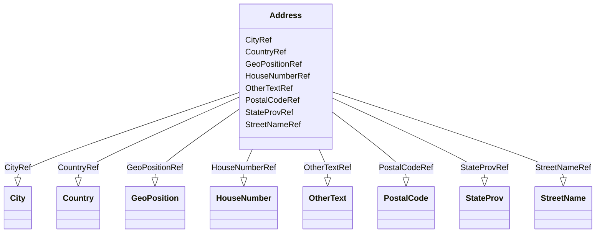

# Class: Address


_The postal address for a user, location, or organization._


URI: [odm:Address](http://www.cdisc.org/ns/odm/v2.0/Address)





<!-- no inheritance hierarchy -->


## Slots

| Name | Cardinality and Range | Description | Inheritance |
| ---  | --- | --- | --- |
| [StreetNameRef](StreetNameRef.md) | 0..1 <br/> [StreetName](StreetName.md) |  | direct |
| [HouseNumberRef](HouseNumberRef.md) | 0..1 <br/> [HouseNumber](HouseNumber.md) |  | direct |
| [CityRef](CityRef.md) | 0..1 <br/> [City](City.md) |  | direct |
| [StateProvRef](StateProvRef.md) | 0..1 <br/> [StateProv](StateProv.md) |  | direct |
| [CountryRef](CountryRef.md) | 0..1 <br/> [Country](Country.md) |  | direct |
| [PostalCodeRef](PostalCodeRef.md) | 0..1 <br/> [PostalCode](PostalCode.md) |  | direct |
| [GeoPositionRef](GeoPositionRef.md) | 0..1 <br/> [GeoPosition](GeoPosition.md) |  | direct |
| [OtherTextRef](OtherTextRef.md) | 0..1 <br/> [OtherText](OtherText.md) |  | direct |


## Usages

| used by | used in | type | used |
| ---  | --- | --- | --- |
| [User](User.md) | [AddressRef](AddressRef.md) | range | [Address](Address.md) |
| [Organization](Organization.md) | [AddressRef](AddressRef.md) | range | [Address](Address.md) |
| [Location](Location.md) | [AddressRef](AddressRef.md) | range | [Address](Address.md) |


## See Also

* [https://wiki.cdisc.org/display/ODM2/Address](https://wiki.cdisc.org/display/ODM2/Address)

## Identifier and Mapping Information


### Schema Source


* from schema: http://www.cdisc.org/ns/odm/v2.0


## Mappings

| Mapping Type | Mapped Value |
| ---  | ---  |
| self | odm:Address |
| native | odm:Address |


## LinkML Source

<!-- TODO: investigate https://stackoverflow.com/questions/37606292/how-to-create-tabbed-code-blocks-in-mkdocs-or-sphinx -->

### Direct

<details>
```yaml
name: Address
description: The postal address for a user, location, or organization.
from_schema: http://www.cdisc.org/ns/odm/v2.0
see_also:
- https://wiki.cdisc.org/display/ODM2/Address
slots:
- StreetNameRef
- HouseNumberRef
- CityRef
- StateProvRef
- CountryRef
- PostalCodeRef
- GeoPositionRef
- OtherTextRef
slot_usage:
  StreetNameRef:
    name: StreetNameRef
    domain_of:
    - Address
    range: StreetName
    maximum_cardinality: 1
  HouseNumberRef:
    name: HouseNumberRef
    domain_of:
    - Address
    range: HouseNumber
    maximum_cardinality: 1
  CityRef:
    name: CityRef
    domain_of:
    - Address
    range: City
    maximum_cardinality: 1
  StateProvRef:
    name: StateProvRef
    domain_of:
    - Address
    range: StateProv
    maximum_cardinality: 1
  CountryRef:
    name: CountryRef
    domain_of:
    - Address
    range: Country
    maximum_cardinality: 1
  PostalCodeRef:
    name: PostalCodeRef
    domain_of:
    - Address
    range: PostalCode
    maximum_cardinality: 1
  GeoPositionRef:
    name: GeoPositionRef
    domain_of:
    - Address
    range: GeoPosition
    maximum_cardinality: 1
  OtherTextRef:
    name: OtherTextRef
    domain_of:
    - Address
    range: OtherText
    maximum_cardinality: 1
class_uri: odm:Address

```
</details>

### Induced

<details>
```yaml
name: Address
description: The postal address for a user, location, or organization.
from_schema: http://www.cdisc.org/ns/odm/v2.0
see_also:
- https://wiki.cdisc.org/display/ODM2/Address
slot_usage:
  StreetNameRef:
    name: StreetNameRef
    domain_of:
    - Address
    range: StreetName
    maximum_cardinality: 1
  HouseNumberRef:
    name: HouseNumberRef
    domain_of:
    - Address
    range: HouseNumber
    maximum_cardinality: 1
  CityRef:
    name: CityRef
    domain_of:
    - Address
    range: City
    maximum_cardinality: 1
  StateProvRef:
    name: StateProvRef
    domain_of:
    - Address
    range: StateProv
    maximum_cardinality: 1
  CountryRef:
    name: CountryRef
    domain_of:
    - Address
    range: Country
    maximum_cardinality: 1
  PostalCodeRef:
    name: PostalCodeRef
    domain_of:
    - Address
    range: PostalCode
    maximum_cardinality: 1
  GeoPositionRef:
    name: GeoPositionRef
    domain_of:
    - Address
    range: GeoPosition
    maximum_cardinality: 1
  OtherTextRef:
    name: OtherTextRef
    domain_of:
    - Address
    range: OtherText
    maximum_cardinality: 1
attributes:
  StreetNameRef:
    name: StreetNameRef
    from_schema: http://www.cdisc.org/ns/odm/v2.0
    rank: 1000
    identifier: false
    alias: StreetNameRef
    owner: Address
    domain_of:
    - Address
    range: StreetName
    maximum_cardinality: 1
  HouseNumberRef:
    name: HouseNumberRef
    from_schema: http://www.cdisc.org/ns/odm/v2.0
    rank: 1000
    identifier: false
    alias: HouseNumberRef
    owner: Address
    domain_of:
    - Address
    range: HouseNumber
    maximum_cardinality: 1
  CityRef:
    name: CityRef
    from_schema: http://www.cdisc.org/ns/odm/v2.0
    rank: 1000
    identifier: false
    alias: CityRef
    owner: Address
    domain_of:
    - Address
    range: City
    maximum_cardinality: 1
  StateProvRef:
    name: StateProvRef
    from_schema: http://www.cdisc.org/ns/odm/v2.0
    rank: 1000
    identifier: false
    alias: StateProvRef
    owner: Address
    domain_of:
    - Address
    range: StateProv
    maximum_cardinality: 1
  CountryRef:
    name: CountryRef
    from_schema: http://www.cdisc.org/ns/odm/v2.0
    rank: 1000
    identifier: false
    alias: CountryRef
    owner: Address
    domain_of:
    - Address
    range: Country
    maximum_cardinality: 1
  PostalCodeRef:
    name: PostalCodeRef
    from_schema: http://www.cdisc.org/ns/odm/v2.0
    rank: 1000
    identifier: false
    alias: PostalCodeRef
    owner: Address
    domain_of:
    - Address
    range: PostalCode
    maximum_cardinality: 1
  GeoPositionRef:
    name: GeoPositionRef
    from_schema: http://www.cdisc.org/ns/odm/v2.0
    rank: 1000
    identifier: false
    alias: GeoPositionRef
    owner: Address
    domain_of:
    - Address
    range: GeoPosition
    maximum_cardinality: 1
  OtherTextRef:
    name: OtherTextRef
    from_schema: http://www.cdisc.org/ns/odm/v2.0
    rank: 1000
    identifier: false
    alias: OtherTextRef
    owner: Address
    domain_of:
    - Address
    range: OtherText
    maximum_cardinality: 1
class_uri: odm:Address

```
</details>