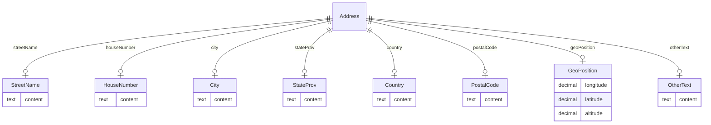

# Class: Address

_The postal address for a user, location, or organization._


URI: [odm:Address](http://www.cdisc.org/ns/odm/v2.0/Address)





<!-- no inheritance hierarchy -->


## Slots

| Name | Cardinality* and Range | Description | Inheritance |
| ---  | --- | --- | --- |
| [streetName](streetName.md) | 0..1 <br/> [StreetName](StreetName.md) | StreetName reference: The street name part of a user's postal address. | direct |
| [houseNumber](houseNumber.md) | 0..1 <br/> [HouseNumber](HouseNumber.md) | HouseNumber reference: The house number part of a user's postal address. | direct |
| [city](city.md) | 0..1 <br/> [City](City.md) | City reference: The city name part of a user's postal address. | direct |
| [stateProv](stateProv.md) | 0..1 <br/> [StateProv](StateProv.md) | StateProv reference: The state or province name part of a user's postal addre... | direct |
| [country](country.md) | 0..1 <br/> [Country](Country.md) | Country reference: The country name part of a user's postal address. For CDIS... | direct |
| [postalCode](postalCode.md) | 0..1 <br/> [PostalCode](PostalCode.md) | PostalCode reference: The postal code part of a user's postal address. | direct |
| [geoPosition](geoPosition.md) | 0..1 <br/> [GeoPosition](GeoPosition.md) | GeoPosition reference: The geographical position using the World Geodetic Sys... | direct |
| [otherText](otherText.md) | 0..1 <br/> [OtherText](OtherText.md) | OtherText reference: Any other text needed as part of a user's postal address... | direct |

_* See [LinkML documentation](https://linkml.io/linkml/schemas/slots.html#slot-cardinality) for cardinality definitions._


## Usages

| used by | used in | type | used |
| ---  | --- | --- | --- |
| [User](User.md) | [address](address.md) | range | [Address](Address.md) |
| [Organization](Organization.md) | [address](address.md) | range | [Address](Address.md) |
| [Location](Location.md) | [address](address.md) | range | [Address](Address.md) |


## See Also

* [https://wiki.cdisc.org/display/PUB/Address](https://wiki.cdisc.org/display/PUB/Address)

## Identifier and Mapping Information


### Schema Source


* from schema: http://www.cdisc.org/ns/odm/v2.0


## Mappings

| Mapping Type | Mapped Value |
| ---  | ---  |
| self | odm:Address |
| native | odm:Address |


## LinkML Source

<!-- TODO: investigate https://stackoverflow.com/questions/37606292/how-to-create-tabbed-code-blocks-in-mkdocs-or-sphinx -->

### Direct

<details>
```yaml
name: Address
description: The postal address for a user, location, or organization.
from_schema: http://www.cdisc.org/ns/odm/v2.0
see_also:
- https://wiki.cdisc.org/display/PUB/Address
rank: 1000
slots:
- streetName
- houseNumber
- city
- stateProv
- country
- postalCode
- geoPosition
- otherText
slot_usage:
  streetName:
    name: streetName
    domain_of:
    - Address
    range: StreetName
    maximum_cardinality: 1
  houseNumber:
    name: houseNumber
    domain_of:
    - Address
    range: HouseNumber
    maximum_cardinality: 1
  city:
    name: city
    domain_of:
    - Address
    range: City
    maximum_cardinality: 1
  stateProv:
    name: stateProv
    domain_of:
    - Address
    range: StateProv
    maximum_cardinality: 1
  country:
    name: country
    domain_of:
    - Address
    range: Country
    maximum_cardinality: 1
  postalCode:
    name: postalCode
    domain_of:
    - Address
    range: PostalCode
    maximum_cardinality: 1
  geoPosition:
    name: geoPosition
    domain_of:
    - Address
    range: GeoPosition
    maximum_cardinality: 1
  otherText:
    name: otherText
    domain_of:
    - Address
    range: OtherText
    maximum_cardinality: 1
class_uri: odm:Address

```
</details>

### Induced

<details>
```yaml
name: Address
description: The postal address for a user, location, or organization.
from_schema: http://www.cdisc.org/ns/odm/v2.0
see_also:
- https://wiki.cdisc.org/display/PUB/Address
rank: 1000
slot_usage:
  streetName:
    name: streetName
    domain_of:
    - Address
    range: StreetName
    maximum_cardinality: 1
  houseNumber:
    name: houseNumber
    domain_of:
    - Address
    range: HouseNumber
    maximum_cardinality: 1
  city:
    name: city
    domain_of:
    - Address
    range: City
    maximum_cardinality: 1
  stateProv:
    name: stateProv
    domain_of:
    - Address
    range: StateProv
    maximum_cardinality: 1
  country:
    name: country
    domain_of:
    - Address
    range: Country
    maximum_cardinality: 1
  postalCode:
    name: postalCode
    domain_of:
    - Address
    range: PostalCode
    maximum_cardinality: 1
  geoPosition:
    name: geoPosition
    domain_of:
    - Address
    range: GeoPosition
    maximum_cardinality: 1
  otherText:
    name: otherText
    domain_of:
    - Address
    range: OtherText
    maximum_cardinality: 1
attributes:
  streetName:
    name: streetName
    description: 'StreetName reference: The street name part of a user''s postal address.'
    from_schema: http://www.cdisc.org/ns/odm/v2.0
    rank: 1000
    alias: streetName
    owner: Address
    domain_of:
    - Address
    range: StreetName
    maximum_cardinality: 1
  houseNumber:
    name: houseNumber
    description: 'HouseNumber reference: The house number part of a user''s postal
      address.'
    from_schema: http://www.cdisc.org/ns/odm/v2.0
    rank: 1000
    alias: houseNumber
    owner: Address
    domain_of:
    - Address
    range: HouseNumber
    maximum_cardinality: 1
  city:
    name: city
    description: 'City reference: The city name part of a user''s postal address.'
    from_schema: http://www.cdisc.org/ns/odm/v2.0
    rank: 1000
    alias: city
    owner: Address
    domain_of:
    - Address
    range: City
    maximum_cardinality: 1
  stateProv:
    name: stateProv
    description: 'StateProv reference: The state or province name part of a user''s
      postal address.'
    from_schema: http://www.cdisc.org/ns/odm/v2.0
    rank: 1000
    alias: stateProv
    owner: Address
    domain_of:
    - Address
    range: StateProv
    maximum_cardinality: 1
  country:
    name: country
    description: 'Country reference: The country name part of a user''s postal address.
      For CDISC SDTM or trial registry applications, this must be represented by an
      ISO 3166 3-letter or US-GENC country code (e.g., FRA for France, JPN for Japan).'
    from_schema: http://www.cdisc.org/ns/odm/v2.0
    rank: 1000
    alias: country
    owner: Address
    domain_of:
    - Address
    range: Country
    maximum_cardinality: 1
  postalCode:
    name: postalCode
    description: 'PostalCode reference: The postal code part of a user''s postal address.'
    from_schema: http://www.cdisc.org/ns/odm/v2.0
    rank: 1000
    alias: postalCode
    owner: Address
    domain_of:
    - Address
    range: PostalCode
    maximum_cardinality: 1
  geoPosition:
    name: geoPosition
    description: 'GeoPosition reference: The geographical position using the World
      Geodetic System WGS84.'
    from_schema: http://www.cdisc.org/ns/odm/v2.0
    rank: 1000
    alias: geoPosition
    owner: Address
    domain_of:
    - Address
    range: GeoPosition
    maximum_cardinality: 1
  otherText:
    name: otherText
    description: 'OtherText reference: Any other text needed as part of a user''s
      postal address.'
    from_schema: http://www.cdisc.org/ns/odm/v2.0
    rank: 1000
    alias: otherText
    owner: Address
    domain_of:
    - Address
    range: OtherText
    maximum_cardinality: 1
class_uri: odm:Address

```
</details>