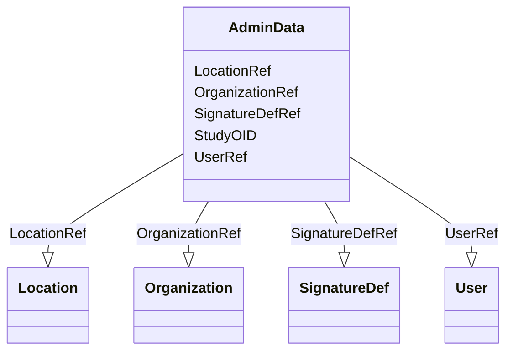

# Class: AdminData


URI: [odm:AdminData](http://www.cdisc.org/ns/odm/v2.0/AdminData)





<!-- no inheritance hierarchy -->


## Slots

| Name | Cardinality and Range | Description | Inheritance |
| ---  | --- | --- | --- |
| [StudyOID](StudyOID.md) | 0..1 <br/> [Oidref](Oidref.md) |  | direct |
| [UserRef](UserRef.md) | 0..* <br/> [User](User.md) |  | direct |
| [OrganizationRef](OrganizationRef.md) | 0..* <br/> [Organization](Organization.md) |  | direct |
| [LocationRef](LocationRef.md) | 0..* <br/> [Location](Location.md) |  | direct |
| [SignatureDefRef](SignatureDefRef.md) | 0..* <br/> [SignatureDef](SignatureDef.md) |  | direct |


## Usages

| used by | used in | type | used |
| ---  | --- | --- | --- |
| [ODMFileMetadata](ODMFileMetadata.md) | [AdminDataRef](AdminDataRef.md) | range | [AdminData](AdminData.md) |


## Identifier and Mapping Information


### Schema Source


* from schema: http://www.cdisc.org/ns/odm/v2.0


## Mappings

| Mapping Type | Mapped Value |
| ---  | ---  |
| self | odm:AdminData |
| native | odm:AdminData |


## LinkML Source

<!-- TODO: investigate https://stackoverflow.com/questions/37606292/how-to-create-tabbed-code-blocks-in-mkdocs-or-sphinx -->

### Direct

<details>
```yaml
name: AdminData
from_schema: http://www.cdisc.org/ns/odm/v2.0
slots:
- StudyOID
- UserRef
- OrganizationRef
- LocationRef
- SignatureDefRef
slot_usage:
  StudyOID:
    name: StudyOID
    domain_of:
    - Include
    - SourceItem
    - AdminData
    - MetaDataVersionRef
    - ReferenceData
    - ClinicalData
    - Association
    - KeySet
    range: oidref
    required: false
  UserRef:
    name: UserRef
    multivalued: true
    domain_of:
    - AdminData
    range: User
    required: false
    minimum_cardinality: 0
  OrganizationRef:
    name: OrganizationRef
    multivalued: true
    domain_of:
    - AdminData
    range: Organization
    required: false
    minimum_cardinality: 0
  LocationRef:
    name: LocationRef
    multivalued: true
    domain_of:
    - AdminData
    range: Location
    required: false
    minimum_cardinality: 0
  SignatureDefRef:
    name: SignatureDefRef
    multivalued: true
    list_elements_unique: true
    domain_of:
    - AdminData
    range: SignatureDef
    required: false
    minimum_cardinality: 0
class_uri: odm:AdminData

```
</details>

### Induced

<details>
```yaml
name: AdminData
from_schema: http://www.cdisc.org/ns/odm/v2.0
slot_usage:
  StudyOID:
    name: StudyOID
    domain_of:
    - Include
    - SourceItem
    - AdminData
    - MetaDataVersionRef
    - ReferenceData
    - ClinicalData
    - Association
    - KeySet
    range: oidref
    required: false
  UserRef:
    name: UserRef
    multivalued: true
    domain_of:
    - AdminData
    range: User
    required: false
    minimum_cardinality: 0
  OrganizationRef:
    name: OrganizationRef
    multivalued: true
    domain_of:
    - AdminData
    range: Organization
    required: false
    minimum_cardinality: 0
  LocationRef:
    name: LocationRef
    multivalued: true
    domain_of:
    - AdminData
    range: Location
    required: false
    minimum_cardinality: 0
  SignatureDefRef:
    name: SignatureDefRef
    multivalued: true
    list_elements_unique: true
    domain_of:
    - AdminData
    range: SignatureDef
    required: false
    minimum_cardinality: 0
attributes:
  StudyOID:
    name: StudyOID
    from_schema: http://www.cdisc.org/ns/odm/v2.0
    rank: 1000
    alias: StudyOID
    owner: AdminData
    domain_of:
    - Include
    - SourceItem
    - AdminData
    - MetaDataVersionRef
    - ReferenceData
    - ClinicalData
    - Association
    - KeySet
    range: oidref
    required: false
  UserRef:
    name: UserRef
    from_schema: http://www.cdisc.org/ns/odm/v2.0
    rank: 1000
    multivalued: true
    alias: UserRef
    owner: AdminData
    domain_of:
    - AdminData
    range: User
    required: false
    minimum_cardinality: 0
  OrganizationRef:
    name: OrganizationRef
    from_schema: http://www.cdisc.org/ns/odm/v2.0
    rank: 1000
    multivalued: true
    alias: OrganizationRef
    owner: AdminData
    domain_of:
    - AdminData
    range: Organization
    required: false
    minimum_cardinality: 0
  LocationRef:
    name: LocationRef
    from_schema: http://www.cdisc.org/ns/odm/v2.0
    rank: 1000
    multivalued: true
    alias: LocationRef
    owner: AdminData
    domain_of:
    - AdminData
    range: Location
    required: false
    minimum_cardinality: 0
  SignatureDefRef:
    name: SignatureDefRef
    from_schema: http://www.cdisc.org/ns/odm/v2.0
    rank: 1000
    multivalued: true
    list_elements_unique: true
    alias: SignatureDefRef
    owner: AdminData
    domain_of:
    - AdminData
    range: SignatureDef
    required: false
    minimum_cardinality: 0
class_uri: odm:AdminData

```
</details>