# Class: AdminData

_Administrative information about users, locations, organizations, and electronic signatures._


URI: [odm:AdminData](http://www.cdisc.org/ns/odm/v2.0/AdminData)

```mermaid
erDiagram
AdminData {
    oidref StudyOID  
}
SignatureDef {
    oid OID  
    SignMethod Methodology  
}
LegalReason {
    text content  
}
Meaning {
    text content  
}
Location {
    oid OID  
    name Name  
    text Role  
    oidref OrganizationOID  
}
Query {
    oid OID  
    QuerySourceType Source  
    text Target  
    QueryType Type  
    QueryStateType State  
    datetime LastUpdateDatetime  
    name Name  
}
Telecom {
    TelecomTypeType TelecomType  
    text ValueRef  
}
Address {

}
MetaDataVersionRef {
    oidref StudyOID  
    oidref MetaDataVersionOID  
    date EffectiveDate  
}
Description {

}
Organization {
    oid OID  
    name Name  
    text Role  
    OrganizationType Type  
    oidref LocationOID  
    oidref PartOfOrganizationOID  
}
User {
    oid OID  
    UserType UserTypeRef  
    oidref OrganizationOID  
    oidref LocationOID  
}
Image {
    fileName ImageFileName  
    text href  
    text MimeType  
}
FamilyName {
    text content  
}
GivenName {
    text content  
}
FullName {
    text content  
}
Suffix {
    text content  
}
Prefix {
    text content  
}
UserName {
    text content  
}

AdminData ||--}o User : "UserRefRef"
AdminData ||--}o Organization : "OrganizationRef"
AdminData ||--}o Location : "LocationRefRef"
AdminData ||--}o SignatureDef : "SignatureDefRef"
SignatureDef ||--|o Meaning : "MeaningRef"
SignatureDef ||--|o LegalReason : "LegalReasonRef"
Location ||--|o Description : "DescriptionRef"
Location ||--}o MetaDataVersionRef : "MetaDataVersionRefRef"
Location ||--}o Address : "AddressRef"
Location ||--}o Telecom : "TelecomRef"
Location ||--}o Query : "QueryRef"
Query ||--|o Value : "ValueRef"
Query ||--}o AuditRecord : "AuditRecordRef"
Address ||--|o StreetName : "StreetNameRef"
Address ||--|o HouseNumber : "HouseNumberRef"
Address ||--|o City : "CityRef"
Address ||--|o StateProv : "StateProvRef"
Address ||--|o Country : "CountryRef"
Address ||--|o PostalCode : "PostalCodeRef"
Address ||--|o GeoPosition : "GeoPositionRef"
Address ||--|o OtherText : "OtherTextRef"
Description ||--}o TranslatedText : "TranslatedTextRef"
Organization ||--|o Description : "DescriptionRef"
Organization ||--}o Address : "AddressRef"
Organization ||--}o Telecom : "TelecomRef"
User ||--|o UserName : "UserNameRef"
User ||--|o Prefix : "PrefixRef"
User ||--|o Suffix : "SuffixRef"
User ||--|o FullName : "FullNameRef"
User ||--|o GivenName : "GivenNameRef"
User ||--|o FamilyName : "FamilyNameRef"
User ||--|o Image : "ImageRef"
User ||--}o Address : "AddressRef"
User ||--}o Telecom : "TelecomRef"

```





<!-- no inheritance hierarchy -->


## Slots

| Name | Cardinality* and Range | Description | Inheritance |
| ---  | --- | --- | --- |
| [StudyOID](StudyOID.md) | 0..1 <br/> [oidref](oidref.md) | Reference to a Study . | direct |
| [UserRefRef](UserRefRef.md) | 0..* <br/> [User](User.md) | UserRef reference: A reference to information about a specific user of a clin... | direct |
| [OrganizationRef](OrganizationRef.md) | 0..* <br/> [Organization](Organization.md) | Organization reference: An organization can reference a parent organization. ... | direct |
| [LocationRefRef](LocationRefRef.md) | 0..* <br/> [Location](Location.md) | LocationRef reference: A reference to the user's physical location. | direct |
| [SignatureDefRef](SignatureDefRef.md) | 0..* <br/> [SignatureDef](SignatureDef.md) | SignatureDef reference: Provides Metadata for signatures included in the /ODM... | direct |

_* See [LinkML documentation](https://linkml.io/linkml/schemas/slots.html#slot-cardinality) for cardinality definitions._


## Usages

| used by | used in | type | used |
| ---  | --- | --- | --- |
| [ODMFileMetadata](ODMFileMetadata.md) | [AdminDataRef](AdminDataRef.md) | range | [AdminData](AdminData.md) |


## See Also

* [https://wiki.cdisc.org/display/PUB/AdminData](https://wiki.cdisc.org/display/PUB/AdminData)

## Identifier and Mapping Information


### Schema Source


* from schema: http://www.cdisc.org/ns/odm/v2.0


## Mappings

| Mapping Type | Mapped Value |
| ---  | ---  |
| self | odm:AdminData |
| native | odm:AdminData |


## LinkML Source

<!-- TODO: investigate https://stackoverflow.com/questions/37606292/how-to-create-tabbed-code-blocks-in-mkdocs-or-sphinx -->

### Direct

<details>
```yaml
name: AdminData
description: Administrative information about users, locations, organizations, and
  electronic signatures.
from_schema: http://www.cdisc.org/ns/odm/v2.0
see_also:
- https://wiki.cdisc.org/display/PUB/AdminData
rank: 1000
slots:
- StudyOID
- UserRefRef
- OrganizationRef
- LocationRefRef
- SignatureDefRef
slot_usage:
  StudyOID:
    name: StudyOID
    description: Reference to a Study .
    comments:
    - 'Required

      range: oidref

      Must match the OID for a /ODM/Study element.'
    domain_of:
    - Include
    - SourceItem
    - AdminData
    - MetaDataVersionRef
    - ReferenceData
    - ClinicalData
    - Association
    - KeySet
    range: oidref
  UserRefRef:
    name: UserRefRef
    multivalued: true
    domain_of:
    - AdminData
    - AuditRecord
    - Signature
    range: User
    inlined: true
    inlined_as_list: true
  OrganizationRef:
    name: OrganizationRef
    multivalued: true
    domain_of:
    - AdminData
    range: Organization
    inlined: true
    inlined_as_list: true
  LocationRefRef:
    name: LocationRefRef
    multivalued: true
    domain_of:
    - AdminData
    - AuditRecord
    - Signature
    range: Location
    inlined: true
    inlined_as_list: true
  SignatureDefRef:
    name: SignatureDefRef
    multivalued: true
    domain_of:
    - AdminData
    range: SignatureDef
    inlined: true
    inlined_as_list: true
class_uri: odm:AdminData

```
</details>

### Induced

<details>
```yaml
name: AdminData
description: Administrative information about users, locations, organizations, and
  electronic signatures.
from_schema: http://www.cdisc.org/ns/odm/v2.0
see_also:
- https://wiki.cdisc.org/display/PUB/AdminData
rank: 1000
slot_usage:
  StudyOID:
    name: StudyOID
    description: Reference to a Study .
    comments:
    - 'Required

      range: oidref

      Must match the OID for a /ODM/Study element.'
    domain_of:
    - Include
    - SourceItem
    - AdminData
    - MetaDataVersionRef
    - ReferenceData
    - ClinicalData
    - Association
    - KeySet
    range: oidref
  UserRefRef:
    name: UserRefRef
    multivalued: true
    domain_of:
    - AdminData
    - AuditRecord
    - Signature
    range: User
    inlined: true
    inlined_as_list: true
  OrganizationRef:
    name: OrganizationRef
    multivalued: true
    domain_of:
    - AdminData
    range: Organization
    inlined: true
    inlined_as_list: true
  LocationRefRef:
    name: LocationRefRef
    multivalued: true
    domain_of:
    - AdminData
    - AuditRecord
    - Signature
    range: Location
    inlined: true
    inlined_as_list: true
  SignatureDefRef:
    name: SignatureDefRef
    multivalued: true
    domain_of:
    - AdminData
    range: SignatureDef
    inlined: true
    inlined_as_list: true
attributes:
  StudyOID:
    name: StudyOID
    description: Reference to a Study .
    comments:
    - 'Required

      range: oidref

      Must match the OID for a /ODM/Study element.'
    from_schema: http://www.cdisc.org/ns/odm/v2.0
    rank: 1000
    alias: StudyOID
    owner: AdminData
    domain_of:
    - Include
    - SourceItem
    - AdminData
    - MetaDataVersionRef
    - ReferenceData
    - ClinicalData
    - Association
    - KeySet
    range: oidref
  UserRefRef:
    name: UserRefRef
    description: 'UserRef reference: A reference to information about a specific user
      of a clinical data collection or data management system.'
    from_schema: http://www.cdisc.org/ns/odm/v2.0
    rank: 1000
    multivalued: true
    identifier: false
    alias: UserRefRef
    owner: AdminData
    domain_of:
    - AdminData
    - AuditRecord
    - Signature
    range: User
    inlined: true
    inlined_as_list: true
  OrganizationRef:
    name: OrganizationRef
    description: 'Organization reference: An organization can reference a parent organization.
      Users may be associated with an Organization. An Organization may be associated
      with a Location. A User, Location, or Organization may have an address.'
    from_schema: http://www.cdisc.org/ns/odm/v2.0
    rank: 1000
    multivalued: true
    identifier: false
    alias: OrganizationRef
    owner: AdminData
    domain_of:
    - AdminData
    range: Organization
    inlined: true
    inlined_as_list: true
  LocationRefRef:
    name: LocationRefRef
    description: 'LocationRef reference: A reference to the user''s physical location.'
    from_schema: http://www.cdisc.org/ns/odm/v2.0
    rank: 1000
    multivalued: true
    identifier: false
    alias: LocationRefRef
    owner: AdminData
    domain_of:
    - AdminData
    - AuditRecord
    - Signature
    range: Location
    inlined: true
    inlined_as_list: true
  SignatureDefRef:
    name: SignatureDefRef
    description: 'SignatureDef reference: Provides Metadata for signatures included
      in the /ODM/ClinicalData.'
    from_schema: http://www.cdisc.org/ns/odm/v2.0
    rank: 1000
    multivalued: true
    identifier: false
    alias: SignatureDefRef
    owner: AdminData
    domain_of:
    - AdminData
    range: SignatureDef
    inlined: true
    inlined_as_list: true
class_uri: odm:AdminData

```
</details>