# Class: AdminData

_Administrative information about users, locations, organizations, and electronic signatures._


URI: [odm:AdminData](http://www.cdisc.org/ns/odm/v2.0/AdminData)

```mermaid
erDiagram
AdminData {

}
SignatureDef {
    oid OID  
    SignMethod methodology  
}
LegalReason {
    text content  
}
Meaning {
    text content  
}
Location {
    oid OID  
    nameType name  
    text role  
}
Query {
    oid OID  
    QuerySourceType source  
    text target  
    QueryType type  
    QueryStateType state  
    datetime lastUpdateDatetime  
    nameType name  
}
Telecom {
    TelecomTypeType telecomType  
    text value  
}
Address {

}
MetaDataVersionRef {
    date effectiveDate  
}
Description {

}
Organization {
    oid OID  
    nameType name  
    text role  
    OrganizationType type  
}
User {
    oid OID  
    UserType userType  
}
Image {
    fileName imageFileName  
    text href  
    text mimeType  
}
FamilyName {
    text content  
}
GivenName {
    text content  
}
FullName {
    text content  
}
Suffix {
    text content  
}
Prefix {
    text content  
}
UserName {
    text content  
}
Study {
    oid OID  
    nameType studyName  
    nameType protocolName  
    nameType versionID  
    nameType versionName  
    nameType status  
}
MetaDataVersion {
    oid OID  
    nameType name  
}

AdminData ||--|o Study : "studyOID"
AdminData ||--}o User : "user"
AdminData ||--}o Organization : "organization"
AdminData ||--}o Location : "location"
AdminData ||--}o SignatureDef : "signatureDef"
SignatureDef ||--|o Meaning : "meaning"
SignatureDef ||--|o LegalReason : "legalReason"
Location ||--|o Organization : "organizationOID"
Location ||--|o Description : "description"
Location ||--}o MetaDataVersionRef : "metaDataVersionRef"
Location ||--}o Address : "address"
Location ||--}o Telecom : "telecom"
Location ||--}o Query : "query"
Query ||--|o Value : "value"
Query ||--}o AuditRecord : "auditRecord"
Address ||--|o StreetName : "streetName"
Address ||--|o HouseNumber : "houseNumber"
Address ||--|o City : "city"
Address ||--|o StateProv : "stateProv"
Address ||--|o Country : "country"
Address ||--|o PostalCode : "postalCode"
Address ||--|o GeoPosition : "geoPosition"
Address ||--|o OtherText : "otherText"
MetaDataVersionRef ||--|| Study : "studyOID"
MetaDataVersionRef ||--|| MetaDataVersion : "metaDataVersionOID"
Description ||--}o TranslatedText : "translatedText"
Organization ||--|o Location : "locationOID"
Organization ||--|o Organization : "partOfOrganizationOID"
Organization ||--|o Description : "description"
Organization ||--}o Address : "address"
Organization ||--}o Telecom : "telecom"
User ||--|o Organization : "organizationOID"
User ||--|o Location : "locationOID"
User ||--|o UserName : "userName"
User ||--|o Prefix : "prefix"
User ||--|o Suffix : "suffix"
User ||--|o FullName : "fullName"
User ||--|o GivenName : "givenName"
User ||--|o FamilyName : "familyName"
User ||--|o Image : "image"
User ||--}o Address : "address"
User ||--}o Telecom : "telecom"
Study ||--|o Description : "description"
Study ||--}o MetaDataVersion : "metaDataVersion"
MetaDataVersion ||--|o CommentDef : "commentOID"
MetaDataVersion ||--|o Description : "description"
MetaDataVersion ||--|o Include : "include"
MetaDataVersion ||--|o Standards : "standards"
MetaDataVersion ||--|o AnnotatedCRF : "annotatedCRF"
MetaDataVersion ||--|o SupplementalDoc : "supplementalDoc"
MetaDataVersion ||--}o ValueListDef : "valueListDef"
MetaDataVersion ||--}o WhereClauseDef : "whereClauseDef"
MetaDataVersion ||--|o Protocol : "protocol"
MetaDataVersion ||--}o WorkflowDef : "workflowDef"
MetaDataVersion ||--}o StudyEventGroupDef : "studyEventGroupDef"
MetaDataVersion ||--}o StudyEventDef : "studyEventDef"
MetaDataVersion ||--}o ItemGroupDef : "itemGroupDef"
MetaDataVersion ||--}o ItemDef : "itemDef"
MetaDataVersion ||--}o CodeList : "codeList"
MetaDataVersion ||--}o ConditionDef : "conditionDef"
MetaDataVersion ||--}o MethodDef : "methodDef"
MetaDataVersion ||--}o CommentDef : "commentDef"
MetaDataVersion ||--}o Leaf : "leaf"

```





<!-- no inheritance hierarchy -->


## Slots

| Name | Cardinality* and Range | Description | Inheritance |
| ---  | --- | --- | --- |
| [studyOID](studyOID.md) | 0..1 <br/> [Study](Study.md) | Reference to a Study . | direct |
| [user](user.md) | 0..* <br/> [User](User.md) | User reference: Information about a specific user of a clinical data collecti... | direct |
| [organization](organization.md) | 0..* <br/> [Organization](Organization.md) | Organization reference: An organization can reference a parent organization. ... | direct |
| [location](location.md) | 0..* <br/> [Location](Location.md) | Location reference: A physical location associated with data collection and/o... | direct |
| [signatureDef](signatureDef.md) | 0..* <br/> [SignatureDef](SignatureDef.md) | SignatureDef reference: Provides Metadata for signatures included in the /ODM... | direct |

_* See [LinkML documentation](https://linkml.io/linkml/schemas/slots.html#slot-cardinality) for cardinality definitions._


## Usages

| used by | used in | type | used |
| ---  | --- | --- | --- |
| [ODMFileMetadata](ODMFileMetadata.md) | [adminData](adminData.md) | range | [AdminData](AdminData.md) |


## See Also

* [https://wiki.cdisc.org/display/PUB/AdminData](https://wiki.cdisc.org/display/PUB/AdminData)

## Identifier and Mapping Information


### Schema Source


* from schema: http://www.cdisc.org/ns/odm/v2.0


## Mappings

| Mapping Type | Mapped Value |
| ---  | ---  |
| self | odm:AdminData |
| native | odm:AdminData |


## LinkML Source

<!-- TODO: investigate https://stackoverflow.com/questions/37606292/how-to-create-tabbed-code-blocks-in-mkdocs-or-sphinx -->

### Direct

<details>
```yaml
name: AdminData
description: Administrative information about users, locations, organizations, and
  electronic signatures.
from_schema: http://www.cdisc.org/ns/odm/v2.0
see_also:
- https://wiki.cdisc.org/display/PUB/AdminData
rank: 1000
slots:
- studyOID
- user
- organization
- location
- signatureDef
slot_usage:
  studyOID:
    name: studyOID
    description: Reference to a Study .
    comments:
    - 'Required

      range: oidref

      Must match the OID for a /ODM/Study element.'
    domain_of:
    - Include
    - SourceItem
    - AdminData
    - MetaDataVersionRef
    - ReferenceData
    - ClinicalData
    - Association
    - KeySet
    range: Study
  user:
    name: user
    multivalued: true
    domain_of:
    - AdminData
    range: User
    inlined: true
    inlined_as_list: true
  organization:
    name: organization
    multivalued: true
    domain_of:
    - AdminData
    range: Organization
    inlined: true
    inlined_as_list: true
  location:
    name: location
    multivalued: true
    domain_of:
    - AdminData
    range: Location
    inlined: true
    inlined_as_list: true
  signatureDef:
    name: signatureDef
    multivalued: true
    domain_of:
    - AdminData
    range: SignatureDef
    inlined: true
    inlined_as_list: true
class_uri: odm:AdminData

```
</details>

### Induced

<details>
```yaml
name: AdminData
description: Administrative information about users, locations, organizations, and
  electronic signatures.
from_schema: http://www.cdisc.org/ns/odm/v2.0
see_also:
- https://wiki.cdisc.org/display/PUB/AdminData
rank: 1000
slot_usage:
  studyOID:
    name: studyOID
    description: Reference to a Study .
    comments:
    - 'Required

      range: oidref

      Must match the OID for a /ODM/Study element.'
    domain_of:
    - Include
    - SourceItem
    - AdminData
    - MetaDataVersionRef
    - ReferenceData
    - ClinicalData
    - Association
    - KeySet
    range: Study
  user:
    name: user
    multivalued: true
    domain_of:
    - AdminData
    range: User
    inlined: true
    inlined_as_list: true
  organization:
    name: organization
    multivalued: true
    domain_of:
    - AdminData
    range: Organization
    inlined: true
    inlined_as_list: true
  location:
    name: location
    multivalued: true
    domain_of:
    - AdminData
    range: Location
    inlined: true
    inlined_as_list: true
  signatureDef:
    name: signatureDef
    multivalued: true
    domain_of:
    - AdminData
    range: SignatureDef
    inlined: true
    inlined_as_list: true
attributes:
  studyOID:
    name: studyOID
    description: Reference to a Study .
    comments:
    - 'Required

      range: oidref

      Must match the OID for a /ODM/Study element.'
    from_schema: http://www.cdisc.org/ns/odm/v2.0
    rank: 1000
    alias: studyOID
    owner: AdminData
    domain_of:
    - Include
    - SourceItem
    - AdminData
    - MetaDataVersionRef
    - ReferenceData
    - ClinicalData
    - Association
    - KeySet
    range: Study
  user:
    name: user
    description: 'User reference: Information about a specific user of a clinical
      data collection or data management system.'
    from_schema: http://www.cdisc.org/ns/odm/v2.0
    rank: 1000
    multivalued: true
    alias: user
    owner: AdminData
    domain_of:
    - AdminData
    range: User
    inlined: true
    inlined_as_list: true
  organization:
    name: organization
    description: 'Organization reference: An organization can reference a parent organization.
      Users may be associated with an Organization. An Organization may be associated
      with a Location. A User, Location, or Organization may have an address.'
    from_schema: http://www.cdisc.org/ns/odm/v2.0
    rank: 1000
    multivalued: true
    alias: organization
    owner: AdminData
    domain_of:
    - AdminData
    range: Organization
    inlined: true
    inlined_as_list: true
  location:
    name: location
    description: 'Location reference: A physical location associated with data collection
      and/or treatment of subjects.'
    from_schema: http://www.cdisc.org/ns/odm/v2.0
    rank: 1000
    multivalued: true
    alias: location
    owner: AdminData
    domain_of:
    - AdminData
    range: Location
    inlined: true
    inlined_as_list: true
  signatureDef:
    name: signatureDef
    description: 'SignatureDef reference: Provides Metadata for signatures included
      in the /ODM/ClinicalData.'
    from_schema: http://www.cdisc.org/ns/odm/v2.0
    rank: 1000
    multivalued: true
    alias: signatureDef
    owner: AdminData
    domain_of:
    - AdminData
    range: SignatureDef
    inlined: true
    inlined_as_list: true
class_uri: odm:AdminData

```
</details>