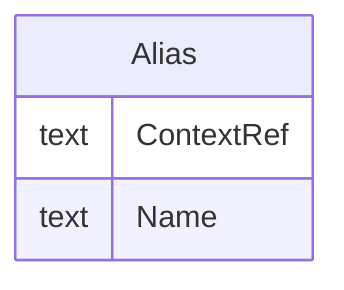

# Class: Alias

_An Alias provides an additional name for an element. The Context attribute specifies the application domain in which this additional name is relevant._


URI: [odm:Alias](http://www.cdisc.org/ns/odm/v2.0/Alias)





<!-- no inheritance hierarchy -->


## Slots

| Name | Cardinality* and Range | Description | Inheritance |
| ---  | --- | --- | --- |
| [ContextRef](ContextRef.md) | 1..1 <br/> [text](text.md) | Identifies applicable domain or scope of the mapping. | direct |
| [Name](Name.md) | 1..1 <br/> [text](text.md) | Alternate name of the parent element. | direct |

_* See [LinkML documentation](https://linkml.io/linkml/schemas/slots.html#slot-cardinality) for cardinality definitions._


## Usages

| used by | used in | type | used |
| ---  | --- | --- | --- |
| [StudyEventDef](StudyEventDef.md) | [AliasRef](AliasRef.md) | range | [Alias](Alias.md) |
| [ItemGroupDef](ItemGroupDef.md) | [AliasRef](AliasRef.md) | range | [Alias](Alias.md) |
| [ItemDef](ItemDef.md) | [AliasRef](AliasRef.md) | range | [Alias](Alias.md) |
| [CodeList](CodeList.md) | [AliasRef](AliasRef.md) | range | [Alias](Alias.md) |
| [CodeListItem](CodeListItem.md) | [AliasRef](AliasRef.md) | range | [Alias](Alias.md) |
| [MethodDef](MethodDef.md) | [AliasRef](AliasRef.md) | range | [Alias](Alias.md) |
| [ConditionDef](ConditionDef.md) | [AliasRef](AliasRef.md) | range | [Alias](Alias.md) |
| [Protocol](Protocol.md) | [AliasRef](AliasRef.md) | range | [Alias](Alias.md) |


## See Also

* [https://wiki.cdisc.org/display/ODM2/Alias](https://wiki.cdisc.org/display/ODM2/Alias)

## Identifier and Mapping Information


### Schema Source


* from schema: http://www.cdisc.org/ns/odm/v2.0


## Mappings

| Mapping Type | Mapped Value |
| ---  | ---  |
| self | odm:Alias |
| native | odm:Alias |


## LinkML Source

<!-- TODO: investigate https://stackoverflow.com/questions/37606292/how-to-create-tabbed-code-blocks-in-mkdocs-or-sphinx -->

### Direct

<details>
```yaml
name: Alias
description: An Alias provides an additional name for an element. The Context attribute
  specifies the application domain in which this additional name is relevant.
from_schema: http://www.cdisc.org/ns/odm/v2.0
see_also:
- https://wiki.cdisc.org/display/ODM2/Alias
rank: 1000
slots:
- ContextRef
- Name
slot_usage:
  ContextRef:
    name: ContextRef
    description: Identifies applicable domain or scope of the mapping.
    comments:
    - 'Required

      range: text

      Valid values may be defined by users or through schema extensions.'
    domain_of:
    - Alias
    - FormalExpression
    - ODMFileMetadata
    range: text
    required: true
  Name:
    name: Name
    description: Alternate name of the parent element.
    comments:
    - 'Required

      range: text

      Valid values are dependent on the Context attribute value.'
    domain_of:
    - Alias
    - MetaDataVersion
    - Standard
    - StudyEventGroupDef
    - StudyEventDef
    - ItemGroupDef
    - Class
    - SubClass
    - SourceItem
    - Resource
    - ItemDef
    - CodeList
    - MethodDef
    - Parameter
    - ReturnValue
    - ConditionDef
    - StudyObjective
    - StudyEndPoint
    - StudyTargetPopulation
    - StudyEstimand
    - Arm
    - Epoch
    - StudyTiming
    - TransitionTimingConstraint
    - AbsoluteTimingConstraint
    - RelativeTimingConstraint
    - DurationTimingConstraint
    - WorkflowDef
    - Transition
    - Branching
    - Criterion
    - Organization
    - Location
    - Query
    range: text
    required: true
class_uri: odm:Alias

```
</details>

### Induced

<details>
```yaml
name: Alias
description: An Alias provides an additional name for an element. The Context attribute
  specifies the application domain in which this additional name is relevant.
from_schema: http://www.cdisc.org/ns/odm/v2.0
see_also:
- https://wiki.cdisc.org/display/ODM2/Alias
rank: 1000
slot_usage:
  ContextRef:
    name: ContextRef
    description: Identifies applicable domain or scope of the mapping.
    comments:
    - 'Required

      range: text

      Valid values may be defined by users or through schema extensions.'
    domain_of:
    - Alias
    - FormalExpression
    - ODMFileMetadata
    range: text
    required: true
  Name:
    name: Name
    description: Alternate name of the parent element.
    comments:
    - 'Required

      range: text

      Valid values are dependent on the Context attribute value.'
    domain_of:
    - Alias
    - MetaDataVersion
    - Standard
    - StudyEventGroupDef
    - StudyEventDef
    - ItemGroupDef
    - Class
    - SubClass
    - SourceItem
    - Resource
    - ItemDef
    - CodeList
    - MethodDef
    - Parameter
    - ReturnValue
    - ConditionDef
    - StudyObjective
    - StudyEndPoint
    - StudyTargetPopulation
    - StudyEstimand
    - Arm
    - Epoch
    - StudyTiming
    - TransitionTimingConstraint
    - AbsoluteTimingConstraint
    - RelativeTimingConstraint
    - DurationTimingConstraint
    - WorkflowDef
    - Transition
    - Branching
    - Criterion
    - Organization
    - Location
    - Query
    range: text
    required: true
attributes:
  ContextRef:
    name: ContextRef
    description: Identifies applicable domain or scope of the mapping.
    comments:
    - 'Required

      range: text

      Valid values may be defined by users or through schema extensions.'
    from_schema: http://www.cdisc.org/ns/odm/v2.0
    rank: 1000
    alias: ContextRef
    owner: Alias
    domain_of:
    - Alias
    - FormalExpression
    - ODMFileMetadata
    range: text
    required: true
  Name:
    name: Name
    description: Alternate name of the parent element.
    comments:
    - 'Required

      range: text

      Valid values are dependent on the Context attribute value.'
    from_schema: http://www.cdisc.org/ns/odm/v2.0
    rank: 1000
    alias: Name
    owner: Alias
    domain_of:
    - Alias
    - MetaDataVersion
    - Standard
    - StudyEventGroupDef
    - StudyEventDef
    - ItemGroupDef
    - Class
    - SubClass
    - SourceItem
    - Resource
    - ItemDef
    - CodeList
    - MethodDef
    - Parameter
    - ReturnValue
    - ConditionDef
    - StudyObjective
    - StudyEndPoint
    - StudyTargetPopulation
    - StudyEstimand
    - Arm
    - Epoch
    - StudyTiming
    - TransitionTimingConstraint
    - AbsoluteTimingConstraint
    - RelativeTimingConstraint
    - DurationTimingConstraint
    - WorkflowDef
    - Transition
    - Branching
    - Criterion
    - Organization
    - Location
    - Query
    range: text
    required: true
class_uri: odm:Alias

```
</details>