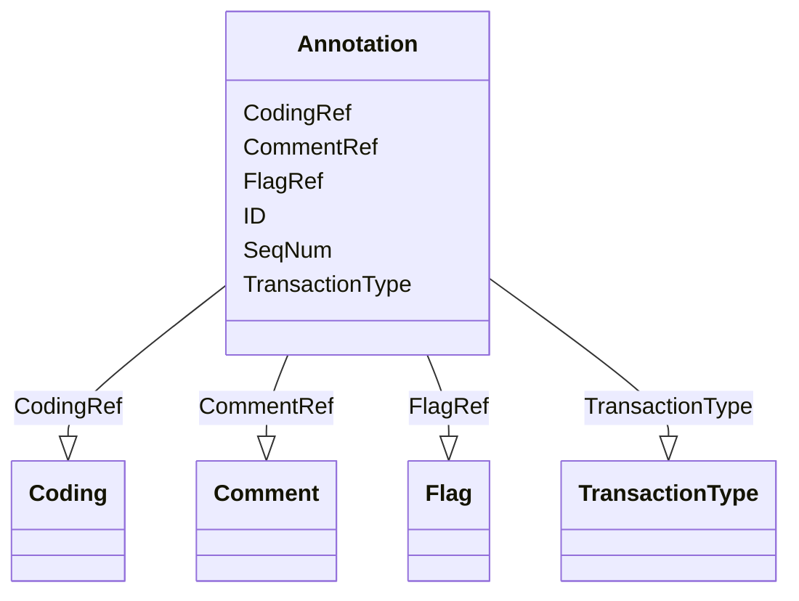

# Class: Annotation


URI: [odm:Annotation](http://www.cdisc.org/ns/odm/v2.0/Annotation)





<!-- no inheritance hierarchy -->


## Slots

| Name | Cardinality and Range | Description | Inheritance |
| ---  | --- | --- | --- |
| [SeqNum](SeqNum.md) | 1..1 <br/> [Integer](Integer.md) |  | direct |
| [TransactionType](TransactionType.md) | 0..1 <br/> [TransactionType](TransactionType.md) |  | direct |
| [ID](ID.md) | 0..1 <br/> [Oid](Oid.md) | Unique identifier for the leaf that is referenced | direct |
| [CommentRef](CommentRef.md) | 0..1 <br/> [Comment](Comment.md) |  | direct |
| [CodingRef](CodingRef.md) | 0..* <br/> [Coding](Coding.md) |  | direct |
| [FlagRef](FlagRef.md) | 0..* <br/> [Flag](Flag.md) |  | direct |


## Usages

| used by | used in | type | used |
| ---  | --- | --- | --- |
| [Association](Association.md) | [AnnotationRef](AnnotationRef.md) | range | [Annotation](Annotation.md) |


## Identifier and Mapping Information


### Schema Source


* from schema: http://www.cdisc.org/ns/odm/v2.0


## Mappings

| Mapping Type | Mapped Value |
| ---  | ---  |
| self | odm:Annotation |
| native | odm:Annotation |


## LinkML Source

<!-- TODO: investigate https://stackoverflow.com/questions/37606292/how-to-create-tabbed-code-blocks-in-mkdocs-or-sphinx -->

### Direct

<details>
```yaml
name: Annotation
in_subset:
- AuditRecordSignatureNotationGroup
from_schema: http://www.cdisc.org/ns/odm/v2.0
slots:
- SeqNum
- TransactionType
- ID
- CommentRef
- CodingRef
- FlagRef
slot_usage:
  SeqNum:
    name: SeqNum
    domain_of:
    - Annotation
    - Value
    range: integer
    required: true
  TransactionType:
    name: TransactionType
    domain_of:
    - SubjectData
    - StudyEventData
    - ItemGroupData
    - ItemData
    - Annotation
    range: TransactionType
    required: false
  ID:
    name: ID
    domain_of:
    - leaf
    - Signature
    - Annotation
    range: oid
    required: false
  CommentRef:
    name: CommentRef
    domain_of:
    - Annotation
    range: Comment
    required: false
    minimum_cardinality: 0
    maximum_cardinality: 1
  CodingRef:
    name: CodingRef
    multivalued: true
    domain_of:
    - StudyEventGroupDef
    - Origin
    - SourceItems
    - SourceItem
    - StudyIndication
    - StudyIntervention
    - StudyTargetPopulation
    - StudyParameter
    - ParameterValue
    - Annotation
    - StudyEventDef
    - ItemGroupDef
    - ItemDef
    - CodeList
    - CodeListItem
    - EnumeratedItem
    range: Coding
    required: false
    minimum_cardinality: 0
  FlagRef:
    name: FlagRef
    multivalued: true
    domain_of:
    - Annotation
    range: Flag
    required: false
    minimum_cardinality: 0
class_uri: odm:Annotation

```
</details>

### Induced

<details>
```yaml
name: Annotation
in_subset:
- AuditRecordSignatureNotationGroup
from_schema: http://www.cdisc.org/ns/odm/v2.0
slot_usage:
  SeqNum:
    name: SeqNum
    domain_of:
    - Annotation
    - Value
    range: integer
    required: true
  TransactionType:
    name: TransactionType
    domain_of:
    - SubjectData
    - StudyEventData
    - ItemGroupData
    - ItemData
    - Annotation
    range: TransactionType
    required: false
  ID:
    name: ID
    domain_of:
    - leaf
    - Signature
    - Annotation
    range: oid
    required: false
  CommentRef:
    name: CommentRef
    domain_of:
    - Annotation
    range: Comment
    required: false
    minimum_cardinality: 0
    maximum_cardinality: 1
  CodingRef:
    name: CodingRef
    multivalued: true
    domain_of:
    - StudyEventGroupDef
    - Origin
    - SourceItems
    - SourceItem
    - StudyIndication
    - StudyIntervention
    - StudyTargetPopulation
    - StudyParameter
    - ParameterValue
    - Annotation
    - StudyEventDef
    - ItemGroupDef
    - ItemDef
    - CodeList
    - CodeListItem
    - EnumeratedItem
    range: Coding
    required: false
    minimum_cardinality: 0
  FlagRef:
    name: FlagRef
    multivalued: true
    domain_of:
    - Annotation
    range: Flag
    required: false
    minimum_cardinality: 0
attributes:
  SeqNum:
    name: SeqNum
    from_schema: http://www.cdisc.org/ns/odm/v2.0
    rank: 1000
    alias: SeqNum
    owner: Annotation
    domain_of:
    - Annotation
    - Value
    range: integer
    required: true
  TransactionType:
    name: TransactionType
    from_schema: http://www.cdisc.org/ns/odm/v2.0
    rank: 1000
    alias: TransactionType
    owner: Annotation
    domain_of:
    - SubjectData
    - StudyEventData
    - ItemGroupData
    - ItemData
    - Annotation
    range: TransactionType
    required: false
  ID:
    name: ID
    description: Unique identifier for the leaf that is referenced.
    from_schema: http://www.cdisc.org/ns/odm/v2.0
    rank: 1000
    alias: ID
    owner: Annotation
    domain_of:
    - leaf
    - Signature
    - Annotation
    range: oid
    required: false
  CommentRef:
    name: CommentRef
    from_schema: http://www.cdisc.org/ns/odm/v2.0
    rank: 1000
    alias: CommentRef
    owner: Annotation
    domain_of:
    - Annotation
    range: Comment
    required: false
    minimum_cardinality: 0
    maximum_cardinality: 1
  CodingRef:
    name: CodingRef
    from_schema: http://www.cdisc.org/ns/odm/v2.0
    rank: 1000
    multivalued: true
    alias: CodingRef
    owner: Annotation
    domain_of:
    - StudyEventGroupDef
    - Origin
    - SourceItems
    - SourceItem
    - StudyIndication
    - StudyIntervention
    - StudyTargetPopulation
    - StudyParameter
    - ParameterValue
    - Annotation
    - StudyEventDef
    - ItemGroupDef
    - ItemDef
    - CodeList
    - CodeListItem
    - EnumeratedItem
    range: Coding
    required: false
    minimum_cardinality: 0
  FlagRef:
    name: FlagRef
    from_schema: http://www.cdisc.org/ns/odm/v2.0
    rank: 1000
    multivalued: true
    alias: FlagRef
    owner: Annotation
    domain_of:
    - Annotation
    range: Flag
    required: false
    minimum_cardinality: 0
class_uri: odm:Annotation

```
</details>