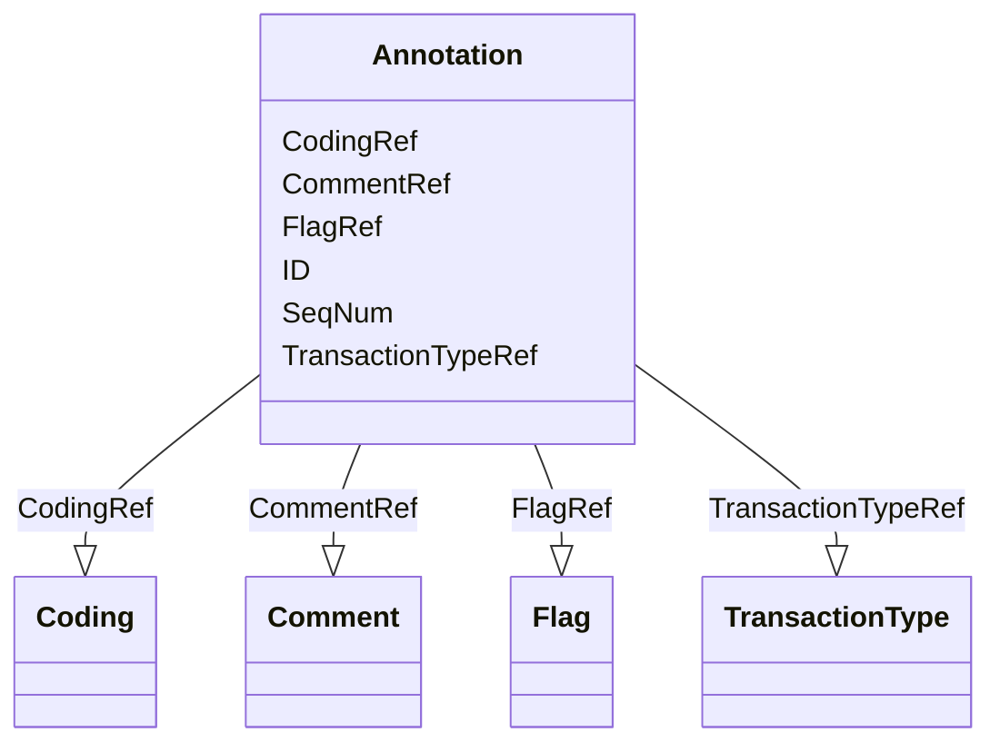

# Class: Annotation


_A general note about clinical data. If an annotation has both a comment and flags, the flags should be related to the comment._


URI: [odm:Annotation](http://www.cdisc.org/ns/odm/v2.0/Annotation)





<!-- no inheritance hierarchy -->


## Slots

| Name | Cardinality and Range | Description | Inheritance |
| ---  | --- | --- | --- |
| [SeqNum](SeqNum.md) | 1..1 <br/> [positiveInteger](positiveInteger.md) | When more than 1 Value element exists this attribute uniquely identifies each... | direct |
| [TransactionTypeRef](TransactionTypeRef.md) | 0..1 <br/> [TransactionType](TransactionType.md) | Identifies the transaction type when /ODM/@FileType is Transactional and ther... | direct |
| [ID](ID.md) | 1..1 <br/> [oid](oid.md) | Unique identifier for the leaf that is referenced. | direct |
| [CommentRef](CommentRef.md) | 0..1 <br/> [Comment](Comment.md) | Comment reference: A free-text (uninterpreted) comment about clinical data. T... | direct |
| [CodingRef](CodingRef.md) | 0..* <br/> [Coding](Coding.md) | Coding reference: Coding references a symbol from a defined code system. It u... | direct |
| [FlagRef](FlagRef.md) | 0..* <br/> [Flag](Flag.md) | Flag reference: A machine-processable annotation. | direct |


## Usages

| used by | used in | type | used |
| ---  | --- | --- | --- |
| [ReferenceData](ReferenceData.md) | [AnnotationRef](AnnotationRef.md) | range | [Annotation](Annotation.md) |
| [ClinicalData](ClinicalData.md) | [AnnotationRef](AnnotationRef.md) | range | [Annotation](Annotation.md) |
| [SubjectData](SubjectData.md) | [AnnotationRef](AnnotationRef.md) | range | [Annotation](Annotation.md) |
| [StudyEventData](StudyEventData.md) | [AnnotationRef](AnnotationRef.md) | range | [Annotation](Annotation.md) |
| [ItemGroupData](ItemGroupData.md) | [AnnotationRef](AnnotationRef.md) | range | [Annotation](Annotation.md) |
| [ItemData](ItemData.md) | [AnnotationRef](AnnotationRef.md) | range | [Annotation](Annotation.md) |
| [Association](Association.md) | [AnnotationRef](AnnotationRef.md) | range | [Annotation](Annotation.md) |


## See Also

* [https://wiki.cdisc.org/display/ODM2/Annotation](https://wiki.cdisc.org/display/ODM2/Annotation)

## Identifier and Mapping Information


### Schema Source


* from schema: http://www.cdisc.org/ns/odm/v2.0


## Mappings

| Mapping Type | Mapped Value |
| ---  | ---  |
| self | odm:Annotation |
| native | odm:Annotation |


## LinkML Source

<!-- TODO: investigate https://stackoverflow.com/questions/37606292/how-to-create-tabbed-code-blocks-in-mkdocs-or-sphinx -->

### Direct

<details>
```yaml
name: Annotation
description: A general note about clinical data. If an annotation has both a comment
  and flags, the flags should be related to the comment.
from_schema: http://www.cdisc.org/ns/odm/v2.0
see_also:
- https://wiki.cdisc.org/display/ODM2/Annotation
slots:
- SeqNum
- TransactionTypeRef
- ID
- CommentRef
- CodingRef
- FlagRef
slot_usage:
  SeqNum:
    name: SeqNum
    comments:
    - 'Required

      range:positiveInteger'
    domain_of:
    - Annotation
    - Value
    range: positiveInteger
    required: true
  TransactionTypeRef:
    name: TransactionTypeRef
    comments:
    - 'Optional

      enum values:(Insert | Update | Remove | Upsert | Context)

      An empty Annotation (one with no annotation value, no comment and no flags)
      is not allowed unless the TransactionType is Remove . On Update, the entire
      value of the annotation is replaced.'
    domain_of:
    - SubjectData
    - StudyEventData
    - ItemGroupData
    - ItemData
    - Annotation
    range: TransactionType
  ID:
    name: ID
    domain_of:
    - Leaf
    - Signature
    - Annotation
    range: oid
  CommentRef:
    name: CommentRef
    domain_of:
    - Annotation
    range: Comment
    maximum_cardinality: 1
  CodingRef:
    name: CodingRef
    multivalued: true
    domain_of:
    - StudyEventGroupDef
    - StudyEventDef
    - ItemGroupDef
    - Origin
    - SourceItems
    - SourceItem
    - ItemDef
    - CodeList
    - CodeListItem
    - StudyIndication
    - StudyIntervention
    - StudyTargetPopulation
    - StudyParameter
    - ParameterValue
    - Criterion
    - Annotation
    range: Coding
    inlined: true
    inlined_as_list: true
  FlagRef:
    name: FlagRef
    multivalued: true
    domain_of:
    - Annotation
    range: Flag
    inlined: true
    inlined_as_list: true
class_uri: odm:Annotation

```
</details>

### Induced

<details>
```yaml
name: Annotation
description: A general note about clinical data. If an annotation has both a comment
  and flags, the flags should be related to the comment.
from_schema: http://www.cdisc.org/ns/odm/v2.0
see_also:
- https://wiki.cdisc.org/display/ODM2/Annotation
slot_usage:
  SeqNum:
    name: SeqNum
    comments:
    - 'Required

      range:positiveInteger'
    domain_of:
    - Annotation
    - Value
    range: positiveInteger
    required: true
  TransactionTypeRef:
    name: TransactionTypeRef
    comments:
    - 'Optional

      enum values:(Insert | Update | Remove | Upsert | Context)

      An empty Annotation (one with no annotation value, no comment and no flags)
      is not allowed unless the TransactionType is Remove . On Update, the entire
      value of the annotation is replaced.'
    domain_of:
    - SubjectData
    - StudyEventData
    - ItemGroupData
    - ItemData
    - Annotation
    range: TransactionType
  ID:
    name: ID
    domain_of:
    - Leaf
    - Signature
    - Annotation
    range: oid
  CommentRef:
    name: CommentRef
    domain_of:
    - Annotation
    range: Comment
    maximum_cardinality: 1
  CodingRef:
    name: CodingRef
    multivalued: true
    domain_of:
    - StudyEventGroupDef
    - StudyEventDef
    - ItemGroupDef
    - Origin
    - SourceItems
    - SourceItem
    - ItemDef
    - CodeList
    - CodeListItem
    - StudyIndication
    - StudyIntervention
    - StudyTargetPopulation
    - StudyParameter
    - ParameterValue
    - Criterion
    - Annotation
    range: Coding
    inlined: true
    inlined_as_list: true
  FlagRef:
    name: FlagRef
    multivalued: true
    domain_of:
    - Annotation
    range: Flag
    inlined: true
    inlined_as_list: true
attributes:
  SeqNum:
    name: SeqNum
    description: When more than 1 Value element exists this attribute uniquely identifies
      each Value and defines the order of a Value in a list of Values.
    comments:
    - 'Required

      range:positiveInteger'
    from_schema: http://www.cdisc.org/ns/odm/v2.0
    rank: 1000
    alias: SeqNum
    owner: Annotation
    domain_of:
    - Annotation
    - Value
    range: positiveInteger
    required: true
  TransactionTypeRef:
    name: TransactionTypeRef
    description: Identifies the transaction type when /ODM/@FileType is Transactional
      and there is no child element.
    comments:
    - 'Optional

      enum values:(Insert | Update | Remove | Upsert | Context)

      An empty Annotation (one with no annotation value, no comment and no flags)
      is not allowed unless the TransactionType is Remove . On Update, the entire
      value of the annotation is replaced.'
    from_schema: http://www.cdisc.org/ns/odm/v2.0
    rank: 1000
    alias: TransactionTypeRef
    owner: Annotation
    domain_of:
    - SubjectData
    - StudyEventData
    - ItemGroupData
    - ItemData
    - Annotation
    range: TransactionType
  ID:
    name: ID
    description: Unique identifier for the leaf that is referenced.
    from_schema: http://www.cdisc.org/ns/odm/v2.0
    rank: 1000
    identifier: true
    alias: ID
    owner: Annotation
    domain_of:
    - Leaf
    - Signature
    - Annotation
    range: oid
    required: true
  CommentRef:
    name: CommentRef
    description: 'Comment reference: A free-text (uninterpreted) comment about clinical
      data. The comment may have come from the sponsor or the clinical site.'
    from_schema: http://www.cdisc.org/ns/odm/v2.0
    rank: 1000
    identifier: false
    alias: CommentRef
    owner: Annotation
    domain_of:
    - Annotation
    range: Comment
    maximum_cardinality: 1
  CodingRef:
    name: CodingRef
    description: 'Coding reference: Coding references a symbol from a defined code
      system. It uses a code defined in a terminology system to associate semantics
      with a given term, codelist, variable, or group of variables. The presence of
      a Coding element associates a meaning to its parent element. Including multiple
      Coding elements for a given parent indicates synonymous meanings provided by
      different code systems or code system versions.'
    from_schema: http://www.cdisc.org/ns/odm/v2.0
    rank: 1000
    multivalued: true
    identifier: false
    alias: CodingRef
    owner: Annotation
    domain_of:
    - StudyEventGroupDef
    - StudyEventDef
    - ItemGroupDef
    - Origin
    - SourceItems
    - SourceItem
    - ItemDef
    - CodeList
    - CodeListItem
    - StudyIndication
    - StudyIntervention
    - StudyTargetPopulation
    - StudyParameter
    - ParameterValue
    - Criterion
    - Annotation
    range: Coding
    inlined: true
    inlined_as_list: true
  FlagRef:
    name: FlagRef
    description: 'Flag reference: A machine-processable annotation.'
    from_schema: http://www.cdisc.org/ns/odm/v2.0
    rank: 1000
    multivalued: true
    identifier: false
    alias: FlagRef
    owner: Annotation
    domain_of:
    - Annotation
    range: Flag
    inlined: true
    inlined_as_list: true
class_uri: odm:Annotation

```
</details>