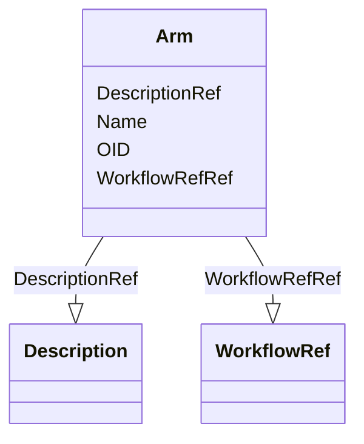

# Class: Arm


_An Arm element provides the declaration of a study arm. Arms do not have any ordering relative to one another._


URI: [odm:Arm](http://www.cdisc.org/ns/odm/v2.0/Arm)





<!-- no inheritance hierarchy -->


## Slots

| Name | Cardinality and Range | Description | Inheritance |
| ---  | --- | --- | --- |
| [OID](OID.md) | 1..1 <br/> [oid](oid.md) | Unique identifier for the Arm definition. | direct |
| [Name](Name.md) | 1..1 <br/> [name](name.md) | Human readable name of the study arm. | direct |
| [DescriptionRef](DescriptionRef.md) | 0..1 <br/> [Description](Description.md) | Description reference: A free-text description of the containing metadata com... | direct |
| [WorkflowRefRef](WorkflowRefRef.md) | 0..1 <br/> [WorkflowRef](WorkflowRef.md) | WorkflowRef reference: The WorkflowRef references a workflow definition | direct |


## Usages

| used by | used in | type | used |
| ---  | --- | --- | --- |
| [StudyStructure](StudyStructure.md) | [ArmRef](ArmRef.md) | range | [Arm](Arm.md) |


## See Also

* [https://wiki.cdisc.org/display/ODM2/Arm](https://wiki.cdisc.org/display/ODM2/Arm)

## Identifier and Mapping Information


### Schema Source


* from schema: http://www.cdisc.org/ns/odm/v2.0


## Mappings

| Mapping Type | Mapped Value |
| ---  | ---  |
| self | odm:Arm |
| native | odm:Arm |


## LinkML Source

<!-- TODO: investigate https://stackoverflow.com/questions/37606292/how-to-create-tabbed-code-blocks-in-mkdocs-or-sphinx -->

### Direct

<details>
```yaml
name: Arm
description: An Arm element provides the declaration of a study arm. Arms do not have
  any ordering relative to one another.
from_schema: http://www.cdisc.org/ns/odm/v2.0
see_also:
- https://wiki.cdisc.org/display/ODM2/Arm
slots:
- OID
- Name
- DescriptionRef
- WorkflowRefRef
slot_usage:
  OID:
    name: OID
    description: Unique identifier for the Arm definition.
    comments:
    - 'Required

      range: oid'
    domain_of:
    - Study
    - MetaDataVersion
    - Standard
    - ValueListDef
    - WhereClauseDef
    - StudyEventGroupDef
    - StudyEventDef
    - ItemGroupDef
    - ItemDef
    - CodeList
    - MethodDef
    - ConditionDef
    - CommentDef
    - StudyIndication
    - StudyIntervention
    - StudyObjective
    - StudyEndPoint
    - StudyTargetPopulation
    - StudyEstimand
    - Arm
    - Epoch
    - StudyParameter
    - StudyTiming
    - TransitionTimingConstraint
    - AbsoluteTimingConstraint
    - RelativeTimingConstraint
    - DurationTimingConstraint
    - WorkflowDef
    - Transition
    - Branching
    - Criterion
    - User
    - Organization
    - Location
    - SignatureDef
    - Query
    range: oid
    required: true
  Name:
    name: Name
    description: Human readable name of the study arm.
    comments:
    - 'Required

      range: name'
    domain_of:
    - Alias
    - MetaDataVersion
    - Standard
    - StudyEventGroupDef
    - StudyEventDef
    - ItemGroupDef
    - Class
    - SubClass
    - SourceItem
    - Resource
    - ItemDef
    - CodeList
    - MethodDef
    - Parameter
    - ReturnValue
    - ConditionDef
    - StudyObjective
    - StudyEndPoint
    - StudyTargetPopulation
    - StudyEstimand
    - Arm
    - Epoch
    - StudyTiming
    - TransitionTimingConstraint
    - AbsoluteTimingConstraint
    - RelativeTimingConstraint
    - DurationTimingConstraint
    - WorkflowDef
    - Transition
    - Branching
    - Criterion
    - Organization
    - Location
    - Query
    range: name
    required: true
  DescriptionRef:
    name: DescriptionRef
    domain_of:
    - Study
    - MetaDataVersion
    - ValueListDef
    - StudyEventGroupRef
    - StudyEventGroupDef
    - StudyEventDef
    - ItemGroupDef
    - Origin
    - ItemDef
    - CodeList
    - CodeListItem
    - MethodDef
    - ConditionDef
    - CommentDef
    - Protocol
    - StudyStructure
    - TrialPhase
    - StudyIndication
    - StudyIntervention
    - StudyObjective
    - StudyEndPoint
    - StudyTargetPopulation
    - StudyEstimand
    - IntercurrentEvent
    - SummaryMeasure
    - Arm
    - Epoch
    - TransitionTimingConstraint
    - AbsoluteTimingConstraint
    - RelativeTimingConstraint
    - DurationTimingConstraint
    - WorkflowDef
    - Criterion
    - Organization
    - Location
    - ODMFileMetadata
    range: Description
    maximum_cardinality: 1
  WorkflowRefRef:
    name: WorkflowRefRef
    domain_of:
    - StudyEventGroupDef
    - StudyEventDef
    - ItemGroupDef
    - Protocol
    - StudyStructure
    - Arm
    range: WorkflowRef
    maximum_cardinality: 1
class_uri: odm:Arm

```
</details>

### Induced

<details>
```yaml
name: Arm
description: An Arm element provides the declaration of a study arm. Arms do not have
  any ordering relative to one another.
from_schema: http://www.cdisc.org/ns/odm/v2.0
see_also:
- https://wiki.cdisc.org/display/ODM2/Arm
slot_usage:
  OID:
    name: OID
    description: Unique identifier for the Arm definition.
    comments:
    - 'Required

      range: oid'
    domain_of:
    - Study
    - MetaDataVersion
    - Standard
    - ValueListDef
    - WhereClauseDef
    - StudyEventGroupDef
    - StudyEventDef
    - ItemGroupDef
    - ItemDef
    - CodeList
    - MethodDef
    - ConditionDef
    - CommentDef
    - StudyIndication
    - StudyIntervention
    - StudyObjective
    - StudyEndPoint
    - StudyTargetPopulation
    - StudyEstimand
    - Arm
    - Epoch
    - StudyParameter
    - StudyTiming
    - TransitionTimingConstraint
    - AbsoluteTimingConstraint
    - RelativeTimingConstraint
    - DurationTimingConstraint
    - WorkflowDef
    - Transition
    - Branching
    - Criterion
    - User
    - Organization
    - Location
    - SignatureDef
    - Query
    range: oid
    required: true
  Name:
    name: Name
    description: Human readable name of the study arm.
    comments:
    - 'Required

      range: name'
    domain_of:
    - Alias
    - MetaDataVersion
    - Standard
    - StudyEventGroupDef
    - StudyEventDef
    - ItemGroupDef
    - Class
    - SubClass
    - SourceItem
    - Resource
    - ItemDef
    - CodeList
    - MethodDef
    - Parameter
    - ReturnValue
    - ConditionDef
    - StudyObjective
    - StudyEndPoint
    - StudyTargetPopulation
    - StudyEstimand
    - Arm
    - Epoch
    - StudyTiming
    - TransitionTimingConstraint
    - AbsoluteTimingConstraint
    - RelativeTimingConstraint
    - DurationTimingConstraint
    - WorkflowDef
    - Transition
    - Branching
    - Criterion
    - Organization
    - Location
    - Query
    range: name
    required: true
  DescriptionRef:
    name: DescriptionRef
    domain_of:
    - Study
    - MetaDataVersion
    - ValueListDef
    - StudyEventGroupRef
    - StudyEventGroupDef
    - StudyEventDef
    - ItemGroupDef
    - Origin
    - ItemDef
    - CodeList
    - CodeListItem
    - MethodDef
    - ConditionDef
    - CommentDef
    - Protocol
    - StudyStructure
    - TrialPhase
    - StudyIndication
    - StudyIntervention
    - StudyObjective
    - StudyEndPoint
    - StudyTargetPopulation
    - StudyEstimand
    - IntercurrentEvent
    - SummaryMeasure
    - Arm
    - Epoch
    - TransitionTimingConstraint
    - AbsoluteTimingConstraint
    - RelativeTimingConstraint
    - DurationTimingConstraint
    - WorkflowDef
    - Criterion
    - Organization
    - Location
    - ODMFileMetadata
    range: Description
    maximum_cardinality: 1
  WorkflowRefRef:
    name: WorkflowRefRef
    domain_of:
    - StudyEventGroupDef
    - StudyEventDef
    - ItemGroupDef
    - Protocol
    - StudyStructure
    - Arm
    range: WorkflowRef
    maximum_cardinality: 1
attributes:
  OID:
    name: OID
    description: Unique identifier for the Arm definition.
    comments:
    - 'Required

      range: oid'
    from_schema: http://www.cdisc.org/ns/odm/v2.0
    rank: 1000
    identifier: true
    alias: OID
    owner: Arm
    domain_of:
    - Study
    - MetaDataVersion
    - Standard
    - ValueListDef
    - WhereClauseDef
    - StudyEventGroupDef
    - StudyEventDef
    - ItemGroupDef
    - ItemDef
    - CodeList
    - MethodDef
    - ConditionDef
    - CommentDef
    - StudyIndication
    - StudyIntervention
    - StudyObjective
    - StudyEndPoint
    - StudyTargetPopulation
    - StudyEstimand
    - Arm
    - Epoch
    - StudyParameter
    - StudyTiming
    - TransitionTimingConstraint
    - AbsoluteTimingConstraint
    - RelativeTimingConstraint
    - DurationTimingConstraint
    - WorkflowDef
    - Transition
    - Branching
    - Criterion
    - User
    - Organization
    - Location
    - SignatureDef
    - Query
    range: oid
    required: true
  Name:
    name: Name
    description: Human readable name of the study arm.
    comments:
    - 'Required

      range: name'
    from_schema: http://www.cdisc.org/ns/odm/v2.0
    rank: 1000
    alias: Name
    owner: Arm
    domain_of:
    - Alias
    - MetaDataVersion
    - Standard
    - StudyEventGroupDef
    - StudyEventDef
    - ItemGroupDef
    - Class
    - SubClass
    - SourceItem
    - Resource
    - ItemDef
    - CodeList
    - MethodDef
    - Parameter
    - ReturnValue
    - ConditionDef
    - StudyObjective
    - StudyEndPoint
    - StudyTargetPopulation
    - StudyEstimand
    - Arm
    - Epoch
    - StudyTiming
    - TransitionTimingConstraint
    - AbsoluteTimingConstraint
    - RelativeTimingConstraint
    - DurationTimingConstraint
    - WorkflowDef
    - Transition
    - Branching
    - Criterion
    - Organization
    - Location
    - Query
    range: name
    required: true
  DescriptionRef:
    name: DescriptionRef
    description: 'Description reference: A free-text description of the containing
      metadata component, unless restricted by Business Rules.'
    from_schema: http://www.cdisc.org/ns/odm/v2.0
    rank: 1000
    identifier: false
    alias: DescriptionRef
    owner: Arm
    domain_of:
    - Study
    - MetaDataVersion
    - ValueListDef
    - StudyEventGroupRef
    - StudyEventGroupDef
    - StudyEventDef
    - ItemGroupDef
    - Origin
    - ItemDef
    - CodeList
    - CodeListItem
    - MethodDef
    - ConditionDef
    - CommentDef
    - Protocol
    - StudyStructure
    - TrialPhase
    - StudyIndication
    - StudyIntervention
    - StudyObjective
    - StudyEndPoint
    - StudyTargetPopulation
    - StudyEstimand
    - IntercurrentEvent
    - SummaryMeasure
    - Arm
    - Epoch
    - TransitionTimingConstraint
    - AbsoluteTimingConstraint
    - RelativeTimingConstraint
    - DurationTimingConstraint
    - WorkflowDef
    - Criterion
    - Organization
    - Location
    - ODMFileMetadata
    range: Description
    maximum_cardinality: 1
  WorkflowRefRef:
    name: WorkflowRefRef
    description: 'WorkflowRef reference: The WorkflowRef references a workflow definition'
    from_schema: http://www.cdisc.org/ns/odm/v2.0
    rank: 1000
    identifier: false
    alias: WorkflowRefRef
    owner: Arm
    domain_of:
    - StudyEventGroupDef
    - StudyEventDef
    - ItemGroupDef
    - Protocol
    - StudyStructure
    - Arm
    range: WorkflowRef
    maximum_cardinality: 1
class_uri: odm:Arm

```
</details>