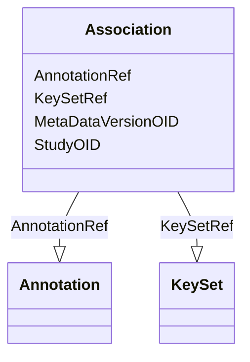

# Class: Association


URI: [odm:Association](http://www.cdisc.org/ns/odm/v2.0/Association)





<!-- no inheritance hierarchy -->


## Slots

| Name | Cardinality and Range | Description | Inheritance |
| ---  | --- | --- | --- |
| [StudyOID](StudyOID.md) | 1..1 <br/> [Oidref](Oidref.md) |  | direct |
| [MetaDataVersionOID](MetaDataVersionOID.md) | 1..1 <br/> [Oidref](Oidref.md) |  | direct |
| [KeySetRef](KeySetRef.md) | 1..1 <br/> [KeySet](KeySet.md) |  | direct |
| [AnnotationRef](AnnotationRef.md) | 1..1 <br/> [Annotation](Annotation.md) |  | direct |


## Usages

| used by | used in | type | used |
| ---  | --- | --- | --- |
| [ODMFileMetadata](ODMFileMetadata.md) | [AssociationRef](AssociationRef.md) | range | [Association](Association.md) |


## Identifier and Mapping Information


### Schema Source


* from schema: http://www.cdisc.org/ns/odm/v2.0


## Mappings

| Mapping Type | Mapped Value |
| ---  | ---  |
| self | odm:Association |
| native | odm:Association |


## LinkML Source

<!-- TODO: investigate https://stackoverflow.com/questions/37606292/how-to-create-tabbed-code-blocks-in-mkdocs-or-sphinx -->

### Direct

<details>
```yaml
name: Association
from_schema: http://www.cdisc.org/ns/odm/v2.0
slots:
- StudyOID
- MetaDataVersionOID
- KeySetRef
- AnnotationRef
slot_usage:
  StudyOID:
    name: StudyOID
    domain_of:
    - Include
    - SourceItem
    - AdminData
    - MetaDataVersionRef
    - ReferenceData
    - ClinicalData
    - Association
    - KeySet
    range: oidref
    required: true
  MetaDataVersionOID:
    name: MetaDataVersionOID
    domain_of:
    - Include
    - SourceItem
    - MetaDataVersionRef
    - ReferenceData
    - ClinicalData
    - Association
    - KeySet
    range: oidref
    required: true
  KeySetRef:
    name: KeySetRef
    domain_of:
    - Association
    range: KeySet
    required: true
    minimum_cardinality: 1
    maximum_cardinality: 1
  AnnotationRef:
    name: AnnotationRef
    domain_of:
    - Association
    range: Annotation
    required: true
    minimum_cardinality: 1
    maximum_cardinality: 1
class_uri: odm:Association

```
</details>

### Induced

<details>
```yaml
name: Association
from_schema: http://www.cdisc.org/ns/odm/v2.0
slot_usage:
  StudyOID:
    name: StudyOID
    domain_of:
    - Include
    - SourceItem
    - AdminData
    - MetaDataVersionRef
    - ReferenceData
    - ClinicalData
    - Association
    - KeySet
    range: oidref
    required: true
  MetaDataVersionOID:
    name: MetaDataVersionOID
    domain_of:
    - Include
    - SourceItem
    - MetaDataVersionRef
    - ReferenceData
    - ClinicalData
    - Association
    - KeySet
    range: oidref
    required: true
  KeySetRef:
    name: KeySetRef
    domain_of:
    - Association
    range: KeySet
    required: true
    minimum_cardinality: 1
    maximum_cardinality: 1
  AnnotationRef:
    name: AnnotationRef
    domain_of:
    - Association
    range: Annotation
    required: true
    minimum_cardinality: 1
    maximum_cardinality: 1
attributes:
  StudyOID:
    name: StudyOID
    from_schema: http://www.cdisc.org/ns/odm/v2.0
    rank: 1000
    alias: StudyOID
    owner: Association
    domain_of:
    - Include
    - SourceItem
    - AdminData
    - MetaDataVersionRef
    - ReferenceData
    - ClinicalData
    - Association
    - KeySet
    range: oidref
    required: true
  MetaDataVersionOID:
    name: MetaDataVersionOID
    from_schema: http://www.cdisc.org/ns/odm/v2.0
    rank: 1000
    alias: MetaDataVersionOID
    owner: Association
    domain_of:
    - Include
    - SourceItem
    - MetaDataVersionRef
    - ReferenceData
    - ClinicalData
    - Association
    - KeySet
    range: oidref
    required: true
  KeySetRef:
    name: KeySetRef
    from_schema: http://www.cdisc.org/ns/odm/v2.0
    rank: 1000
    alias: KeySetRef
    owner: Association
    domain_of:
    - Association
    range: KeySet
    required: true
    minimum_cardinality: 1
    maximum_cardinality: 1
  AnnotationRef:
    name: AnnotationRef
    from_schema: http://www.cdisc.org/ns/odm/v2.0
    rank: 1000
    alias: AnnotationRef
    owner: Association
    domain_of:
    - Association
    range: Annotation
    required: true
    minimum_cardinality: 1
    maximum_cardinality: 1
class_uri: odm:Association

```
</details>