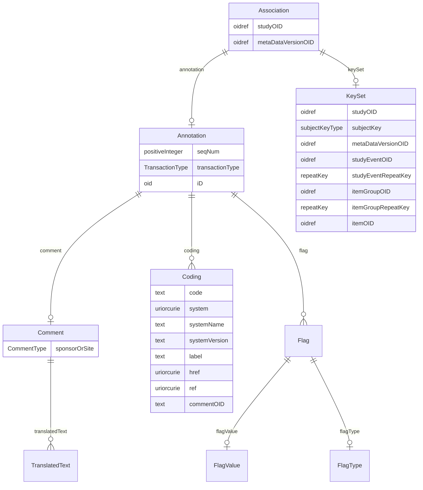

# Class: Association

_An association permits an annotation to be placed on an ordered pair of entities rather than on just one. The first and second KeySets identify the start and end of the annotated "link._


URI: [odm:Association](http://www.cdisc.org/ns/odm/v2.0/Association)





<!-- no inheritance hierarchy -->


## Slots

| Name | Cardinality* and Range | Description | Inheritance |
| ---  | --- | --- | --- |
| [studyOID](studyOID.md) | 1..1 <br/> [oidref](oidref.md) | Reference to an ODM Study element. | direct |
| [metaDataVersionOID](metaDataVersionOID.md) | 1..1 <br/> [oidref](oidref.md) | Reference to a MetaDataVersion element. | direct |
| [keySet](keySet.md) | 0..1 <br/> [KeySet](KeySet.md) | KeySet reference: A KeySet references a single entity (e.g., a study, a subje... | direct |
| [keySet](keySet.md) | 0..1 <br/> [KeySet](KeySet.md) | KeySet reference: A KeySet references a single entity (e.g., a study, a subje... | direct |
| [annotation](annotation.md) | 0..1 <br/> [Annotation](Annotation.md) | Annotation reference: A general note about clinical data. If an annotation ha... | direct |

_* See [LinkML documentation](https://linkml.io/linkml/schemas/slots.html#slot-cardinality) for cardinality definitions._


## Usages

| used by | used in | type | used |
| ---  | --- | --- | --- |
| [ODMFileMetadata](ODMFileMetadata.md) | [association](association.md) | range | [Association](Association.md) |


## See Also

* [https://wiki.cdisc.org/display/PUB/Association](https://wiki.cdisc.org/display/PUB/Association)

## Identifier and Mapping Information


### Schema Source


* from schema: http://www.cdisc.org/ns/odm/v2.0


## Mappings

| Mapping Type | Mapped Value |
| ---  | ---  |
| self | odm:Association |
| native | odm:Association |


## LinkML Source

<!-- TODO: investigate https://stackoverflow.com/questions/37606292/how-to-create-tabbed-code-blocks-in-mkdocs-or-sphinx -->

### Direct

<details>
```yaml
name: Association
description: An association permits an annotation to be placed on an ordered pair
  of entities rather than on just one. The first and second KeySets identify the start
  and end of the annotated "link.
from_schema: http://www.cdisc.org/ns/odm/v2.0
see_also:
- https://wiki.cdisc.org/display/PUB/Association
rank: 1000
slots:
- studyOID
- metaDataVersionOID
- keySet
- keySet
- annotation
slot_usage:
  studyOID:
    name: studyOID
    description: Reference to an ODM Study element.
    comments:
    - Required
    domain_of:
    - Include
    - SourceItem
    - AdminData
    - MetaDataVersionRef
    - ReferenceData
    - ClinicalData
    - Association
    - KeySet
    range: oidref
    required: true
  metaDataVersionOID:
    name: metaDataVersionOID
    description: Reference to a MetaDataVersion element.
    comments:
    - Required
    domain_of:
    - Include
    - SourceItem
    - MetaDataVersionRef
    - ReferenceData
    - ClinicalData
    - Association
    - KeySet
    range: oidref
    required: true
  keySet:
    name: keySet
    domain_of:
    - Association
    range: KeySet
    maximum_cardinality: 1
  annotation:
    name: annotation
    domain_of:
    - ReferenceData
    - ClinicalData
    - SubjectData
    - StudyEventData
    - ItemGroupData
    - ItemData
    - Association
    range: Annotation
    maximum_cardinality: 1
class_uri: odm:Association

```
</details>

### Induced

<details>
```yaml
name: Association
description: An association permits an annotation to be placed on an ordered pair
  of entities rather than on just one. The first and second KeySets identify the start
  and end of the annotated "link.
from_schema: http://www.cdisc.org/ns/odm/v2.0
see_also:
- https://wiki.cdisc.org/display/PUB/Association
rank: 1000
slot_usage:
  studyOID:
    name: studyOID
    description: Reference to an ODM Study element.
    comments:
    - Required
    domain_of:
    - Include
    - SourceItem
    - AdminData
    - MetaDataVersionRef
    - ReferenceData
    - ClinicalData
    - Association
    - KeySet
    range: oidref
    required: true
  metaDataVersionOID:
    name: metaDataVersionOID
    description: Reference to a MetaDataVersion element.
    comments:
    - Required
    domain_of:
    - Include
    - SourceItem
    - MetaDataVersionRef
    - ReferenceData
    - ClinicalData
    - Association
    - KeySet
    range: oidref
    required: true
  keySet:
    name: keySet
    domain_of:
    - Association
    range: KeySet
    maximum_cardinality: 1
  annotation:
    name: annotation
    domain_of:
    - ReferenceData
    - ClinicalData
    - SubjectData
    - StudyEventData
    - ItemGroupData
    - ItemData
    - Association
    range: Annotation
    maximum_cardinality: 1
attributes:
  studyOID:
    name: studyOID
    description: Reference to an ODM Study element.
    comments:
    - Required
    from_schema: http://www.cdisc.org/ns/odm/v2.0
    rank: 1000
    alias: studyOID
    owner: Association
    domain_of:
    - Include
    - SourceItem
    - AdminData
    - MetaDataVersionRef
    - ReferenceData
    - ClinicalData
    - Association
    - KeySet
    range: oidref
    required: true
  metaDataVersionOID:
    name: metaDataVersionOID
    description: Reference to a MetaDataVersion element.
    comments:
    - Required
    from_schema: http://www.cdisc.org/ns/odm/v2.0
    rank: 1000
    alias: metaDataVersionOID
    owner: Association
    domain_of:
    - Include
    - SourceItem
    - MetaDataVersionRef
    - ReferenceData
    - ClinicalData
    - Association
    - KeySet
    range: oidref
    required: true
  keySet:
    name: keySet
    description: 'KeySet reference: A KeySet references a single entity (e.g., a study,
      a subject, a study event). Only those attributes needed to specify the particular
      entity are required, and all others must be omitted (see Section 2.7, Clinical
      Data Keys).'
    from_schema: http://www.cdisc.org/ns/odm/v2.0
    rank: 1000
    identifier: false
    alias: keySet
    owner: Association
    domain_of:
    - Association
    range: KeySet
    maximum_cardinality: 1
  annotation:
    name: annotation
    description: 'Annotation reference: A general note about clinical data. If an
      annotation has both a comment and flags, the flags should be related to the
      comment.'
    from_schema: http://www.cdisc.org/ns/odm/v2.0
    rank: 1000
    identifier: false
    alias: annotation
    owner: Association
    domain_of:
    - ReferenceData
    - ClinicalData
    - SubjectData
    - StudyEventData
    - ItemGroupData
    - ItemData
    - Association
    range: Annotation
    maximum_cardinality: 1
class_uri: odm:Association

```
</details>