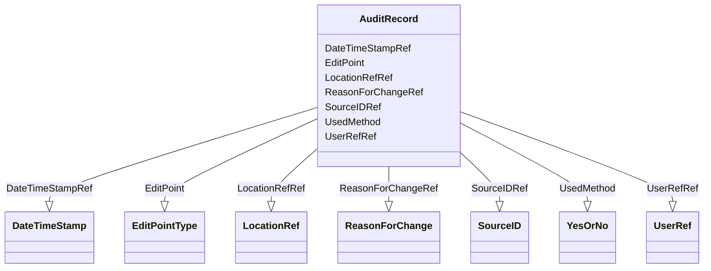

# Class: AuditRecord


URI: [odm:AuditRecord](http://www.cdisc.org/ns/odm/v2.0/AuditRecord)





<!-- no inheritance hierarchy -->


## Slots

| Name | Cardinality and Range | Description | Inheritance |
| ---  | --- | --- | --- |
| [EditPoint](EditPoint.md) | 0..1 <br/> [EditPointType](EditPointType.md) |  | direct |
| [UsedMethod](UsedMethod.md) | 0..1 <br/> [YesOrNo](YesOrNo.md) |  | direct |
| [UserRefRef](UserRefRef.md) | 1..1 <br/> [UserRef](UserRef.md) |  | direct |
| [LocationRefRef](LocationRefRef.md) | 1..1 <br/> [LocationRef](LocationRef.md) |  | direct |
| [DateTimeStampRef](DateTimeStampRef.md) | 1..1 <br/> [DateTimeStamp](DateTimeStamp.md) |  | direct |
| [ReasonForChangeRef](ReasonForChangeRef.md) | 0..1 <br/> [ReasonForChange](ReasonForChange.md) |  | direct |
| [SourceIDRef](SourceIDRef.md) | 0..1 <br/> [SourceID](SourceID.md) |  | direct |


## Usages

| used by | used in | type | used |
| ---  | --- | --- | --- |
| [Query](Query.md) | [AuditRecordRef](AuditRecordRef.md) | range | [AuditRecord](AuditRecord.md) |


## Identifier and Mapping Information


### Schema Source


* from schema: http://www.cdisc.org/ns/odm/v2.0


## Mappings

| Mapping Type | Mapped Value |
| ---  | ---  |
| self | odm:AuditRecord |
| native | odm:AuditRecord |


## LinkML Source

<!-- TODO: investigate https://stackoverflow.com/questions/37606292/how-to-create-tabbed-code-blocks-in-mkdocs-or-sphinx -->

### Direct

<details>
```yaml
name: AuditRecord
in_subset:
- AuditRecordSignatureNotationGroup
from_schema: http://www.cdisc.org/ns/odm/v2.0
slots:
- EditPoint
- UsedMethod
- UserRefRef
- LocationRefRef
- DateTimeStampRef
- ReasonForChangeRef
- SourceIDRef
slot_usage:
  EditPoint:
    name: EditPoint
    domain_of:
    - AuditRecord
    range: EditPointType
    required: false
  UsedMethod:
    name: UsedMethod
    domain_of:
    - AuditRecord
    range: YesOrNo
    required: false
  UserRefRef:
    name: UserRefRef
    domain_of:
    - AuditRecord
    - Signature
    range: UserRef
    required: true
    minimum_cardinality: 1
    maximum_cardinality: 1
  LocationRefRef:
    name: LocationRefRef
    domain_of:
    - AuditRecord
    - Signature
    range: LocationRef
    required: true
    minimum_cardinality: 1
    maximum_cardinality: 1
  DateTimeStampRef:
    name: DateTimeStampRef
    domain_of:
    - AuditRecord
    - Signature
    range: DateTimeStamp
    required: true
    minimum_cardinality: 1
    maximum_cardinality: 1
  ReasonForChangeRef:
    name: ReasonForChangeRef
    domain_of:
    - AuditRecord
    range: ReasonForChange
    required: false
    minimum_cardinality: 0
    maximum_cardinality: 1
  SourceIDRef:
    name: SourceIDRef
    domain_of:
    - AuditRecord
    range: SourceID
    required: false
    minimum_cardinality: 0
    maximum_cardinality: 1
class_uri: odm:AuditRecord

```
</details>

### Induced

<details>
```yaml
name: AuditRecord
in_subset:
- AuditRecordSignatureNotationGroup
from_schema: http://www.cdisc.org/ns/odm/v2.0
slot_usage:
  EditPoint:
    name: EditPoint
    domain_of:
    - AuditRecord
    range: EditPointType
    required: false
  UsedMethod:
    name: UsedMethod
    domain_of:
    - AuditRecord
    range: YesOrNo
    required: false
  UserRefRef:
    name: UserRefRef
    domain_of:
    - AuditRecord
    - Signature
    range: UserRef
    required: true
    minimum_cardinality: 1
    maximum_cardinality: 1
  LocationRefRef:
    name: LocationRefRef
    domain_of:
    - AuditRecord
    - Signature
    range: LocationRef
    required: true
    minimum_cardinality: 1
    maximum_cardinality: 1
  DateTimeStampRef:
    name: DateTimeStampRef
    domain_of:
    - AuditRecord
    - Signature
    range: DateTimeStamp
    required: true
    minimum_cardinality: 1
    maximum_cardinality: 1
  ReasonForChangeRef:
    name: ReasonForChangeRef
    domain_of:
    - AuditRecord
    range: ReasonForChange
    required: false
    minimum_cardinality: 0
    maximum_cardinality: 1
  SourceIDRef:
    name: SourceIDRef
    domain_of:
    - AuditRecord
    range: SourceID
    required: false
    minimum_cardinality: 0
    maximum_cardinality: 1
attributes:
  EditPoint:
    name: EditPoint
    from_schema: http://www.cdisc.org/ns/odm/v2.0
    rank: 1000
    alias: EditPoint
    owner: AuditRecord
    domain_of:
    - AuditRecord
    range: EditPointType
    required: false
  UsedMethod:
    name: UsedMethod
    from_schema: http://www.cdisc.org/ns/odm/v2.0
    rank: 1000
    alias: UsedMethod
    owner: AuditRecord
    domain_of:
    - AuditRecord
    range: YesOrNo
    required: false
  UserRefRef:
    name: UserRefRef
    from_schema: http://www.cdisc.org/ns/odm/v2.0
    rank: 1000
    alias: UserRefRef
    owner: AuditRecord
    domain_of:
    - AuditRecord
    - Signature
    range: UserRef
    required: true
    minimum_cardinality: 1
    maximum_cardinality: 1
  LocationRefRef:
    name: LocationRefRef
    from_schema: http://www.cdisc.org/ns/odm/v2.0
    rank: 1000
    alias: LocationRefRef
    owner: AuditRecord
    domain_of:
    - AuditRecord
    - Signature
    range: LocationRef
    required: true
    minimum_cardinality: 1
    maximum_cardinality: 1
  DateTimeStampRef:
    name: DateTimeStampRef
    from_schema: http://www.cdisc.org/ns/odm/v2.0
    rank: 1000
    alias: DateTimeStampRef
    owner: AuditRecord
    domain_of:
    - AuditRecord
    - Signature
    range: DateTimeStamp
    required: true
    minimum_cardinality: 1
    maximum_cardinality: 1
  ReasonForChangeRef:
    name: ReasonForChangeRef
    from_schema: http://www.cdisc.org/ns/odm/v2.0
    rank: 1000
    alias: ReasonForChangeRef
    owner: AuditRecord
    domain_of:
    - AuditRecord
    range: ReasonForChange
    required: false
    minimum_cardinality: 0
    maximum_cardinality: 1
  SourceIDRef:
    name: SourceIDRef
    from_schema: http://www.cdisc.org/ns/odm/v2.0
    rank: 1000
    alias: SourceIDRef
    owner: AuditRecord
    domain_of:
    - AuditRecord
    range: SourceID
    required: false
    minimum_cardinality: 0
    maximum_cardinality: 1
class_uri: odm:AuditRecord

```
</details>