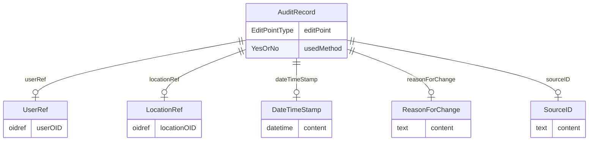

# Class: AuditRecord

_An AuditRecord carries information pertaining to the creation, deletion, or modification of clinical data. This information includes who performed that action, and where, when, and why that action was performed.AuditRecord information describes a change to clinical data, but is not itself clinical data. The value of some clinical data can always be changed by a subsequent transaction, but history cannot be changed, only added to._


URI: [odm:AuditRecord](http://www.cdisc.org/ns/odm/v2.0/AuditRecord)





<!-- no inheritance hierarchy -->


## Slots

| Name | Cardinality* and Range | Description | Inheritance |
| ---  | --- | --- | --- |
| [editPoint](editPoint.md) | 0..1 <br/> [EditPointType](EditPointType.md) | Identifies the phase of data processing in which update action occurred. | direct |
| [usedMethod](usedMethod.md) | 0..1 <br/> [YesOrNo](YesOrNo.md) | Indicates that the action was made by the system rather than a data entry for... | direct |
| [userRef](userRef.md) | 0..1 <br/> [UserRef](UserRef.md) | UserRef reference: A reference to information about a specific user of a clin... | direct |
| [locationRef](locationRef.md) | 0..1 <br/> [LocationRef](LocationRef.md) | LocationRef reference: A reference to the user's physical location. | direct |
| [dateTimeStamp](dateTimeStamp.md) | 0..1 <br/> [DateTimeStamp](DateTimeStamp.md) | DateTimeStamp reference: Date and time when an action was performed. | direct |
| [reasonForChange](reasonForChange.md) | 0..1 <br/> [ReasonForChange](ReasonForChange.md) | ReasonForChange reference: A user-supplied reason for a data change. | direct |
| [sourceID](sourceID.md) | 0..1 <br/> [SourceID](SourceID.md) | SourceID reference: Information that identifies the source of the data within... | direct |

_* See [LinkML documentation](https://linkml.io/linkml/schemas/slots.html#slot-cardinality) for cardinality definitions._


## Usages

| used by | used in | type | used |
| ---  | --- | --- | --- |
| [ReferenceData](ReferenceData.md) | [auditRecord](auditRecord.md) | range | [AuditRecord](AuditRecord.md) |
| [ClinicalData](ClinicalData.md) | [auditRecord](auditRecord.md) | range | [AuditRecord](AuditRecord.md) |
| [SubjectData](SubjectData.md) | [auditRecord](auditRecord.md) | range | [AuditRecord](AuditRecord.md) |
| [StudyEventData](StudyEventData.md) | [auditRecord](auditRecord.md) | range | [AuditRecord](AuditRecord.md) |
| [ItemGroupData](ItemGroupData.md) | [auditRecord](auditRecord.md) | range | [AuditRecord](AuditRecord.md) |
| [ItemData](ItemData.md) | [auditRecord](auditRecord.md) | range | [AuditRecord](AuditRecord.md) |
| [Query](Query.md) | [auditRecord](auditRecord.md) | range | [AuditRecord](AuditRecord.md) |


## See Also

* [https://wiki.cdisc.org/display/PUB/AuditRecord](https://wiki.cdisc.org/display/PUB/AuditRecord)

## Identifier and Mapping Information


### Schema Source


* from schema: http://www.cdisc.org/ns/odm/v2.0


## Mappings

| Mapping Type | Mapped Value |
| ---  | ---  |
| self | odm:AuditRecord |
| native | odm:AuditRecord |


## LinkML Source

<!-- TODO: investigate https://stackoverflow.com/questions/37606292/how-to-create-tabbed-code-blocks-in-mkdocs-or-sphinx -->

### Direct

<details>
```yaml
name: AuditRecord
description: An AuditRecord carries information pertaining to the creation, deletion,
  or modification of clinical data. This information includes who performed that action,
  and where, when, and why that action was performed.AuditRecord information describes
  a change to clinical data, but is not itself clinical data. The value of some clinical
  data can always be changed by a subsequent transaction, but history cannot be changed,
  only added to.
from_schema: http://www.cdisc.org/ns/odm/v2.0
see_also:
- https://wiki.cdisc.org/display/PUB/AuditRecord
rank: 1000
slots:
- editPoint
- usedMethod
- userRef
- locationRef
- dateTimeStamp
- reasonForChange
- sourceID
slot_usage:
  editPoint:
    name: editPoint
    description: Identifies the phase of data processing in which update action occurred.
    comments:
    - Optional
    domain_of:
    - AuditRecord
    range: EditPointType
  usedMethod:
    name: usedMethod
    description: Indicates that the action was made by the system rather than a data
      entry form user action.
    comments:
    - Optional
    domain_of:
    - AuditRecord
    range: YesOrNo
  userRef:
    name: userRef
    domain_of:
    - AuditRecord
    - Signature
    range: UserRef
    maximum_cardinality: 1
  locationRef:
    name: locationRef
    domain_of:
    - AuditRecord
    - Signature
    range: LocationRef
    maximum_cardinality: 1
  dateTimeStamp:
    name: dateTimeStamp
    domain_of:
    - AuditRecord
    - Signature
    range: DateTimeStamp
    maximum_cardinality: 1
  reasonForChange:
    name: reasonForChange
    domain_of:
    - AuditRecord
    range: ReasonForChange
    maximum_cardinality: 1
  sourceID:
    name: sourceID
    domain_of:
    - AuditRecord
    range: SourceID
    maximum_cardinality: 1
class_uri: odm:AuditRecord

```
</details>

### Induced

<details>
```yaml
name: AuditRecord
description: An AuditRecord carries information pertaining to the creation, deletion,
  or modification of clinical data. This information includes who performed that action,
  and where, when, and why that action was performed.AuditRecord information describes
  a change to clinical data, but is not itself clinical data. The value of some clinical
  data can always be changed by a subsequent transaction, but history cannot be changed,
  only added to.
from_schema: http://www.cdisc.org/ns/odm/v2.0
see_also:
- https://wiki.cdisc.org/display/PUB/AuditRecord
rank: 1000
slot_usage:
  editPoint:
    name: editPoint
    description: Identifies the phase of data processing in which update action occurred.
    comments:
    - Optional
    domain_of:
    - AuditRecord
    range: EditPointType
  usedMethod:
    name: usedMethod
    description: Indicates that the action was made by the system rather than a data
      entry form user action.
    comments:
    - Optional
    domain_of:
    - AuditRecord
    range: YesOrNo
  userRef:
    name: userRef
    domain_of:
    - AuditRecord
    - Signature
    range: UserRef
    maximum_cardinality: 1
  locationRef:
    name: locationRef
    domain_of:
    - AuditRecord
    - Signature
    range: LocationRef
    maximum_cardinality: 1
  dateTimeStamp:
    name: dateTimeStamp
    domain_of:
    - AuditRecord
    - Signature
    range: DateTimeStamp
    maximum_cardinality: 1
  reasonForChange:
    name: reasonForChange
    domain_of:
    - AuditRecord
    range: ReasonForChange
    maximum_cardinality: 1
  sourceID:
    name: sourceID
    domain_of:
    - AuditRecord
    range: SourceID
    maximum_cardinality: 1
attributes:
  editPoint:
    name: editPoint
    description: Identifies the phase of data processing in which update action occurred.
    comments:
    - Optional
    from_schema: http://www.cdisc.org/ns/odm/v2.0
    rank: 1000
    alias: editPoint
    owner: AuditRecord
    domain_of:
    - AuditRecord
    range: EditPointType
  usedMethod:
    name: usedMethod
    description: Indicates that the action was made by the system rather than a data
      entry form user action.
    comments:
    - Optional
    from_schema: http://www.cdisc.org/ns/odm/v2.0
    rank: 1000
    alias: usedMethod
    owner: AuditRecord
    domain_of:
    - AuditRecord
    range: YesOrNo
  userRef:
    name: userRef
    description: 'UserRef reference: A reference to information about a specific user
      of a clinical data collection or data management system.'
    from_schema: http://www.cdisc.org/ns/odm/v2.0
    rank: 1000
    identifier: false
    alias: userRef
    owner: AuditRecord
    domain_of:
    - AuditRecord
    - Signature
    range: UserRef
    maximum_cardinality: 1
  locationRef:
    name: locationRef
    description: 'LocationRef reference: A reference to the user''s physical location.'
    from_schema: http://www.cdisc.org/ns/odm/v2.0
    rank: 1000
    identifier: false
    alias: locationRef
    owner: AuditRecord
    domain_of:
    - AuditRecord
    - Signature
    range: LocationRef
    maximum_cardinality: 1
  dateTimeStamp:
    name: dateTimeStamp
    description: 'DateTimeStamp reference: Date and time when an action was performed.'
    from_schema: http://www.cdisc.org/ns/odm/v2.0
    rank: 1000
    identifier: false
    alias: dateTimeStamp
    owner: AuditRecord
    domain_of:
    - AuditRecord
    - Signature
    range: DateTimeStamp
    maximum_cardinality: 1
  reasonForChange:
    name: reasonForChange
    description: 'ReasonForChange reference: A user-supplied reason for a data change.'
    from_schema: http://www.cdisc.org/ns/odm/v2.0
    rank: 1000
    identifier: false
    alias: reasonForChange
    owner: AuditRecord
    domain_of:
    - AuditRecord
    range: ReasonForChange
    maximum_cardinality: 1
  sourceID:
    name: sourceID
    description: 'SourceID reference: Information that identifies the source of the
      data within an originating system.'
    from_schema: http://www.cdisc.org/ns/odm/v2.0
    rank: 1000
    identifier: false
    alias: sourceID
    owner: AuditRecord
    domain_of:
    - AuditRecord
    range: SourceID
    maximum_cardinality: 1
class_uri: odm:AuditRecord

```
</details>