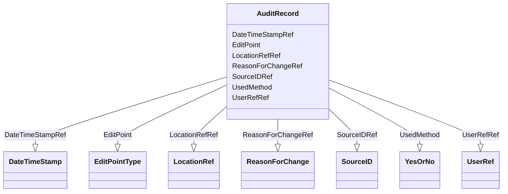

# Class: AuditRecord


_An AuditRecord carries information pertaining to the creation, deletion, or modification of clinical data. This information includes who performed that action, and where, when, and why that action was performed.AuditRecord information describes a change to clinical data, but is not itself clinical data. The value of some clinical data can always be changed by a subsequent transaction, but history cannot be changed, only added to._


URI: [odm:AuditRecord](http://www.cdisc.org/ns/odm/v2.0/AuditRecord)





<!-- no inheritance hierarchy -->


## Slots

| Name | Cardinality and Range | Description | Inheritance |
| ---  | --- | --- | --- |
| [EditPoint](EditPoint.md) | 0..1 <br/> [EditPointType](EditPointType.md) | Identifies the phase of data processing in which update action occurred. | direct |
| [UsedMethod](UsedMethod.md) | 0..1 <br/> [YesOrNo](YesOrNo.md) | Indicates that the action was made by the system rather than a data entry for... | direct |
| [UserRefRef](UserRefRef.md) | 0..1 <br/> [UserRef](UserRef.md) | UserRef reference: None | direct |
| [LocationRefRef](LocationRefRef.md) | 0..1 <br/> [LocationRef](LocationRef.md) | LocationRef reference: A reference to the user's physical location. | direct |
| [DateTimeStampRef](DateTimeStampRef.md) | 0..1 <br/> [DateTimeStamp](DateTimeStamp.md) | DateTimeStamp reference: None | direct |
| [ReasonForChangeRef](ReasonForChangeRef.md) | 0..1 <br/> [ReasonForChange](ReasonForChange.md) | ReasonForChange reference: A user-supplied reason for a data change. | direct |
| [SourceIDRef](SourceIDRef.md) | 0..1 <br/> [SourceID](SourceID.md) | SourceID reference: Information that identifies the source of the data within... | direct |


## Usages

| used by | used in | type | used |
| ---  | --- | --- | --- |
| [ReferenceData](ReferenceData.md) | [AuditRecordRef](AuditRecordRef.md) | range | [AuditRecord](AuditRecord.md) |
| [ClinicalData](ClinicalData.md) | [AuditRecordRef](AuditRecordRef.md) | range | [AuditRecord](AuditRecord.md) |
| [SubjectData](SubjectData.md) | [AuditRecordRef](AuditRecordRef.md) | range | [AuditRecord](AuditRecord.md) |
| [StudyEventData](StudyEventData.md) | [AuditRecordRef](AuditRecordRef.md) | range | [AuditRecord](AuditRecord.md) |
| [ItemGroupData](ItemGroupData.md) | [AuditRecordRef](AuditRecordRef.md) | range | [AuditRecord](AuditRecord.md) |
| [ItemData](ItemData.md) | [AuditRecordRef](AuditRecordRef.md) | range | [AuditRecord](AuditRecord.md) |
| [Query](Query.md) | [AuditRecordRef](AuditRecordRef.md) | range | [AuditRecord](AuditRecord.md) |


## See Also

* [https://wiki.cdisc.org/display/ODM2/AuditRecord](https://wiki.cdisc.org/display/ODM2/AuditRecord)

## Identifier and Mapping Information


### Schema Source


* from schema: http://www.cdisc.org/ns/odm/v2.0


## Mappings

| Mapping Type | Mapped Value |
| ---  | ---  |
| self | odm:AuditRecord |
| native | odm:AuditRecord |


## LinkML Source

<!-- TODO: investigate https://stackoverflow.com/questions/37606292/how-to-create-tabbed-code-blocks-in-mkdocs-or-sphinx -->

### Direct

<details>
```yaml
name: AuditRecord
description: An AuditRecord carries information pertaining to the creation, deletion,
  or modification of clinical data. This information includes who performed that action,
  and where, when, and why that action was performed.AuditRecord information describes
  a change to clinical data, but is not itself clinical data. The value of some clinical
  data can always be changed by a subsequent transaction, but history cannot be changed,
  only added to.
from_schema: http://www.cdisc.org/ns/odm/v2.0
see_also:
- https://wiki.cdisc.org/display/ODM2/AuditRecord
slots:
- EditPoint
- UsedMethod
- UserRefRef
- LocationRefRef
- DateTimeStampRef
- ReasonForChangeRef
- SourceIDRef
slot_usage:
  EditPoint:
    name: EditPoint
    description: Identifies the phase of data processing in which update action occurred.
    comments:
    - Optional
    domain_of:
    - AuditRecord
    range: EditPointType
  UsedMethod:
    name: UsedMethod
    description: Indicates that the action was made by the system rather than a data
      entry form user action.
    comments:
    - Optional
    domain_of:
    - AuditRecord
    range: YesOrNo
  UserRefRef:
    name: UserRefRef
    domain_of:
    - AdminData
    - AuditRecord
    - Signature
    range: UserRef
    maximum_cardinality: 1
  LocationRefRef:
    name: LocationRefRef
    domain_of:
    - AdminData
    - AuditRecord
    - Signature
    range: LocationRef
    maximum_cardinality: 1
  DateTimeStampRef:
    name: DateTimeStampRef
    domain_of:
    - AuditRecord
    - Signature
    range: DateTimeStamp
    maximum_cardinality: 1
  ReasonForChangeRef:
    name: ReasonForChangeRef
    domain_of:
    - AuditRecord
    range: ReasonForChange
    maximum_cardinality: 1
  SourceIDRef:
    name: SourceIDRef
    domain_of:
    - AuditRecord
    range: SourceID
    maximum_cardinality: 1
class_uri: odm:AuditRecord

```
</details>

### Induced

<details>
```yaml
name: AuditRecord
description: An AuditRecord carries information pertaining to the creation, deletion,
  or modification of clinical data. This information includes who performed that action,
  and where, when, and why that action was performed.AuditRecord information describes
  a change to clinical data, but is not itself clinical data. The value of some clinical
  data can always be changed by a subsequent transaction, but history cannot be changed,
  only added to.
from_schema: http://www.cdisc.org/ns/odm/v2.0
see_also:
- https://wiki.cdisc.org/display/ODM2/AuditRecord
slot_usage:
  EditPoint:
    name: EditPoint
    description: Identifies the phase of data processing in which update action occurred.
    comments:
    - Optional
    domain_of:
    - AuditRecord
    range: EditPointType
  UsedMethod:
    name: UsedMethod
    description: Indicates that the action was made by the system rather than a data
      entry form user action.
    comments:
    - Optional
    domain_of:
    - AuditRecord
    range: YesOrNo
  UserRefRef:
    name: UserRefRef
    domain_of:
    - AdminData
    - AuditRecord
    - Signature
    range: UserRef
    maximum_cardinality: 1
  LocationRefRef:
    name: LocationRefRef
    domain_of:
    - AdminData
    - AuditRecord
    - Signature
    range: LocationRef
    maximum_cardinality: 1
  DateTimeStampRef:
    name: DateTimeStampRef
    domain_of:
    - AuditRecord
    - Signature
    range: DateTimeStamp
    maximum_cardinality: 1
  ReasonForChangeRef:
    name: ReasonForChangeRef
    domain_of:
    - AuditRecord
    range: ReasonForChange
    maximum_cardinality: 1
  SourceIDRef:
    name: SourceIDRef
    domain_of:
    - AuditRecord
    range: SourceID
    maximum_cardinality: 1
attributes:
  EditPoint:
    name: EditPoint
    description: Identifies the phase of data processing in which update action occurred.
    comments:
    - Optional
    from_schema: http://www.cdisc.org/ns/odm/v2.0
    rank: 1000
    alias: EditPoint
    owner: AuditRecord
    domain_of:
    - AuditRecord
    range: EditPointType
  UsedMethod:
    name: UsedMethod
    description: Indicates that the action was made by the system rather than a data
      entry form user action.
    comments:
    - Optional
    from_schema: http://www.cdisc.org/ns/odm/v2.0
    rank: 1000
    alias: UsedMethod
    owner: AuditRecord
    domain_of:
    - AuditRecord
    range: YesOrNo
  UserRefRef:
    name: UserRefRef
    description: 'UserRef reference: None'
    from_schema: http://www.cdisc.org/ns/odm/v2.0
    rank: 1000
    identifier: false
    alias: UserRefRef
    owner: AuditRecord
    domain_of:
    - AdminData
    - AuditRecord
    - Signature
    range: UserRef
    maximum_cardinality: 1
  LocationRefRef:
    name: LocationRefRef
    description: 'LocationRef reference: A reference to the user''s physical location.'
    from_schema: http://www.cdisc.org/ns/odm/v2.0
    rank: 1000
    identifier: false
    alias: LocationRefRef
    owner: AuditRecord
    domain_of:
    - AdminData
    - AuditRecord
    - Signature
    range: LocationRef
    maximum_cardinality: 1
  DateTimeStampRef:
    name: DateTimeStampRef
    description: 'DateTimeStamp reference: None'
    from_schema: http://www.cdisc.org/ns/odm/v2.0
    rank: 1000
    identifier: false
    alias: DateTimeStampRef
    owner: AuditRecord
    domain_of:
    - AuditRecord
    - Signature
    range: DateTimeStamp
    maximum_cardinality: 1
  ReasonForChangeRef:
    name: ReasonForChangeRef
    description: 'ReasonForChange reference: A user-supplied reason for a data change.'
    from_schema: http://www.cdisc.org/ns/odm/v2.0
    rank: 1000
    identifier: false
    alias: ReasonForChangeRef
    owner: AuditRecord
    domain_of:
    - AuditRecord
    range: ReasonForChange
    maximum_cardinality: 1
  SourceIDRef:
    name: SourceIDRef
    description: 'SourceID reference: Information that identifies the source of the
      data within an originating system.'
    from_schema: http://www.cdisc.org/ns/odm/v2.0
    rank: 1000
    identifier: false
    alias: SourceIDRef
    owner: AuditRecord
    domain_of:
    - AuditRecord
    range: SourceID
    maximum_cardinality: 1
class_uri: odm:AuditRecord

```
</details>