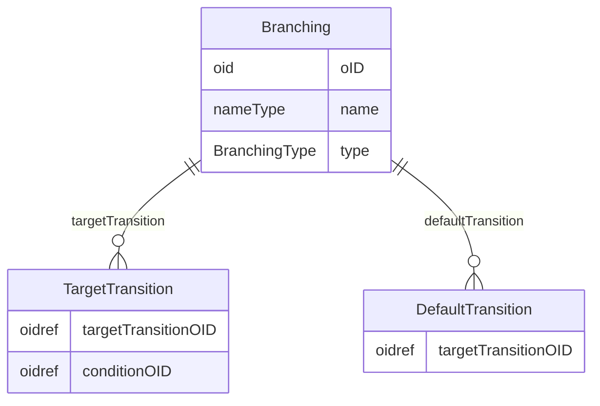

# Class: Branching

_This element describes the branching in a workflow from a source (start) structural element to 2 or more target structural elements, over a Transition element._


URI: [odm:Branching](http://www.cdisc.org/ns/odm/v2.0/Branching)





<!-- no inheritance hierarchy -->


## Slots

| Name | Cardinality* and Range | Description | Inheritance |
| ---  | --- | --- | --- |
| [oID](oID.md) | 1..1 <br/> [oid](oid.md) | Unique identifier of the version within the XML document. | direct |
| [name](name.md) | 1..1 <br/> [nameType](nameType.md) | General observation Sub Class. | direct |
| [type](type.md) | 1..1 <br/> [BranchingType](BranchingType.md) | Type of page for page references indicated in the PageRefs attribute. | direct |
| [targetTransition](targetTransition.md) | 0..* <br/> [TargetTransition](TargetTransition.md) | TargetTransition reference: TargetTransition provides a reference to a Transi... | direct |
| [defaultTransition](defaultTransition.md) | 0..* <br/> [DefaultTransition](DefaultTransition.md) | DefaultTransition reference: The DefaultTransition references the Transition ... | direct |

_* See [LinkML documentation](https://linkml.io/linkml/schemas/slots.html#slot-cardinality) for cardinality definitions._


## Usages

| used by | used in | type | used |
| ---  | --- | --- | --- |
| [WorkflowDef](WorkflowDef.md) | [branching](branching.md) | range | [Branching](Branching.md) |


## See Also

* [https://wiki.cdisc.org/display/PUB/Branching](https://wiki.cdisc.org/display/PUB/Branching)

## Identifier and Mapping Information


### Schema Source


* from schema: http://www.cdisc.org/ns/odm/v2.0


## Mappings

| Mapping Type | Mapped Value |
| ---  | ---  |
| self | odm:Branching |
| native | odm:Branching |


## LinkML Source

<!-- TODO: investigate https://stackoverflow.com/questions/37606292/how-to-create-tabbed-code-blocks-in-mkdocs-or-sphinx -->

### Direct

<details>
```yaml
name: Branching
description: This element describes the branching in a workflow from a source (start)
  structural element to 2 or more target structural elements, over a Transition element.
from_schema: http://www.cdisc.org/ns/odm/v2.0
see_also:
- https://wiki.cdisc.org/display/PUB/Branching
rank: 1000
slots:
- oID
- name
- type
- targetTransition
- defaultTransition
slot_usage:
  oID:
    name: oID
    comments:
    - 'Required

      range: oid

      The Branching/@OID attribute must be unique within the Study/MetaDataVersion.'
    domain_of:
    - Study
    - MetaDataVersion
    - Standard
    - ValueListDef
    - WhereClauseDef
    - StudyEventGroupDef
    - StudyEventDef
    - ItemGroupDef
    - ItemDef
    - CodeList
    - MethodDef
    - ConditionDef
    - CommentDef
    - StudyIndication
    - StudyIntervention
    - StudyObjective
    - StudyEndPoint
    - StudyTargetPopulation
    - StudyEstimand
    - Arm
    - Epoch
    - StudyParameter
    - StudyTiming
    - TransitionTimingConstraint
    - AbsoluteTimingConstraint
    - RelativeTimingConstraint
    - DurationTimingConstraint
    - WorkflowDef
    - Transition
    - Branching
    - Criterion
    - User
    - Organization
    - Location
    - SignatureDef
    - Query
    range: oid
    required: true
  name:
    name: name
    comments:
    - 'Required

      range: name

      The Branching/@Name attribute must be unique within the set of Study/MetaDataVersion/WorkflowDefs'
    domain_of:
    - Alias
    - MetaDataVersion
    - Standard
    - StudyEventGroupDef
    - StudyEventDef
    - ItemGroupDef
    - Class
    - SubClass
    - SourceItem
    - Resource
    - ItemDef
    - CodeList
    - MethodDef
    - Parameter
    - ReturnValue
    - ConditionDef
    - StudyObjective
    - StudyEndPoint
    - StudyTargetPopulation
    - StudyEstimand
    - Arm
    - Epoch
    - StudyTiming
    - TransitionTimingConstraint
    - AbsoluteTimingConstraint
    - RelativeTimingConstraint
    - DurationTimingConstraint
    - WorkflowDef
    - Transition
    - Branching
    - Criterion
    - Organization
    - Location
    - Query
    range: nameType
    required: true
  type:
    name: type
    comments:
    - 'Required

      enum values: (Exclusive | Parallel)

      The TargetTransition element must provide a reference to a ConditionDef when
      the value of Type is "Exclusive".'
    domain_of:
    - TranslatedText
    - PDFPageRef
    - Standard
    - StudyEventDef
    - ItemGroupDef
    - Origin
    - Resource
    - MethodDef
    - StudyEndPoint
    - TransitionTimingConstraint
    - RelativeTimingConstraint
    - Branching
    - Organization
    - Query
    range: BranchingType
    required: true
  targetTransition:
    name: targetTransition
    multivalued: true
    domain_of:
    - Branching
    range: TargetTransition
    inlined: true
    inlined_as_list: true
  defaultTransition:
    name: defaultTransition
    multivalued: true
    domain_of:
    - Branching
    range: DefaultTransition
    inlined: true
    inlined_as_list: true
class_uri: odm:Branching

```
</details>

### Induced

<details>
```yaml
name: Branching
description: This element describes the branching in a workflow from a source (start)
  structural element to 2 or more target structural elements, over a Transition element.
from_schema: http://www.cdisc.org/ns/odm/v2.0
see_also:
- https://wiki.cdisc.org/display/PUB/Branching
rank: 1000
slot_usage:
  oID:
    name: oID
    comments:
    - 'Required

      range: oid

      The Branching/@OID attribute must be unique within the Study/MetaDataVersion.'
    domain_of:
    - Study
    - MetaDataVersion
    - Standard
    - ValueListDef
    - WhereClauseDef
    - StudyEventGroupDef
    - StudyEventDef
    - ItemGroupDef
    - ItemDef
    - CodeList
    - MethodDef
    - ConditionDef
    - CommentDef
    - StudyIndication
    - StudyIntervention
    - StudyObjective
    - StudyEndPoint
    - StudyTargetPopulation
    - StudyEstimand
    - Arm
    - Epoch
    - StudyParameter
    - StudyTiming
    - TransitionTimingConstraint
    - AbsoluteTimingConstraint
    - RelativeTimingConstraint
    - DurationTimingConstraint
    - WorkflowDef
    - Transition
    - Branching
    - Criterion
    - User
    - Organization
    - Location
    - SignatureDef
    - Query
    range: oid
    required: true
  name:
    name: name
    comments:
    - 'Required

      range: name

      The Branching/@Name attribute must be unique within the set of Study/MetaDataVersion/WorkflowDefs'
    domain_of:
    - Alias
    - MetaDataVersion
    - Standard
    - StudyEventGroupDef
    - StudyEventDef
    - ItemGroupDef
    - Class
    - SubClass
    - SourceItem
    - Resource
    - ItemDef
    - CodeList
    - MethodDef
    - Parameter
    - ReturnValue
    - ConditionDef
    - StudyObjective
    - StudyEndPoint
    - StudyTargetPopulation
    - StudyEstimand
    - Arm
    - Epoch
    - StudyTiming
    - TransitionTimingConstraint
    - AbsoluteTimingConstraint
    - RelativeTimingConstraint
    - DurationTimingConstraint
    - WorkflowDef
    - Transition
    - Branching
    - Criterion
    - Organization
    - Location
    - Query
    range: nameType
    required: true
  type:
    name: type
    comments:
    - 'Required

      enum values: (Exclusive | Parallel)

      The TargetTransition element must provide a reference to a ConditionDef when
      the value of Type is "Exclusive".'
    domain_of:
    - TranslatedText
    - PDFPageRef
    - Standard
    - StudyEventDef
    - ItemGroupDef
    - Origin
    - Resource
    - MethodDef
    - StudyEndPoint
    - TransitionTimingConstraint
    - RelativeTimingConstraint
    - Branching
    - Organization
    - Query
    range: BranchingType
    required: true
  targetTransition:
    name: targetTransition
    multivalued: true
    domain_of:
    - Branching
    range: TargetTransition
    inlined: true
    inlined_as_list: true
  defaultTransition:
    name: defaultTransition
    multivalued: true
    domain_of:
    - Branching
    range: DefaultTransition
    inlined: true
    inlined_as_list: true
attributes:
  oID:
    name: oID
    description: Unique identifier of the version within the XML document.
    comments:
    - 'Required

      range: oid

      The Branching/@OID attribute must be unique within the Study/MetaDataVersion.'
    from_schema: http://www.cdisc.org/ns/odm/v2.0
    rank: 1000
    identifier: true
    alias: oID
    owner: Branching
    domain_of:
    - Study
    - MetaDataVersion
    - Standard
    - ValueListDef
    - WhereClauseDef
    - StudyEventGroupDef
    - StudyEventDef
    - ItemGroupDef
    - ItemDef
    - CodeList
    - MethodDef
    - ConditionDef
    - CommentDef
    - StudyIndication
    - StudyIntervention
    - StudyObjective
    - StudyEndPoint
    - StudyTargetPopulation
    - StudyEstimand
    - Arm
    - Epoch
    - StudyParameter
    - StudyTiming
    - TransitionTimingConstraint
    - AbsoluteTimingConstraint
    - RelativeTimingConstraint
    - DurationTimingConstraint
    - WorkflowDef
    - Transition
    - Branching
    - Criterion
    - User
    - Organization
    - Location
    - SignatureDef
    - Query
    range: oid
    required: true
  name:
    name: name
    description: General observation Sub Class.
    comments:
    - 'Required

      range: name

      The Branching/@Name attribute must be unique within the set of Study/MetaDataVersion/WorkflowDefs'
    from_schema: http://www.cdisc.org/ns/odm/v2.0
    rank: 1000
    alias: name
    owner: Branching
    domain_of:
    - Alias
    - MetaDataVersion
    - Standard
    - StudyEventGroupDef
    - StudyEventDef
    - ItemGroupDef
    - Class
    - SubClass
    - SourceItem
    - Resource
    - ItemDef
    - CodeList
    - MethodDef
    - Parameter
    - ReturnValue
    - ConditionDef
    - StudyObjective
    - StudyEndPoint
    - StudyTargetPopulation
    - StudyEstimand
    - Arm
    - Epoch
    - StudyTiming
    - TransitionTimingConstraint
    - AbsoluteTimingConstraint
    - RelativeTimingConstraint
    - DurationTimingConstraint
    - WorkflowDef
    - Transition
    - Branching
    - Criterion
    - Organization
    - Location
    - Query
    range: nameType
    required: true
  type:
    name: type
    description: Type of page for page references indicated in the PageRefs attribute.
    comments:
    - 'Required

      enum values: (Exclusive | Parallel)

      The TargetTransition element must provide a reference to a ConditionDef when
      the value of Type is "Exclusive".'
    from_schema: http://www.cdisc.org/ns/odm/v2.0
    rank: 1000
    alias: type
    owner: Branching
    domain_of:
    - TranslatedText
    - PDFPageRef
    - Standard
    - StudyEventDef
    - ItemGroupDef
    - Origin
    - Resource
    - MethodDef
    - StudyEndPoint
    - TransitionTimingConstraint
    - RelativeTimingConstraint
    - Branching
    - Organization
    - Query
    range: BranchingType
    required: true
  targetTransition:
    name: targetTransition
    description: 'TargetTransition reference: TargetTransition provides a reference
      to a Transition element that is the target of a branching.'
    from_schema: http://www.cdisc.org/ns/odm/v2.0
    rank: 1000
    multivalued: true
    identifier: false
    alias: targetTransition
    owner: Branching
    domain_of:
    - Branching
    range: TargetTransition
    inlined: true
    inlined_as_list: true
  defaultTransition:
    name: defaultTransition
    description: 'DefaultTransition reference: The DefaultTransition references the
      Transition that needs to be executed when none of the TargetTransitions can
      be executed.'
    from_schema: http://www.cdisc.org/ns/odm/v2.0
    rank: 1000
    multivalued: true
    identifier: false
    alias: defaultTransition
    owner: Branching
    domain_of:
    - Branching
    range: DefaultTransition
    inlined: true
    inlined_as_list: true
class_uri: odm:Branching

```
</details>