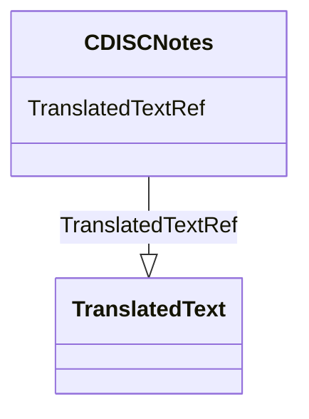

# Class: CDISCNotes


URI: [odm:CDISCNotes](http://www.cdisc.org/ns/odm/v2.0/CDISCNotes)





<!-- no inheritance hierarchy -->


## Slots

| Name | Cardinality and Range | Description | Inheritance |
| ---  | --- | --- | --- |
| [TranslatedTextRef](TranslatedTextRef.md) | 1..* <br/> [TranslatedText](TranslatedText.md) |  | direct |


## Usages

| used by | used in | type | used |
| ---  | --- | --- | --- |
| [ItemDef](ItemDef.md) | [CDISCNotesRef](CDISCNotesRef.md) | range | [CDISCNotes](CDISCNotes.md) |


## See Also

* [https://wiki.cdisc.org/display/ODM2/CDISCNotes](https://wiki.cdisc.org/display/ODM2/CDISCNotes)

## Identifier and Mapping Information


### Schema Source


* from schema: http://www.cdisc.org/ns/odm/v2.0


## Mappings

| Mapping Type | Mapped Value |
| ---  | ---  |
| self | odm:CDISCNotes |
| native | odm:CDISCNotes |


## LinkML Source

<!-- TODO: investigate https://stackoverflow.com/questions/37606292/how-to-create-tabbed-code-blocks-in-mkdocs-or-sphinx -->

### Direct

<details>
```yaml
name: CDISCNotes
from_schema: http://www.cdisc.org/ns/odm/v2.0
see_also:
- https://wiki.cdisc.org/display/ODM2/CDISCNotes
slots:
- TranslatedTextRef
slot_usage:
  TranslatedTextRef:
    name: TranslatedTextRef
    multivalued: true
    domain_of:
    - Description
    - Question
    - Definition
    - Prompt
    - CRFCompletionInstructions
    - ImplementationNotes
    - CDISCNotes
    - ErrorMessage
    - Decode
    - Comment
    range: TranslatedText
    required: true
    inlined: true
    inlined_as_list: true
    minimum_cardinality: 1
class_uri: odm:CDISCNotes

```
</details>

### Induced

<details>
```yaml
name: CDISCNotes
from_schema: http://www.cdisc.org/ns/odm/v2.0
see_also:
- https://wiki.cdisc.org/display/ODM2/CDISCNotes
slot_usage:
  TranslatedTextRef:
    name: TranslatedTextRef
    multivalued: true
    domain_of:
    - Description
    - Question
    - Definition
    - Prompt
    - CRFCompletionInstructions
    - ImplementationNotes
    - CDISCNotes
    - ErrorMessage
    - Decode
    - Comment
    range: TranslatedText
    required: true
    inlined: true
    inlined_as_list: true
    minimum_cardinality: 1
attributes:
  TranslatedTextRef:
    name: TranslatedTextRef
    from_schema: http://www.cdisc.org/ns/odm/v2.0
    rank: 1000
    multivalued: true
    alias: TranslatedTextRef
    owner: CDISCNotes
    domain_of:
    - Description
    - Question
    - Definition
    - Prompt
    - CRFCompletionInstructions
    - ImplementationNotes
    - CDISCNotes
    - ErrorMessage
    - Decode
    - Comment
    range: TranslatedText
    required: true
    inlined: true
    inlined_as_list: true
    minimum_cardinality: 1
class_uri: odm:CDISCNotes

```
</details>