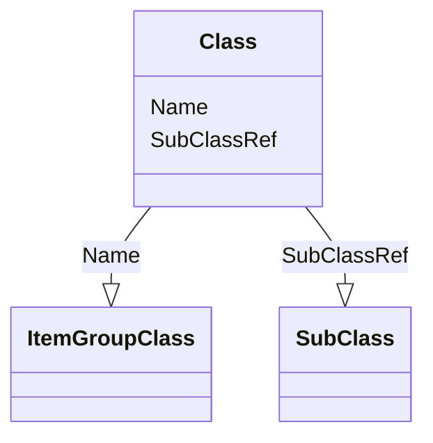

# Class: Class


_The Class element identifies which predefined Class within the model applies to the definition of the dataset._


URI: [odm:Class](http://www.cdisc.org/ns/odm/v2.0/Class)





<!-- no inheritance hierarchy -->


## Slots

| Name | Cardinality and Range | Description | Inheritance |
| ---  | --- | --- | --- |
| [Name](Name.md) | 1..1 <br/> [ItemGroupClass](ItemGroupClass.md) | Name of the Class | direct |
| [SubClassRef](SubClassRef.md) | 0..* <br/> [SubClass](SubClass.md) | SubClass reference: This element contains SubClass definitions. | direct |


## Usages

| used by | used in | type | used |
| ---  | --- | --- | --- |
| [ItemGroupDef](ItemGroupDef.md) | [ClassRef](ClassRef.md) | range | [Class](Class.md) |


## See Also

* [https://wiki.cdisc.org/display/ODM2/Class](https://wiki.cdisc.org/display/ODM2/Class)

## Identifier and Mapping Information


### Schema Source


* from schema: http://www.cdisc.org/ns/odm/v2.0


## Mappings

| Mapping Type | Mapped Value |
| ---  | ---  |
| self | odm:Class |
| native | odm:Class |


## LinkML Source

<!-- TODO: investigate https://stackoverflow.com/questions/37606292/how-to-create-tabbed-code-blocks-in-mkdocs-or-sphinx -->

### Direct

<details>
```yaml
name: Class
description: The Class element identifies which predefined Class within the model
  applies to the definition of the dataset.
from_schema: http://www.cdisc.org/ns/odm/v2.0
see_also:
- https://wiki.cdisc.org/display/ODM2/Class
slots:
- Name
- SubClassRef
slot_usage:
  Name:
    name: Name
    description: Name of the Class
    comments:
    - 'Conditional Required when ODM/@Context="Submission

      range: text

      Text must follow CDISC Controlled Terminology for General Observation Class.
      For analysis datasets, if the ItemGroupDef IsNonStandard attribute is used,
      the Class should not be provided.'
    domain_of:
    - Alias
    - MetaDataVersion
    - Standard
    - StudyEventGroupDef
    - StudyEventDef
    - ItemGroupDef
    - Class
    - SubClass
    - SourceItem
    - Resource
    - ItemDef
    - CodeList
    - MethodDef
    - Parameter
    - ReturnValue
    - ConditionDef
    - StudyObjective
    - StudyEndPoint
    - StudyTargetPopulation
    - StudyEstimand
    - Arm
    - Epoch
    - StudyTiming
    - TransitionTimingConstraint
    - AbsoluteTimingConstraint
    - RelativeTimingConstraint
    - DurationTimingConstraint
    - WorkflowDef
    - Transition
    - Branching
    - Criterion
    - Organization
    - Location
    - Query
    range: ItemGroupClass
    required: true
  SubClassRef:
    name: SubClassRef
    multivalued: true
    domain_of:
    - Class
    range: SubClass
    inlined: true
    inlined_as_list: true
class_uri: odm:Class

```
</details>

### Induced

<details>
```yaml
name: Class
description: The Class element identifies which predefined Class within the model
  applies to the definition of the dataset.
from_schema: http://www.cdisc.org/ns/odm/v2.0
see_also:
- https://wiki.cdisc.org/display/ODM2/Class
slot_usage:
  Name:
    name: Name
    description: Name of the Class
    comments:
    - 'Conditional Required when ODM/@Context="Submission

      range: text

      Text must follow CDISC Controlled Terminology for General Observation Class.
      For analysis datasets, if the ItemGroupDef IsNonStandard attribute is used,
      the Class should not be provided.'
    domain_of:
    - Alias
    - MetaDataVersion
    - Standard
    - StudyEventGroupDef
    - StudyEventDef
    - ItemGroupDef
    - Class
    - SubClass
    - SourceItem
    - Resource
    - ItemDef
    - CodeList
    - MethodDef
    - Parameter
    - ReturnValue
    - ConditionDef
    - StudyObjective
    - StudyEndPoint
    - StudyTargetPopulation
    - StudyEstimand
    - Arm
    - Epoch
    - StudyTiming
    - TransitionTimingConstraint
    - AbsoluteTimingConstraint
    - RelativeTimingConstraint
    - DurationTimingConstraint
    - WorkflowDef
    - Transition
    - Branching
    - Criterion
    - Organization
    - Location
    - Query
    range: ItemGroupClass
    required: true
  SubClassRef:
    name: SubClassRef
    multivalued: true
    domain_of:
    - Class
    range: SubClass
    inlined: true
    inlined_as_list: true
attributes:
  Name:
    name: Name
    description: Name of the Class
    comments:
    - 'Conditional Required when ODM/@Context="Submission

      range: text

      Text must follow CDISC Controlled Terminology for General Observation Class.
      For analysis datasets, if the ItemGroupDef IsNonStandard attribute is used,
      the Class should not be provided.'
    from_schema: http://www.cdisc.org/ns/odm/v2.0
    rank: 1000
    alias: Name
    owner: Class
    domain_of:
    - Alias
    - MetaDataVersion
    - Standard
    - StudyEventGroupDef
    - StudyEventDef
    - ItemGroupDef
    - Class
    - SubClass
    - SourceItem
    - Resource
    - ItemDef
    - CodeList
    - MethodDef
    - Parameter
    - ReturnValue
    - ConditionDef
    - StudyObjective
    - StudyEndPoint
    - StudyTargetPopulation
    - StudyEstimand
    - Arm
    - Epoch
    - StudyTiming
    - TransitionTimingConstraint
    - AbsoluteTimingConstraint
    - RelativeTimingConstraint
    - DurationTimingConstraint
    - WorkflowDef
    - Transition
    - Branching
    - Criterion
    - Organization
    - Location
    - Query
    range: ItemGroupClass
    required: true
  SubClassRef:
    name: SubClassRef
    description: 'SubClass reference: This element contains SubClass definitions.'
    from_schema: http://www.cdisc.org/ns/odm/v2.0
    rank: 1000
    multivalued: true
    identifier: false
    alias: SubClassRef
    owner: Class
    domain_of:
    - Class
    range: SubClass
    inlined: true
    inlined_as_list: true
class_uri: odm:Class

```
</details>