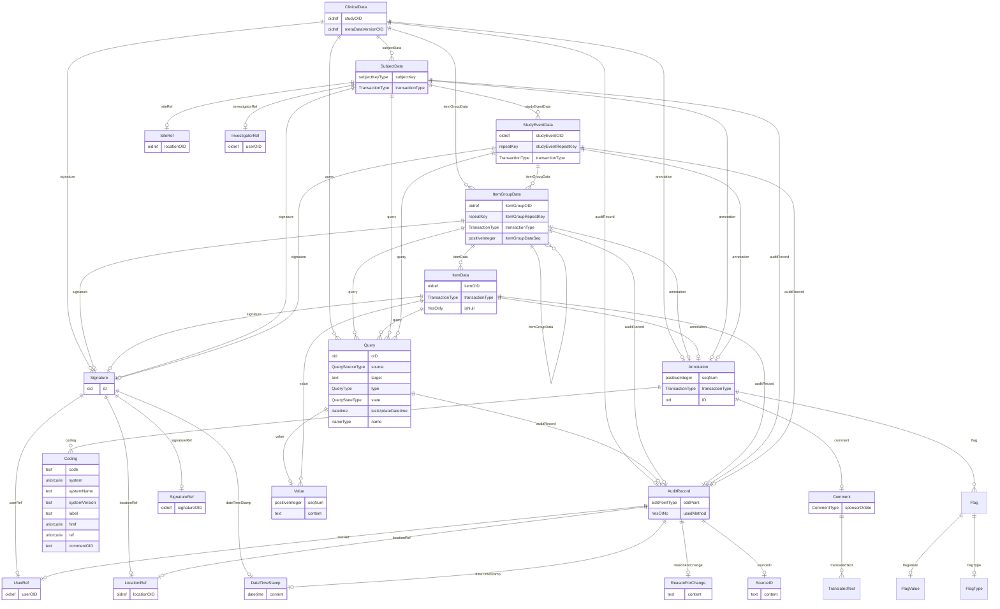

# Class: ClinicalData

_Clinical data for 1 or more subjects._


URI: [odm:ClinicalData](http://www.cdisc.org/ns/odm/v2.0/ClinicalData)





<!-- no inheritance hierarchy -->


## Slots

| Name | Cardinality* and Range | Description | Inheritance |
| ---  | --- | --- | --- |
| [studyOID](studyOID.md) | 1..1 <br/> [oidref](oidref.md) | References the Study that uses the data nested within this element. | direct |
| [metaDataVersionOID](metaDataVersionOID.md) | 1..1 <br/> [oidref](oidref.md) | References the MetaDataVersion (within the above Study) that governs the data... | direct |
| [subjectData](subjectData.md) | 0..* <br/> [SubjectData](SubjectData.md) | SubjectData reference: Clinical data for a single subject. | direct |
| [itemGroupData](itemGroupData.md) | 0..* <br/> [ItemGroupData](ItemGroupData.md) | ItemGroupData reference: Clinical data corresponding to an ItemGroupRef defin... | direct |
| [query](query.md) | 0..* <br/> [Query](Query.md) | Query reference: The Query element represents a request for clarification on ... | direct |
| [auditRecord](auditRecord.md) | 0..1 <br/> [AuditRecord](AuditRecord.md) | AuditRecord reference: An AuditRecord carries information pertaining to the c... | direct |
| [signature](signature.md) | 0..1 <br/> [Signature](Signature.md) | Signature reference: An electronic signature applies to a collection of clini... | direct |
| [annotation](annotation.md) | 0..1 <br/> [Annotation](Annotation.md) | Annotation reference: A general note about clinical data. If an annotation ha... | direct |

_* See [LinkML documentation](https://linkml.io/linkml/schemas/slots.html#slot-cardinality) for cardinality definitions._


## Usages

| used by | used in | type | used |
| ---  | --- | --- | --- |
| [ODMFileMetadata](ODMFileMetadata.md) | [clinicalData](clinicalData.md) | range | [ClinicalData](ClinicalData.md) |


## See Also

* [https://wiki.cdisc.org/display/PUB/ClinicalData](https://wiki.cdisc.org/display/PUB/ClinicalData)

## Identifier and Mapping Information


### Schema Source


* from schema: http://www.cdisc.org/ns/odm/v2.0


## Mappings

| Mapping Type | Mapped Value |
| ---  | ---  |
| self | odm:ClinicalData |
| native | odm:ClinicalData |


## LinkML Source

<!-- TODO: investigate https://stackoverflow.com/questions/37606292/how-to-create-tabbed-code-blocks-in-mkdocs-or-sphinx -->

### Direct

<details>
```yaml
name: ClinicalData
description: Clinical data for 1 or more subjects.
from_schema: http://www.cdisc.org/ns/odm/v2.0
see_also:
- https://wiki.cdisc.org/display/PUB/ClinicalData
rank: 1000
slots:
- studyOID
- metaDataVersionOID
- subjectData
- itemGroupData
- query
- auditRecord
- signature
- annotation
slot_usage:
  studyOID:
    name: studyOID
    description: References the Study that uses the data nested within this element.
    comments:
    - 'Required

      range: oidref

      Must match a Study/@OID value.'
    domain_of:
    - Include
    - SourceItem
    - AdminData
    - MetaDataVersionRef
    - ReferenceData
    - ClinicalData
    - Association
    - KeySet
    range: oidref
    required: true
  metaDataVersionOID:
    name: metaDataVersionOID
    description: References the MetaDataVersion (within the above Study) that governs
      the data nested within this element. The StudyOID and MetaDataVersionOID attributes
      select a particular metadata version. All metadata references (OIDs) occurring
      within this ClinicalData element refer to definitions within the selected metadata
      version.
    comments:
    - 'Required

      range: oidref

      Must match a MetaDataVersions/@OID value contained in the Study element.'
    domain_of:
    - Include
    - SourceItem
    - MetaDataVersionRef
    - ReferenceData
    - ClinicalData
    - Association
    - KeySet
    range: oidref
    required: true
  subjectData:
    name: subjectData
    multivalued: true
    domain_of:
    - ClinicalData
    range: SubjectData
    inlined: true
    inlined_as_list: true
  itemGroupData:
    name: itemGroupData
    multivalued: true
    domain_of:
    - ReferenceData
    - ClinicalData
    - StudyEventData
    - ItemGroupData
    range: ItemGroupData
    inlined: true
    inlined_as_list: true
  query:
    name: query
    multivalued: true
    domain_of:
    - Location
    - ClinicalData
    - SubjectData
    - StudyEventData
    - ItemGroupData
    - ItemData
    range: Query
    inlined: true
    inlined_as_list: true
  auditRecord:
    name: auditRecord
    domain_of:
    - ReferenceData
    - ClinicalData
    - SubjectData
    - StudyEventData
    - ItemGroupData
    - ItemData
    - Query
    range: AuditRecord
    maximum_cardinality: 1
  signature:
    name: signature
    domain_of:
    - ReferenceData
    - ClinicalData
    - SubjectData
    - StudyEventData
    - ItemGroupData
    - ItemData
    range: Signature
    maximum_cardinality: 1
  annotation:
    name: annotation
    domain_of:
    - ReferenceData
    - ClinicalData
    - SubjectData
    - StudyEventData
    - ItemGroupData
    - ItemData
    - Association
    range: Annotation
    maximum_cardinality: 1
class_uri: odm:ClinicalData

```
</details>

### Induced

<details>
```yaml
name: ClinicalData
description: Clinical data for 1 or more subjects.
from_schema: http://www.cdisc.org/ns/odm/v2.0
see_also:
- https://wiki.cdisc.org/display/PUB/ClinicalData
rank: 1000
slot_usage:
  studyOID:
    name: studyOID
    description: References the Study that uses the data nested within this element.
    comments:
    - 'Required

      range: oidref

      Must match a Study/@OID value.'
    domain_of:
    - Include
    - SourceItem
    - AdminData
    - MetaDataVersionRef
    - ReferenceData
    - ClinicalData
    - Association
    - KeySet
    range: oidref
    required: true
  metaDataVersionOID:
    name: metaDataVersionOID
    description: References the MetaDataVersion (within the above Study) that governs
      the data nested within this element. The StudyOID and MetaDataVersionOID attributes
      select a particular metadata version. All metadata references (OIDs) occurring
      within this ClinicalData element refer to definitions within the selected metadata
      version.
    comments:
    - 'Required

      range: oidref

      Must match a MetaDataVersions/@OID value contained in the Study element.'
    domain_of:
    - Include
    - SourceItem
    - MetaDataVersionRef
    - ReferenceData
    - ClinicalData
    - Association
    - KeySet
    range: oidref
    required: true
  subjectData:
    name: subjectData
    multivalued: true
    domain_of:
    - ClinicalData
    range: SubjectData
    inlined: true
    inlined_as_list: true
  itemGroupData:
    name: itemGroupData
    multivalued: true
    domain_of:
    - ReferenceData
    - ClinicalData
    - StudyEventData
    - ItemGroupData
    range: ItemGroupData
    inlined: true
    inlined_as_list: true
  query:
    name: query
    multivalued: true
    domain_of:
    - Location
    - ClinicalData
    - SubjectData
    - StudyEventData
    - ItemGroupData
    - ItemData
    range: Query
    inlined: true
    inlined_as_list: true
  auditRecord:
    name: auditRecord
    domain_of:
    - ReferenceData
    - ClinicalData
    - SubjectData
    - StudyEventData
    - ItemGroupData
    - ItemData
    - Query
    range: AuditRecord
    maximum_cardinality: 1
  signature:
    name: signature
    domain_of:
    - ReferenceData
    - ClinicalData
    - SubjectData
    - StudyEventData
    - ItemGroupData
    - ItemData
    range: Signature
    maximum_cardinality: 1
  annotation:
    name: annotation
    domain_of:
    - ReferenceData
    - ClinicalData
    - SubjectData
    - StudyEventData
    - ItemGroupData
    - ItemData
    - Association
    range: Annotation
    maximum_cardinality: 1
attributes:
  studyOID:
    name: studyOID
    description: References the Study that uses the data nested within this element.
    comments:
    - 'Required

      range: oidref

      Must match a Study/@OID value.'
    from_schema: http://www.cdisc.org/ns/odm/v2.0
    rank: 1000
    alias: studyOID
    owner: ClinicalData
    domain_of:
    - Include
    - SourceItem
    - AdminData
    - MetaDataVersionRef
    - ReferenceData
    - ClinicalData
    - Association
    - KeySet
    range: oidref
    required: true
  metaDataVersionOID:
    name: metaDataVersionOID
    description: References the MetaDataVersion (within the above Study) that governs
      the data nested within this element. The StudyOID and MetaDataVersionOID attributes
      select a particular metadata version. All metadata references (OIDs) occurring
      within this ClinicalData element refer to definitions within the selected metadata
      version.
    comments:
    - 'Required

      range: oidref

      Must match a MetaDataVersions/@OID value contained in the Study element.'
    from_schema: http://www.cdisc.org/ns/odm/v2.0
    rank: 1000
    alias: metaDataVersionOID
    owner: ClinicalData
    domain_of:
    - Include
    - SourceItem
    - MetaDataVersionRef
    - ReferenceData
    - ClinicalData
    - Association
    - KeySet
    range: oidref
    required: true
  subjectData:
    name: subjectData
    description: 'SubjectData reference: Clinical data for a single subject.'
    from_schema: http://www.cdisc.org/ns/odm/v2.0
    rank: 1000
    multivalued: true
    identifier: false
    alias: subjectData
    owner: ClinicalData
    domain_of:
    - ClinicalData
    range: SubjectData
    inlined: true
    inlined_as_list: true
  itemGroupData:
    name: itemGroupData
    description: 'ItemGroupData reference: Clinical data corresponding to an ItemGroupRef
      defined in the active MetaDataVersion.'
    from_schema: http://www.cdisc.org/ns/odm/v2.0
    rank: 1000
    multivalued: true
    identifier: false
    alias: itemGroupData
    owner: ClinicalData
    domain_of:
    - ReferenceData
    - ClinicalData
    - StudyEventData
    - ItemGroupData
    range: ItemGroupData
    inlined: true
    inlined_as_list: true
  query:
    name: query
    description: 'Query reference: The Query element represents a request for clarification
      on a data item collected for a clinical trial, specifically a request from a
      sponsor or sponsor’s representative to an investigator to resolve an error or
      inconsistency discovered during data review. Queries can be created manually
      by individuals such as site monitors or data managers or automatically by systems.
      The full text of the Query exists in the Value child element. The optional Name
      attribute provide the means to provide a short identifier that can be included
      in listing or user interfaces.'
    from_schema: http://www.cdisc.org/ns/odm/v2.0
    rank: 1000
    multivalued: true
    identifier: false
    alias: query
    owner: ClinicalData
    domain_of:
    - Location
    - ClinicalData
    - SubjectData
    - StudyEventData
    - ItemGroupData
    - ItemData
    range: Query
    inlined: true
    inlined_as_list: true
  auditRecord:
    name: auditRecord
    description: 'AuditRecord reference: An AuditRecord carries information pertaining
      to the creation, deletion, or modification of clinical data. This information
      includes who performed that action, and where, when, and why that action was
      performed.AuditRecord information describes a change to clinical data, but is
      not itself clinical data. The value of some clinical data can always be changed
      by a subsequent transaction, but history cannot be changed, only added to.'
    from_schema: http://www.cdisc.org/ns/odm/v2.0
    rank: 1000
    identifier: false
    alias: auditRecord
    owner: ClinicalData
    domain_of:
    - ReferenceData
    - ClinicalData
    - SubjectData
    - StudyEventData
    - ItemGroupData
    - ItemData
    - Query
    range: AuditRecord
    maximum_cardinality: 1
  signature:
    name: signature
    description: 'Signature reference: An electronic signature applies to a collection
      of clinical data. This indicates that some user accepts legal responsibility
      for that data. See 21 CFR Part 11. The signature identifies the person signing,
      the location of signing, the signature meaning (via the referenced SignatureDef),
      the date and time of signing, and (in the case of a digital signature) an encrypted
      hash of the included data.'
    from_schema: http://www.cdisc.org/ns/odm/v2.0
    rank: 1000
    identifier: false
    alias: signature
    owner: ClinicalData
    domain_of:
    - ReferenceData
    - ClinicalData
    - SubjectData
    - StudyEventData
    - ItemGroupData
    - ItemData
    range: Signature
    maximum_cardinality: 1
  annotation:
    name: annotation
    description: 'Annotation reference: A general note about clinical data. If an
      annotation has both a comment and flags, the flags should be related to the
      comment.'
    from_schema: http://www.cdisc.org/ns/odm/v2.0
    rank: 1000
    identifier: false
    alias: annotation
    owner: ClinicalData
    domain_of:
    - ReferenceData
    - ClinicalData
    - SubjectData
    - StudyEventData
    - ItemGroupData
    - ItemData
    - Association
    range: Annotation
    maximum_cardinality: 1
class_uri: odm:ClinicalData

```
</details>