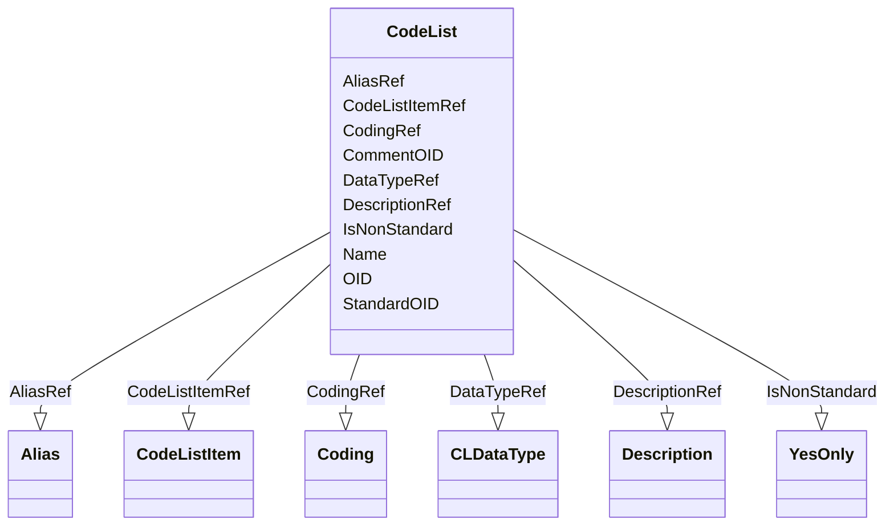

# Class: CodeList


URI: [odm:CodeList](http://www.cdisc.org/ns/odm/v2.0/CodeList)





<!-- no inheritance hierarchy -->


## Slots

| Name | Cardinality and Range | Description | Inheritance |
| ---  | --- | --- | --- |
| [OID](OID.md) | 1..1 <br/> [Oid](Oid.md) | Unique identifier of the version within the XML document | direct |
| [Name](Name.md) | 1..1 <br/> [Name](Name.md) | General observation Sub Class | direct |
| [DataTypeRef](DataTypeRef.md) | 1..1 <br/> [CLDataType](CLDataType.md) | The DataType attribute specifies how the corresponding value | direct |
| [CommentOID](CommentOID.md) | 0..1 <br/> [Oidref](Oidref.md) | The Comment identifier that this value refers to | direct |
| [StandardOID](StandardOID.md) | 0..1 <br/> [Oidref](Oidref.md) |  | direct |
| [IsNonStandard](IsNonStandard.md) | 0..1 <br/> [YesOnly](YesOnly.md) |  | direct |
| [DescriptionRef](DescriptionRef.md) | 0..1 <br/> [Description](Description.md) |  | direct |
| [CodeListItemRef](CodeListItemRef.md) | 0..* <br/> [CodeListItem](CodeListItem.md) |  | direct |
| [CodingRef](CodingRef.md) | 0..* <br/> [Coding](Coding.md) |  | direct |
| [AliasRef](AliasRef.md) | 0..* <br/> [Alias](Alias.md) |  | direct |


## Usages

| used by | used in | type | used |
| ---  | --- | --- | --- |
| [MetaDataVersion](MetaDataVersion.md) | [CodeListRefRef](CodeListRefRef.md) | range | [CodeList](CodeList.md) |


## See Also

* [https://wiki.cdisc.org/display/ODM2/CodeList](https://wiki.cdisc.org/display/ODM2/CodeList)

## Identifier and Mapping Information


### Schema Source


* from schema: http://www.cdisc.org/ns/odm/v2.0


## Mappings

| Mapping Type | Mapped Value |
| ---  | ---  |
| self | odm:CodeList |
| native | odm:CodeList |


## LinkML Source

<!-- TODO: investigate https://stackoverflow.com/questions/37606292/how-to-create-tabbed-code-blocks-in-mkdocs-or-sphinx -->

### Direct

<details>
```yaml
name: CodeList
from_schema: http://www.cdisc.org/ns/odm/v2.0
see_also:
- https://wiki.cdisc.org/display/ODM2/CodeList
slots:
- OID
- Name
- DataTypeRef
- CommentOID
- StandardOID
- IsNonStandard
- DescriptionRef
- CodeListItemRef
- CodingRef
- AliasRef
slot_usage:
  OID:
    name: OID
    domain_of:
    - Study
    - MetaDataVersion
    - Standard
    - ValueListDef
    - WhereClauseDef
    - StudyEventGroupDef
    - StudyEventDef
    - ItemGroupDef
    - ItemDef
    - CodeList
    - MethodDef
    - ConditionDef
    - CommentDef
    - StudyIndication
    - StudyIntervention
    - StudyObjective
    - StudyEndPoint
    - StudyTargetPopulation
    - StudyEstimand
    - Arm
    - Epoch
    - StudyParameter
    - StudyTiming
    - TransitionTimingConstraint
    - AbsoluteTimingConstraint
    - RelativeTimingConstraint
    - DurationTimingConstraint
    - WorkflowDef
    - Transition
    - Branching
    - Criterion
    - ExceptionEvent
    - User
    - Organization
    - Location
    - SignatureDef
    - Query
    range: oid
    required: true
  Name:
    name: Name
    domain_of:
    - Alias
    - MetaDataVersion
    - Standard
    - StudyEventGroupDef
    - StudyEventDef
    - ItemGroupDef
    - Class
    - SubClass
    - SourceItem
    - Resource
    - ItemDef
    - CodeList
    - MethodDef
    - Parameter
    - ReturnValue
    - ConditionDef
    - StudyObjective
    - StudyEndPoint
    - StudyTargetPopulation
    - StudyEstimand
    - Arm
    - Epoch
    - StudyTiming
    - TransitionTimingConstraint
    - AbsoluteTimingConstraint
    - RelativeTimingConstraint
    - DurationTimingConstraint
    - WorkflowDef
    - Transition
    - Branching
    - Criterion
    - ExceptionEvent
    - Organization
    - Location
    - Query
    range: name
    required: true
  DataTypeRef:
    name: DataTypeRef
    domain_of:
    - ItemDef
    - CodeList
    - Parameter
    - ReturnValue
    range: CLDataType
    required: true
  CommentOID:
    name: CommentOID
    domain_of:
    - MetaDataVersion
    - Standard
    - WhereClauseDef
    - StudyEventGroupDef
    - StudyEventDef
    - ItemGroupDef
    - ItemDef
    - CodeList
    - CodeListItem
    - MethodDef
    - ConditionDef
    - Coding
    range: oidref
  StandardOID:
    name: StandardOID
    domain_of:
    - ItemGroupDef
    - CodeList
    range: oidref
  IsNonStandard:
    name: IsNonStandard
    domain_of:
    - ItemGroupDef
    - ItemRef
    - CodeList
    range: YesOnly
  DescriptionRef:
    name: DescriptionRef
    domain_of:
    - Study
    - MetaDataVersion
    - ValueListDef
    - StudyEventGroupRef
    - StudyEventGroupDef
    - StudyEventDef
    - ItemGroupDef
    - Origin
    - ItemDef
    - CodeList
    - CodeListItem
    - MethodDef
    - ConditionDef
    - CommentDef
    - Protocol
    - StudyStructure
    - TrialPhase
    - StudyIndication
    - StudyIntervention
    - StudyObjective
    - StudyEndPoint
    - StudyTargetPopulation
    - StudyEstimand
    - IntercurrentEvent
    - SummaryMeasure
    - Arm
    - Epoch
    - TransitionTimingConstraint
    - AbsoluteTimingConstraint
    - RelativeTimingConstraint
    - DurationTimingConstraint
    - WorkflowDef
    - Criterion
    - ExceptionEvent
    - Organization
    - Location
    - ODMFileMetadata
    range: Description
    maximum_cardinality: 1
  CodeListItemRef:
    name: CodeListItemRef
    multivalued: true
    domain_of:
    - CodeList
    range: CodeListItem
    inlined: true
    inlined_as_list: true
  CodingRef:
    name: CodingRef
    multivalued: true
    domain_of:
    - StudyEventGroupDef
    - StudyEventDef
    - ItemGroupDef
    - Origin
    - SourceItems
    - SourceItem
    - ItemDef
    - CodeList
    - CodeListItem
    - StudyIndication
    - StudyIntervention
    - StudyTargetPopulation
    - StudyParameter
    - ParameterValue
    - Criterion
    - Annotation
    range: Coding
    inlined: true
    inlined_as_list: true
  AliasRef:
    name: AliasRef
    multivalued: true
    domain_of:
    - StudyEventDef
    - ItemGroupDef
    - ItemDef
    - CodeList
    - CodeListItem
    - MethodDef
    - ConditionDef
    - Protocol
    range: Alias
    inlined: true
    inlined_as_list: true
class_uri: odm:CodeList

```
</details>

### Induced

<details>
```yaml
name: CodeList
from_schema: http://www.cdisc.org/ns/odm/v2.0
see_also:
- https://wiki.cdisc.org/display/ODM2/CodeList
slot_usage:
  OID:
    name: OID
    domain_of:
    - Study
    - MetaDataVersion
    - Standard
    - ValueListDef
    - WhereClauseDef
    - StudyEventGroupDef
    - StudyEventDef
    - ItemGroupDef
    - ItemDef
    - CodeList
    - MethodDef
    - ConditionDef
    - CommentDef
    - StudyIndication
    - StudyIntervention
    - StudyObjective
    - StudyEndPoint
    - StudyTargetPopulation
    - StudyEstimand
    - Arm
    - Epoch
    - StudyParameter
    - StudyTiming
    - TransitionTimingConstraint
    - AbsoluteTimingConstraint
    - RelativeTimingConstraint
    - DurationTimingConstraint
    - WorkflowDef
    - Transition
    - Branching
    - Criterion
    - ExceptionEvent
    - User
    - Organization
    - Location
    - SignatureDef
    - Query
    range: oid
    required: true
  Name:
    name: Name
    domain_of:
    - Alias
    - MetaDataVersion
    - Standard
    - StudyEventGroupDef
    - StudyEventDef
    - ItemGroupDef
    - Class
    - SubClass
    - SourceItem
    - Resource
    - ItemDef
    - CodeList
    - MethodDef
    - Parameter
    - ReturnValue
    - ConditionDef
    - StudyObjective
    - StudyEndPoint
    - StudyTargetPopulation
    - StudyEstimand
    - Arm
    - Epoch
    - StudyTiming
    - TransitionTimingConstraint
    - AbsoluteTimingConstraint
    - RelativeTimingConstraint
    - DurationTimingConstraint
    - WorkflowDef
    - Transition
    - Branching
    - Criterion
    - ExceptionEvent
    - Organization
    - Location
    - Query
    range: name
    required: true
  DataTypeRef:
    name: DataTypeRef
    domain_of:
    - ItemDef
    - CodeList
    - Parameter
    - ReturnValue
    range: CLDataType
    required: true
  CommentOID:
    name: CommentOID
    domain_of:
    - MetaDataVersion
    - Standard
    - WhereClauseDef
    - StudyEventGroupDef
    - StudyEventDef
    - ItemGroupDef
    - ItemDef
    - CodeList
    - CodeListItem
    - MethodDef
    - ConditionDef
    - Coding
    range: oidref
  StandardOID:
    name: StandardOID
    domain_of:
    - ItemGroupDef
    - CodeList
    range: oidref
  IsNonStandard:
    name: IsNonStandard
    domain_of:
    - ItemGroupDef
    - ItemRef
    - CodeList
    range: YesOnly
  DescriptionRef:
    name: DescriptionRef
    domain_of:
    - Study
    - MetaDataVersion
    - ValueListDef
    - StudyEventGroupRef
    - StudyEventGroupDef
    - StudyEventDef
    - ItemGroupDef
    - Origin
    - ItemDef
    - CodeList
    - CodeListItem
    - MethodDef
    - ConditionDef
    - CommentDef
    - Protocol
    - StudyStructure
    - TrialPhase
    - StudyIndication
    - StudyIntervention
    - StudyObjective
    - StudyEndPoint
    - StudyTargetPopulation
    - StudyEstimand
    - IntercurrentEvent
    - SummaryMeasure
    - Arm
    - Epoch
    - TransitionTimingConstraint
    - AbsoluteTimingConstraint
    - RelativeTimingConstraint
    - DurationTimingConstraint
    - WorkflowDef
    - Criterion
    - ExceptionEvent
    - Organization
    - Location
    - ODMFileMetadata
    range: Description
    maximum_cardinality: 1
  CodeListItemRef:
    name: CodeListItemRef
    multivalued: true
    domain_of:
    - CodeList
    range: CodeListItem
    inlined: true
    inlined_as_list: true
  CodingRef:
    name: CodingRef
    multivalued: true
    domain_of:
    - StudyEventGroupDef
    - StudyEventDef
    - ItemGroupDef
    - Origin
    - SourceItems
    - SourceItem
    - ItemDef
    - CodeList
    - CodeListItem
    - StudyIndication
    - StudyIntervention
    - StudyTargetPopulation
    - StudyParameter
    - ParameterValue
    - Criterion
    - Annotation
    range: Coding
    inlined: true
    inlined_as_list: true
  AliasRef:
    name: AliasRef
    multivalued: true
    domain_of:
    - StudyEventDef
    - ItemGroupDef
    - ItemDef
    - CodeList
    - CodeListItem
    - MethodDef
    - ConditionDef
    - Protocol
    range: Alias
    inlined: true
    inlined_as_list: true
attributes:
  OID:
    name: OID
    description: Unique identifier of the version within the XML document.
    from_schema: http://www.cdisc.org/ns/odm/v2.0
    rank: 1000
    identifier: true
    alias: OID
    owner: CodeList
    domain_of:
    - Study
    - MetaDataVersion
    - Standard
    - ValueListDef
    - WhereClauseDef
    - StudyEventGroupDef
    - StudyEventDef
    - ItemGroupDef
    - ItemDef
    - CodeList
    - MethodDef
    - ConditionDef
    - CommentDef
    - StudyIndication
    - StudyIntervention
    - StudyObjective
    - StudyEndPoint
    - StudyTargetPopulation
    - StudyEstimand
    - Arm
    - Epoch
    - StudyParameter
    - StudyTiming
    - TransitionTimingConstraint
    - AbsoluteTimingConstraint
    - RelativeTimingConstraint
    - DurationTimingConstraint
    - WorkflowDef
    - Transition
    - Branching
    - Criterion
    - ExceptionEvent
    - User
    - Organization
    - Location
    - SignatureDef
    - Query
    range: oid
    required: true
  Name:
    name: Name
    description: General observation Sub Class.
    from_schema: http://www.cdisc.org/ns/odm/v2.0
    rank: 1000
    alias: Name
    owner: CodeList
    domain_of:
    - Alias
    - MetaDataVersion
    - Standard
    - StudyEventGroupDef
    - StudyEventDef
    - ItemGroupDef
    - Class
    - SubClass
    - SourceItem
    - Resource
    - ItemDef
    - CodeList
    - MethodDef
    - Parameter
    - ReturnValue
    - ConditionDef
    - StudyObjective
    - StudyEndPoint
    - StudyTargetPopulation
    - StudyEstimand
    - Arm
    - Epoch
    - StudyTiming
    - TransitionTimingConstraint
    - AbsoluteTimingConstraint
    - RelativeTimingConstraint
    - DurationTimingConstraint
    - WorkflowDef
    - Transition
    - Branching
    - Criterion
    - ExceptionEvent
    - Organization
    - Location
    - Query
    range: name
    required: true
  DataTypeRef:
    name: DataTypeRef
    description: "The DataType attribute specifies how the corresponding value\n \
      \                   elements are to be interpreted for comparison and storage."
    from_schema: http://www.cdisc.org/ns/odm/v2.0
    rank: 1000
    alias: DataTypeRef
    owner: CodeList
    domain_of:
    - ItemDef
    - CodeList
    - Parameter
    - ReturnValue
    range: CLDataType
    required: true
  CommentOID:
    name: CommentOID
    description: "The Comment identifier that this value refers to. Needed when the\
      \ WhereClause references Items across different domains.\n                The\
      \ Comment would define any join assumptions."
    from_schema: http://www.cdisc.org/ns/odm/v2.0
    rank: 1000
    alias: CommentOID
    owner: CodeList
    domain_of:
    - MetaDataVersion
    - Standard
    - WhereClauseDef
    - StudyEventGroupDef
    - StudyEventDef
    - ItemGroupDef
    - ItemDef
    - CodeList
    - CodeListItem
    - MethodDef
    - ConditionDef
    - Coding
    range: oidref
  StandardOID:
    name: StandardOID
    from_schema: http://www.cdisc.org/ns/odm/v2.0
    rank: 1000
    alias: StandardOID
    owner: CodeList
    domain_of:
    - ItemGroupDef
    - CodeList
    range: oidref
  IsNonStandard:
    name: IsNonStandard
    from_schema: http://www.cdisc.org/ns/odm/v2.0
    rank: 1000
    alias: IsNonStandard
    owner: CodeList
    domain_of:
    - ItemGroupDef
    - ItemRef
    - CodeList
    range: YesOnly
  DescriptionRef:
    name: DescriptionRef
    from_schema: http://www.cdisc.org/ns/odm/v2.0
    rank: 1000
    alias: DescriptionRef
    owner: CodeList
    domain_of:
    - Study
    - MetaDataVersion
    - ValueListDef
    - StudyEventGroupRef
    - StudyEventGroupDef
    - StudyEventDef
    - ItemGroupDef
    - Origin
    - ItemDef
    - CodeList
    - CodeListItem
    - MethodDef
    - ConditionDef
    - CommentDef
    - Protocol
    - StudyStructure
    - TrialPhase
    - StudyIndication
    - StudyIntervention
    - StudyObjective
    - StudyEndPoint
    - StudyTargetPopulation
    - StudyEstimand
    - IntercurrentEvent
    - SummaryMeasure
    - Arm
    - Epoch
    - TransitionTimingConstraint
    - AbsoluteTimingConstraint
    - RelativeTimingConstraint
    - DurationTimingConstraint
    - WorkflowDef
    - Criterion
    - ExceptionEvent
    - Organization
    - Location
    - ODMFileMetadata
    range: Description
    maximum_cardinality: 1
  CodeListItemRef:
    name: CodeListItemRef
    from_schema: http://www.cdisc.org/ns/odm/v2.0
    rank: 1000
    multivalued: true
    alias: CodeListItemRef
    owner: CodeList
    domain_of:
    - CodeList
    range: CodeListItem
    inlined: true
    inlined_as_list: true
  CodingRef:
    name: CodingRef
    from_schema: http://www.cdisc.org/ns/odm/v2.0
    rank: 1000
    multivalued: true
    alias: CodingRef
    owner: CodeList
    domain_of:
    - StudyEventGroupDef
    - StudyEventDef
    - ItemGroupDef
    - Origin
    - SourceItems
    - SourceItem
    - ItemDef
    - CodeList
    - CodeListItem
    - StudyIndication
    - StudyIntervention
    - StudyTargetPopulation
    - StudyParameter
    - ParameterValue
    - Criterion
    - Annotation
    range: Coding
    inlined: true
    inlined_as_list: true
  AliasRef:
    name: AliasRef
    from_schema: http://www.cdisc.org/ns/odm/v2.0
    rank: 1000
    multivalued: true
    alias: AliasRef
    owner: CodeList
    domain_of:
    - StudyEventDef
    - ItemGroupDef
    - ItemDef
    - CodeList
    - CodeListItem
    - MethodDef
    - ConditionDef
    - Protocol
    range: Alias
    inlined: true
    inlined_as_list: true
class_uri: odm:CodeList

```
</details>