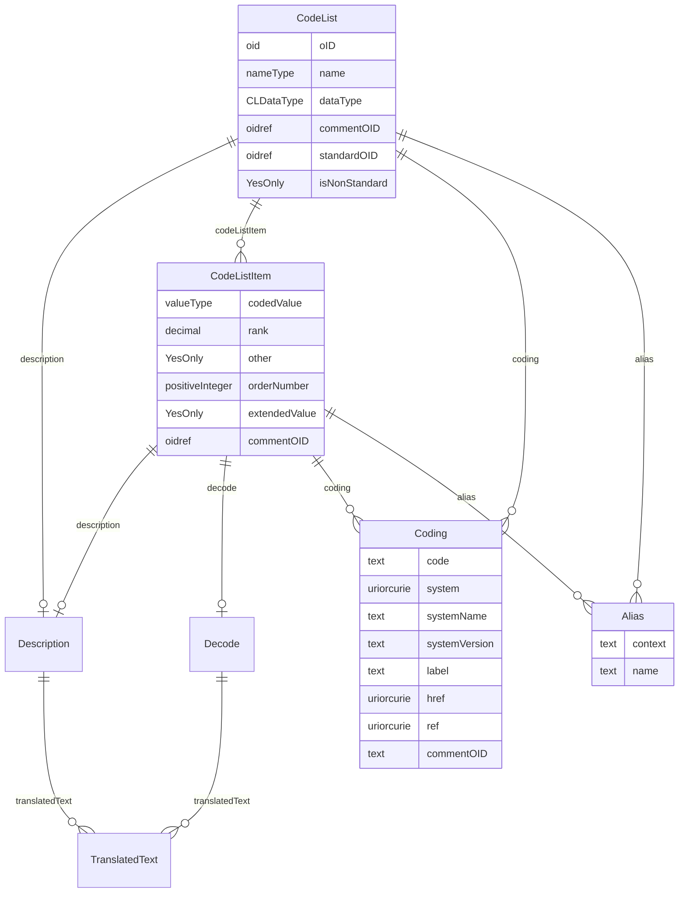

# Class: CodeList

_Defines a discrete set of permitted values for an item, or provides a reference to a codelist or dictionary maintained by an external organization via the Coding element, or a combination of both. Examples provided under Coding._


URI: [odm:CodeList](http://www.cdisc.org/ns/odm/v2.0/CodeList)





<!-- no inheritance hierarchy -->


## Slots

| Name | Cardinality* and Range | Description | Inheritance |
| ---  | --- | --- | --- |
| [oID](oID.md) | 1..1 <br/> [oid](oid.md) | Unique identifier for the Codelist element. | direct |
| [name](name.md) | 1..1 <br/> [nameType](nameType.md) | Human readable name for the Codelist. | direct |
| [dataType](dataType.md) | 1..1 <br/> [CLDataType](CLDataType.md) | Specifies the DataType for codes defined in this codelist. | direct |
| [commentOID](commentOID.md) | 0..1 <br/> [oidref](oidref.md) | Reference to a CommentDef Element. | direct |
| [standardOID](standardOID.md) | 0..1 <br/> [oidref](oidref.md) | Reference to a Standard element. | direct |
| [isNonStandard](isNonStandard.md) | 0..1 <br/> [YesOnly](YesOnly.md) | Used when the controlled terminology includes a set of EnumeratedItem or Code... | direct |
| [description](description.md) | 0..1 <br/> [Description](Description.md) | Description reference: A free-text description of the containing metadata com... | direct |
| [codeListItem](codeListItem.md) | 0..* <br/> [CodeListItem](CodeListItem.md) | CodeListItem reference: Defines an individual member value of a codelist. It ... | direct |
| [coding](coding.md) | 0..* <br/> [Coding](Coding.md) | Coding reference: Coding references a symbol from a defined code system. It u... | direct |
| [alias](alias.md) | 0..* <br/> [Alias](Alias.md) | Alias reference: An Alias provides an additional name for an element. The Con... | direct |

_* See [LinkML documentation](https://linkml.io/linkml/schemas/slots.html#slot-cardinality) for cardinality definitions._


## Usages

| used by | used in | type | used |
| ---  | --- | --- | --- |
| [MetaDataVersion](MetaDataVersion.md) | [codeList](codeList.md) | range | [CodeList](CodeList.md) |


## See Also

* [https://wiki.cdisc.org/display/PUB/CodeList](https://wiki.cdisc.org/display/PUB/CodeList)

## Identifier and Mapping Information


### Schema Source


* from schema: http://www.cdisc.org/ns/odm/v2.0


## Mappings

| Mapping Type | Mapped Value |
| ---  | ---  |
| self | odm:CodeList |
| native | odm:CodeList |


## LinkML Source

<!-- TODO: investigate https://stackoverflow.com/questions/37606292/how-to-create-tabbed-code-blocks-in-mkdocs-or-sphinx -->

### Direct

<details>
```yaml
name: CodeList
description: Defines a discrete set of permitted values for an item, or provides a
  reference to a codelist or dictionary maintained by an external organization via
  the Coding element, or a combination of both. Examples provided under Coding.
from_schema: http://www.cdisc.org/ns/odm/v2.0
see_also:
- https://wiki.cdisc.org/display/PUB/CodeList
rank: 1000
slots:
- oID
- name
- dataType
- commentOID
- standardOID
- isNonStandard
- description
- codeListItem
- coding
- alias
slot_usage:
  oID:
    name: oID
    description: Unique identifier for the Codelist element.
    comments:
    - Required
    domain_of:
    - Study
    - MetaDataVersion
    - Standard
    - ValueListDef
    - WhereClauseDef
    - StudyEventGroupDef
    - StudyEventDef
    - ItemGroupDef
    - ItemDef
    - CodeList
    - MethodDef
    - ConditionDef
    - CommentDef
    - StudyIndication
    - StudyIntervention
    - StudyObjective
    - StudyEndPoint
    - StudyTargetPopulation
    - StudyEstimand
    - Arm
    - Epoch
    - StudyParameter
    - StudyTiming
    - TransitionTimingConstraint
    - AbsoluteTimingConstraint
    - RelativeTimingConstraint
    - DurationTimingConstraint
    - WorkflowDef
    - Transition
    - Branching
    - Criterion
    - User
    - Organization
    - Location
    - SignatureDef
    - Query
    range: oid
    required: true
  name:
    name: name
    description: Human readable name for the Codelist.
    comments:
    - Required
    domain_of:
    - Alias
    - MetaDataVersion
    - Standard
    - StudyEventGroupDef
    - StudyEventDef
    - ItemGroupDef
    - Class
    - SubClass
    - SourceItem
    - Resource
    - ItemDef
    - CodeList
    - MethodDef
    - Parameter
    - ReturnValue
    - ConditionDef
    - StudyObjective
    - StudyEndPoint
    - StudyTargetPopulation
    - StudyEstimand
    - Arm
    - Epoch
    - StudyTiming
    - TransitionTimingConstraint
    - AbsoluteTimingConstraint
    - RelativeTimingConstraint
    - DurationTimingConstraint
    - WorkflowDef
    - Transition
    - Branching
    - Criterion
    - Organization
    - Location
    - Query
    range: nameType
    required: true
  dataType:
    name: dataType
    description: Specifies the DataType for codes defined in this codelist.
    comments:
    - Required
    domain_of:
    - ItemDef
    - CodeList
    - Parameter
    - ReturnValue
    range: CLDataType
    required: true
  commentOID:
    name: commentOID
    description: Reference to a CommentDef Element.
    comments:
    - Optional
    domain_of:
    - MetaDataVersion
    - Standard
    - WhereClauseDef
    - StudyEventGroupDef
    - StudyEventDef
    - ItemGroupDef
    - ItemDef
    - CodeList
    - CodeListItem
    - MethodDef
    - ConditionDef
    - Coding
    range: oidref
  standardOID:
    name: standardOID
    description: Reference to a Standard element.
    comments:
    - Optional
    domain_of:
    - ItemGroupDef
    - CodeList
    range: oidref
  isNonStandard:
    name: isNonStandard
    description: Used when the controlled terminology includes a set of EnumeratedItem
      or CodeListItem elements as defined by the sponsor.
    comments:
    - Conditional
    domain_of:
    - ItemGroupDef
    - ItemRef
    - CodeList
    range: YesOnly
  description:
    name: description
    domain_of:
    - Study
    - MetaDataVersion
    - ValueListDef
    - StudyEventGroupRef
    - StudyEventGroupDef
    - StudyEventDef
    - ItemGroupDef
    - Origin
    - ItemDef
    - CodeList
    - CodeListItem
    - MethodDef
    - ConditionDef
    - CommentDef
    - Protocol
    - StudyStructure
    - TrialPhase
    - StudyIndication
    - StudyIntervention
    - StudyObjective
    - StudyEndPoint
    - StudyTargetPopulation
    - StudyEstimand
    - IntercurrentEvent
    - SummaryMeasure
    - Arm
    - Epoch
    - TransitionTimingConstraint
    - AbsoluteTimingConstraint
    - RelativeTimingConstraint
    - DurationTimingConstraint
    - WorkflowDef
    - Criterion
    - Organization
    - Location
    - ODMFileMetadata
    range: Description
    maximum_cardinality: 1
  codeListItem:
    name: codeListItem
    multivalued: true
    domain_of:
    - CodeList
    range: CodeListItem
    inlined: true
    inlined_as_list: true
  coding:
    name: coding
    multivalued: true
    domain_of:
    - StudyEventGroupDef
    - StudyEventDef
    - ItemGroupDef
    - Origin
    - SourceItems
    - SourceItem
    - ItemDef
    - CodeList
    - CodeListItem
    - StudyIndication
    - StudyIntervention
    - StudyTargetPopulation
    - StudyParameter
    - ParameterValue
    - Criterion
    - Annotation
    range: Coding
    inlined: true
    inlined_as_list: true
  alias:
    name: alias
    multivalued: true
    domain_of:
    - StudyEventDef
    - ItemGroupDef
    - ItemDef
    - CodeList
    - CodeListItem
    - MethodDef
    - ConditionDef
    - Protocol
    range: Alias
    inlined: true
    inlined_as_list: true
class_uri: odm:CodeList

```
</details>

### Induced

<details>
```yaml
name: CodeList
description: Defines a discrete set of permitted values for an item, or provides a
  reference to a codelist or dictionary maintained by an external organization via
  the Coding element, or a combination of both. Examples provided under Coding.
from_schema: http://www.cdisc.org/ns/odm/v2.0
see_also:
- https://wiki.cdisc.org/display/PUB/CodeList
rank: 1000
slot_usage:
  oID:
    name: oID
    description: Unique identifier for the Codelist element.
    comments:
    - Required
    domain_of:
    - Study
    - MetaDataVersion
    - Standard
    - ValueListDef
    - WhereClauseDef
    - StudyEventGroupDef
    - StudyEventDef
    - ItemGroupDef
    - ItemDef
    - CodeList
    - MethodDef
    - ConditionDef
    - CommentDef
    - StudyIndication
    - StudyIntervention
    - StudyObjective
    - StudyEndPoint
    - StudyTargetPopulation
    - StudyEstimand
    - Arm
    - Epoch
    - StudyParameter
    - StudyTiming
    - TransitionTimingConstraint
    - AbsoluteTimingConstraint
    - RelativeTimingConstraint
    - DurationTimingConstraint
    - WorkflowDef
    - Transition
    - Branching
    - Criterion
    - User
    - Organization
    - Location
    - SignatureDef
    - Query
    range: oid
    required: true
  name:
    name: name
    description: Human readable name for the Codelist.
    comments:
    - Required
    domain_of:
    - Alias
    - MetaDataVersion
    - Standard
    - StudyEventGroupDef
    - StudyEventDef
    - ItemGroupDef
    - Class
    - SubClass
    - SourceItem
    - Resource
    - ItemDef
    - CodeList
    - MethodDef
    - Parameter
    - ReturnValue
    - ConditionDef
    - StudyObjective
    - StudyEndPoint
    - StudyTargetPopulation
    - StudyEstimand
    - Arm
    - Epoch
    - StudyTiming
    - TransitionTimingConstraint
    - AbsoluteTimingConstraint
    - RelativeTimingConstraint
    - DurationTimingConstraint
    - WorkflowDef
    - Transition
    - Branching
    - Criterion
    - Organization
    - Location
    - Query
    range: nameType
    required: true
  dataType:
    name: dataType
    description: Specifies the DataType for codes defined in this codelist.
    comments:
    - Required
    domain_of:
    - ItemDef
    - CodeList
    - Parameter
    - ReturnValue
    range: CLDataType
    required: true
  commentOID:
    name: commentOID
    description: Reference to a CommentDef Element.
    comments:
    - Optional
    domain_of:
    - MetaDataVersion
    - Standard
    - WhereClauseDef
    - StudyEventGroupDef
    - StudyEventDef
    - ItemGroupDef
    - ItemDef
    - CodeList
    - CodeListItem
    - MethodDef
    - ConditionDef
    - Coding
    range: oidref
  standardOID:
    name: standardOID
    description: Reference to a Standard element.
    comments:
    - Optional
    domain_of:
    - ItemGroupDef
    - CodeList
    range: oidref
  isNonStandard:
    name: isNonStandard
    description: Used when the controlled terminology includes a set of EnumeratedItem
      or CodeListItem elements as defined by the sponsor.
    comments:
    - Conditional
    domain_of:
    - ItemGroupDef
    - ItemRef
    - CodeList
    range: YesOnly
  description:
    name: description
    domain_of:
    - Study
    - MetaDataVersion
    - ValueListDef
    - StudyEventGroupRef
    - StudyEventGroupDef
    - StudyEventDef
    - ItemGroupDef
    - Origin
    - ItemDef
    - CodeList
    - CodeListItem
    - MethodDef
    - ConditionDef
    - CommentDef
    - Protocol
    - StudyStructure
    - TrialPhase
    - StudyIndication
    - StudyIntervention
    - StudyObjective
    - StudyEndPoint
    - StudyTargetPopulation
    - StudyEstimand
    - IntercurrentEvent
    - SummaryMeasure
    - Arm
    - Epoch
    - TransitionTimingConstraint
    - AbsoluteTimingConstraint
    - RelativeTimingConstraint
    - DurationTimingConstraint
    - WorkflowDef
    - Criterion
    - Organization
    - Location
    - ODMFileMetadata
    range: Description
    maximum_cardinality: 1
  codeListItem:
    name: codeListItem
    multivalued: true
    domain_of:
    - CodeList
    range: CodeListItem
    inlined: true
    inlined_as_list: true
  coding:
    name: coding
    multivalued: true
    domain_of:
    - StudyEventGroupDef
    - StudyEventDef
    - ItemGroupDef
    - Origin
    - SourceItems
    - SourceItem
    - ItemDef
    - CodeList
    - CodeListItem
    - StudyIndication
    - StudyIntervention
    - StudyTargetPopulation
    - StudyParameter
    - ParameterValue
    - Criterion
    - Annotation
    range: Coding
    inlined: true
    inlined_as_list: true
  alias:
    name: alias
    multivalued: true
    domain_of:
    - StudyEventDef
    - ItemGroupDef
    - ItemDef
    - CodeList
    - CodeListItem
    - MethodDef
    - ConditionDef
    - Protocol
    range: Alias
    inlined: true
    inlined_as_list: true
attributes:
  oID:
    name: oID
    description: Unique identifier for the Codelist element.
    comments:
    - Required
    from_schema: http://www.cdisc.org/ns/odm/v2.0
    rank: 1000
    identifier: true
    alias: oID
    owner: CodeList
    domain_of:
    - Study
    - MetaDataVersion
    - Standard
    - ValueListDef
    - WhereClauseDef
    - StudyEventGroupDef
    - StudyEventDef
    - ItemGroupDef
    - ItemDef
    - CodeList
    - MethodDef
    - ConditionDef
    - CommentDef
    - StudyIndication
    - StudyIntervention
    - StudyObjective
    - StudyEndPoint
    - StudyTargetPopulation
    - StudyEstimand
    - Arm
    - Epoch
    - StudyParameter
    - StudyTiming
    - TransitionTimingConstraint
    - AbsoluteTimingConstraint
    - RelativeTimingConstraint
    - DurationTimingConstraint
    - WorkflowDef
    - Transition
    - Branching
    - Criterion
    - User
    - Organization
    - Location
    - SignatureDef
    - Query
    range: oid
    required: true
  name:
    name: name
    description: Human readable name for the Codelist.
    comments:
    - Required
    from_schema: http://www.cdisc.org/ns/odm/v2.0
    rank: 1000
    alias: name
    owner: CodeList
    domain_of:
    - Alias
    - MetaDataVersion
    - Standard
    - StudyEventGroupDef
    - StudyEventDef
    - ItemGroupDef
    - Class
    - SubClass
    - SourceItem
    - Resource
    - ItemDef
    - CodeList
    - MethodDef
    - Parameter
    - ReturnValue
    - ConditionDef
    - StudyObjective
    - StudyEndPoint
    - StudyTargetPopulation
    - StudyEstimand
    - Arm
    - Epoch
    - StudyTiming
    - TransitionTimingConstraint
    - AbsoluteTimingConstraint
    - RelativeTimingConstraint
    - DurationTimingConstraint
    - WorkflowDef
    - Transition
    - Branching
    - Criterion
    - Organization
    - Location
    - Query
    range: nameType
    required: true
  dataType:
    name: dataType
    description: Specifies the DataType for codes defined in this codelist.
    comments:
    - Required
    from_schema: http://www.cdisc.org/ns/odm/v2.0
    rank: 1000
    alias: dataType
    owner: CodeList
    domain_of:
    - ItemDef
    - CodeList
    - Parameter
    - ReturnValue
    range: CLDataType
    required: true
  commentOID:
    name: commentOID
    description: Reference to a CommentDef Element.
    comments:
    - Optional
    from_schema: http://www.cdisc.org/ns/odm/v2.0
    rank: 1000
    alias: commentOID
    owner: CodeList
    domain_of:
    - MetaDataVersion
    - Standard
    - WhereClauseDef
    - StudyEventGroupDef
    - StudyEventDef
    - ItemGroupDef
    - ItemDef
    - CodeList
    - CodeListItem
    - MethodDef
    - ConditionDef
    - Coding
    range: oidref
  standardOID:
    name: standardOID
    description: Reference to a Standard element.
    comments:
    - Optional
    from_schema: http://www.cdisc.org/ns/odm/v2.0
    rank: 1000
    alias: standardOID
    owner: CodeList
    domain_of:
    - ItemGroupDef
    - CodeList
    range: oidref
  isNonStandard:
    name: isNonStandard
    description: Used when the controlled terminology includes a set of EnumeratedItem
      or CodeListItem elements as defined by the sponsor.
    comments:
    - Conditional
    from_schema: http://www.cdisc.org/ns/odm/v2.0
    rank: 1000
    alias: isNonStandard
    owner: CodeList
    domain_of:
    - ItemGroupDef
    - ItemRef
    - CodeList
    range: YesOnly
  description:
    name: description
    description: 'Description reference: A free-text description of the containing
      metadata component, unless restricted by Business Rules.'
    from_schema: http://www.cdisc.org/ns/odm/v2.0
    rank: 1000
    identifier: false
    alias: description
    owner: CodeList
    domain_of:
    - Study
    - MetaDataVersion
    - ValueListDef
    - StudyEventGroupRef
    - StudyEventGroupDef
    - StudyEventDef
    - ItemGroupDef
    - Origin
    - ItemDef
    - CodeList
    - CodeListItem
    - MethodDef
    - ConditionDef
    - CommentDef
    - Protocol
    - StudyStructure
    - TrialPhase
    - StudyIndication
    - StudyIntervention
    - StudyObjective
    - StudyEndPoint
    - StudyTargetPopulation
    - StudyEstimand
    - IntercurrentEvent
    - SummaryMeasure
    - Arm
    - Epoch
    - TransitionTimingConstraint
    - AbsoluteTimingConstraint
    - RelativeTimingConstraint
    - DurationTimingConstraint
    - WorkflowDef
    - Criterion
    - Organization
    - Location
    - ODMFileMetadata
    range: Description
    maximum_cardinality: 1
  codeListItem:
    name: codeListItem
    description: 'CodeListItem reference: Defines an individual member value of a
      codelist. It may include a display value in the child Decode element'
    from_schema: http://www.cdisc.org/ns/odm/v2.0
    rank: 1000
    multivalued: true
    identifier: false
    alias: codeListItem
    owner: CodeList
    domain_of:
    - CodeList
    range: CodeListItem
    inlined: true
    inlined_as_list: true
  coding:
    name: coding
    description: 'Coding reference: Coding references a symbol from a defined code
      system. It uses a code defined in a terminology system to associate semantics
      with a given term, codelist, variable, or group of variables. The presence of
      a Coding element associates a meaning to its parent element. Including multiple
      Coding elements for a given parent indicates synonymous meanings provided by
      different code systems or code system versions.'
    from_schema: http://www.cdisc.org/ns/odm/v2.0
    rank: 1000
    multivalued: true
    identifier: false
    alias: coding
    owner: CodeList
    domain_of:
    - StudyEventGroupDef
    - StudyEventDef
    - ItemGroupDef
    - Origin
    - SourceItems
    - SourceItem
    - ItemDef
    - CodeList
    - CodeListItem
    - StudyIndication
    - StudyIntervention
    - StudyTargetPopulation
    - StudyParameter
    - ParameterValue
    - Criterion
    - Annotation
    range: Coding
    inlined: true
    inlined_as_list: true
  alias:
    name: alias
    description: 'Alias reference: An Alias provides an additional name for an element.
      The Context attribute specifies the application domain in which this additional
      name is relevant.'
    from_schema: http://www.cdisc.org/ns/odm/v2.0
    rank: 1000
    multivalued: true
    identifier: false
    alias: alias
    owner: CodeList
    domain_of:
    - StudyEventDef
    - ItemGroupDef
    - ItemDef
    - CodeList
    - CodeListItem
    - MethodDef
    - ConditionDef
    - Protocol
    range: Alias
    inlined: true
    inlined_as_list: true
class_uri: odm:CodeList

```
</details>