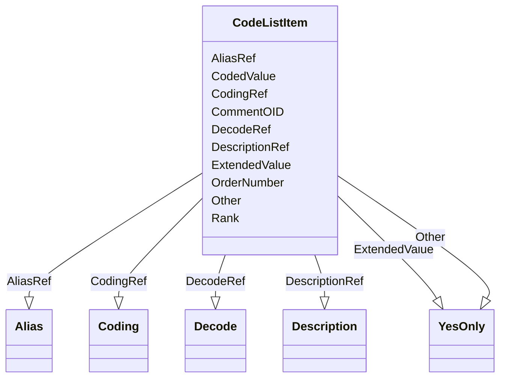

# Class: CodeListItem


URI: [odm:CodeListItem](http://www.cdisc.org/ns/odm/v2.0/CodeListItem)





<!-- no inheritance hierarchy -->


## Slots

| Name | Cardinality and Range | Description | Inheritance |
| ---  | --- | --- | --- |
| [CodedValue](CodedValue.md) | 1..1 <br/> [Value](Value.md) |  | direct |
| [Rank](Rank.md) | 0..1 <br/> [Decimal](Decimal.md) |  | direct |
| [Other](Other.md) | 0..1 <br/> [YesOnly](YesOnly.md) |  | direct |
| [OrderNumber](OrderNumber.md) | 0..1 <br/> [PositiveInteger](PositiveInteger.md) |  | direct |
| [ExtendedValue](ExtendedValue.md) | 0..1 <br/> [YesOnly](YesOnly.md) |  | direct |
| [CommentOID](CommentOID.md) | 0..1 <br/> [Oidref](Oidref.md) | The Comment identifier that this value refers to | direct |
| [DescriptionRef](DescriptionRef.md) | 0..1 <br/> [Description](Description.md) |  | direct |
| [DecodeRef](DecodeRef.md) | 0..1 <br/> [Decode](Decode.md) |  | direct |
| [CodingRef](CodingRef.md) | 0..* <br/> [Coding](Coding.md) |  | direct |
| [AliasRef](AliasRef.md) | 0..* <br/> [Alias](Alias.md) |  | direct |


## Usages

| used by | used in | type | used |
| ---  | --- | --- | --- |
| [CodeList](CodeList.md) | [CodeListItemRef](CodeListItemRef.md) | range | [CodeListItem](CodeListItem.md) |


## See Also

* [https://wiki.cdisc.org/display/ODM2/CodeListItem](https://wiki.cdisc.org/display/ODM2/CodeListItem)

## Identifier and Mapping Information


### Schema Source


* from schema: http://www.cdisc.org/ns/odm/v2.0


## Mappings

| Mapping Type | Mapped Value |
| ---  | ---  |
| self | odm:CodeListItem |
| native | odm:CodeListItem |


## LinkML Source

<!-- TODO: investigate https://stackoverflow.com/questions/37606292/how-to-create-tabbed-code-blocks-in-mkdocs-or-sphinx -->

### Direct

<details>
```yaml
name: CodeListItem
from_schema: http://www.cdisc.org/ns/odm/v2.0
see_also:
- https://wiki.cdisc.org/display/ODM2/CodeListItem
slots:
- CodedValue
- Rank
- Other
- OrderNumber
- ExtendedValue
- CommentOID
- DescriptionRef
- DecodeRef
- CodingRef
- AliasRef
slot_usage:
  CodedValue:
    name: CodedValue
    domain_of:
    - CodeListItem
    range: value
    required: true
  Rank:
    name: Rank
    domain_of:
    - CodeListItem
    range: decimal
  Other:
    name: Other
    domain_of:
    - ItemRef
    - CodeListItem
    range: YesOnly
  OrderNumber:
    name: OrderNumber
    domain_of:
    - StudyEventGroupRef
    - StudyEventRef
    - ItemGroupRef
    - ItemRef
    - CodeListItem
    - Parameter
    - ReturnValue
    - StudyEndPointRef
    range: positiveInteger
  ExtendedValue:
    name: ExtendedValue
    domain_of:
    - CodeListItem
    range: YesOnly
  CommentOID:
    name: CommentOID
    domain_of:
    - MetaDataVersion
    - Standard
    - WhereClauseDef
    - StudyEventGroupDef
    - StudyEventDef
    - ItemGroupDef
    - ItemDef
    - CodeList
    - CodeListItem
    - MethodDef
    - ConditionDef
    - Coding
    range: oidref
  DescriptionRef:
    name: DescriptionRef
    domain_of:
    - Study
    - MetaDataVersion
    - ValueListDef
    - StudyEventGroupRef
    - StudyEventGroupDef
    - StudyEventDef
    - ItemGroupDef
    - Origin
    - ItemDef
    - CodeList
    - CodeListItem
    - MethodDef
    - ConditionDef
    - CommentDef
    - Protocol
    - StudyStructure
    - TrialPhase
    - StudyIndication
    - StudyIntervention
    - StudyObjective
    - StudyEndPoint
    - StudyTargetPopulation
    - StudyEstimand
    - IntercurrentEvent
    - SummaryMeasure
    - Arm
    - Epoch
    - TransitionTimingConstraint
    - AbsoluteTimingConstraint
    - RelativeTimingConstraint
    - DurationTimingConstraint
    - WorkflowDef
    - Criterion
    - ExceptionEvent
    - Organization
    - Location
    - ODMFileMetadata
    range: Description
    maximum_cardinality: 1
  DecodeRef:
    name: DecodeRef
    domain_of:
    - CodeListItem
    range: Decode
    maximum_cardinality: 1
  CodingRef:
    name: CodingRef
    multivalued: true
    domain_of:
    - StudyEventGroupDef
    - StudyEventDef
    - ItemGroupDef
    - Origin
    - SourceItems
    - SourceItem
    - ItemDef
    - CodeList
    - CodeListItem
    - StudyIndication
    - StudyIntervention
    - StudyTargetPopulation
    - StudyParameter
    - ParameterValue
    - Criterion
    - Annotation
    range: Coding
    inlined: true
    inlined_as_list: true
  AliasRef:
    name: AliasRef
    multivalued: true
    domain_of:
    - StudyEventDef
    - ItemGroupDef
    - ItemDef
    - CodeList
    - CodeListItem
    - MethodDef
    - ConditionDef
    - Protocol
    range: Alias
    inlined: true
    inlined_as_list: true
class_uri: odm:CodeListItem

```
</details>

### Induced

<details>
```yaml
name: CodeListItem
from_schema: http://www.cdisc.org/ns/odm/v2.0
see_also:
- https://wiki.cdisc.org/display/ODM2/CodeListItem
slot_usage:
  CodedValue:
    name: CodedValue
    domain_of:
    - CodeListItem
    range: value
    required: true
  Rank:
    name: Rank
    domain_of:
    - CodeListItem
    range: decimal
  Other:
    name: Other
    domain_of:
    - ItemRef
    - CodeListItem
    range: YesOnly
  OrderNumber:
    name: OrderNumber
    domain_of:
    - StudyEventGroupRef
    - StudyEventRef
    - ItemGroupRef
    - ItemRef
    - CodeListItem
    - Parameter
    - ReturnValue
    - StudyEndPointRef
    range: positiveInteger
  ExtendedValue:
    name: ExtendedValue
    domain_of:
    - CodeListItem
    range: YesOnly
  CommentOID:
    name: CommentOID
    domain_of:
    - MetaDataVersion
    - Standard
    - WhereClauseDef
    - StudyEventGroupDef
    - StudyEventDef
    - ItemGroupDef
    - ItemDef
    - CodeList
    - CodeListItem
    - MethodDef
    - ConditionDef
    - Coding
    range: oidref
  DescriptionRef:
    name: DescriptionRef
    domain_of:
    - Study
    - MetaDataVersion
    - ValueListDef
    - StudyEventGroupRef
    - StudyEventGroupDef
    - StudyEventDef
    - ItemGroupDef
    - Origin
    - ItemDef
    - CodeList
    - CodeListItem
    - MethodDef
    - ConditionDef
    - CommentDef
    - Protocol
    - StudyStructure
    - TrialPhase
    - StudyIndication
    - StudyIntervention
    - StudyObjective
    - StudyEndPoint
    - StudyTargetPopulation
    - StudyEstimand
    - IntercurrentEvent
    - SummaryMeasure
    - Arm
    - Epoch
    - TransitionTimingConstraint
    - AbsoluteTimingConstraint
    - RelativeTimingConstraint
    - DurationTimingConstraint
    - WorkflowDef
    - Criterion
    - ExceptionEvent
    - Organization
    - Location
    - ODMFileMetadata
    range: Description
    maximum_cardinality: 1
  DecodeRef:
    name: DecodeRef
    domain_of:
    - CodeListItem
    range: Decode
    maximum_cardinality: 1
  CodingRef:
    name: CodingRef
    multivalued: true
    domain_of:
    - StudyEventGroupDef
    - StudyEventDef
    - ItemGroupDef
    - Origin
    - SourceItems
    - SourceItem
    - ItemDef
    - CodeList
    - CodeListItem
    - StudyIndication
    - StudyIntervention
    - StudyTargetPopulation
    - StudyParameter
    - ParameterValue
    - Criterion
    - Annotation
    range: Coding
    inlined: true
    inlined_as_list: true
  AliasRef:
    name: AliasRef
    multivalued: true
    domain_of:
    - StudyEventDef
    - ItemGroupDef
    - ItemDef
    - CodeList
    - CodeListItem
    - MethodDef
    - ConditionDef
    - Protocol
    range: Alias
    inlined: true
    inlined_as_list: true
attributes:
  CodedValue:
    name: CodedValue
    from_schema: http://www.cdisc.org/ns/odm/v2.0
    rank: 1000
    alias: CodedValue
    owner: CodeListItem
    domain_of:
    - CodeListItem
    range: value
    required: true
  Rank:
    name: Rank
    from_schema: http://www.cdisc.org/ns/odm/v2.0
    rank: 1000
    alias: Rank
    owner: CodeListItem
    domain_of:
    - CodeListItem
    range: decimal
  Other:
    name: Other
    from_schema: http://www.cdisc.org/ns/odm/v2.0
    rank: 1000
    alias: Other
    owner: CodeListItem
    domain_of:
    - ItemRef
    - CodeListItem
    range: YesOnly
  OrderNumber:
    name: OrderNumber
    from_schema: http://www.cdisc.org/ns/odm/v2.0
    rank: 1000
    alias: OrderNumber
    owner: CodeListItem
    domain_of:
    - StudyEventGroupRef
    - StudyEventRef
    - ItemGroupRef
    - ItemRef
    - CodeListItem
    - Parameter
    - ReturnValue
    - StudyEndPointRef
    range: positiveInteger
  ExtendedValue:
    name: ExtendedValue
    from_schema: http://www.cdisc.org/ns/odm/v2.0
    rank: 1000
    alias: ExtendedValue
    owner: CodeListItem
    domain_of:
    - CodeListItem
    range: YesOnly
  CommentOID:
    name: CommentOID
    description: "The Comment identifier that this value refers to. Needed when the\
      \ WhereClause references Items across different domains.\n                The\
      \ Comment would define any join assumptions."
    from_schema: http://www.cdisc.org/ns/odm/v2.0
    rank: 1000
    alias: CommentOID
    owner: CodeListItem
    domain_of:
    - MetaDataVersion
    - Standard
    - WhereClauseDef
    - StudyEventGroupDef
    - StudyEventDef
    - ItemGroupDef
    - ItemDef
    - CodeList
    - CodeListItem
    - MethodDef
    - ConditionDef
    - Coding
    range: oidref
  DescriptionRef:
    name: DescriptionRef
    from_schema: http://www.cdisc.org/ns/odm/v2.0
    rank: 1000
    alias: DescriptionRef
    owner: CodeListItem
    domain_of:
    - Study
    - MetaDataVersion
    - ValueListDef
    - StudyEventGroupRef
    - StudyEventGroupDef
    - StudyEventDef
    - ItemGroupDef
    - Origin
    - ItemDef
    - CodeList
    - CodeListItem
    - MethodDef
    - ConditionDef
    - CommentDef
    - Protocol
    - StudyStructure
    - TrialPhase
    - StudyIndication
    - StudyIntervention
    - StudyObjective
    - StudyEndPoint
    - StudyTargetPopulation
    - StudyEstimand
    - IntercurrentEvent
    - SummaryMeasure
    - Arm
    - Epoch
    - TransitionTimingConstraint
    - AbsoluteTimingConstraint
    - RelativeTimingConstraint
    - DurationTimingConstraint
    - WorkflowDef
    - Criterion
    - ExceptionEvent
    - Organization
    - Location
    - ODMFileMetadata
    range: Description
    maximum_cardinality: 1
  DecodeRef:
    name: DecodeRef
    from_schema: http://www.cdisc.org/ns/odm/v2.0
    rank: 1000
    alias: DecodeRef
    owner: CodeListItem
    domain_of:
    - CodeListItem
    range: Decode
    maximum_cardinality: 1
  CodingRef:
    name: CodingRef
    from_schema: http://www.cdisc.org/ns/odm/v2.0
    rank: 1000
    multivalued: true
    alias: CodingRef
    owner: CodeListItem
    domain_of:
    - StudyEventGroupDef
    - StudyEventDef
    - ItemGroupDef
    - Origin
    - SourceItems
    - SourceItem
    - ItemDef
    - CodeList
    - CodeListItem
    - StudyIndication
    - StudyIntervention
    - StudyTargetPopulation
    - StudyParameter
    - ParameterValue
    - Criterion
    - Annotation
    range: Coding
    inlined: true
    inlined_as_list: true
  AliasRef:
    name: AliasRef
    from_schema: http://www.cdisc.org/ns/odm/v2.0
    rank: 1000
    multivalued: true
    alias: AliasRef
    owner: CodeListItem
    domain_of:
    - StudyEventDef
    - ItemGroupDef
    - ItemDef
    - CodeList
    - CodeListItem
    - MethodDef
    - ConditionDef
    - Protocol
    range: Alias
    inlined: true
    inlined_as_list: true
class_uri: odm:CodeListItem

```
</details>