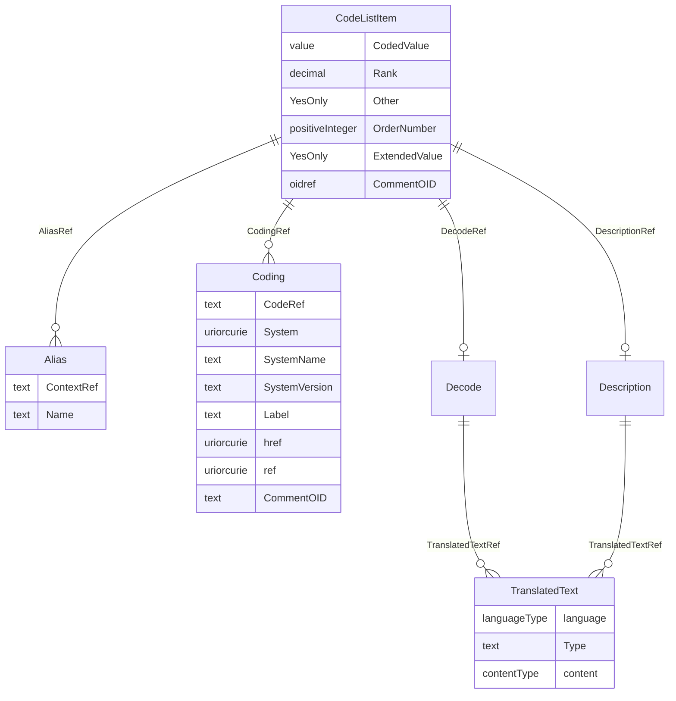

# Class: CodeListItem

_Defines an individual member value of a codelist. It may include a display value in the child Decode element_


URI: [odm:CodeListItem](http://www.cdisc.org/ns/odm/v2.0/CodeListItem)





<!-- no inheritance hierarchy -->


## Slots

| Name | Cardinality* and Range | Description | Inheritance |
| ---  | --- | --- | --- |
| [CodedValue](CodedValue.md) | 1..1 <br/> [value](value.md) | Value of the codelist item (as it would occur in clinical data). | direct |
| [Rank](Rank.md) | 0..1 <br/> [decimal](decimal.md) | Numeric significance of the CodeListItem relative to others in the CodeList. ... | direct |
| [Other](Other.md) | 0..1 <br/> [YesOnly](YesOnly.md) | Flag to indicate that the term represents "other" content. | direct |
| [OrderNumber](OrderNumber.md) | 0..1 <br/> [positiveInteger](positiveInteger.md) | Ordering on the CodeListItems (within a containing CodeListItem) for use when... | direct |
| [ExtendedValue](ExtendedValue.md) | 0..1 <br/> [YesOnly](YesOnly.md) |  | direct |
| [CommentOID](CommentOID.md) | 0..1 <br/> [oidref](oidref.md) | Reference to a CommentDef . | direct |
| [DescriptionRef](DescriptionRef.md) | 0..1 <br/> [Description](Description.md) | Description reference: A free-text description of the containing metadata com... | direct |
| [DecodeRef](DecodeRef.md) | 0..1 <br/> [Decode](Decode.md) | Decode reference: The displayed value relating to the CodeListItem/@CodedValu... | direct |
| [CodingRef](CodingRef.md) | 0..* <br/> [Coding](Coding.md) | Coding reference: Coding references a symbol from a defined code system. It u... | direct |
| [AliasRef](AliasRef.md) | 0..* <br/> [Alias](Alias.md) | Alias reference: An Alias provides an additional name for an element. The Con... | direct |

_* See [LinkML documentation](https://linkml.io/linkml/schemas/slots.html#slot-cardinality) for cardinality definitions._


## Usages

| used by | used in | type | used |
| ---  | --- | --- | --- |
| [CodeList](CodeList.md) | [CodeListItemRef](CodeListItemRef.md) | range | [CodeListItem](CodeListItem.md) |


## See Also

* [https://wiki.cdisc.org/display/ODM2/CodeListItem](https://wiki.cdisc.org/display/ODM2/CodeListItem)

## Identifier and Mapping Information


### Schema Source


* from schema: http://www.cdisc.org/ns/odm/v2.0


## Mappings

| Mapping Type | Mapped Value |
| ---  | ---  |
| self | odm:CodeListItem |
| native | odm:CodeListItem |


## LinkML Source

<!-- TODO: investigate https://stackoverflow.com/questions/37606292/how-to-create-tabbed-code-blocks-in-mkdocs-or-sphinx -->

### Direct

<details>
```yaml
name: CodeListItem
description: Defines an individual member value of a codelist. It may include a display
  value in the child Decode element
from_schema: http://www.cdisc.org/ns/odm/v2.0
see_also:
- https://wiki.cdisc.org/display/ODM2/CodeListItem
rank: 1000
slots:
- CodedValue
- Rank
- Other
- OrderNumber
- ExtendedValue
- CommentOID
- DescriptionRef
- DecodeRef
- CodingRef
- AliasRef
slot_usage:
  CodedValue:
    name: CodedValue
    description: Value of the codelist item (as it would occur in clinical data).
    comments:
    - 'Required

      range: text'
    domain_of:
    - CodeListItem
    range: value
    required: true
  Rank:
    name: Rank
    description: Numeric significance of the CodeListItem relative to others in the
      CodeList. The Rank attribute may be used where the relative value corresponding
      to an enumeration cannot or should not be determined by its lexical order. For
      example, if you have a list of enumerated text values including "Low", "Medium",
      and "High" and wish to assign these relative numeric values 1, 2, and 3 respectively,
      you should include a Rank attribute for each CodeListItem defined. Without the
      applied rank attribute, the normal lexical ordering would be "High", "Low",
      and "Medium".
    comments:
    - 'Optional

      range: float'
    domain_of:
    - CodeListItem
    range: decimal
  Other:
    name: Other
    description: Flag to indicate that the term represents "other" content.
    comments:
    - 'Optional

      range: (Yes)'
    domain_of:
    - ItemRef
    - CodeListItem
    range: YesOnly
  OrderNumber:
    name: OrderNumber
    description: Ordering on the CodeListItems (within a containing CodeListItem)
      for use whenever a list of Items is presented to a user. The ordering does not
      imply anything about event scheduling, time ordering, or data correctness.
    comments:
    - 'Optional

      range: integer'
    domain_of:
    - StudyEventGroupRef
    - StudyEventRef
    - ItemGroupRef
    - ItemRef
    - CodeListItem
    - Parameter
    - ReturnValue
    - StudyEndPointRef
    range: positiveInteger
  ExtendedValue:
    name: ExtendedValue
    domain_of:
    - CodeListItem
    range: YesOnly
  CommentOID:
    name: CommentOID
    description: Reference to a CommentDef .
    comments:
    - 'Optional

      range: oidref'
    domain_of:
    - MetaDataVersion
    - Standard
    - WhereClauseDef
    - StudyEventGroupDef
    - StudyEventDef
    - ItemGroupDef
    - ItemDef
    - CodeList
    - CodeListItem
    - MethodDef
    - ConditionDef
    - Coding
    range: oidref
  DescriptionRef:
    name: DescriptionRef
    domain_of:
    - Study
    - MetaDataVersion
    - ValueListDef
    - StudyEventGroupRef
    - StudyEventGroupDef
    - StudyEventDef
    - ItemGroupDef
    - Origin
    - ItemDef
    - CodeList
    - CodeListItem
    - MethodDef
    - ConditionDef
    - CommentDef
    - Protocol
    - StudyStructure
    - TrialPhase
    - StudyIndication
    - StudyIntervention
    - StudyObjective
    - StudyEndPoint
    - StudyTargetPopulation
    - StudyEstimand
    - IntercurrentEvent
    - SummaryMeasure
    - Arm
    - Epoch
    - TransitionTimingConstraint
    - AbsoluteTimingConstraint
    - RelativeTimingConstraint
    - DurationTimingConstraint
    - WorkflowDef
    - Criterion
    - Organization
    - Location
    - ODMFileMetadata
    range: Description
    maximum_cardinality: 1
  DecodeRef:
    name: DecodeRef
    domain_of:
    - CodeListItem
    range: Decode
    maximum_cardinality: 1
  CodingRef:
    name: CodingRef
    multivalued: true
    domain_of:
    - StudyEventGroupDef
    - StudyEventDef
    - ItemGroupDef
    - Origin
    - SourceItems
    - SourceItem
    - ItemDef
    - CodeList
    - CodeListItem
    - StudyIndication
    - StudyIntervention
    - StudyTargetPopulation
    - StudyParameter
    - ParameterValue
    - Criterion
    - Annotation
    range: Coding
    inlined: true
    inlined_as_list: true
  AliasRef:
    name: AliasRef
    multivalued: true
    domain_of:
    - StudyEventDef
    - ItemGroupDef
    - ItemDef
    - CodeList
    - CodeListItem
    - MethodDef
    - ConditionDef
    - Protocol
    range: Alias
    inlined: true
    inlined_as_list: true
class_uri: odm:CodeListItem

```
</details>

### Induced

<details>
```yaml
name: CodeListItem
description: Defines an individual member value of a codelist. It may include a display
  value in the child Decode element
from_schema: http://www.cdisc.org/ns/odm/v2.0
see_also:
- https://wiki.cdisc.org/display/ODM2/CodeListItem
rank: 1000
slot_usage:
  CodedValue:
    name: CodedValue
    description: Value of the codelist item (as it would occur in clinical data).
    comments:
    - 'Required

      range: text'
    domain_of:
    - CodeListItem
    range: value
    required: true
  Rank:
    name: Rank
    description: Numeric significance of the CodeListItem relative to others in the
      CodeList. The Rank attribute may be used where the relative value corresponding
      to an enumeration cannot or should not be determined by its lexical order. For
      example, if you have a list of enumerated text values including "Low", "Medium",
      and "High" and wish to assign these relative numeric values 1, 2, and 3 respectively,
      you should include a Rank attribute for each CodeListItem defined. Without the
      applied rank attribute, the normal lexical ordering would be "High", "Low",
      and "Medium".
    comments:
    - 'Optional

      range: float'
    domain_of:
    - CodeListItem
    range: decimal
  Other:
    name: Other
    description: Flag to indicate that the term represents "other" content.
    comments:
    - 'Optional

      range: (Yes)'
    domain_of:
    - ItemRef
    - CodeListItem
    range: YesOnly
  OrderNumber:
    name: OrderNumber
    description: Ordering on the CodeListItems (within a containing CodeListItem)
      for use whenever a list of Items is presented to a user. The ordering does not
      imply anything about event scheduling, time ordering, or data correctness.
    comments:
    - 'Optional

      range: integer'
    domain_of:
    - StudyEventGroupRef
    - StudyEventRef
    - ItemGroupRef
    - ItemRef
    - CodeListItem
    - Parameter
    - ReturnValue
    - StudyEndPointRef
    range: positiveInteger
  ExtendedValue:
    name: ExtendedValue
    domain_of:
    - CodeListItem
    range: YesOnly
  CommentOID:
    name: CommentOID
    description: Reference to a CommentDef .
    comments:
    - 'Optional

      range: oidref'
    domain_of:
    - MetaDataVersion
    - Standard
    - WhereClauseDef
    - StudyEventGroupDef
    - StudyEventDef
    - ItemGroupDef
    - ItemDef
    - CodeList
    - CodeListItem
    - MethodDef
    - ConditionDef
    - Coding
    range: oidref
  DescriptionRef:
    name: DescriptionRef
    domain_of:
    - Study
    - MetaDataVersion
    - ValueListDef
    - StudyEventGroupRef
    - StudyEventGroupDef
    - StudyEventDef
    - ItemGroupDef
    - Origin
    - ItemDef
    - CodeList
    - CodeListItem
    - MethodDef
    - ConditionDef
    - CommentDef
    - Protocol
    - StudyStructure
    - TrialPhase
    - StudyIndication
    - StudyIntervention
    - StudyObjective
    - StudyEndPoint
    - StudyTargetPopulation
    - StudyEstimand
    - IntercurrentEvent
    - SummaryMeasure
    - Arm
    - Epoch
    - TransitionTimingConstraint
    - AbsoluteTimingConstraint
    - RelativeTimingConstraint
    - DurationTimingConstraint
    - WorkflowDef
    - Criterion
    - Organization
    - Location
    - ODMFileMetadata
    range: Description
    maximum_cardinality: 1
  DecodeRef:
    name: DecodeRef
    domain_of:
    - CodeListItem
    range: Decode
    maximum_cardinality: 1
  CodingRef:
    name: CodingRef
    multivalued: true
    domain_of:
    - StudyEventGroupDef
    - StudyEventDef
    - ItemGroupDef
    - Origin
    - SourceItems
    - SourceItem
    - ItemDef
    - CodeList
    - CodeListItem
    - StudyIndication
    - StudyIntervention
    - StudyTargetPopulation
    - StudyParameter
    - ParameterValue
    - Criterion
    - Annotation
    range: Coding
    inlined: true
    inlined_as_list: true
  AliasRef:
    name: AliasRef
    multivalued: true
    domain_of:
    - StudyEventDef
    - ItemGroupDef
    - ItemDef
    - CodeList
    - CodeListItem
    - MethodDef
    - ConditionDef
    - Protocol
    range: Alias
    inlined: true
    inlined_as_list: true
attributes:
  CodedValue:
    name: CodedValue
    description: Value of the codelist item (as it would occur in clinical data).
    comments:
    - 'Required

      range: text'
    from_schema: http://www.cdisc.org/ns/odm/v2.0
    rank: 1000
    alias: CodedValue
    owner: CodeListItem
    domain_of:
    - CodeListItem
    range: value
    required: true
  Rank:
    name: Rank
    description: Numeric significance of the CodeListItem relative to others in the
      CodeList. The Rank attribute may be used where the relative value corresponding
      to an enumeration cannot or should not be determined by its lexical order. For
      example, if you have a list of enumerated text values including "Low", "Medium",
      and "High" and wish to assign these relative numeric values 1, 2, and 3 respectively,
      you should include a Rank attribute for each CodeListItem defined. Without the
      applied rank attribute, the normal lexical ordering would be "High", "Low",
      and "Medium".
    comments:
    - 'Optional

      range: float'
    from_schema: http://www.cdisc.org/ns/odm/v2.0
    rank: 1000
    alias: Rank
    owner: CodeListItem
    domain_of:
    - CodeListItem
    range: decimal
  Other:
    name: Other
    description: Flag to indicate that the term represents "other" content.
    comments:
    - 'Optional

      range: (Yes)'
    from_schema: http://www.cdisc.org/ns/odm/v2.0
    rank: 1000
    alias: Other
    owner: CodeListItem
    domain_of:
    - ItemRef
    - CodeListItem
    range: YesOnly
  OrderNumber:
    name: OrderNumber
    description: Ordering on the CodeListItems (within a containing CodeListItem)
      for use whenever a list of Items is presented to a user. The ordering does not
      imply anything about event scheduling, time ordering, or data correctness.
    comments:
    - 'Optional

      range: integer'
    from_schema: http://www.cdisc.org/ns/odm/v2.0
    rank: 1000
    alias: OrderNumber
    owner: CodeListItem
    domain_of:
    - StudyEventGroupRef
    - StudyEventRef
    - ItemGroupRef
    - ItemRef
    - CodeListItem
    - Parameter
    - ReturnValue
    - StudyEndPointRef
    range: positiveInteger
  ExtendedValue:
    name: ExtendedValue
    from_schema: http://www.cdisc.org/ns/odm/v2.0
    rank: 1000
    alias: ExtendedValue
    owner: CodeListItem
    domain_of:
    - CodeListItem
    range: YesOnly
  CommentOID:
    name: CommentOID
    description: Reference to a CommentDef .
    comments:
    - 'Optional

      range: oidref'
    from_schema: http://www.cdisc.org/ns/odm/v2.0
    rank: 1000
    alias: CommentOID
    owner: CodeListItem
    domain_of:
    - MetaDataVersion
    - Standard
    - WhereClauseDef
    - StudyEventGroupDef
    - StudyEventDef
    - ItemGroupDef
    - ItemDef
    - CodeList
    - CodeListItem
    - MethodDef
    - ConditionDef
    - Coding
    range: oidref
  DescriptionRef:
    name: DescriptionRef
    description: 'Description reference: A free-text description of the containing
      metadata component, unless restricted by Business Rules.'
    from_schema: http://www.cdisc.org/ns/odm/v2.0
    rank: 1000
    identifier: false
    alias: DescriptionRef
    owner: CodeListItem
    domain_of:
    - Study
    - MetaDataVersion
    - ValueListDef
    - StudyEventGroupRef
    - StudyEventGroupDef
    - StudyEventDef
    - ItemGroupDef
    - Origin
    - ItemDef
    - CodeList
    - CodeListItem
    - MethodDef
    - ConditionDef
    - CommentDef
    - Protocol
    - StudyStructure
    - TrialPhase
    - StudyIndication
    - StudyIntervention
    - StudyObjective
    - StudyEndPoint
    - StudyTargetPopulation
    - StudyEstimand
    - IntercurrentEvent
    - SummaryMeasure
    - Arm
    - Epoch
    - TransitionTimingConstraint
    - AbsoluteTimingConstraint
    - RelativeTimingConstraint
    - DurationTimingConstraint
    - WorkflowDef
    - Criterion
    - Organization
    - Location
    - ODMFileMetadata
    range: Description
    maximum_cardinality: 1
  DecodeRef:
    name: DecodeRef
    description: 'Decode reference: The displayed value relating to the CodeListItem/@CodedValue.
      This is often a label corresponding to a short name or alpha-numeric code. The
      actual Decode text is provided in a TranslatedText element so that it can be
      provided in different languages on a case report form or tabular data summary.'
    from_schema: http://www.cdisc.org/ns/odm/v2.0
    rank: 1000
    identifier: false
    alias: DecodeRef
    owner: CodeListItem
    domain_of:
    - CodeListItem
    range: Decode
    maximum_cardinality: 1
  CodingRef:
    name: CodingRef
    description: 'Coding reference: Coding references a symbol from a defined code
      system. It uses a code defined in a terminology system to associate semantics
      with a given term, codelist, variable, or group of variables. The presence of
      a Coding element associates a meaning to its parent element. Including multiple
      Coding elements for a given parent indicates synonymous meanings provided by
      different code systems or code system versions.'
    from_schema: http://www.cdisc.org/ns/odm/v2.0
    rank: 1000
    multivalued: true
    identifier: false
    alias: CodingRef
    owner: CodeListItem
    domain_of:
    - StudyEventGroupDef
    - StudyEventDef
    - ItemGroupDef
    - Origin
    - SourceItems
    - SourceItem
    - ItemDef
    - CodeList
    - CodeListItem
    - StudyIndication
    - StudyIntervention
    - StudyTargetPopulation
    - StudyParameter
    - ParameterValue
    - Criterion
    - Annotation
    range: Coding
    inlined: true
    inlined_as_list: true
  AliasRef:
    name: AliasRef
    description: 'Alias reference: An Alias provides an additional name for an element.
      The Context attribute specifies the application domain in which this additional
      name is relevant.'
    from_schema: http://www.cdisc.org/ns/odm/v2.0
    rank: 1000
    multivalued: true
    identifier: false
    alias: AliasRef
    owner: CodeListItem
    domain_of:
    - StudyEventDef
    - ItemGroupDef
    - ItemDef
    - CodeList
    - CodeListItem
    - MethodDef
    - ConditionDef
    - Protocol
    range: Alias
    inlined: true
    inlined_as_list: true
class_uri: odm:CodeListItem

```
</details>