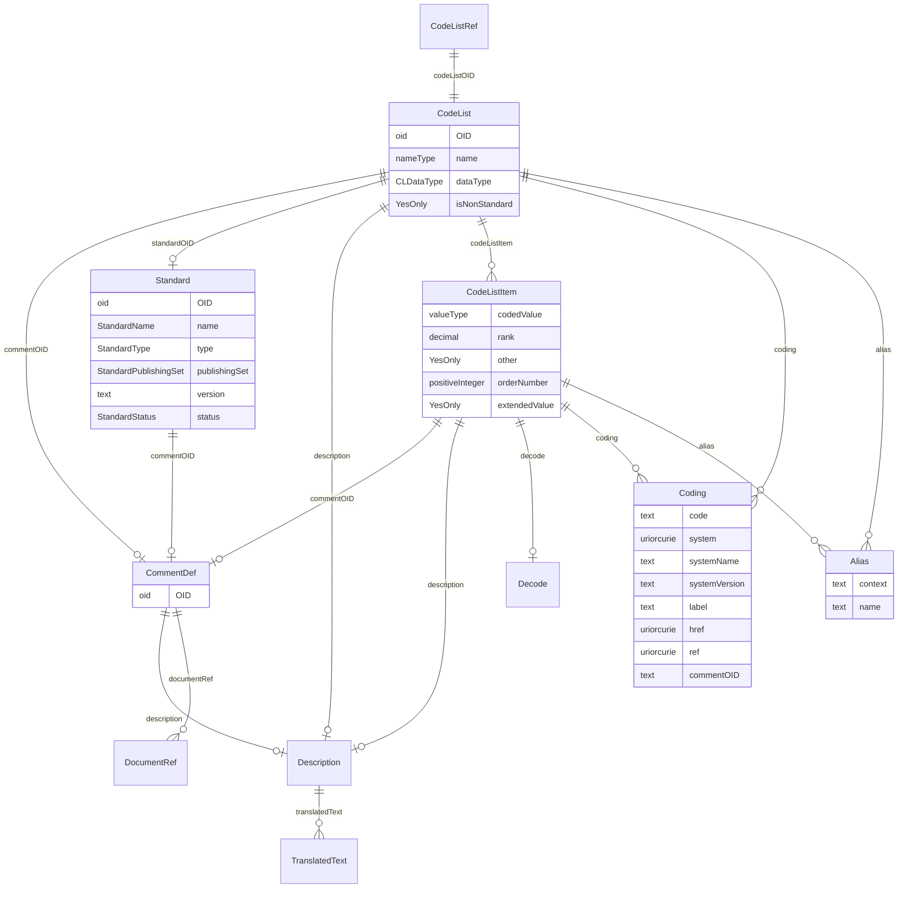

# Class: CodeListRef

_A reference to a CodeList definition._


URI: [odm:CodeListRef](http://www.cdisc.org/ns/odm/v2.0/CodeListRef)





<!-- no inheritance hierarchy -->


## Slots

| Name | Cardinality* and Range | Description | Inheritance |
| ---  | --- | --- | --- |
| [codeListOID](codeListOID.md) | 1..1 <br/> [CodeList](CodeList.md) | Reference to the CodeList definition that provides the allowable values for I... | direct |

_* See [LinkML documentation](https://linkml.io/linkml/schemas/slots.html#slot-cardinality) for cardinality definitions._


## Usages

| used by | used in | type | used |
| ---  | --- | --- | --- |
| [ItemDef](ItemDef.md) | [codeListRef](codeListRef.md) | range | [CodeListRef](CodeListRef.md) |


## See Also

* [https://wiki.cdisc.org/display/PUB/CodeListRef](https://wiki.cdisc.org/display/PUB/CodeListRef)

## Identifier and Mapping Information


### Schema Source


* from schema: http://www.cdisc.org/ns/odm/v2.0


## Mappings

| Mapping Type | Mapped Value |
| ---  | ---  |
| self | odm:CodeListRef |
| native | odm:CodeListRef |


## LinkML Source

<!-- TODO: investigate https://stackoverflow.com/questions/37606292/how-to-create-tabbed-code-blocks-in-mkdocs-or-sphinx -->

### Direct

<details>
```yaml
name: CodeListRef
description: A reference to a CodeList definition.
from_schema: http://www.cdisc.org/ns/odm/v2.0
see_also:
- https://wiki.cdisc.org/display/PUB/CodeListRef
rank: 1000
slots:
- codeListOID
slot_usage:
  codeListOID:
    name: codeListOID
    description: Reference to the CodeList definition that provides the allowable
      values for ItemData that references the ItemDef.
    comments:
    - 'Optional

      range: oidref'
    domain_of:
    - CodeListRef
    - FlagValue
    - FlagType
    range: CodeList
    required: true
class_uri: odm:CodeListRef

```
</details>

### Induced

<details>
```yaml
name: CodeListRef
description: A reference to a CodeList definition.
from_schema: http://www.cdisc.org/ns/odm/v2.0
see_also:
- https://wiki.cdisc.org/display/PUB/CodeListRef
rank: 1000
slot_usage:
  codeListOID:
    name: codeListOID
    description: Reference to the CodeList definition that provides the allowable
      values for ItemData that references the ItemDef.
    comments:
    - 'Optional

      range: oidref'
    domain_of:
    - CodeListRef
    - FlagValue
    - FlagType
    range: CodeList
    required: true
attributes:
  codeListOID:
    name: codeListOID
    description: Reference to the CodeList definition that provides the allowable
      values for ItemData that references the ItemDef.
    comments:
    - 'Optional

      range: oidref'
    from_schema: http://www.cdisc.org/ns/odm/v2.0
    rank: 1000
    alias: codeListOID
    owner: CodeListRef
    domain_of:
    - CodeListRef
    - FlagValue
    - FlagType
    range: CodeList
    required: true
class_uri: odm:CodeListRef

```
</details>