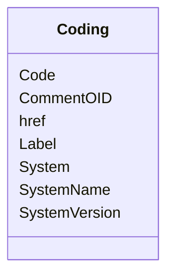

# Class: Coding


URI: [odm:Coding](http://www.cdisc.org/ns/odm/v2.0/Coding)





<!-- no inheritance hierarchy -->


## Slots

| Name | Cardinality and Range | Description | Inheritance |
| ---  | --- | --- | --- |
| [Code](Code.md) | 1..1 <br/> [Text](Text.md) |  | direct |
| [System](System.md) | 1..1 <br/> [Uriorcurie](Uriorcurie.md) |  | direct |
| [SystemName](SystemName.md) | 0..1 <br/> [Text](Text.md) |  | direct |
| [SystemVersion](SystemVersion.md) | 0..1 <br/> [Text](Text.md) |  | direct |
| [Label](Label.md) | 0..1 <br/> [Text](Text.md) |  | direct |
| [href](href.md) | 0..1 <br/> [Uriorcurie](Uriorcurie.md) | URL that can be used to identify the location of a document or dataset file r... | direct |
| [CommentOID](CommentOID.md) | 0..1 <br/> [Text](Text.md) | The Comment identifier that this value refers to | direct |


## Usages

| used by | used in | type | used |
| ---  | --- | --- | --- |
| [StudyEventGroupDef](StudyEventGroupDef.md) | [CodingRef](CodingRef.md) | range | [Coding](Coding.md) |
| [Origin](Origin.md) | [CodingRef](CodingRef.md) | range | [Coding](Coding.md) |
| [SourceItems](SourceItems.md) | [CodingRef](CodingRef.md) | range | [Coding](Coding.md) |
| [SourceItem](SourceItem.md) | [CodingRef](CodingRef.md) | range | [Coding](Coding.md) |
| [StudyIndication](StudyIndication.md) | [CodingRef](CodingRef.md) | range | [Coding](Coding.md) |
| [StudyIntervention](StudyIntervention.md) | [CodingRef](CodingRef.md) | range | [Coding](Coding.md) |
| [StudyTargetPopulation](StudyTargetPopulation.md) | [CodingRef](CodingRef.md) | range | [Coding](Coding.md) |
| [StudyParameter](StudyParameter.md) | [CodingRef](CodingRef.md) | range | [Coding](Coding.md) |
| [ParameterValue](ParameterValue.md) | [CodingRef](CodingRef.md) | range | [Coding](Coding.md) |
| [Annotation](Annotation.md) | [CodingRef](CodingRef.md) | range | [Coding](Coding.md) |
| [StudyEventDef](StudyEventDef.md) | [CodingRef](CodingRef.md) | range | [Coding](Coding.md) |
| [ItemGroupDef](ItemGroupDef.md) | [CodingRef](CodingRef.md) | range | [Coding](Coding.md) |
| [ItemDef](ItemDef.md) | [CodingRef](CodingRef.md) | range | [Coding](Coding.md) |
| [CodeList](CodeList.md) | [CodingRef](CodingRef.md) | range | [Coding](Coding.md) |
| [CodeListItem](CodeListItem.md) | [CodingRef](CodingRef.md) | range | [Coding](Coding.md) |
| [EnumeratedItem](EnumeratedItem.md) | [CodingRef](CodingRef.md) | range | [Coding](Coding.md) |


## Identifier and Mapping Information


### Schema Source


* from schema: http://www.cdisc.org/ns/odm/v2.0


## Mappings

| Mapping Type | Mapped Value |
| ---  | ---  |
| self | odm:Coding |
| native | odm:Coding |


## LinkML Source

<!-- TODO: investigate https://stackoverflow.com/questions/37606292/how-to-create-tabbed-code-blocks-in-mkdocs-or-sphinx -->

### Direct

<details>
```yaml
name: Coding
from_schema: http://www.cdisc.org/ns/odm/v2.0
slots:
- Code
- System
- SystemName
- SystemVersion
- Label
- href
- CommentOID
slot_usage:
  Code:
    name: Code
    domain_of:
    - Coding
    range: text
    required: true
  System:
    name: System
    domain_of:
    - Coding
    range: uriorcurie
    required: true
  SystemName:
    name: SystemName
    domain_of:
    - Coding
    range: text
    required: false
  SystemVersion:
    name: SystemVersion
    domain_of:
    - Coding
    range: text
    required: false
  Label:
    name: Label
    domain_of:
    - Resource
    - Coding
    range: text
    required: false
  href:
    name: href
    domain_of:
    - leaf
    - Include
    - ExternalCodeList
    - ExternalCodeLib
    - Image
    - Coding
    range: uriorcurie
    required: false
  CommentOID:
    name: CommentOID
    domain_of:
    - WhereClauseDef
    - StudyEventGroupDef
    - Coding
    - MetaDataVersion
    - StudyEventDef
    - ItemGroupDef
    - ItemDef
    - CodeList
    - ConditionDef
    - MethodDef
    - Standard
    - CodeListItem
    - EnumeratedItem
    range: text
    required: false
class_uri: odm:Coding

```
</details>

### Induced

<details>
```yaml
name: Coding
from_schema: http://www.cdisc.org/ns/odm/v2.0
slot_usage:
  Code:
    name: Code
    domain_of:
    - Coding
    range: text
    required: true
  System:
    name: System
    domain_of:
    - Coding
    range: uriorcurie
    required: true
  SystemName:
    name: SystemName
    domain_of:
    - Coding
    range: text
    required: false
  SystemVersion:
    name: SystemVersion
    domain_of:
    - Coding
    range: text
    required: false
  Label:
    name: Label
    domain_of:
    - Resource
    - Coding
    range: text
    required: false
  href:
    name: href
    domain_of:
    - leaf
    - Include
    - ExternalCodeList
    - ExternalCodeLib
    - Image
    - Coding
    range: uriorcurie
    required: false
  CommentOID:
    name: CommentOID
    domain_of:
    - WhereClauseDef
    - StudyEventGroupDef
    - Coding
    - MetaDataVersion
    - StudyEventDef
    - ItemGroupDef
    - ItemDef
    - CodeList
    - ConditionDef
    - MethodDef
    - Standard
    - CodeListItem
    - EnumeratedItem
    range: text
    required: false
attributes:
  Code:
    name: Code
    from_schema: http://www.cdisc.org/ns/odm/v2.0
    rank: 1000
    alias: Code
    owner: Coding
    domain_of:
    - Coding
    range: text
    required: true
  System:
    name: System
    from_schema: http://www.cdisc.org/ns/odm/v2.0
    rank: 1000
    alias: System
    owner: Coding
    domain_of:
    - Coding
    range: uriorcurie
    required: true
  SystemName:
    name: SystemName
    from_schema: http://www.cdisc.org/ns/odm/v2.0
    rank: 1000
    alias: SystemName
    owner: Coding
    domain_of:
    - Coding
    range: text
    required: false
  SystemVersion:
    name: SystemVersion
    from_schema: http://www.cdisc.org/ns/odm/v2.0
    rank: 1000
    alias: SystemVersion
    owner: Coding
    domain_of:
    - Coding
    range: text
    required: false
  Label:
    name: Label
    from_schema: http://www.cdisc.org/ns/odm/v2.0
    rank: 1000
    alias: Label
    owner: Coding
    domain_of:
    - Resource
    - Coding
    range: text
    required: false
  href:
    name: href
    description: URL that can be used to identify the location of a document or dataset
      file relative to the folder containing the ODM file.
    from_schema: http://www.cdisc.org/ns/odm/v2.0
    rank: 1000
    alias: href
    owner: Coding
    domain_of:
    - leaf
    - Include
    - ExternalCodeList
    - ExternalCodeLib
    - Image
    - Coding
    range: uriorcurie
    required: false
  CommentOID:
    name: CommentOID
    description: "The Comment identifier that this value refers to. Needed when the\
      \ WhereClause references Items across different domains.\n                The\
      \ Comment would define any join assumptions."
    from_schema: http://www.cdisc.org/ns/odm/v2.0
    rank: 1000
    alias: CommentOID
    owner: Coding
    domain_of:
    - WhereClauseDef
    - StudyEventGroupDef
    - Coding
    - MetaDataVersion
    - StudyEventDef
    - ItemGroupDef
    - ItemDef
    - CodeList
    - ConditionDef
    - MethodDef
    - Standard
    - CodeListItem
    - EnumeratedItem
    range: text
    required: false
class_uri: odm:Coding

```
</details>