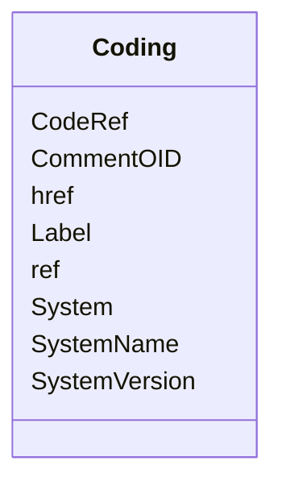

# Class: Coding


_Coding references a symbol from a defined code system. It uses a code defined in a terminology system to associate semantics with a given term, codelist, variable, or group of variables. The presence of a Coding element associates a meaning to its parent element. Including multiple Coding elements for a given parent indicates synonymous meanings provided by different code systems or code system versions._


URI: [odm:Coding](http://www.cdisc.org/ns/odm/v2.0/Coding)





<!-- no inheritance hierarchy -->


## Slots

| Name | Cardinality and Range | Description | Inheritance |
| ---  | --- | --- | --- |
| [CodeRef](CodeRef.md) | 0..1 <br/> [text](text.md) | A string pattern that identifies a concept as defined by the code system. | direct |
| [System](System.md) | 1..1 <br/> [uriorcurie](uriorcurie.md) | Identifies the code system that defines the code. If the code is taken from a... | direct |
| [SystemName](SystemName.md) | 0..1 <br/> [text](text.md) | Human readable name for the code system. | direct |
| [SystemVersion](SystemVersion.md) | 0..1 <br/> [text](text.md) | Identifies the version of the code system | direct |
| [Label](Label.md) | 0..1 <br/> [text](text.md) | Used to link the value to a named MethodDef parameter. | direct |
| [href](href.md) | 0..1 <br/> [uriorcurie](uriorcurie.md) | URI reference to the Code definition. | direct |
| [ref](ref.md) | 0..1 <br/> [uriorcurie](uriorcurie.md) | Reference to a local instance of the code system. | direct |
| [CommentOID](CommentOID.md) | 0..1 <br/> [text](text.md) | Reference to a CommentDef that provides the rationale for the use of the Conc... | direct |


## Usages

| used by | used in | type | used |
| ---  | --- | --- | --- |
| [StudyEventGroupDef](StudyEventGroupDef.md) | [CodingRef](CodingRef.md) | range | [Coding](Coding.md) |
| [StudyEventDef](StudyEventDef.md) | [CodingRef](CodingRef.md) | range | [Coding](Coding.md) |
| [ItemGroupDef](ItemGroupDef.md) | [CodingRef](CodingRef.md) | range | [Coding](Coding.md) |
| [Origin](Origin.md) | [CodingRef](CodingRef.md) | range | [Coding](Coding.md) |
| [SourceItems](SourceItems.md) | [CodingRef](CodingRef.md) | range | [Coding](Coding.md) |
| [SourceItem](SourceItem.md) | [CodingRef](CodingRef.md) | range | [Coding](Coding.md) |
| [ItemDef](ItemDef.md) | [CodingRef](CodingRef.md) | range | [Coding](Coding.md) |
| [CodeList](CodeList.md) | [CodingRef](CodingRef.md) | range | [Coding](Coding.md) |
| [CodeListItem](CodeListItem.md) | [CodingRef](CodingRef.md) | range | [Coding](Coding.md) |
| [StudyIndication](StudyIndication.md) | [CodingRef](CodingRef.md) | range | [Coding](Coding.md) |
| [StudyIntervention](StudyIntervention.md) | [CodingRef](CodingRef.md) | range | [Coding](Coding.md) |
| [StudyTargetPopulation](StudyTargetPopulation.md) | [CodingRef](CodingRef.md) | range | [Coding](Coding.md) |
| [StudyParameter](StudyParameter.md) | [CodingRef](CodingRef.md) | range | [Coding](Coding.md) |
| [ParameterValue](ParameterValue.md) | [CodingRef](CodingRef.md) | range | [Coding](Coding.md) |
| [Criterion](Criterion.md) | [CodingRef](CodingRef.md) | range | [Coding](Coding.md) |
| [Annotation](Annotation.md) | [CodingRef](CodingRef.md) | range | [Coding](Coding.md) |


## See Also

* [https://wiki.cdisc.org/display/ODM2/Coding](https://wiki.cdisc.org/display/ODM2/Coding)

## Identifier and Mapping Information


### Schema Source


* from schema: http://www.cdisc.org/ns/odm/v2.0


## Mappings

| Mapping Type | Mapped Value |
| ---  | ---  |
| self | odm:Coding |
| native | odm:Coding |


## LinkML Source

<!-- TODO: investigate https://stackoverflow.com/questions/37606292/how-to-create-tabbed-code-blocks-in-mkdocs-or-sphinx -->

### Direct

<details>
```yaml
name: Coding
description: Coding references a symbol from a defined code system. It uses a code
  defined in a terminology system to associate semantics with a given term, codelist,
  variable, or group of variables. The presence of a Coding element associates a meaning
  to its parent element. Including multiple Coding elements for a given parent indicates
  synonymous meanings provided by different code systems or code system versions.
from_schema: http://www.cdisc.org/ns/odm/v2.0
see_also:
- https://wiki.cdisc.org/display/ODM2/Coding
slots:
- CodeRef
- System
- SystemName
- SystemVersion
- Label
- href
- ref
- CommentOID
slot_usage:
  CodeRef:
    name: CodeRef
    description: A string pattern that identifies a concept as defined by the code
      system.
    comments:
    - 'Optional

      range: text

      When not provided, all codes in the code system are allowed. For example, when
      referencing the complete set of codes from the MedDRA code system.'
    domain_of:
    - FormalExpression
    - Coding
    range: text
  System:
    name: System
    description: Identifies the code system that defines the code. If the code is
      taken from a code system resource then the URL for the code system should be
      used.
    comments:
    - 'Required

      range: URI'
    domain_of:
    - Coding
    range: uriorcurie
    required: true
  SystemName:
    name: SystemName
    description: Human readable name for the code system.
    comments:
    - 'Optional

      range: text'
    domain_of:
    - Coding
    range: text
  SystemVersion:
    name: SystemVersion
    description: Identifies the version of the code system
    comments:
    - 'Optional

      range: text'
    domain_of:
    - Coding
    range: text
  Label:
    name: Label
    description: Used to link the value to a named MethodDef parameter.
    comments:
    - 'Optional

      range: text'
    domain_of:
    - Resource
    - Coding
    range: text
  href:
    name: href
    description: URI reference to the Code definition.
    comments:
    - 'Optional

      range: URI'
    domain_of:
    - Leaf
    - Include
    - ExternalCodeLib
    - Image
    - Coding
    range: uriorcurie
  ref:
    name: ref
    description: Reference to a local instance of the code system.
    comments:
    - 'Optional

      range: URI'
    domain_of:
    - ExternalCodeLib
    - Coding
    range: uriorcurie
  CommentOID:
    name: CommentOID
    description: Reference to a CommentDef that provides the rationale for the use
      of the Concept.
    comments:
    - 'Optional

      range: oidref

      Must match the OID attribute of a CommentDef element within in this Study/MetaDataVersion.'
    domain_of:
    - MetaDataVersion
    - Standard
    - WhereClauseDef
    - StudyEventGroupDef
    - StudyEventDef
    - ItemGroupDef
    - ItemDef
    - CodeList
    - CodeListItem
    - MethodDef
    - ConditionDef
    - Coding
    range: text
class_uri: odm:Coding

```
</details>

### Induced

<details>
```yaml
name: Coding
description: Coding references a symbol from a defined code system. It uses a code
  defined in a terminology system to associate semantics with a given term, codelist,
  variable, or group of variables. The presence of a Coding element associates a meaning
  to its parent element. Including multiple Coding elements for a given parent indicates
  synonymous meanings provided by different code systems or code system versions.
from_schema: http://www.cdisc.org/ns/odm/v2.0
see_also:
- https://wiki.cdisc.org/display/ODM2/Coding
slot_usage:
  CodeRef:
    name: CodeRef
    description: A string pattern that identifies a concept as defined by the code
      system.
    comments:
    - 'Optional

      range: text

      When not provided, all codes in the code system are allowed. For example, when
      referencing the complete set of codes from the MedDRA code system.'
    domain_of:
    - FormalExpression
    - Coding
    range: text
  System:
    name: System
    description: Identifies the code system that defines the code. If the code is
      taken from a code system resource then the URL for the code system should be
      used.
    comments:
    - 'Required

      range: URI'
    domain_of:
    - Coding
    range: uriorcurie
    required: true
  SystemName:
    name: SystemName
    description: Human readable name for the code system.
    comments:
    - 'Optional

      range: text'
    domain_of:
    - Coding
    range: text
  SystemVersion:
    name: SystemVersion
    description: Identifies the version of the code system
    comments:
    - 'Optional

      range: text'
    domain_of:
    - Coding
    range: text
  Label:
    name: Label
    description: Used to link the value to a named MethodDef parameter.
    comments:
    - 'Optional

      range: text'
    domain_of:
    - Resource
    - Coding
    range: text
  href:
    name: href
    description: URI reference to the Code definition.
    comments:
    - 'Optional

      range: URI'
    domain_of:
    - Leaf
    - Include
    - ExternalCodeLib
    - Image
    - Coding
    range: uriorcurie
  ref:
    name: ref
    description: Reference to a local instance of the code system.
    comments:
    - 'Optional

      range: URI'
    domain_of:
    - ExternalCodeLib
    - Coding
    range: uriorcurie
  CommentOID:
    name: CommentOID
    description: Reference to a CommentDef that provides the rationale for the use
      of the Concept.
    comments:
    - 'Optional

      range: oidref

      Must match the OID attribute of a CommentDef element within in this Study/MetaDataVersion.'
    domain_of:
    - MetaDataVersion
    - Standard
    - WhereClauseDef
    - StudyEventGroupDef
    - StudyEventDef
    - ItemGroupDef
    - ItemDef
    - CodeList
    - CodeListItem
    - MethodDef
    - ConditionDef
    - Coding
    range: text
attributes:
  CodeRef:
    name: CodeRef
    description: A string pattern that identifies a concept as defined by the code
      system.
    comments:
    - 'Optional

      range: text

      When not provided, all codes in the code system are allowed. For example, when
      referencing the complete set of codes from the MedDRA code system.'
    from_schema: http://www.cdisc.org/ns/odm/v2.0
    rank: 1000
    identifier: false
    alias: CodeRef
    owner: Coding
    domain_of:
    - FormalExpression
    - Coding
    range: text
  System:
    name: System
    description: Identifies the code system that defines the code. If the code is
      taken from a code system resource then the URL for the code system should be
      used.
    comments:
    - 'Required

      range: URI'
    from_schema: http://www.cdisc.org/ns/odm/v2.0
    rank: 1000
    alias: System
    owner: Coding
    domain_of:
    - Coding
    range: uriorcurie
    required: true
  SystemName:
    name: SystemName
    description: Human readable name for the code system.
    comments:
    - 'Optional

      range: text'
    from_schema: http://www.cdisc.org/ns/odm/v2.0
    rank: 1000
    alias: SystemName
    owner: Coding
    domain_of:
    - Coding
    range: text
  SystemVersion:
    name: SystemVersion
    description: Identifies the version of the code system
    comments:
    - 'Optional

      range: text'
    from_schema: http://www.cdisc.org/ns/odm/v2.0
    rank: 1000
    alias: SystemVersion
    owner: Coding
    domain_of:
    - Coding
    range: text
  Label:
    name: Label
    description: Used to link the value to a named MethodDef parameter.
    comments:
    - 'Optional

      range: text'
    from_schema: http://www.cdisc.org/ns/odm/v2.0
    rank: 1000
    alias: Label
    owner: Coding
    domain_of:
    - Resource
    - Coding
    range: text
  href:
    name: href
    description: URI reference to the Code definition.
    comments:
    - 'Optional

      range: URI'
    from_schema: http://www.cdisc.org/ns/odm/v2.0
    rank: 1000
    alias: href
    owner: Coding
    domain_of:
    - Leaf
    - Include
    - ExternalCodeLib
    - Image
    - Coding
    range: uriorcurie
  ref:
    name: ref
    description: Reference to a local instance of the code system.
    comments:
    - 'Optional

      range: URI'
    from_schema: http://www.cdisc.org/ns/odm/v2.0
    rank: 1000
    alias: ref
    owner: Coding
    domain_of:
    - ExternalCodeLib
    - Coding
    range: uriorcurie
  CommentOID:
    name: CommentOID
    description: Reference to a CommentDef that provides the rationale for the use
      of the Concept.
    comments:
    - 'Optional

      range: oidref

      Must match the OID attribute of a CommentDef element within in this Study/MetaDataVersion.'
    from_schema: http://www.cdisc.org/ns/odm/v2.0
    rank: 1000
    alias: CommentOID
    owner: Coding
    domain_of:
    - MetaDataVersion
    - Standard
    - WhereClauseDef
    - StudyEventGroupDef
    - StudyEventDef
    - ItemGroupDef
    - ItemDef
    - CodeList
    - CodeListItem
    - MethodDef
    - ConditionDef
    - Coding
    range: text
class_uri: odm:Coding

```
</details>