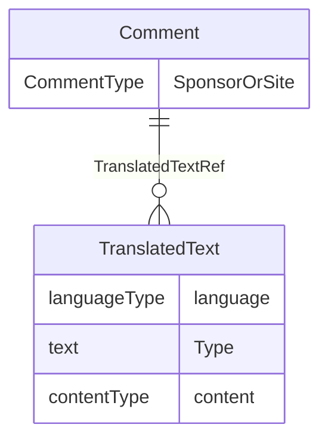

# Class: Comment

_A free-text (uninterpreted) comment about clinical data. The comment may have come from the sponsor or the clinical site._


URI: [odm:Comment](http://www.cdisc.org/ns/odm/v2.0/Comment)





<!-- no inheritance hierarchy -->


## Slots

| Name | Cardinality* and Range | Description | Inheritance |
| ---  | --- | --- | --- |
| [SponsorOrSite](SponsorOrSite.md) | 0..1 <br/> [CommentType](CommentType.md) | Source of the comment. | direct |
| [TranslatedTextRef](TranslatedTextRef.md) | 0..* <br/> [TranslatedText](TranslatedText.md) | TranslatedText reference: Human-readable text that is appropriate for a parti... | direct |

_* See [LinkML documentation](https://linkml.io/linkml/schemas/slots.html#slot-cardinality) for cardinality definitions._


## Usages

| used by | used in | type | used |
| ---  | --- | --- | --- |
| [Annotation](Annotation.md) | [CommentRef](CommentRef.md) | range | [Comment](Comment.md) |


## See Also

* [https://wiki.cdisc.org/display/ODM2/Comment](https://wiki.cdisc.org/display/ODM2/Comment)

## Identifier and Mapping Information


### Schema Source


* from schema: http://www.cdisc.org/ns/odm/v2.0


## Mappings

| Mapping Type | Mapped Value |
| ---  | ---  |
| self | odm:Comment |
| native | odm:Comment |


## LinkML Source

<!-- TODO: investigate https://stackoverflow.com/questions/37606292/how-to-create-tabbed-code-blocks-in-mkdocs-or-sphinx -->

### Direct

<details>
```yaml
name: Comment
description: A free-text (uninterpreted) comment about clinical data. The comment
  may have come from the sponsor or the clinical site.
from_schema: http://www.cdisc.org/ns/odm/v2.0
see_also:
- https://wiki.cdisc.org/display/ODM2/Comment
rank: 1000
slots:
- SponsorOrSite
- TranslatedTextRef
slot_usage:
  SponsorOrSite:
    name: SponsorOrSite
    description: Source of the comment.
    comments:
    - 'Optional

      enum values: (Sponsor | Site)'
    domain_of:
    - Comment
    range: CommentType
  TranslatedTextRef:
    name: TranslatedTextRef
    multivalued: true
    domain_of:
    - Description
    - Question
    - Definition
    - Prompt
    - CRFCompletionInstructions
    - ImplementationNotes
    - CDISCNotes
    - ErrorMessage
    - Decode
    - Comment
    range: TranslatedText
    inlined: true
    inlined_as_list: true
class_uri: odm:Comment

```
</details>

### Induced

<details>
```yaml
name: Comment
description: A free-text (uninterpreted) comment about clinical data. The comment
  may have come from the sponsor or the clinical site.
from_schema: http://www.cdisc.org/ns/odm/v2.0
see_also:
- https://wiki.cdisc.org/display/ODM2/Comment
rank: 1000
slot_usage:
  SponsorOrSite:
    name: SponsorOrSite
    description: Source of the comment.
    comments:
    - 'Optional

      enum values: (Sponsor | Site)'
    domain_of:
    - Comment
    range: CommentType
  TranslatedTextRef:
    name: TranslatedTextRef
    multivalued: true
    domain_of:
    - Description
    - Question
    - Definition
    - Prompt
    - CRFCompletionInstructions
    - ImplementationNotes
    - CDISCNotes
    - ErrorMessage
    - Decode
    - Comment
    range: TranslatedText
    inlined: true
    inlined_as_list: true
attributes:
  SponsorOrSite:
    name: SponsorOrSite
    description: Source of the comment.
    comments:
    - 'Optional

      enum values: (Sponsor | Site)'
    from_schema: http://www.cdisc.org/ns/odm/v2.0
    rank: 1000
    alias: SponsorOrSite
    owner: Comment
    domain_of:
    - Comment
    range: CommentType
  TranslatedTextRef:
    name: TranslatedTextRef
    description: 'TranslatedText reference: Human-readable text that is appropriate
      for a particular language. TranslatedText elements typically occur in a series,
      presenting a set of alternative textual renditions for different languages and
      types.'
    from_schema: http://www.cdisc.org/ns/odm/v2.0
    rank: 1000
    multivalued: true
    identifier: false
    alias: TranslatedTextRef
    owner: Comment
    domain_of:
    - Description
    - Question
    - Definition
    - Prompt
    - CRFCompletionInstructions
    - ImplementationNotes
    - CDISCNotes
    - ErrorMessage
    - Decode
    - Comment
    range: TranslatedText
    inlined: true
    inlined_as_list: true
class_uri: odm:Comment

```
</details>