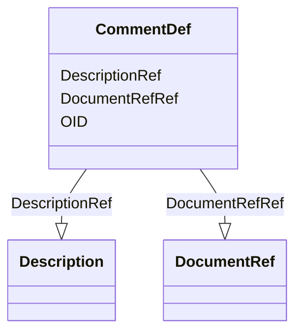

# Class: CommentDef


_The Comment element allows referencing short comments self-contained in the XML document or long comments normally included in external documents. For comments included in external documents, the reference could include specific pages of a document where the comments are included._


URI: [odm:CommentDef](http://www.cdisc.org/ns/odm/v2.0/CommentDef)





<!-- no inheritance hierarchy -->


## Slots

| Name | Cardinality and Range | Description | Inheritance |
| ---  | --- | --- | --- |
| [OID](OID.md) | 1..1 <br/> [Oid](Oid.md) | Unique identifier of the version within the XML document | direct |
| [DescriptionRef](DescriptionRef.md) | 1..1 <br/> [Description](Description.md) | Text of the comment | direct |
| [DocumentRefRef](DocumentRefRef.md) | 0..* <br/> [DocumentRef](DocumentRef.md) | The DocumentRef element is a container for page references in a PDF file | direct |


## Usages

| used by | used in | type | used |
| ---  | --- | --- | --- |
| [MetaDataVersion](MetaDataVersion.md) | [CommentDefRef](CommentDefRef.md) | range | [CommentDef](CommentDef.md) |


## See Also

* [https://wiki.cdisc.org/display/ODM2/CommentDef](https://wiki.cdisc.org/display/ODM2/CommentDef)

## Identifier and Mapping Information


### Schema Source


* from schema: http://www.cdisc.org/ns/odm/v2.0


## Mappings

| Mapping Type | Mapped Value |
| ---  | ---  |
| self | odm:CommentDef |
| native | odm:CommentDef |


## LinkML Source

<!-- TODO: investigate https://stackoverflow.com/questions/37606292/how-to-create-tabbed-code-blocks-in-mkdocs-or-sphinx -->

### Direct

<details>
```yaml
name: CommentDef
description: The Comment element allows referencing short comments self-contained
  in the XML document or long comments normally included in external documents. For
  comments included in external documents, the reference could include specific pages
  of a document where the comments are included.
from_schema: http://www.cdisc.org/ns/odm/v2.0
see_also:
- https://wiki.cdisc.org/display/ODM2/CommentDef
slots:
- OID
- DescriptionRef
- DocumentRefRef
slot_usage:
  OID:
    name: OID
    domain_of:
    - Study
    - MetaDataVersion
    - Standard
    - ValueListDef
    - WhereClauseDef
    - StudyEventGroupDef
    - StudyEventDef
    - ItemGroupDef
    - ItemDef
    - CodeList
    - MethodDef
    - ConditionDef
    - CommentDef
    - StudyIndication
    - StudyIntervention
    - StudyObjective
    - StudyEndPoint
    - StudyTargetPopulation
    - StudyEstimand
    - Arm
    - Epoch
    - StudyParameter
    - StudyTiming
    - TransitionTimingConstraint
    - AbsoluteTimingConstraint
    - RelativeTimingConstraint
    - DurationTimingConstraint
    - WorkflowDef
    - Transition
    - Branching
    - Criterion
    - ExceptionEvent
    - User
    - Organization
    - Location
    - SignatureDef
    - Query
    range: oid
    required: true
  DescriptionRef:
    name: DescriptionRef
    description: Text of the comment.
    domain_of:
    - Study
    - MetaDataVersion
    - ValueListDef
    - StudyEventGroupRef
    - StudyEventGroupDef
    - StudyEventDef
    - ItemGroupDef
    - Origin
    - ItemDef
    - CodeList
    - CodeListItem
    - MethodDef
    - ConditionDef
    - CommentDef
    - Protocol
    - StudyStructure
    - TrialPhase
    - StudyIndication
    - StudyIntervention
    - StudyObjective
    - StudyEndPoint
    - StudyTargetPopulation
    - StudyEstimand
    - IntercurrentEvent
    - SummaryMeasure
    - Arm
    - Epoch
    - TransitionTimingConstraint
    - AbsoluteTimingConstraint
    - RelativeTimingConstraint
    - DurationTimingConstraint
    - WorkflowDef
    - Criterion
    - ExceptionEvent
    - Organization
    - Location
    - ODMFileMetadata
    range: Description
    required: true
    minimum_cardinality: 1
    maximum_cardinality: 1
  DocumentRefRef:
    name: DocumentRefRef
    description: The DocumentRef element is a container for page references in a PDF
      file.
    multivalued: true
    domain_of:
    - AnnotatedCRF
    - SupplementalDoc
    - Origin
    - MethodDef
    - CommentDef
    range: DocumentRef
    inlined: true
    inlined_as_list: true
class_uri: odm:CommentDef

```
</details>

### Induced

<details>
```yaml
name: CommentDef
description: The Comment element allows referencing short comments self-contained
  in the XML document or long comments normally included in external documents. For
  comments included in external documents, the reference could include specific pages
  of a document where the comments are included.
from_schema: http://www.cdisc.org/ns/odm/v2.0
see_also:
- https://wiki.cdisc.org/display/ODM2/CommentDef
slot_usage:
  OID:
    name: OID
    domain_of:
    - Study
    - MetaDataVersion
    - Standard
    - ValueListDef
    - WhereClauseDef
    - StudyEventGroupDef
    - StudyEventDef
    - ItemGroupDef
    - ItemDef
    - CodeList
    - MethodDef
    - ConditionDef
    - CommentDef
    - StudyIndication
    - StudyIntervention
    - StudyObjective
    - StudyEndPoint
    - StudyTargetPopulation
    - StudyEstimand
    - Arm
    - Epoch
    - StudyParameter
    - StudyTiming
    - TransitionTimingConstraint
    - AbsoluteTimingConstraint
    - RelativeTimingConstraint
    - DurationTimingConstraint
    - WorkflowDef
    - Transition
    - Branching
    - Criterion
    - ExceptionEvent
    - User
    - Organization
    - Location
    - SignatureDef
    - Query
    range: oid
    required: true
  DescriptionRef:
    name: DescriptionRef
    description: Text of the comment.
    domain_of:
    - Study
    - MetaDataVersion
    - ValueListDef
    - StudyEventGroupRef
    - StudyEventGroupDef
    - StudyEventDef
    - ItemGroupDef
    - Origin
    - ItemDef
    - CodeList
    - CodeListItem
    - MethodDef
    - ConditionDef
    - CommentDef
    - Protocol
    - StudyStructure
    - TrialPhase
    - StudyIndication
    - StudyIntervention
    - StudyObjective
    - StudyEndPoint
    - StudyTargetPopulation
    - StudyEstimand
    - IntercurrentEvent
    - SummaryMeasure
    - Arm
    - Epoch
    - TransitionTimingConstraint
    - AbsoluteTimingConstraint
    - RelativeTimingConstraint
    - DurationTimingConstraint
    - WorkflowDef
    - Criterion
    - ExceptionEvent
    - Organization
    - Location
    - ODMFileMetadata
    range: Description
    required: true
    minimum_cardinality: 1
    maximum_cardinality: 1
  DocumentRefRef:
    name: DocumentRefRef
    description: The DocumentRef element is a container for page references in a PDF
      file.
    multivalued: true
    domain_of:
    - AnnotatedCRF
    - SupplementalDoc
    - Origin
    - MethodDef
    - CommentDef
    range: DocumentRef
    inlined: true
    inlined_as_list: true
attributes:
  OID:
    name: OID
    description: Unique identifier of the version within the XML document.
    from_schema: http://www.cdisc.org/ns/odm/v2.0
    rank: 1000
    identifier: true
    alias: OID
    owner: CommentDef
    domain_of:
    - Study
    - MetaDataVersion
    - Standard
    - ValueListDef
    - WhereClauseDef
    - StudyEventGroupDef
    - StudyEventDef
    - ItemGroupDef
    - ItemDef
    - CodeList
    - MethodDef
    - ConditionDef
    - CommentDef
    - StudyIndication
    - StudyIntervention
    - StudyObjective
    - StudyEndPoint
    - StudyTargetPopulation
    - StudyEstimand
    - Arm
    - Epoch
    - StudyParameter
    - StudyTiming
    - TransitionTimingConstraint
    - AbsoluteTimingConstraint
    - RelativeTimingConstraint
    - DurationTimingConstraint
    - WorkflowDef
    - Transition
    - Branching
    - Criterion
    - ExceptionEvent
    - User
    - Organization
    - Location
    - SignatureDef
    - Query
    range: oid
    required: true
  DescriptionRef:
    name: DescriptionRef
    description: Text of the comment.
    from_schema: http://www.cdisc.org/ns/odm/v2.0
    rank: 1000
    alias: DescriptionRef
    owner: CommentDef
    domain_of:
    - Study
    - MetaDataVersion
    - ValueListDef
    - StudyEventGroupRef
    - StudyEventGroupDef
    - StudyEventDef
    - ItemGroupDef
    - Origin
    - ItemDef
    - CodeList
    - CodeListItem
    - MethodDef
    - ConditionDef
    - CommentDef
    - Protocol
    - StudyStructure
    - TrialPhase
    - StudyIndication
    - StudyIntervention
    - StudyObjective
    - StudyEndPoint
    - StudyTargetPopulation
    - StudyEstimand
    - IntercurrentEvent
    - SummaryMeasure
    - Arm
    - Epoch
    - TransitionTimingConstraint
    - AbsoluteTimingConstraint
    - RelativeTimingConstraint
    - DurationTimingConstraint
    - WorkflowDef
    - Criterion
    - ExceptionEvent
    - Organization
    - Location
    - ODMFileMetadata
    range: Description
    required: true
    minimum_cardinality: 1
    maximum_cardinality: 1
  DocumentRefRef:
    name: DocumentRefRef
    description: The DocumentRef element is a container for page references in a PDF
      file.
    from_schema: http://www.cdisc.org/ns/odm/v2.0
    rank: 1000
    multivalued: true
    alias: DocumentRefRef
    owner: CommentDef
    domain_of:
    - AnnotatedCRF
    - SupplementalDoc
    - Origin
    - MethodDef
    - CommentDef
    range: DocumentRef
    inlined: true
    inlined_as_list: true
class_uri: odm:CommentDef

```
</details>