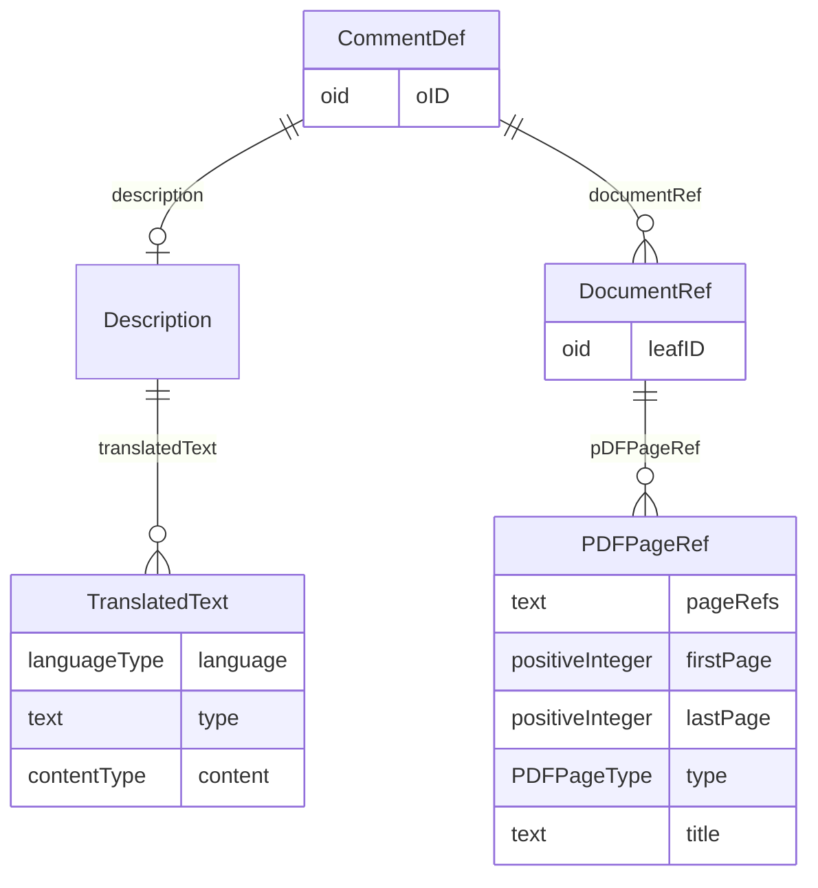

# Class: CommentDef

_The Comment element allows referencing short comments self-contained in the XML document or long comments normally included in external documents. For comments included in external documents, the reference could include specific pages of a document where the comments are included._


URI: [odm:CommentDef](http://www.cdisc.org/ns/odm/v2.0/CommentDef)





<!-- no inheritance hierarchy -->


## Slots

| Name | Cardinality* and Range | Description | Inheritance |
| ---  | --- | --- | --- |
| [oID](oID.md) | 1..1 <br/> [oid](oid.md) | Unique identifier. | direct |
| [description](description.md) | 0..1 <br/> [Description](Description.md) | Text of the comment. | direct |
| [documentRef](documentRef.md) | 0..* <br/> [DocumentRef](DocumentRef.md) | The DocumentRef element is a container for page references in a PDF file. | direct |

_* See [LinkML documentation](https://linkml.io/linkml/schemas/slots.html#slot-cardinality) for cardinality definitions._


## Usages

| used by | used in | type | used |
| ---  | --- | --- | --- |
| [MetaDataVersion](MetaDataVersion.md) | [commentDef](commentDef.md) | range | [CommentDef](CommentDef.md) |


## See Also

* [https://wiki.cdisc.org/display/PUB/CommentDef](https://wiki.cdisc.org/display/PUB/CommentDef)

## Identifier and Mapping Information


### Schema Source


* from schema: http://www.cdisc.org/ns/odm/v2.0


## Mappings

| Mapping Type | Mapped Value |
| ---  | ---  |
| self | odm:CommentDef |
| native | odm:CommentDef |


## LinkML Source

<!-- TODO: investigate https://stackoverflow.com/questions/37606292/how-to-create-tabbed-code-blocks-in-mkdocs-or-sphinx -->

### Direct

<details>
```yaml
name: CommentDef
description: The Comment element allows referencing short comments self-contained
  in the XML document or long comments normally included in external documents. For
  comments included in external documents, the reference could include specific pages
  of a document where the comments are included.
from_schema: http://www.cdisc.org/ns/odm/v2.0
see_also:
- https://wiki.cdisc.org/display/PUB/CommentDef
rank: 1000
slots:
- oID
- description
- documentRef
slot_usage:
  oID:
    name: oID
    description: Unique identifier.
    comments:
    - 'Required

      range: oid'
    domain_of:
    - Study
    - MetaDataVersion
    - Standard
    - ValueListDef
    - WhereClauseDef
    - StudyEventGroupDef
    - StudyEventDef
    - ItemGroupDef
    - ItemDef
    - CodeList
    - MethodDef
    - ConditionDef
    - CommentDef
    - StudyIndication
    - StudyIntervention
    - StudyObjective
    - StudyEndPoint
    - StudyTargetPopulation
    - StudyEstimand
    - Arm
    - Epoch
    - StudyParameter
    - StudyTiming
    - TransitionTimingConstraint
    - AbsoluteTimingConstraint
    - RelativeTimingConstraint
    - DurationTimingConstraint
    - WorkflowDef
    - Transition
    - Branching
    - Criterion
    - User
    - Organization
    - Location
    - SignatureDef
    - Query
    range: oid
    required: true
  description:
    name: description
    description: Text of the comment.
    domain_of:
    - Study
    - MetaDataVersion
    - ValueListDef
    - StudyEventGroupRef
    - StudyEventGroupDef
    - StudyEventDef
    - ItemGroupDef
    - Origin
    - ItemDef
    - CodeList
    - CodeListItem
    - MethodDef
    - ConditionDef
    - CommentDef
    - Protocol
    - StudyStructure
    - TrialPhase
    - StudyIndication
    - StudyIntervention
    - StudyObjective
    - StudyEndPoint
    - StudyTargetPopulation
    - StudyEstimand
    - IntercurrentEvent
    - SummaryMeasure
    - Arm
    - Epoch
    - TransitionTimingConstraint
    - AbsoluteTimingConstraint
    - RelativeTimingConstraint
    - DurationTimingConstraint
    - WorkflowDef
    - Criterion
    - Organization
    - Location
    - ODMFileMetadata
    range: Description
    maximum_cardinality: 1
  documentRef:
    name: documentRef
    description: The DocumentRef element is a container for page references in a PDF
      file.
    multivalued: true
    domain_of:
    - AnnotatedCRF
    - SupplementalDoc
    - Origin
    - MethodDef
    - CommentDef
    range: DocumentRef
    inlined: true
    inlined_as_list: true
class_uri: odm:CommentDef

```
</details>

### Induced

<details>
```yaml
name: CommentDef
description: The Comment element allows referencing short comments self-contained
  in the XML document or long comments normally included in external documents. For
  comments included in external documents, the reference could include specific pages
  of a document where the comments are included.
from_schema: http://www.cdisc.org/ns/odm/v2.0
see_also:
- https://wiki.cdisc.org/display/PUB/CommentDef
rank: 1000
slot_usage:
  oID:
    name: oID
    description: Unique identifier.
    comments:
    - 'Required

      range: oid'
    domain_of:
    - Study
    - MetaDataVersion
    - Standard
    - ValueListDef
    - WhereClauseDef
    - StudyEventGroupDef
    - StudyEventDef
    - ItemGroupDef
    - ItemDef
    - CodeList
    - MethodDef
    - ConditionDef
    - CommentDef
    - StudyIndication
    - StudyIntervention
    - StudyObjective
    - StudyEndPoint
    - StudyTargetPopulation
    - StudyEstimand
    - Arm
    - Epoch
    - StudyParameter
    - StudyTiming
    - TransitionTimingConstraint
    - AbsoluteTimingConstraint
    - RelativeTimingConstraint
    - DurationTimingConstraint
    - WorkflowDef
    - Transition
    - Branching
    - Criterion
    - User
    - Organization
    - Location
    - SignatureDef
    - Query
    range: oid
    required: true
  description:
    name: description
    description: Text of the comment.
    domain_of:
    - Study
    - MetaDataVersion
    - ValueListDef
    - StudyEventGroupRef
    - StudyEventGroupDef
    - StudyEventDef
    - ItemGroupDef
    - Origin
    - ItemDef
    - CodeList
    - CodeListItem
    - MethodDef
    - ConditionDef
    - CommentDef
    - Protocol
    - StudyStructure
    - TrialPhase
    - StudyIndication
    - StudyIntervention
    - StudyObjective
    - StudyEndPoint
    - StudyTargetPopulation
    - StudyEstimand
    - IntercurrentEvent
    - SummaryMeasure
    - Arm
    - Epoch
    - TransitionTimingConstraint
    - AbsoluteTimingConstraint
    - RelativeTimingConstraint
    - DurationTimingConstraint
    - WorkflowDef
    - Criterion
    - Organization
    - Location
    - ODMFileMetadata
    range: Description
    maximum_cardinality: 1
  documentRef:
    name: documentRef
    description: The DocumentRef element is a container for page references in a PDF
      file.
    multivalued: true
    domain_of:
    - AnnotatedCRF
    - SupplementalDoc
    - Origin
    - MethodDef
    - CommentDef
    range: DocumentRef
    inlined: true
    inlined_as_list: true
attributes:
  oID:
    name: oID
    description: Unique identifier.
    comments:
    - 'Required

      range: oid'
    from_schema: http://www.cdisc.org/ns/odm/v2.0
    rank: 1000
    identifier: true
    alias: oID
    owner: CommentDef
    domain_of:
    - Study
    - MetaDataVersion
    - Standard
    - ValueListDef
    - WhereClauseDef
    - StudyEventGroupDef
    - StudyEventDef
    - ItemGroupDef
    - ItemDef
    - CodeList
    - MethodDef
    - ConditionDef
    - CommentDef
    - StudyIndication
    - StudyIntervention
    - StudyObjective
    - StudyEndPoint
    - StudyTargetPopulation
    - StudyEstimand
    - Arm
    - Epoch
    - StudyParameter
    - StudyTiming
    - TransitionTimingConstraint
    - AbsoluteTimingConstraint
    - RelativeTimingConstraint
    - DurationTimingConstraint
    - WorkflowDef
    - Transition
    - Branching
    - Criterion
    - User
    - Organization
    - Location
    - SignatureDef
    - Query
    range: oid
    required: true
  description:
    name: description
    description: Text of the comment.
    from_schema: http://www.cdisc.org/ns/odm/v2.0
    rank: 1000
    identifier: false
    alias: description
    owner: CommentDef
    domain_of:
    - Study
    - MetaDataVersion
    - ValueListDef
    - StudyEventGroupRef
    - StudyEventGroupDef
    - StudyEventDef
    - ItemGroupDef
    - Origin
    - ItemDef
    - CodeList
    - CodeListItem
    - MethodDef
    - ConditionDef
    - CommentDef
    - Protocol
    - StudyStructure
    - TrialPhase
    - StudyIndication
    - StudyIntervention
    - StudyObjective
    - StudyEndPoint
    - StudyTargetPopulation
    - StudyEstimand
    - IntercurrentEvent
    - SummaryMeasure
    - Arm
    - Epoch
    - TransitionTimingConstraint
    - AbsoluteTimingConstraint
    - RelativeTimingConstraint
    - DurationTimingConstraint
    - WorkflowDef
    - Criterion
    - Organization
    - Location
    - ODMFileMetadata
    range: Description
    maximum_cardinality: 1
  documentRef:
    name: documentRef
    description: The DocumentRef element is a container for page references in a PDF
      file.
    from_schema: http://www.cdisc.org/ns/odm/v2.0
    rank: 1000
    multivalued: true
    identifier: false
    alias: documentRef
    owner: CommentDef
    domain_of:
    - AnnotatedCRF
    - SupplementalDoc
    - Origin
    - MethodDef
    - CommentDef
    range: DocumentRef
    inlined: true
    inlined_as_list: true
class_uri: odm:CommentDef

```
</details>