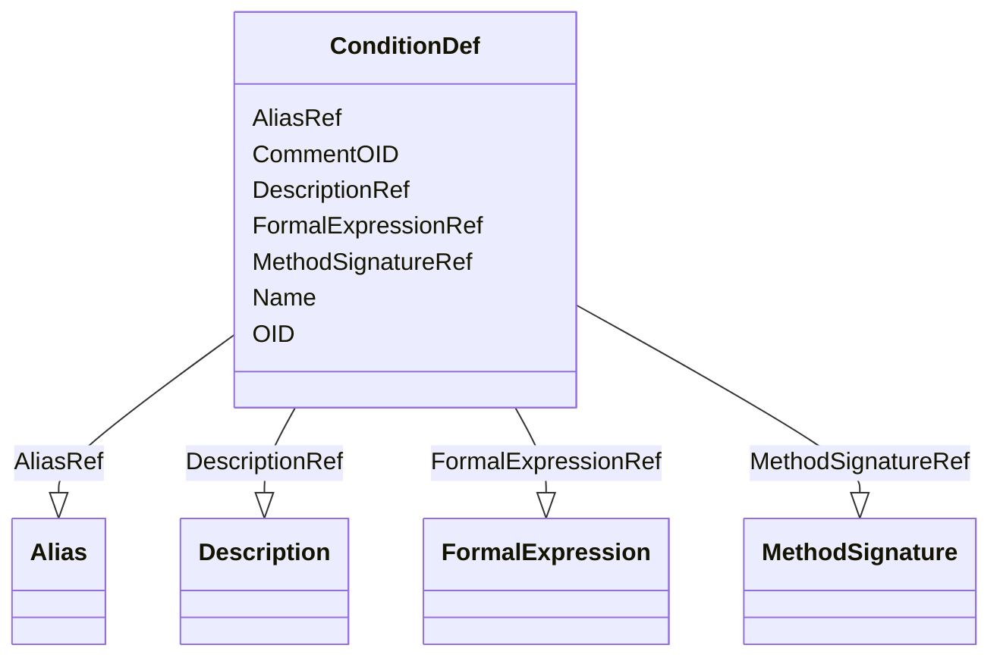

# Class: ConditionDef


_A ConditionDef defines a boolean condition.Element NameConditionDefParent ElementsMetaDataVersionElement XPath(s)/ODM/Study/MetaDataVersion/ConditionDefElement Textual ValueNoneAttributesOID, Name, CommentOIDChild Elements(Description, MethodSignature, FormalExpression*, Alias*)The Description element must be provided and should include a prose description. The MethodSignature element must also be provided and identifies the input parameter and return values for the ConditionDef.Usage/Business RulesBusiness Rule(s):The MethodSignature ReturnValue for ConditionDef must always equal boolean.If a FormalExpression is provided, it must contain a machine-readable expression that will evaluate to True or False.Other Information:The Description and MethodSignature are the normative content of the ConditionDef. The ConditionDef is referenced by the CollectionExceptionConditionOID attribute within a study metadata component which may be omitted under circumstances defined by the condition (i.e., when the FormalExpression evaluates to True).Multiple FormalExpressions can be provided if each has a different Context attribute, allowing the same expression to be represented in forms appropriate to multiple systems.If an application cannot interpret any of the FormalExpressions or does not normally support conditional data collection, data for the referencing study metadata component should be collected as though no Condition is specified.In cases where a MethodSignature element exists without an associated FormalExpression, the MethodSignature supports improved traceability. It also serves the case where one role defines the MethodDef or ConditionDef, but another role provides the executable FormalExpression._


URI: [odm:ConditionDef](http://www.cdisc.org/ns/odm/v2.0/ConditionDef)





<!-- no inheritance hierarchy -->


## Slots

| Name | Cardinality and Range | Description | Inheritance |
| ---  | --- | --- | --- |
| [OID](OID.md) | 1..1 <br/> [Oid](Oid.md) | Unique identifier | direct |
| [Name](Name.md) | 1..1 <br/> [Name](Name.md) | Human-readable name for the Condition | direct |
| [CommentOID](CommentOID.md) | 0..1 <br/> [Oidref](Oidref.md) | Reference to a CommentDef element | direct |
| [DescriptionRef](DescriptionRef.md) | 0..1 <br/> [Description](Description.md) |  | direct |
| [MethodSignatureRef](MethodSignatureRef.md) | 0..1 <br/> [MethodSignature](MethodSignature.md) |  | direct |
| [FormalExpressionRef](FormalExpressionRef.md) | 0..* <br/> [FormalExpression](FormalExpression.md) |  | direct |
| [AliasRef](AliasRef.md) | 0..* <br/> [Alias](Alias.md) |  | direct |


## Usages

| used by | used in | type | used |
| ---  | --- | --- | --- |
| [MetaDataVersion](MetaDataVersion.md) | [ConditionDefRef](ConditionDefRef.md) | range | [ConditionDef](ConditionDef.md) |


## See Also

* [https://wiki.cdisc.org/display/ODM2/ConditionDef](https://wiki.cdisc.org/display/ODM2/ConditionDef)

## Identifier and Mapping Information


### Schema Source


* from schema: http://www.cdisc.org/ns/odm/v2.0


## Mappings

| Mapping Type | Mapped Value |
| ---  | ---  |
| self | odm:ConditionDef |
| native | odm:ConditionDef |


## LinkML Source

<!-- TODO: investigate https://stackoverflow.com/questions/37606292/how-to-create-tabbed-code-blocks-in-mkdocs-or-sphinx -->

### Direct

<details>
```yaml
name: ConditionDef
description: A ConditionDef defines a boolean condition.Element NameConditionDefParent
  ElementsMetaDataVersionElement XPath(s)/ODM/Study/MetaDataVersion/ConditionDefElement
  Textual ValueNoneAttributesOID, Name, CommentOIDChild Elements(Description, MethodSignature,
  FormalExpression*, Alias*)The Description element must be provided and should include
  a prose description. The MethodSignature element must also be provided and identifies
  the input parameter and return values for the ConditionDef.Usage/Business RulesBusiness
  Rule(s):The MethodSignature ReturnValue for ConditionDef must always equal boolean.If
  a FormalExpression is provided, it must contain a machine-readable expression that
  will evaluate to True or False.Other Information:The Description and MethodSignature
  are the normative content of the ConditionDef. The ConditionDef is referenced by
  the CollectionExceptionConditionOID attribute within a study metadata component
  which may be omitted under circumstances defined by the condition (i.e., when the
  FormalExpression evaluates to True).Multiple FormalExpressions can be provided if
  each has a different Context attribute, allowing the same expression to be represented
  in forms appropriate to multiple systems.If an application cannot interpret any
  of the FormalExpressions or does not normally support conditional data collection,
  data for the referencing study metadata component should be collected as though
  no Condition is specified.In cases where a MethodSignature element exists without
  an associated FormalExpression, the MethodSignature supports improved traceability.
  It also serves the case where one role defines the MethodDef or ConditionDef, but
  another role provides the executable FormalExpression.
from_schema: http://www.cdisc.org/ns/odm/v2.0
see_also:
- https://wiki.cdisc.org/display/ODM2/ConditionDef
slots:
- OID
- Name
- CommentOID
- DescriptionRef
- MethodSignatureRef
- FormalExpressionRef
- AliasRef
slot_usage:
  OID:
    name: OID
    description: Unique identifier.
    comments:
    - 'Required

      range:oid'
    domain_of:
    - Study
    - MetaDataVersion
    - Standard
    - ValueListDef
    - WhereClauseDef
    - StudyEventGroupDef
    - StudyEventDef
    - ItemGroupDef
    - ItemDef
    - CodeList
    - MethodDef
    - ConditionDef
    - CommentDef
    - StudyIndication
    - StudyIntervention
    - StudyObjective
    - StudyEndPoint
    - StudyTargetPopulation
    - StudyEstimand
    - Arm
    - Epoch
    - StudyParameter
    - StudyTiming
    - TransitionTimingConstraint
    - AbsoluteTimingConstraint
    - RelativeTimingConstraint
    - DurationTimingConstraint
    - WorkflowDef
    - Transition
    - Branching
    - Criterion
    - ExceptionEvent
    - User
    - Organization
    - Location
    - SignatureDef
    - Query
    range: oid
    required: true
  Name:
    name: Name
    description: Human-readable name for the Condition.
    comments:
    - 'Required

      range:name'
    domain_of:
    - Alias
    - MetaDataVersion
    - Standard
    - StudyEventGroupDef
    - StudyEventDef
    - ItemGroupDef
    - Class
    - SubClass
    - SourceItem
    - Resource
    - ItemDef
    - CodeList
    - MethodDef
    - Parameter
    - ReturnValue
    - ConditionDef
    - StudyObjective
    - StudyEndPoint
    - StudyTargetPopulation
    - StudyEstimand
    - Arm
    - Epoch
    - StudyTiming
    - TransitionTimingConstraint
    - AbsoluteTimingConstraint
    - RelativeTimingConstraint
    - DurationTimingConstraint
    - WorkflowDef
    - Transition
    - Branching
    - Criterion
    - ExceptionEvent
    - Organization
    - Location
    - Query
    range: name
    required: true
  CommentOID:
    name: CommentOID
    description: Reference to a CommentDef element.
    comments:
    - 'Optional

      range:oidref'
    domain_of:
    - MetaDataVersion
    - Standard
    - WhereClauseDef
    - StudyEventGroupDef
    - StudyEventDef
    - ItemGroupDef
    - ItemDef
    - CodeList
    - CodeListItem
    - MethodDef
    - ConditionDef
    - Coding
    range: oidref
  DescriptionRef:
    name: DescriptionRef
    domain_of:
    - Study
    - MetaDataVersion
    - ValueListDef
    - StudyEventGroupRef
    - StudyEventGroupDef
    - StudyEventDef
    - ItemGroupDef
    - Origin
    - ItemDef
    - CodeList
    - CodeListItem
    - MethodDef
    - ConditionDef
    - CommentDef
    - Protocol
    - StudyStructure
    - TrialPhase
    - StudyIndication
    - StudyIntervention
    - StudyObjective
    - StudyEndPoint
    - StudyTargetPopulation
    - StudyEstimand
    - IntercurrentEvent
    - SummaryMeasure
    - Arm
    - Epoch
    - TransitionTimingConstraint
    - AbsoluteTimingConstraint
    - RelativeTimingConstraint
    - DurationTimingConstraint
    - WorkflowDef
    - Criterion
    - ExceptionEvent
    - Organization
    - Location
    - ODMFileMetadata
    range: Description
    maximum_cardinality: 1
  MethodSignatureRef:
    name: MethodSignatureRef
    domain_of:
    - RangeCheck
    - MethodDef
    - ConditionDef
    range: MethodSignature
    maximum_cardinality: 1
  FormalExpressionRef:
    name: FormalExpressionRef
    multivalued: true
    domain_of:
    - RangeCheck
    - MethodDef
    - ConditionDef
    - StudyEndPoint
    - StudyTargetPopulation
    range: FormalExpression
    inlined: true
    inlined_as_list: true
  AliasRef:
    name: AliasRef
    multivalued: true
    domain_of:
    - StudyEventDef
    - ItemGroupDef
    - ItemDef
    - CodeList
    - CodeListItem
    - MethodDef
    - ConditionDef
    - Protocol
    range: Alias
    inlined: true
    inlined_as_list: true
class_uri: odm:ConditionDef

```
</details>

### Induced

<details>
```yaml
name: ConditionDef
description: A ConditionDef defines a boolean condition.Element NameConditionDefParent
  ElementsMetaDataVersionElement XPath(s)/ODM/Study/MetaDataVersion/ConditionDefElement
  Textual ValueNoneAttributesOID, Name, CommentOIDChild Elements(Description, MethodSignature,
  FormalExpression*, Alias*)The Description element must be provided and should include
  a prose description. The MethodSignature element must also be provided and identifies
  the input parameter and return values for the ConditionDef.Usage/Business RulesBusiness
  Rule(s):The MethodSignature ReturnValue for ConditionDef must always equal boolean.If
  a FormalExpression is provided, it must contain a machine-readable expression that
  will evaluate to True or False.Other Information:The Description and MethodSignature
  are the normative content of the ConditionDef. The ConditionDef is referenced by
  the CollectionExceptionConditionOID attribute within a study metadata component
  which may be omitted under circumstances defined by the condition (i.e., when the
  FormalExpression evaluates to True).Multiple FormalExpressions can be provided if
  each has a different Context attribute, allowing the same expression to be represented
  in forms appropriate to multiple systems.If an application cannot interpret any
  of the FormalExpressions or does not normally support conditional data collection,
  data for the referencing study metadata component should be collected as though
  no Condition is specified.In cases where a MethodSignature element exists without
  an associated FormalExpression, the MethodSignature supports improved traceability.
  It also serves the case where one role defines the MethodDef or ConditionDef, but
  another role provides the executable FormalExpression.
from_schema: http://www.cdisc.org/ns/odm/v2.0
see_also:
- https://wiki.cdisc.org/display/ODM2/ConditionDef
slot_usage:
  OID:
    name: OID
    description: Unique identifier.
    comments:
    - 'Required

      range:oid'
    domain_of:
    - Study
    - MetaDataVersion
    - Standard
    - ValueListDef
    - WhereClauseDef
    - StudyEventGroupDef
    - StudyEventDef
    - ItemGroupDef
    - ItemDef
    - CodeList
    - MethodDef
    - ConditionDef
    - CommentDef
    - StudyIndication
    - StudyIntervention
    - StudyObjective
    - StudyEndPoint
    - StudyTargetPopulation
    - StudyEstimand
    - Arm
    - Epoch
    - StudyParameter
    - StudyTiming
    - TransitionTimingConstraint
    - AbsoluteTimingConstraint
    - RelativeTimingConstraint
    - DurationTimingConstraint
    - WorkflowDef
    - Transition
    - Branching
    - Criterion
    - ExceptionEvent
    - User
    - Organization
    - Location
    - SignatureDef
    - Query
    range: oid
    required: true
  Name:
    name: Name
    description: Human-readable name for the Condition.
    comments:
    - 'Required

      range:name'
    domain_of:
    - Alias
    - MetaDataVersion
    - Standard
    - StudyEventGroupDef
    - StudyEventDef
    - ItemGroupDef
    - Class
    - SubClass
    - SourceItem
    - Resource
    - ItemDef
    - CodeList
    - MethodDef
    - Parameter
    - ReturnValue
    - ConditionDef
    - StudyObjective
    - StudyEndPoint
    - StudyTargetPopulation
    - StudyEstimand
    - Arm
    - Epoch
    - StudyTiming
    - TransitionTimingConstraint
    - AbsoluteTimingConstraint
    - RelativeTimingConstraint
    - DurationTimingConstraint
    - WorkflowDef
    - Transition
    - Branching
    - Criterion
    - ExceptionEvent
    - Organization
    - Location
    - Query
    range: name
    required: true
  CommentOID:
    name: CommentOID
    description: Reference to a CommentDef element.
    comments:
    - 'Optional

      range:oidref'
    domain_of:
    - MetaDataVersion
    - Standard
    - WhereClauseDef
    - StudyEventGroupDef
    - StudyEventDef
    - ItemGroupDef
    - ItemDef
    - CodeList
    - CodeListItem
    - MethodDef
    - ConditionDef
    - Coding
    range: oidref
  DescriptionRef:
    name: DescriptionRef
    domain_of:
    - Study
    - MetaDataVersion
    - ValueListDef
    - StudyEventGroupRef
    - StudyEventGroupDef
    - StudyEventDef
    - ItemGroupDef
    - Origin
    - ItemDef
    - CodeList
    - CodeListItem
    - MethodDef
    - ConditionDef
    - CommentDef
    - Protocol
    - StudyStructure
    - TrialPhase
    - StudyIndication
    - StudyIntervention
    - StudyObjective
    - StudyEndPoint
    - StudyTargetPopulation
    - StudyEstimand
    - IntercurrentEvent
    - SummaryMeasure
    - Arm
    - Epoch
    - TransitionTimingConstraint
    - AbsoluteTimingConstraint
    - RelativeTimingConstraint
    - DurationTimingConstraint
    - WorkflowDef
    - Criterion
    - ExceptionEvent
    - Organization
    - Location
    - ODMFileMetadata
    range: Description
    maximum_cardinality: 1
  MethodSignatureRef:
    name: MethodSignatureRef
    domain_of:
    - RangeCheck
    - MethodDef
    - ConditionDef
    range: MethodSignature
    maximum_cardinality: 1
  FormalExpressionRef:
    name: FormalExpressionRef
    multivalued: true
    domain_of:
    - RangeCheck
    - MethodDef
    - ConditionDef
    - StudyEndPoint
    - StudyTargetPopulation
    range: FormalExpression
    inlined: true
    inlined_as_list: true
  AliasRef:
    name: AliasRef
    multivalued: true
    domain_of:
    - StudyEventDef
    - ItemGroupDef
    - ItemDef
    - CodeList
    - CodeListItem
    - MethodDef
    - ConditionDef
    - Protocol
    range: Alias
    inlined: true
    inlined_as_list: true
attributes:
  OID:
    name: OID
    description: Unique identifier.
    comments:
    - 'Required

      range:oid'
    from_schema: http://www.cdisc.org/ns/odm/v2.0
    rank: 1000
    identifier: true
    alias: OID
    owner: ConditionDef
    domain_of:
    - Study
    - MetaDataVersion
    - Standard
    - ValueListDef
    - WhereClauseDef
    - StudyEventGroupDef
    - StudyEventDef
    - ItemGroupDef
    - ItemDef
    - CodeList
    - MethodDef
    - ConditionDef
    - CommentDef
    - StudyIndication
    - StudyIntervention
    - StudyObjective
    - StudyEndPoint
    - StudyTargetPopulation
    - StudyEstimand
    - Arm
    - Epoch
    - StudyParameter
    - StudyTiming
    - TransitionTimingConstraint
    - AbsoluteTimingConstraint
    - RelativeTimingConstraint
    - DurationTimingConstraint
    - WorkflowDef
    - Transition
    - Branching
    - Criterion
    - ExceptionEvent
    - User
    - Organization
    - Location
    - SignatureDef
    - Query
    range: oid
    required: true
  Name:
    name: Name
    description: Human-readable name for the Condition.
    comments:
    - 'Required

      range:name'
    from_schema: http://www.cdisc.org/ns/odm/v2.0
    rank: 1000
    alias: Name
    owner: ConditionDef
    domain_of:
    - Alias
    - MetaDataVersion
    - Standard
    - StudyEventGroupDef
    - StudyEventDef
    - ItemGroupDef
    - Class
    - SubClass
    - SourceItem
    - Resource
    - ItemDef
    - CodeList
    - MethodDef
    - Parameter
    - ReturnValue
    - ConditionDef
    - StudyObjective
    - StudyEndPoint
    - StudyTargetPopulation
    - StudyEstimand
    - Arm
    - Epoch
    - StudyTiming
    - TransitionTimingConstraint
    - AbsoluteTimingConstraint
    - RelativeTimingConstraint
    - DurationTimingConstraint
    - WorkflowDef
    - Transition
    - Branching
    - Criterion
    - ExceptionEvent
    - Organization
    - Location
    - Query
    range: name
    required: true
  CommentOID:
    name: CommentOID
    description: Reference to a CommentDef element.
    comments:
    - 'Optional

      range:oidref'
    from_schema: http://www.cdisc.org/ns/odm/v2.0
    rank: 1000
    alias: CommentOID
    owner: ConditionDef
    domain_of:
    - MetaDataVersion
    - Standard
    - WhereClauseDef
    - StudyEventGroupDef
    - StudyEventDef
    - ItemGroupDef
    - ItemDef
    - CodeList
    - CodeListItem
    - MethodDef
    - ConditionDef
    - Coding
    range: oidref
  DescriptionRef:
    name: DescriptionRef
    from_schema: http://www.cdisc.org/ns/odm/v2.0
    rank: 1000
    identifier: false
    alias: DescriptionRef
    owner: ConditionDef
    domain_of:
    - Study
    - MetaDataVersion
    - ValueListDef
    - StudyEventGroupRef
    - StudyEventGroupDef
    - StudyEventDef
    - ItemGroupDef
    - Origin
    - ItemDef
    - CodeList
    - CodeListItem
    - MethodDef
    - ConditionDef
    - CommentDef
    - Protocol
    - StudyStructure
    - TrialPhase
    - StudyIndication
    - StudyIntervention
    - StudyObjective
    - StudyEndPoint
    - StudyTargetPopulation
    - StudyEstimand
    - IntercurrentEvent
    - SummaryMeasure
    - Arm
    - Epoch
    - TransitionTimingConstraint
    - AbsoluteTimingConstraint
    - RelativeTimingConstraint
    - DurationTimingConstraint
    - WorkflowDef
    - Criterion
    - ExceptionEvent
    - Organization
    - Location
    - ODMFileMetadata
    range: Description
    maximum_cardinality: 1
  MethodSignatureRef:
    name: MethodSignatureRef
    from_schema: http://www.cdisc.org/ns/odm/v2.0
    rank: 1000
    identifier: false
    alias: MethodSignatureRef
    owner: ConditionDef
    domain_of:
    - RangeCheck
    - MethodDef
    - ConditionDef
    range: MethodSignature
    maximum_cardinality: 1
  FormalExpressionRef:
    name: FormalExpressionRef
    from_schema: http://www.cdisc.org/ns/odm/v2.0
    rank: 1000
    multivalued: true
    identifier: false
    alias: FormalExpressionRef
    owner: ConditionDef
    domain_of:
    - RangeCheck
    - MethodDef
    - ConditionDef
    - StudyEndPoint
    - StudyTargetPopulation
    range: FormalExpression
    inlined: true
    inlined_as_list: true
  AliasRef:
    name: AliasRef
    from_schema: http://www.cdisc.org/ns/odm/v2.0
    rank: 1000
    multivalued: true
    identifier: false
    alias: AliasRef
    owner: ConditionDef
    domain_of:
    - StudyEventDef
    - ItemGroupDef
    - ItemDef
    - CodeList
    - CodeListItem
    - MethodDef
    - ConditionDef
    - Protocol
    range: Alias
    inlined: true
    inlined_as_list: true
class_uri: odm:ConditionDef

```
</details>