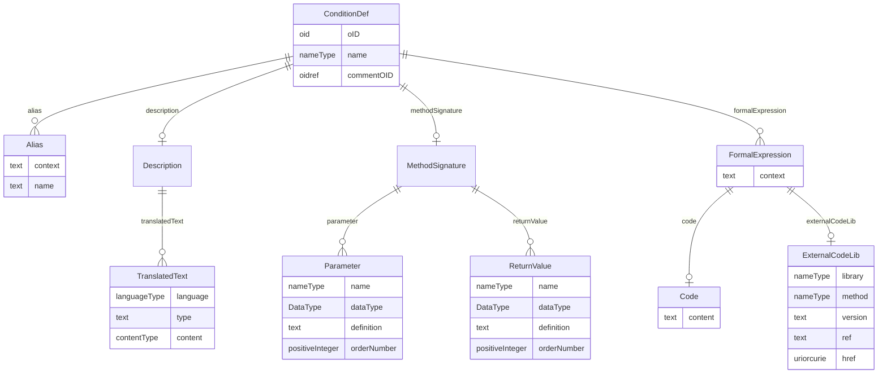

# Class: ConditionDef

_A ConditionDef defines a boolean condition._


URI: [odm:ConditionDef](http://www.cdisc.org/ns/odm/v2.0/ConditionDef)





<!-- no inheritance hierarchy -->


## Slots

| Name | Cardinality* and Range | Description | Inheritance |
| ---  | --- | --- | --- |
| [oID](oID.md) | 1..1 <br/> [oid](oid.md) | Unique identifier. | direct |
| [name](name.md) | 1..1 <br/> [nameType](nameType.md) | Human-readable name for the Condition. | direct |
| [commentOID](commentOID.md) | 0..1 <br/> [oidref](oidref.md) | Reference to a CommentDef element. | direct |
| [description](description.md) | 0..1 <br/> [Description](Description.md) | Description reference: A free-text description of the containing metadata com... | direct |
| [methodSignature](methodSignature.md) | 0..1 <br/> [MethodSignature](MethodSignature.md) | MethodSignature reference: A MethodSignature defines the parameters and retur... | direct |
| [formalExpression](formalExpression.md) | 0..* <br/> [FormalExpression](FormalExpression.md) | FormalExpression reference: A FormalExpression used within a ConditionDef or ... | direct |
| [alias](alias.md) | 0..* <br/> [Alias](Alias.md) | Alias reference: An Alias provides an additional name for an element. The Con... | direct |

_* See [LinkML documentation](https://linkml.io/linkml/schemas/slots.html#slot-cardinality) for cardinality definitions._


## Usages

| used by | used in | type | used |
| ---  | --- | --- | --- |
| [MetaDataVersion](MetaDataVersion.md) | [conditionDef](conditionDef.md) | range | [ConditionDef](ConditionDef.md) |


## See Also

* [https://wiki.cdisc.org/display/PUB/ConditionDef](https://wiki.cdisc.org/display/PUB/ConditionDef)

## Identifier and Mapping Information


### Schema Source


* from schema: http://www.cdisc.org/ns/odm/v2.0


## Mappings

| Mapping Type | Mapped Value |
| ---  | ---  |
| self | odm:ConditionDef |
| native | odm:ConditionDef |


## LinkML Source

<!-- TODO: investigate https://stackoverflow.com/questions/37606292/how-to-create-tabbed-code-blocks-in-mkdocs-or-sphinx -->

### Direct

<details>
```yaml
name: ConditionDef
description: A ConditionDef defines a boolean condition.
from_schema: http://www.cdisc.org/ns/odm/v2.0
see_also:
- https://wiki.cdisc.org/display/PUB/ConditionDef
rank: 1000
slots:
- oID
- name
- commentOID
- description
- methodSignature
- formalExpression
- alias
slot_usage:
  oID:
    name: oID
    description: Unique identifier.
    comments:
    - 'Required

      range: oid'
    domain_of:
    - Study
    - MetaDataVersion
    - Standard
    - ValueListDef
    - WhereClauseDef
    - StudyEventGroupDef
    - StudyEventDef
    - ItemGroupDef
    - ItemDef
    - CodeList
    - MethodDef
    - ConditionDef
    - CommentDef
    - StudyIndication
    - StudyIntervention
    - StudyObjective
    - StudyEndPoint
    - StudyTargetPopulation
    - StudyEstimand
    - Arm
    - Epoch
    - StudyParameter
    - StudyTiming
    - TransitionTimingConstraint
    - AbsoluteTimingConstraint
    - RelativeTimingConstraint
    - DurationTimingConstraint
    - WorkflowDef
    - Transition
    - Branching
    - Criterion
    - User
    - Organization
    - Location
    - SignatureDef
    - Query
    range: oid
    required: true
  name:
    name: name
    description: Human-readable name for the Condition.
    comments:
    - 'Required

      range: name'
    domain_of:
    - Alias
    - MetaDataVersion
    - Standard
    - StudyEventGroupDef
    - StudyEventDef
    - ItemGroupDef
    - Class
    - SubClass
    - SourceItem
    - Resource
    - ItemDef
    - CodeList
    - MethodDef
    - Parameter
    - ReturnValue
    - ConditionDef
    - StudyObjective
    - StudyEndPoint
    - StudyTargetPopulation
    - StudyEstimand
    - Arm
    - Epoch
    - StudyTiming
    - TransitionTimingConstraint
    - AbsoluteTimingConstraint
    - RelativeTimingConstraint
    - DurationTimingConstraint
    - WorkflowDef
    - Transition
    - Branching
    - Criterion
    - Organization
    - Location
    - Query
    range: nameType
    required: true
  commentOID:
    name: commentOID
    description: Reference to a CommentDef element.
    comments:
    - 'Optional

      range: oidref'
    domain_of:
    - MetaDataVersion
    - Standard
    - WhereClauseDef
    - StudyEventGroupDef
    - StudyEventDef
    - ItemGroupDef
    - ItemDef
    - CodeList
    - CodeListItem
    - MethodDef
    - ConditionDef
    - Coding
    range: oidref
  description:
    name: description
    domain_of:
    - Study
    - MetaDataVersion
    - ValueListDef
    - StudyEventGroupRef
    - StudyEventGroupDef
    - StudyEventDef
    - ItemGroupDef
    - Origin
    - ItemDef
    - CodeList
    - CodeListItem
    - MethodDef
    - ConditionDef
    - CommentDef
    - Protocol
    - StudyStructure
    - TrialPhase
    - StudyIndication
    - StudyIntervention
    - StudyObjective
    - StudyEndPoint
    - StudyTargetPopulation
    - StudyEstimand
    - IntercurrentEvent
    - SummaryMeasure
    - Arm
    - Epoch
    - TransitionTimingConstraint
    - AbsoluteTimingConstraint
    - RelativeTimingConstraint
    - DurationTimingConstraint
    - WorkflowDef
    - Criterion
    - Organization
    - Location
    - ODMFileMetadata
    range: Description
    maximum_cardinality: 1
  methodSignature:
    name: methodSignature
    domain_of:
    - RangeCheck
    - MethodDef
    - ConditionDef
    range: MethodSignature
    maximum_cardinality: 1
  formalExpression:
    name: formalExpression
    multivalued: true
    domain_of:
    - RangeCheck
    - MethodDef
    - ConditionDef
    - StudyEndPoint
    - StudyTargetPopulation
    range: FormalExpression
    inlined: true
    inlined_as_list: true
  alias:
    name: alias
    multivalued: true
    domain_of:
    - StudyEventDef
    - ItemGroupDef
    - ItemDef
    - CodeList
    - CodeListItem
    - MethodDef
    - ConditionDef
    - Protocol
    range: Alias
    inlined: true
    inlined_as_list: true
class_uri: odm:ConditionDef

```
</details>

### Induced

<details>
```yaml
name: ConditionDef
description: A ConditionDef defines a boolean condition.
from_schema: http://www.cdisc.org/ns/odm/v2.0
see_also:
- https://wiki.cdisc.org/display/PUB/ConditionDef
rank: 1000
slot_usage:
  oID:
    name: oID
    description: Unique identifier.
    comments:
    - 'Required

      range: oid'
    domain_of:
    - Study
    - MetaDataVersion
    - Standard
    - ValueListDef
    - WhereClauseDef
    - StudyEventGroupDef
    - StudyEventDef
    - ItemGroupDef
    - ItemDef
    - CodeList
    - MethodDef
    - ConditionDef
    - CommentDef
    - StudyIndication
    - StudyIntervention
    - StudyObjective
    - StudyEndPoint
    - StudyTargetPopulation
    - StudyEstimand
    - Arm
    - Epoch
    - StudyParameter
    - StudyTiming
    - TransitionTimingConstraint
    - AbsoluteTimingConstraint
    - RelativeTimingConstraint
    - DurationTimingConstraint
    - WorkflowDef
    - Transition
    - Branching
    - Criterion
    - User
    - Organization
    - Location
    - SignatureDef
    - Query
    range: oid
    required: true
  name:
    name: name
    description: Human-readable name for the Condition.
    comments:
    - 'Required

      range: name'
    domain_of:
    - Alias
    - MetaDataVersion
    - Standard
    - StudyEventGroupDef
    - StudyEventDef
    - ItemGroupDef
    - Class
    - SubClass
    - SourceItem
    - Resource
    - ItemDef
    - CodeList
    - MethodDef
    - Parameter
    - ReturnValue
    - ConditionDef
    - StudyObjective
    - StudyEndPoint
    - StudyTargetPopulation
    - StudyEstimand
    - Arm
    - Epoch
    - StudyTiming
    - TransitionTimingConstraint
    - AbsoluteTimingConstraint
    - RelativeTimingConstraint
    - DurationTimingConstraint
    - WorkflowDef
    - Transition
    - Branching
    - Criterion
    - Organization
    - Location
    - Query
    range: nameType
    required: true
  commentOID:
    name: commentOID
    description: Reference to a CommentDef element.
    comments:
    - 'Optional

      range: oidref'
    domain_of:
    - MetaDataVersion
    - Standard
    - WhereClauseDef
    - StudyEventGroupDef
    - StudyEventDef
    - ItemGroupDef
    - ItemDef
    - CodeList
    - CodeListItem
    - MethodDef
    - ConditionDef
    - Coding
    range: oidref
  description:
    name: description
    domain_of:
    - Study
    - MetaDataVersion
    - ValueListDef
    - StudyEventGroupRef
    - StudyEventGroupDef
    - StudyEventDef
    - ItemGroupDef
    - Origin
    - ItemDef
    - CodeList
    - CodeListItem
    - MethodDef
    - ConditionDef
    - CommentDef
    - Protocol
    - StudyStructure
    - TrialPhase
    - StudyIndication
    - StudyIntervention
    - StudyObjective
    - StudyEndPoint
    - StudyTargetPopulation
    - StudyEstimand
    - IntercurrentEvent
    - SummaryMeasure
    - Arm
    - Epoch
    - TransitionTimingConstraint
    - AbsoluteTimingConstraint
    - RelativeTimingConstraint
    - DurationTimingConstraint
    - WorkflowDef
    - Criterion
    - Organization
    - Location
    - ODMFileMetadata
    range: Description
    maximum_cardinality: 1
  methodSignature:
    name: methodSignature
    domain_of:
    - RangeCheck
    - MethodDef
    - ConditionDef
    range: MethodSignature
    maximum_cardinality: 1
  formalExpression:
    name: formalExpression
    multivalued: true
    domain_of:
    - RangeCheck
    - MethodDef
    - ConditionDef
    - StudyEndPoint
    - StudyTargetPopulation
    range: FormalExpression
    inlined: true
    inlined_as_list: true
  alias:
    name: alias
    multivalued: true
    domain_of:
    - StudyEventDef
    - ItemGroupDef
    - ItemDef
    - CodeList
    - CodeListItem
    - MethodDef
    - ConditionDef
    - Protocol
    range: Alias
    inlined: true
    inlined_as_list: true
attributes:
  oID:
    name: oID
    description: Unique identifier.
    comments:
    - 'Required

      range: oid'
    from_schema: http://www.cdisc.org/ns/odm/v2.0
    rank: 1000
    identifier: true
    alias: oID
    owner: ConditionDef
    domain_of:
    - Study
    - MetaDataVersion
    - Standard
    - ValueListDef
    - WhereClauseDef
    - StudyEventGroupDef
    - StudyEventDef
    - ItemGroupDef
    - ItemDef
    - CodeList
    - MethodDef
    - ConditionDef
    - CommentDef
    - StudyIndication
    - StudyIntervention
    - StudyObjective
    - StudyEndPoint
    - StudyTargetPopulation
    - StudyEstimand
    - Arm
    - Epoch
    - StudyParameter
    - StudyTiming
    - TransitionTimingConstraint
    - AbsoluteTimingConstraint
    - RelativeTimingConstraint
    - DurationTimingConstraint
    - WorkflowDef
    - Transition
    - Branching
    - Criterion
    - User
    - Organization
    - Location
    - SignatureDef
    - Query
    range: oid
    required: true
  name:
    name: name
    description: Human-readable name for the Condition.
    comments:
    - 'Required

      range: name'
    from_schema: http://www.cdisc.org/ns/odm/v2.0
    rank: 1000
    alias: name
    owner: ConditionDef
    domain_of:
    - Alias
    - MetaDataVersion
    - Standard
    - StudyEventGroupDef
    - StudyEventDef
    - ItemGroupDef
    - Class
    - SubClass
    - SourceItem
    - Resource
    - ItemDef
    - CodeList
    - MethodDef
    - Parameter
    - ReturnValue
    - ConditionDef
    - StudyObjective
    - StudyEndPoint
    - StudyTargetPopulation
    - StudyEstimand
    - Arm
    - Epoch
    - StudyTiming
    - TransitionTimingConstraint
    - AbsoluteTimingConstraint
    - RelativeTimingConstraint
    - DurationTimingConstraint
    - WorkflowDef
    - Transition
    - Branching
    - Criterion
    - Organization
    - Location
    - Query
    range: nameType
    required: true
  commentOID:
    name: commentOID
    description: Reference to a CommentDef element.
    comments:
    - 'Optional

      range: oidref'
    from_schema: http://www.cdisc.org/ns/odm/v2.0
    rank: 1000
    alias: commentOID
    owner: ConditionDef
    domain_of:
    - MetaDataVersion
    - Standard
    - WhereClauseDef
    - StudyEventGroupDef
    - StudyEventDef
    - ItemGroupDef
    - ItemDef
    - CodeList
    - CodeListItem
    - MethodDef
    - ConditionDef
    - Coding
    range: oidref
  description:
    name: description
    description: 'Description reference: A free-text description of the containing
      metadata component, unless restricted by Business Rules.'
    from_schema: http://www.cdisc.org/ns/odm/v2.0
    rank: 1000
    identifier: false
    alias: description
    owner: ConditionDef
    domain_of:
    - Study
    - MetaDataVersion
    - ValueListDef
    - StudyEventGroupRef
    - StudyEventGroupDef
    - StudyEventDef
    - ItemGroupDef
    - Origin
    - ItemDef
    - CodeList
    - CodeListItem
    - MethodDef
    - ConditionDef
    - CommentDef
    - Protocol
    - StudyStructure
    - TrialPhase
    - StudyIndication
    - StudyIntervention
    - StudyObjective
    - StudyEndPoint
    - StudyTargetPopulation
    - StudyEstimand
    - IntercurrentEvent
    - SummaryMeasure
    - Arm
    - Epoch
    - TransitionTimingConstraint
    - AbsoluteTimingConstraint
    - RelativeTimingConstraint
    - DurationTimingConstraint
    - WorkflowDef
    - Criterion
    - Organization
    - Location
    - ODMFileMetadata
    range: Description
    maximum_cardinality: 1
  methodSignature:
    name: methodSignature
    description: 'MethodSignature reference: A MethodSignature defines the parameters
      and return values for a method. The MethodSignature improves traceability while
      enhancing the ability for automation engines to execute a MethodDef''s FormalExpression.
      Most Methods use one or more input parameters and return one or more values.'
    from_schema: http://www.cdisc.org/ns/odm/v2.0
    rank: 1000
    identifier: false
    alias: methodSignature
    owner: ConditionDef
    domain_of:
    - RangeCheck
    - MethodDef
    - ConditionDef
    range: MethodSignature
    maximum_cardinality: 1
  formalExpression:
    name: formalExpression
    description: 'FormalExpression reference: A FormalExpression used within a ConditionDef
      or a RangeCheck must evaluate to True or False. A FormalExpression referenced
      within a MethodDef having Type Imputation, Computation, or Transpose must evaluate
      to the correct DataType for an Item that may be imputed or computed using the
      Method. A FormalExpression gets parameter and return value definitions from
      the MethodSignature element. The data types in the MethodSignature parameters
      and return values must match the corresponding data types in the FormalExpression.'
    from_schema: http://www.cdisc.org/ns/odm/v2.0
    rank: 1000
    multivalued: true
    identifier: false
    alias: formalExpression
    owner: ConditionDef
    domain_of:
    - RangeCheck
    - MethodDef
    - ConditionDef
    - StudyEndPoint
    - StudyTargetPopulation
    range: FormalExpression
    inlined: true
    inlined_as_list: true
  alias:
    name: alias
    description: 'Alias reference: An Alias provides an additional name for an element.
      The Context attribute specifies the application domain in which this additional
      name is relevant.'
    from_schema: http://www.cdisc.org/ns/odm/v2.0
    rank: 1000
    multivalued: true
    identifier: false
    alias: alias
    owner: ConditionDef
    domain_of:
    - StudyEventDef
    - ItemGroupDef
    - ItemDef
    - CodeList
    - CodeListItem
    - MethodDef
    - ConditionDef
    - Protocol
    range: Alias
    inlined: true
    inlined_as_list: true
class_uri: odm:ConditionDef

```
</details>