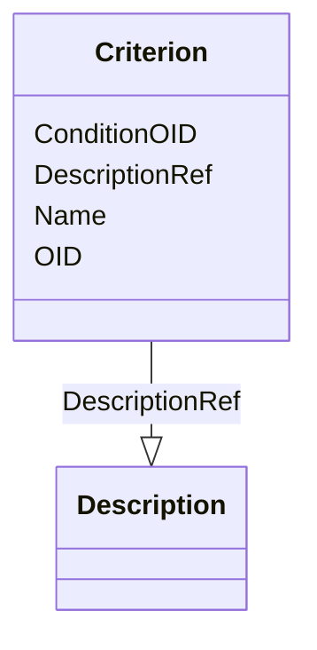

# Class: Criterion


URI: [odm:Criterion](http://www.cdisc.org/ns/odm/v2.0/Criterion)





<!-- no inheritance hierarchy -->


## Slots

| Name | Cardinality and Range | Description | Inheritance |
| ---  | --- | --- | --- |
| [OID](OID.md) | 1..1 <br/> [Oid](Oid.md) | Unique identifier of the version within the XML document | direct |
| [Name](Name.md) | 1..1 <br/> [Name](Name.md) | General observation Sub Class | direct |
| [ConditionOID](ConditionOID.md) | 1..1 <br/> [Oidref](Oidref.md) |  | direct |
| [DescriptionRef](DescriptionRef.md) | 0..1 <br/> [Description](Description.md) |  | direct |


## Usages

| used by | used in | type | used |
| ---  | --- | --- | --- |
| [InclusionCriteria](InclusionCriteria.md) | [CriterionRef](CriterionRef.md) | range | [Criterion](Criterion.md) |
| [ExclusionCriteria](ExclusionCriteria.md) | [CriterionRef](CriterionRef.md) | range | [Criterion](Criterion.md) |
| [EntryCriteria](EntryCriteria.md) | [CriterionRef](CriterionRef.md) | range | [Criterion](Criterion.md) |
| [ExitCriteria](ExitCriteria.md) | [CriterionRef](CriterionRef.md) | range | [Criterion](Criterion.md) |


## Identifier and Mapping Information


### Schema Source


* from schema: http://www.cdisc.org/ns/odm/v2.0


## Mappings

| Mapping Type | Mapped Value |
| ---  | ---  |
| self | odm:Criterion |
| native | odm:Criterion |


## LinkML Source

<!-- TODO: investigate https://stackoverflow.com/questions/37606292/how-to-create-tabbed-code-blocks-in-mkdocs-or-sphinx -->

### Direct

<details>
```yaml
name: Criterion
from_schema: http://www.cdisc.org/ns/odm/v2.0
slots:
- OID
- Name
- ConditionOID
- DescriptionRef
slot_usage:
  OID:
    name: OID
    domain_of:
    - ValueListDef
    - WhereClauseDef
    - StudyEventGroupDef
    - CommentDef
    - StudyIndication
    - StudyIntervention
    - StudyObjective
    - StudyEndPoint
    - StudyTargetPopulation
    - StudyEstimand
    - Arm
    - Epoch
    - StudyParameter
    - StudyTiming
    - TransitionTimingConstraint
    - AbsoluteTimingConstraint
    - RelativeTimingConstraint
    - DurationTimingConstraint
    - WorkflowDef
    - Transition
    - Branching
    - Criterion
    - ExceptionEvent
    - Organization
    - Query
    - MetaDataVersion
    - StudyEventDef
    - ItemGroupDef
    - ItemDef
    - CodeList
    - ConditionDef
    - MethodDef
    - Standard
    - User
    - Location
    - SignatureDef
    - Study
    range: oid
    required: true
  Name:
    name: Name
    domain_of:
    - StudyEventGroupDef
    - Class
    - SubClass
    - SourceItem
    - Resource
    - Parameter
    - ReturnValue
    - StudyObjective
    - StudyEndPoint
    - StudyTargetPopulation
    - StudyEstimand
    - Arm
    - Epoch
    - StudyTiming
    - TransitionTimingConstraint
    - AbsoluteTimingConstraint
    - RelativeTimingConstraint
    - DurationTimingConstraint
    - WorkflowDef
    - Transition
    - Branching
    - Criterion
    - ExceptionEvent
    - Organization
    - Query
    - MetaDataVersion
    - StudyEventDef
    - ItemGroupDef
    - ItemDef
    - CodeList
    - ConditionDef
    - MethodDef
    - Standard
    - Alias
    - Location
    range: name
    required: true
  ConditionOID:
    name: ConditionOID
    domain_of:
    - TargetTransition
    - Criterion
    - ExceptionEvent
    range: oidref
    required: true
  DescriptionRef:
    name: DescriptionRef
    domain_of:
    - ValueListDef
    - StudyEventGroupRef
    - StudyEventGroupDef
    - Origin
    - CommentDef
    - Protocol
    - StudyStructure
    - TrialPhase
    - StudyIndication
    - StudyIntervention
    - StudyObjective
    - StudyEndPoint
    - StudyTargetPopulation
    - StudyEstimand
    - IntercurrentEvent
    - SummaryMeasure
    - Arm
    - Epoch
    - TransitionTimingConstraint
    - AbsoluteTimingConstraint
    - RelativeTimingConstraint
    - DurationTimingConstraint
    - WorkflowDef
    - Criterion
    - ExceptionEvent
    - Organization
    - MetaDataVersion
    - StudyEventDef
    - ItemGroupDef
    - ItemDef
    - CodeList
    - ConditionDef
    - MethodDef
    - CodeListItem
    - EnumeratedItem
    - Location
    - Study
    - ODMFileMetadata
    range: Description
    required: false
    minimum_cardinality: 0
    maximum_cardinality: 1
class_uri: odm:Criterion

```
</details>

### Induced

<details>
```yaml
name: Criterion
from_schema: http://www.cdisc.org/ns/odm/v2.0
slot_usage:
  OID:
    name: OID
    domain_of:
    - ValueListDef
    - WhereClauseDef
    - StudyEventGroupDef
    - CommentDef
    - StudyIndication
    - StudyIntervention
    - StudyObjective
    - StudyEndPoint
    - StudyTargetPopulation
    - StudyEstimand
    - Arm
    - Epoch
    - StudyParameter
    - StudyTiming
    - TransitionTimingConstraint
    - AbsoluteTimingConstraint
    - RelativeTimingConstraint
    - DurationTimingConstraint
    - WorkflowDef
    - Transition
    - Branching
    - Criterion
    - ExceptionEvent
    - Organization
    - Query
    - MetaDataVersion
    - StudyEventDef
    - ItemGroupDef
    - ItemDef
    - CodeList
    - ConditionDef
    - MethodDef
    - Standard
    - User
    - Location
    - SignatureDef
    - Study
    range: oid
    required: true
  Name:
    name: Name
    domain_of:
    - StudyEventGroupDef
    - Class
    - SubClass
    - SourceItem
    - Resource
    - Parameter
    - ReturnValue
    - StudyObjective
    - StudyEndPoint
    - StudyTargetPopulation
    - StudyEstimand
    - Arm
    - Epoch
    - StudyTiming
    - TransitionTimingConstraint
    - AbsoluteTimingConstraint
    - RelativeTimingConstraint
    - DurationTimingConstraint
    - WorkflowDef
    - Transition
    - Branching
    - Criterion
    - ExceptionEvent
    - Organization
    - Query
    - MetaDataVersion
    - StudyEventDef
    - ItemGroupDef
    - ItemDef
    - CodeList
    - ConditionDef
    - MethodDef
    - Standard
    - Alias
    - Location
    range: name
    required: true
  ConditionOID:
    name: ConditionOID
    domain_of:
    - TargetTransition
    - Criterion
    - ExceptionEvent
    range: oidref
    required: true
  DescriptionRef:
    name: DescriptionRef
    domain_of:
    - ValueListDef
    - StudyEventGroupRef
    - StudyEventGroupDef
    - Origin
    - CommentDef
    - Protocol
    - StudyStructure
    - TrialPhase
    - StudyIndication
    - StudyIntervention
    - StudyObjective
    - StudyEndPoint
    - StudyTargetPopulation
    - StudyEstimand
    - IntercurrentEvent
    - SummaryMeasure
    - Arm
    - Epoch
    - TransitionTimingConstraint
    - AbsoluteTimingConstraint
    - RelativeTimingConstraint
    - DurationTimingConstraint
    - WorkflowDef
    - Criterion
    - ExceptionEvent
    - Organization
    - MetaDataVersion
    - StudyEventDef
    - ItemGroupDef
    - ItemDef
    - CodeList
    - ConditionDef
    - MethodDef
    - CodeListItem
    - EnumeratedItem
    - Location
    - Study
    - ODMFileMetadata
    range: Description
    required: false
    minimum_cardinality: 0
    maximum_cardinality: 1
attributes:
  OID:
    name: OID
    description: Unique identifier of the version within the XML document.
    from_schema: http://www.cdisc.org/ns/odm/v2.0
    rank: 1000
    alias: OID
    owner: Criterion
    domain_of:
    - ValueListDef
    - WhereClauseDef
    - StudyEventGroupDef
    - CommentDef
    - StudyIndication
    - StudyIntervention
    - StudyObjective
    - StudyEndPoint
    - StudyTargetPopulation
    - StudyEstimand
    - Arm
    - Epoch
    - StudyParameter
    - StudyTiming
    - TransitionTimingConstraint
    - AbsoluteTimingConstraint
    - RelativeTimingConstraint
    - DurationTimingConstraint
    - WorkflowDef
    - Transition
    - Branching
    - Criterion
    - ExceptionEvent
    - Organization
    - Query
    - MetaDataVersion
    - StudyEventDef
    - ItemGroupDef
    - ItemDef
    - CodeList
    - ConditionDef
    - MethodDef
    - Standard
    - User
    - Location
    - SignatureDef
    - Study
    range: oid
    required: true
  Name:
    name: Name
    description: General observation Sub Class.
    from_schema: http://www.cdisc.org/ns/odm/v2.0
    rank: 1000
    alias: Name
    owner: Criterion
    domain_of:
    - StudyEventGroupDef
    - Class
    - SubClass
    - SourceItem
    - Resource
    - Parameter
    - ReturnValue
    - StudyObjective
    - StudyEndPoint
    - StudyTargetPopulation
    - StudyEstimand
    - Arm
    - Epoch
    - StudyTiming
    - TransitionTimingConstraint
    - AbsoluteTimingConstraint
    - RelativeTimingConstraint
    - DurationTimingConstraint
    - WorkflowDef
    - Transition
    - Branching
    - Criterion
    - ExceptionEvent
    - Organization
    - Query
    - MetaDataVersion
    - StudyEventDef
    - ItemGroupDef
    - ItemDef
    - CodeList
    - ConditionDef
    - MethodDef
    - Standard
    - Alias
    - Location
    range: name
    required: true
  ConditionOID:
    name: ConditionOID
    from_schema: http://www.cdisc.org/ns/odm/v2.0
    rank: 1000
    alias: ConditionOID
    owner: Criterion
    domain_of:
    - TargetTransition
    - Criterion
    - ExceptionEvent
    range: oidref
    required: true
  DescriptionRef:
    name: DescriptionRef
    from_schema: http://www.cdisc.org/ns/odm/v2.0
    rank: 1000
    alias: DescriptionRef
    owner: Criterion
    domain_of:
    - ValueListDef
    - StudyEventGroupRef
    - StudyEventGroupDef
    - Origin
    - CommentDef
    - Protocol
    - StudyStructure
    - TrialPhase
    - StudyIndication
    - StudyIntervention
    - StudyObjective
    - StudyEndPoint
    - StudyTargetPopulation
    - StudyEstimand
    - IntercurrentEvent
    - SummaryMeasure
    - Arm
    - Epoch
    - TransitionTimingConstraint
    - AbsoluteTimingConstraint
    - RelativeTimingConstraint
    - DurationTimingConstraint
    - WorkflowDef
    - Criterion
    - ExceptionEvent
    - Organization
    - MetaDataVersion
    - StudyEventDef
    - ItemGroupDef
    - ItemDef
    - CodeList
    - ConditionDef
    - MethodDef
    - CodeListItem
    - EnumeratedItem
    - Location
    - Study
    - ODMFileMetadata
    range: Description
    required: false
    minimum_cardinality: 0
    maximum_cardinality: 1
class_uri: odm:Criterion

```
</details>