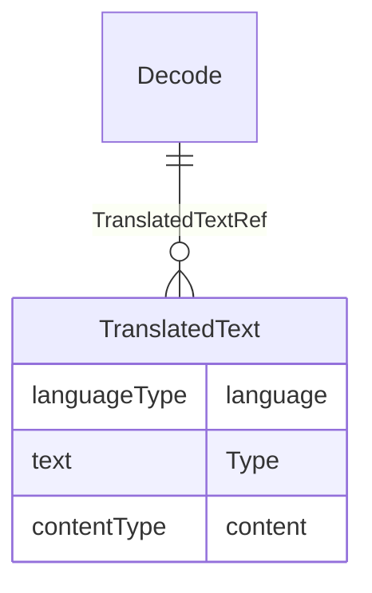

# Class: Decode

_The displayed value relating to the CodeListItem/@CodedValue. This is often a label corresponding to a short name or alpha-numeric code. The actual Decode text is provided in a TranslatedText element so that it can be provided in different languages on a case report form or tabular data summary._


URI: [odm:Decode](http://www.cdisc.org/ns/odm/v2.0/Decode)





<!-- no inheritance hierarchy -->


## Slots

| Name | Cardinality* and Range | Description | Inheritance |
| ---  | --- | --- | --- |
| [TranslatedTextRef](TranslatedTextRef.md) | 0..* <br/> [TranslatedText](TranslatedText.md) | TranslatedText reference: Human-readable text that is appropriate for a parti... | direct |

_* See [LinkML documentation](https://linkml.io/linkml/schemas/slots.html#slot-cardinality) for cardinality definitions._


## Usages

| used by | used in | type | used |
| ---  | --- | --- | --- |
| [CodeListItem](CodeListItem.md) | [DecodeRef](DecodeRef.md) | range | [Decode](Decode.md) |


## See Also

* [https://wiki.cdisc.org/display/PUB/Decode](https://wiki.cdisc.org/display/PUB/Decode)

## Identifier and Mapping Information


### Schema Source


* from schema: http://www.cdisc.org/ns/odm/v2.0


## Mappings

| Mapping Type | Mapped Value |
| ---  | ---  |
| self | odm:Decode |
| native | odm:Decode |


## LinkML Source

<!-- TODO: investigate https://stackoverflow.com/questions/37606292/how-to-create-tabbed-code-blocks-in-mkdocs-or-sphinx -->

### Direct

<details>
```yaml
name: Decode
description: The displayed value relating to the CodeListItem/@CodedValue. This is
  often a label corresponding to a short name or alpha-numeric code. The actual Decode
  text is provided in a TranslatedText element so that it can be provided in different
  languages on a case report form or tabular data summary.
from_schema: http://www.cdisc.org/ns/odm/v2.0
see_also:
- https://wiki.cdisc.org/display/PUB/Decode
rank: 1000
slots:
- TranslatedTextRef
slot_usage:
  TranslatedTextRef:
    name: TranslatedTextRef
    multivalued: true
    domain_of:
    - Description
    - Question
    - Definition
    - Prompt
    - CRFCompletionInstructions
    - ImplementationNotes
    - CDISCNotes
    - ErrorMessage
    - Decode
    - Comment
    range: TranslatedText
    inlined: true
    inlined_as_list: true
class_uri: odm:Decode

```
</details>

### Induced

<details>
```yaml
name: Decode
description: The displayed value relating to the CodeListItem/@CodedValue. This is
  often a label corresponding to a short name or alpha-numeric code. The actual Decode
  text is provided in a TranslatedText element so that it can be provided in different
  languages on a case report form or tabular data summary.
from_schema: http://www.cdisc.org/ns/odm/v2.0
see_also:
- https://wiki.cdisc.org/display/PUB/Decode
rank: 1000
slot_usage:
  TranslatedTextRef:
    name: TranslatedTextRef
    multivalued: true
    domain_of:
    - Description
    - Question
    - Definition
    - Prompt
    - CRFCompletionInstructions
    - ImplementationNotes
    - CDISCNotes
    - ErrorMessage
    - Decode
    - Comment
    range: TranslatedText
    inlined: true
    inlined_as_list: true
attributes:
  TranslatedTextRef:
    name: TranslatedTextRef
    description: 'TranslatedText reference: Human-readable text that is appropriate
      for a particular language. TranslatedText elements typically occur in a series,
      presenting a set of alternative textual renditions for different languages and
      types.'
    from_schema: http://www.cdisc.org/ns/odm/v2.0
    rank: 1000
    multivalued: true
    identifier: false
    alias: TranslatedTextRef
    owner: Decode
    domain_of:
    - Description
    - Question
    - Definition
    - Prompt
    - CRFCompletionInstructions
    - ImplementationNotes
    - CDISCNotes
    - ErrorMessage
    - Decode
    - Comment
    range: TranslatedText
    inlined: true
    inlined_as_list: true
class_uri: odm:Decode

```
</details>