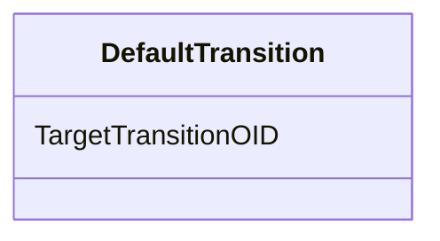

# Class: DefaultTransition


URI: [odm:DefaultTransition](http://www.cdisc.org/ns/odm/v2.0/DefaultTransition)





<!-- no inheritance hierarchy -->


## Slots

| Name | Cardinality and Range | Description | Inheritance |
| ---  | --- | --- | --- |
| [TargetTransitionOID](TargetTransitionOID.md) | 1..1 <br/> [Oidref](Oidref.md) |  | direct |


## Usages

| used by | used in | type | used |
| ---  | --- | --- | --- |
| [Branching](Branching.md) | [DefaultTransitionRef](DefaultTransitionRef.md) | range | [DefaultTransition](DefaultTransition.md) |


## Identifier and Mapping Information


### Schema Source


* from schema: http://www.cdisc.org/ns/odm/v2.0


## Mappings

| Mapping Type | Mapped Value |
| ---  | ---  |
| self | odm:DefaultTransition |
| native | odm:DefaultTransition |


## LinkML Source

<!-- TODO: investigate https://stackoverflow.com/questions/37606292/how-to-create-tabbed-code-blocks-in-mkdocs-or-sphinx -->

### Direct

<details>
```yaml
name: DefaultTransition
from_schema: http://www.cdisc.org/ns/odm/v2.0
slots:
- TargetTransitionOID
slot_usage:
  TargetTransitionOID:
    name: TargetTransitionOID
    domain_of:
    - TargetTransition
    - DefaultTransition
    range: oidref
    required: true
class_uri: odm:DefaultTransition

```
</details>

### Induced

<details>
```yaml
name: DefaultTransition
from_schema: http://www.cdisc.org/ns/odm/v2.0
slot_usage:
  TargetTransitionOID:
    name: TargetTransitionOID
    domain_of:
    - TargetTransition
    - DefaultTransition
    range: oidref
    required: true
attributes:
  TargetTransitionOID:
    name: TargetTransitionOID
    from_schema: http://www.cdisc.org/ns/odm/v2.0
    rank: 1000
    alias: TargetTransitionOID
    owner: DefaultTransition
    domain_of:
    - TargetTransition
    - DefaultTransition
    range: oidref
    required: true
class_uri: odm:DefaultTransition

```
</details>