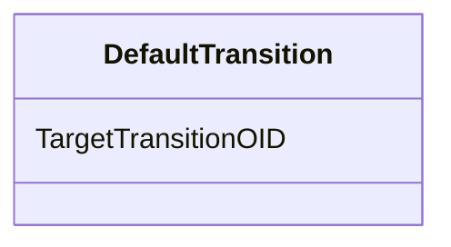

# Class: DefaultTransition


_Element NameDefaultTransitionParent ElementsBranchingElement XPath(s)/ODM/Study/MetaDataVersion/Protocol/WorkflowDef/Branching/DefaultTransitionElement Textual ValueNoneAttributesTargetTransitionOIDChild ElementsNoneUsage/Business Rules_


URI: [odm:DefaultTransition](http://www.cdisc.org/ns/odm/v2.0/DefaultTransition)





<!-- no inheritance hierarchy -->


## Slots

| Name | Cardinality and Range | Description | Inheritance |
| ---  | --- | --- | --- |
| [TargetTransitionOID](TargetTransitionOID.md) | 1..1 <br/> [Oidref](Oidref.md) | Reference to the Transition that is the default target of the branching | direct |


## Usages

| used by | used in | type | used |
| ---  | --- | --- | --- |
| [Branching](Branching.md) | [DefaultTransitionRef](DefaultTransitionRef.md) | range | [DefaultTransition](DefaultTransition.md) |


## See Also

* [https://wiki.cdisc.org/display/ODM2/DefaultTransition](https://wiki.cdisc.org/display/ODM2/DefaultTransition)

## Identifier and Mapping Information


### Schema Source


* from schema: http://www.cdisc.org/ns/odm/v2.0


## Mappings

| Mapping Type | Mapped Value |
| ---  | ---  |
| self | odm:DefaultTransition |
| native | odm:DefaultTransition |


## LinkML Source

<!-- TODO: investigate https://stackoverflow.com/questions/37606292/how-to-create-tabbed-code-blocks-in-mkdocs-or-sphinx -->

### Direct

<details>
```yaml
name: DefaultTransition
description: Element NameDefaultTransitionParent ElementsBranchingElement XPath(s)/ODM/Study/MetaDataVersion/Protocol/WorkflowDef/Branching/DefaultTransitionElement
  Textual ValueNoneAttributesTargetTransitionOIDChild ElementsNoneUsage/Business Rules
from_schema: http://www.cdisc.org/ns/odm/v2.0
see_also:
- https://wiki.cdisc.org/display/ODM2/DefaultTransition
slots:
- TargetTransitionOID
slot_usage:
  TargetTransitionOID:
    name: TargetTransitionOID
    description: Reference to the Transition that is the default target of the branching.
    comments:
    - 'Required

      range:oidref

      The TargetTransitionOID attribute must match the OID attribute of a Transition
      element within the WorkflowDef.'
    domain_of:
    - TargetTransition
    - DefaultTransition
    range: oidref
    required: true
class_uri: odm:DefaultTransition

```
</details>

### Induced

<details>
```yaml
name: DefaultTransition
description: Element NameDefaultTransitionParent ElementsBranchingElement XPath(s)/ODM/Study/MetaDataVersion/Protocol/WorkflowDef/Branching/DefaultTransitionElement
  Textual ValueNoneAttributesTargetTransitionOIDChild ElementsNoneUsage/Business Rules
from_schema: http://www.cdisc.org/ns/odm/v2.0
see_also:
- https://wiki.cdisc.org/display/ODM2/DefaultTransition
slot_usage:
  TargetTransitionOID:
    name: TargetTransitionOID
    description: Reference to the Transition that is the default target of the branching.
    comments:
    - 'Required

      range:oidref

      The TargetTransitionOID attribute must match the OID attribute of a Transition
      element within the WorkflowDef.'
    domain_of:
    - TargetTransition
    - DefaultTransition
    range: oidref
    required: true
attributes:
  TargetTransitionOID:
    name: TargetTransitionOID
    description: Reference to the Transition that is the default target of the branching.
    comments:
    - 'Required

      range:oidref

      The TargetTransitionOID attribute must match the OID attribute of a Transition
      element within the WorkflowDef.'
    from_schema: http://www.cdisc.org/ns/odm/v2.0
    rank: 1000
    alias: TargetTransitionOID
    owner: DefaultTransition
    domain_of:
    - TargetTransition
    - DefaultTransition
    range: oidref
    required: true
class_uri: odm:DefaultTransition

```
</details>