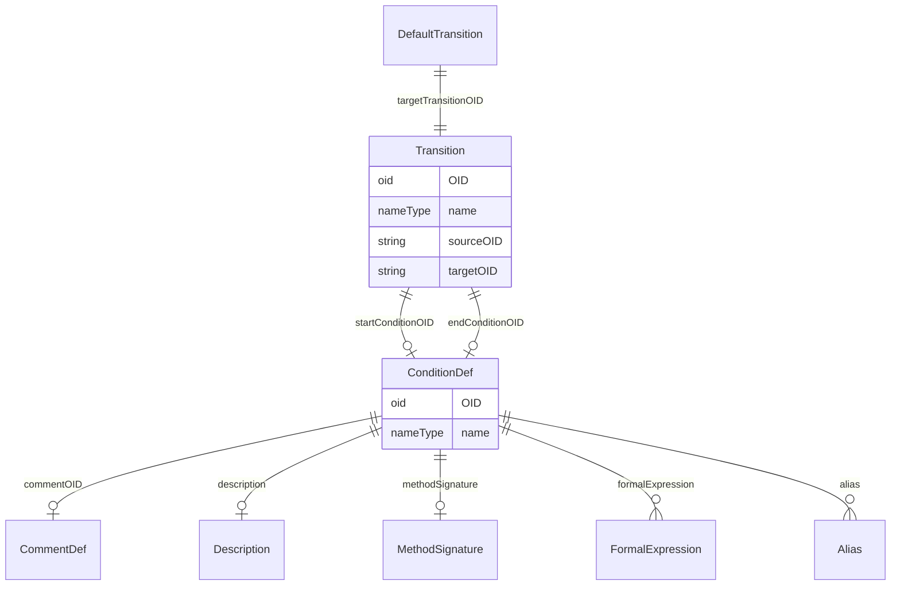

# Class: DefaultTransition

_The DefaultTransition references the Transition that needs to be executed when none of the TargetTransitions can be executed._


URI: [odm:DefaultTransition](http://www.cdisc.org/ns/odm/v2.0/DefaultTransition)





<!-- no inheritance hierarchy -->


## Slots

| Name | Cardinality* and Range | Description | Inheritance |
| ---  | --- | --- | --- |
| [targetTransitionOID](targetTransitionOID.md) | 1..1 <br/> [Transition](Transition.md) | Reference to the Transition that is the default target of the branching. | direct |

_* See [LinkML documentation](https://linkml.io/linkml/schemas/slots.html#slot-cardinality) for cardinality definitions._


## Usages

| used by | used in | type | used |
| ---  | --- | --- | --- |
| [Branching](Branching.md) | [defaultTransition](defaultTransition.md) | range | [DefaultTransition](DefaultTransition.md) |


## See Also

* [https://wiki.cdisc.org/display/PUB/DefaultTransition](https://wiki.cdisc.org/display/PUB/DefaultTransition)

## Identifier and Mapping Information


### Schema Source


* from schema: http://www.cdisc.org/ns/odm/v2.0


## Mappings

| Mapping Type | Mapped Value |
| ---  | ---  |
| self | odm:DefaultTransition |
| native | odm:DefaultTransition |


## LinkML Source

<!-- TODO: investigate https://stackoverflow.com/questions/37606292/how-to-create-tabbed-code-blocks-in-mkdocs-or-sphinx -->

### Direct

<details>
```yaml
name: DefaultTransition
description: The DefaultTransition references the Transition that needs to be executed
  when none of the TargetTransitions can be executed.
from_schema: http://www.cdisc.org/ns/odm/v2.0
see_also:
- https://wiki.cdisc.org/display/PUB/DefaultTransition
rank: 1000
slots:
- targetTransitionOID
slot_usage:
  targetTransitionOID:
    name: targetTransitionOID
    description: Reference to the Transition that is the default target of the branching.
    comments:
    - 'Required

      range: oidref

      The TargetTransitionOID attribute must match the OID attribute of a Transition
      element within the WorkflowDef.'
    domain_of:
    - TargetTransition
    - DefaultTransition
    range: Transition
    required: true
class_uri: odm:DefaultTransition

```
</details>

### Induced

<details>
```yaml
name: DefaultTransition
description: The DefaultTransition references the Transition that needs to be executed
  when none of the TargetTransitions can be executed.
from_schema: http://www.cdisc.org/ns/odm/v2.0
see_also:
- https://wiki.cdisc.org/display/PUB/DefaultTransition
rank: 1000
slot_usage:
  targetTransitionOID:
    name: targetTransitionOID
    description: Reference to the Transition that is the default target of the branching.
    comments:
    - 'Required

      range: oidref

      The TargetTransitionOID attribute must match the OID attribute of a Transition
      element within the WorkflowDef.'
    domain_of:
    - TargetTransition
    - DefaultTransition
    range: Transition
    required: true
attributes:
  targetTransitionOID:
    name: targetTransitionOID
    description: Reference to the Transition that is the default target of the branching.
    comments:
    - 'Required

      range: oidref

      The TargetTransitionOID attribute must match the OID attribute of a Transition
      element within the WorkflowDef.'
    from_schema: http://www.cdisc.org/ns/odm/v2.0
    rank: 1000
    alias: targetTransitionOID
    owner: DefaultTransition
    domain_of:
    - TargetTransition
    - DefaultTransition
    range: Transition
    required: true
class_uri: odm:DefaultTransition

```
</details>