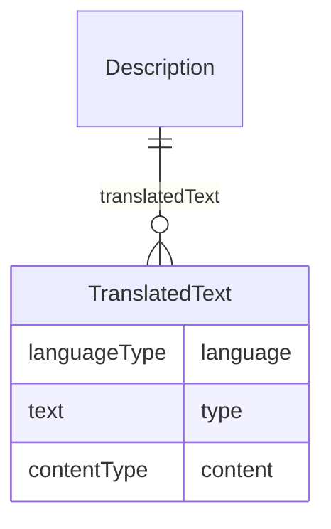

# Class: Description

_A free-text description of the containing metadata component, unless restricted by Business Rules._


URI: [odm:Description](http://www.cdisc.org/ns/odm/v2.0/Description)





<!-- no inheritance hierarchy -->


## Slots

| Name | Cardinality* and Range | Description | Inheritance |
| ---  | --- | --- | --- |
| [translatedText](translatedText.md) | 0..* <br/> [TranslatedText](TranslatedText.md) | TranslatedText reference: Human-readable text that is appropriate for a parti... | direct |

_* See [LinkML documentation](https://linkml.io/linkml/schemas/slots.html#slot-cardinality) for cardinality definitions._


## Usages

| used by | used in | type | used |
| ---  | --- | --- | --- |
| [Study](Study.md) | [description](description.md) | range | [Description](Description.md) |
| [MetaDataVersion](MetaDataVersion.md) | [description](description.md) | range | [Description](Description.md) |
| [ValueListDef](ValueListDef.md) | [description](description.md) | range | [Description](Description.md) |
| [StudyEventGroupRef](StudyEventGroupRef.md) | [description](description.md) | range | [Description](Description.md) |
| [StudyEventGroupDef](StudyEventGroupDef.md) | [description](description.md) | range | [Description](Description.md) |
| [StudyEventDef](StudyEventDef.md) | [description](description.md) | range | [Description](Description.md) |
| [ItemGroupDef](ItemGroupDef.md) | [description](description.md) | range | [Description](Description.md) |
| [Origin](Origin.md) | [description](description.md) | range | [Description](Description.md) |
| [ItemDef](ItemDef.md) | [description](description.md) | range | [Description](Description.md) |
| [CodeList](CodeList.md) | [description](description.md) | range | [Description](Description.md) |
| [CodeListItem](CodeListItem.md) | [description](description.md) | range | [Description](Description.md) |
| [MethodDef](MethodDef.md) | [description](description.md) | range | [Description](Description.md) |
| [ConditionDef](ConditionDef.md) | [description](description.md) | range | [Description](Description.md) |
| [CommentDef](CommentDef.md) | [description](description.md) | range | [Description](Description.md) |
| [Protocol](Protocol.md) | [description](description.md) | range | [Description](Description.md) |
| [StudyStructure](StudyStructure.md) | [description](description.md) | range | [Description](Description.md) |
| [TrialPhase](TrialPhase.md) | [description](description.md) | range | [Description](Description.md) |
| [StudyIndication](StudyIndication.md) | [description](description.md) | range | [Description](Description.md) |
| [StudyIntervention](StudyIntervention.md) | [description](description.md) | range | [Description](Description.md) |
| [StudyObjective](StudyObjective.md) | [description](description.md) | range | [Description](Description.md) |
| [StudyEndPoint](StudyEndPoint.md) | [description](description.md) | range | [Description](Description.md) |
| [StudyTargetPopulation](StudyTargetPopulation.md) | [description](description.md) | range | [Description](Description.md) |
| [StudyEstimand](StudyEstimand.md) | [description](description.md) | range | [Description](Description.md) |
| [IntercurrentEvent](IntercurrentEvent.md) | [description](description.md) | range | [Description](Description.md) |
| [SummaryMeasure](SummaryMeasure.md) | [description](description.md) | range | [Description](Description.md) |
| [Arm](Arm.md) | [description](description.md) | range | [Description](Description.md) |
| [Epoch](Epoch.md) | [description](description.md) | range | [Description](Description.md) |
| [TransitionTimingConstraint](TransitionTimingConstraint.md) | [description](description.md) | range | [Description](Description.md) |
| [AbsoluteTimingConstraint](AbsoluteTimingConstraint.md) | [description](description.md) | range | [Description](Description.md) |
| [RelativeTimingConstraint](RelativeTimingConstraint.md) | [description](description.md) | range | [Description](Description.md) |
| [DurationTimingConstraint](DurationTimingConstraint.md) | [description](description.md) | range | [Description](Description.md) |
| [WorkflowDef](WorkflowDef.md) | [description](description.md) | range | [Description](Description.md) |
| [Criterion](Criterion.md) | [description](description.md) | range | [Description](Description.md) |
| [Organization](Organization.md) | [description](description.md) | range | [Description](Description.md) |
| [Location](Location.md) | [description](description.md) | range | [Description](Description.md) |
| [ODMFileMetadata](ODMFileMetadata.md) | [description](description.md) | range | [Description](Description.md) |


## See Also

* [https://wiki.cdisc.org/display/PUB/Description](https://wiki.cdisc.org/display/PUB/Description)

## Identifier and Mapping Information


### Schema Source


* from schema: http://www.cdisc.org/ns/odm/v2.0


## Mappings

| Mapping Type | Mapped Value |
| ---  | ---  |
| self | odm:Description |
| native | odm:Description |


## LinkML Source

<!-- TODO: investigate https://stackoverflow.com/questions/37606292/how-to-create-tabbed-code-blocks-in-mkdocs-or-sphinx -->

### Direct

<details>
```yaml
name: Description
description: A free-text description of the containing metadata component, unless
  restricted by Business Rules.
from_schema: http://www.cdisc.org/ns/odm/v2.0
see_also:
- https://wiki.cdisc.org/display/PUB/Description
rank: 1000
slots:
- translatedText
slot_usage:
  translatedText:
    name: translatedText
    multivalued: true
    domain_of:
    - Description
    - Question
    - Definition
    - Prompt
    - CRFCompletionInstructions
    - ImplementationNotes
    - CDISCNotes
    - ErrorMessage
    - Decode
    - Comment
    range: TranslatedText
    inlined: true
    inlined_as_list: true
class_uri: odm:Description

```
</details>

### Induced

<details>
```yaml
name: Description
description: A free-text description of the containing metadata component, unless
  restricted by Business Rules.
from_schema: http://www.cdisc.org/ns/odm/v2.0
see_also:
- https://wiki.cdisc.org/display/PUB/Description
rank: 1000
slot_usage:
  translatedText:
    name: translatedText
    multivalued: true
    domain_of:
    - Description
    - Question
    - Definition
    - Prompt
    - CRFCompletionInstructions
    - ImplementationNotes
    - CDISCNotes
    - ErrorMessage
    - Decode
    - Comment
    range: TranslatedText
    inlined: true
    inlined_as_list: true
attributes:
  translatedText:
    name: translatedText
    description: 'TranslatedText reference: Human-readable text that is appropriate
      for a particular language. TranslatedText elements typically occur in a series,
      presenting a set of alternative textual renditions for different languages and
      types.'
    from_schema: http://www.cdisc.org/ns/odm/v2.0
    rank: 1000
    multivalued: true
    identifier: false
    alias: translatedText
    owner: Description
    domain_of:
    - Description
    - Question
    - Definition
    - Prompt
    - CRFCompletionInstructions
    - ImplementationNotes
    - CDISCNotes
    - ErrorMessage
    - Decode
    - Comment
    range: TranslatedText
    inlined: true
    inlined_as_list: true
class_uri: odm:Description

```
</details>