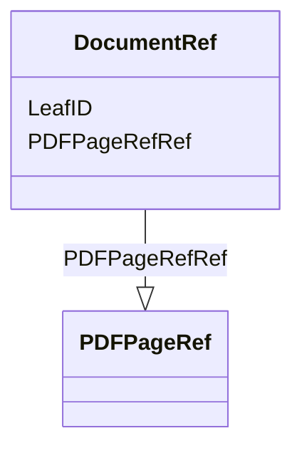

# Class: DocumentRef


_Links to a leaf element with the location of the document._


URI: [odm:DocumentRef](http://www.cdisc.org/ns/odm/v2.0/DocumentRef)





<!-- no inheritance hierarchy -->


## Slots

| Name | Cardinality and Range | Description | Inheritance |
| ---  | --- | --- | --- |
| [LeafID](LeafID.md) | 1..1 <br/> [Oid](Oid.md) | Reference to the unique ID of the Leaf element that contains the location of ... | direct |
| [PDFPageRefRef](PDFPageRefRef.md) | 0..* <br/> [PDFPageRef](PDFPageRef.md) | The PDFPageRef element is a container for page references in a PDF file | direct |


## Usages

| used by | used in | type | used |
| ---  | --- | --- | --- |
| [AnnotatedCRF](AnnotatedCRF.md) | [DocumentRefRef](DocumentRefRef.md) | range | [DocumentRef](DocumentRef.md) |
| [SupplementalDoc](SupplementalDoc.md) | [DocumentRefRef](DocumentRefRef.md) | range | [DocumentRef](DocumentRef.md) |
| [Origin](Origin.md) | [DocumentRefRef](DocumentRefRef.md) | range | [DocumentRef](DocumentRef.md) |
| [MethodDef](MethodDef.md) | [DocumentRefRef](DocumentRefRef.md) | range | [DocumentRef](DocumentRef.md) |
| [CommentDef](CommentDef.md) | [DocumentRefRef](DocumentRefRef.md) | range | [DocumentRef](DocumentRef.md) |


## See Also

* [https://wiki.cdisc.org/display/ODM2/DocumentRef](https://wiki.cdisc.org/display/ODM2/DocumentRef)

## Identifier and Mapping Information


### Schema Source


* from schema: http://www.cdisc.org/ns/odm/v2.0


## Mappings

| Mapping Type | Mapped Value |
| ---  | ---  |
| self | odm:DocumentRef |
| native | odm:DocumentRef |


## LinkML Source

<!-- TODO: investigate https://stackoverflow.com/questions/37606292/how-to-create-tabbed-code-blocks-in-mkdocs-or-sphinx -->

### Direct

<details>
```yaml
name: DocumentRef
description: Links to a leaf element with the location of the document.
from_schema: http://www.cdisc.org/ns/odm/v2.0
see_also:
- https://wiki.cdisc.org/display/ODM2/DocumentRef
slots:
- LeafID
- PDFPageRefRef
slot_usage:
  LeafID:
    name: LeafID
    description: Reference to the unique ID of the Leaf element that contains the
      location of a file containing a document.
    comments:
    - 'Required

      enum values:t ext'
    domain_of:
    - DocumentRef
    range: oid
    required: true
  PDFPageRefRef:
    name: PDFPageRefRef
    description: The PDFPageRef element is a container for page references in a PDF
      file.
    multivalued: true
    domain_of:
    - DocumentRef
    range: PDFPageRef
    inlined: true
    inlined_as_list: true
class_uri: odm:DocumentRef

```
</details>

### Induced

<details>
```yaml
name: DocumentRef
description: Links to a leaf element with the location of the document.
from_schema: http://www.cdisc.org/ns/odm/v2.0
see_also:
- https://wiki.cdisc.org/display/ODM2/DocumentRef
slot_usage:
  LeafID:
    name: LeafID
    description: Reference to the unique ID of the Leaf element that contains the
      location of a file containing a document.
    comments:
    - 'Required

      enum values:t ext'
    domain_of:
    - DocumentRef
    range: oid
    required: true
  PDFPageRefRef:
    name: PDFPageRefRef
    description: The PDFPageRef element is a container for page references in a PDF
      file.
    multivalued: true
    domain_of:
    - DocumentRef
    range: PDFPageRef
    inlined: true
    inlined_as_list: true
attributes:
  LeafID:
    name: LeafID
    description: Reference to the unique ID of the Leaf element that contains the
      location of a file containing a document.
    comments:
    - 'Required

      enum values:t ext'
    from_schema: http://www.cdisc.org/ns/odm/v2.0
    rank: 1000
    alias: LeafID
    owner: DocumentRef
    domain_of:
    - DocumentRef
    range: oid
    required: true
  PDFPageRefRef:
    name: PDFPageRefRef
    description: The PDFPageRef element is a container for page references in a PDF
      file.
    from_schema: http://www.cdisc.org/ns/odm/v2.0
    rank: 1000
    multivalued: true
    identifier: false
    alias: PDFPageRefRef
    owner: DocumentRef
    domain_of:
    - DocumentRef
    range: PDFPageRef
    inlined: true
    inlined_as_list: true
class_uri: odm:DocumentRef

```
</details>