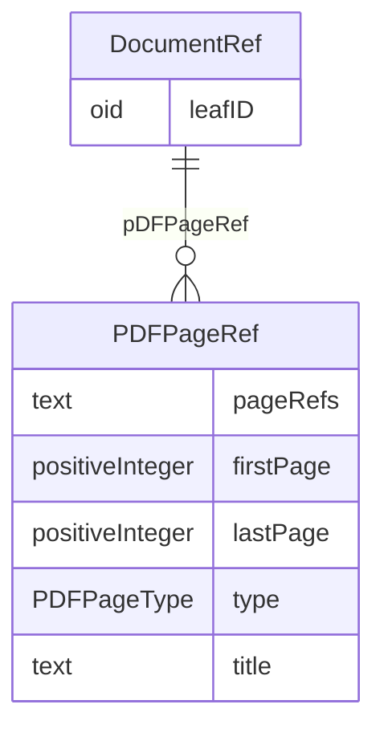

# Class: DocumentRef

_Links to a leaf element with the location of the document._


URI: [odm:DocumentRef](http://www.cdisc.org/ns/odm/v2.0/DocumentRef)





<!-- no inheritance hierarchy -->


## Slots

| Name | Cardinality* and Range | Description | Inheritance |
| ---  | --- | --- | --- |
| [leafID](leafID.md) | 1..1 <br/> [oid](oid.md) | Reference to the unique ID of the Leaf element that contains the location of ... | direct |
| [pDFPageRef](pDFPageRef.md) | 0..* <br/> [PDFPageRef](PDFPageRef.md) | The PDFPageRef element is a container for page references in a PDF file. | direct |

_* See [LinkML documentation](https://linkml.io/linkml/schemas/slots.html#slot-cardinality) for cardinality definitions._


## Usages

| used by | used in | type | used |
| ---  | --- | --- | --- |
| [AnnotatedCRF](AnnotatedCRF.md) | [documentRef](documentRef.md) | range | [DocumentRef](DocumentRef.md) |
| [SupplementalDoc](SupplementalDoc.md) | [documentRef](documentRef.md) | range | [DocumentRef](DocumentRef.md) |
| [Origin](Origin.md) | [documentRef](documentRef.md) | range | [DocumentRef](DocumentRef.md) |
| [MethodDef](MethodDef.md) | [documentRef](documentRef.md) | range | [DocumentRef](DocumentRef.md) |
| [CommentDef](CommentDef.md) | [documentRef](documentRef.md) | range | [DocumentRef](DocumentRef.md) |


## See Also

* [https://wiki.cdisc.org/display/PUB/DocumentRef](https://wiki.cdisc.org/display/PUB/DocumentRef)

## Identifier and Mapping Information


### Schema Source


* from schema: http://www.cdisc.org/ns/odm/v2.0


## Mappings

| Mapping Type | Mapped Value |
| ---  | ---  |
| self | odm:DocumentRef |
| native | odm:DocumentRef |


## LinkML Source

<!-- TODO: investigate https://stackoverflow.com/questions/37606292/how-to-create-tabbed-code-blocks-in-mkdocs-or-sphinx -->

### Direct

<details>
```yaml
name: DocumentRef
description: Links to a leaf element with the location of the document.
from_schema: http://www.cdisc.org/ns/odm/v2.0
see_also:
- https://wiki.cdisc.org/display/PUB/DocumentRef
rank: 1000
slots:
- leafID
- pDFPageRef
slot_usage:
  leafID:
    name: leafID
    description: Reference to the unique ID of the Leaf element that contains the
      location of a file containing a document.
    comments:
    - 'Required

      range: text'
    domain_of:
    - DocumentRef
    - SourceItem
    range: oid
    required: true
  pDFPageRef:
    name: pDFPageRef
    description: The PDFPageRef element is a container for page references in a PDF
      file.
    multivalued: true
    domain_of:
    - DocumentRef
    range: PDFPageRef
    inlined: true
    inlined_as_list: true
class_uri: odm:DocumentRef

```
</details>

### Induced

<details>
```yaml
name: DocumentRef
description: Links to a leaf element with the location of the document.
from_schema: http://www.cdisc.org/ns/odm/v2.0
see_also:
- https://wiki.cdisc.org/display/PUB/DocumentRef
rank: 1000
slot_usage:
  leafID:
    name: leafID
    description: Reference to the unique ID of the Leaf element that contains the
      location of a file containing a document.
    comments:
    - 'Required

      range: text'
    domain_of:
    - DocumentRef
    - SourceItem
    range: oid
    required: true
  pDFPageRef:
    name: pDFPageRef
    description: The PDFPageRef element is a container for page references in a PDF
      file.
    multivalued: true
    domain_of:
    - DocumentRef
    range: PDFPageRef
    inlined: true
    inlined_as_list: true
attributes:
  leafID:
    name: leafID
    description: Reference to the unique ID of the Leaf element that contains the
      location of a file containing a document.
    comments:
    - 'Required

      range: text'
    from_schema: http://www.cdisc.org/ns/odm/v2.0
    rank: 1000
    alias: leafID
    owner: DocumentRef
    domain_of:
    - DocumentRef
    - SourceItem
    range: oid
    required: true
  pDFPageRef:
    name: pDFPageRef
    description: The PDFPageRef element is a container for page references in a PDF
      file.
    from_schema: http://www.cdisc.org/ns/odm/v2.0
    rank: 1000
    multivalued: true
    identifier: false
    alias: pDFPageRef
    owner: DocumentRef
    domain_of:
    - DocumentRef
    range: PDFPageRef
    inlined: true
    inlined_as_list: true
class_uri: odm:DocumentRef

```
</details>