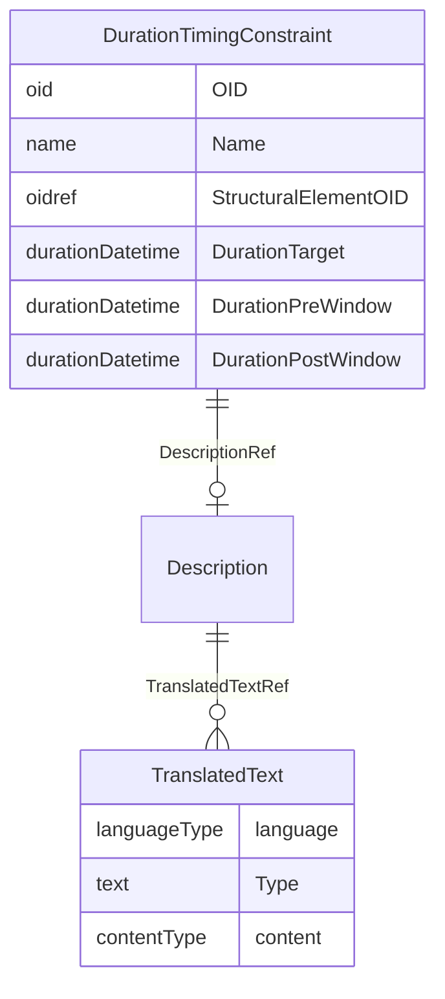

# Class: DurationTimingConstraint

_The DurationTimingConstraint constrains the duration of an activity represented by a study, epoch, StudyEventGroupDef, StudyEventDef, ItemGroupDef, or ItemDef. It is used to constrain the duration of the visit, activity, or any other structural element._


URI: [odm:DurationTimingConstraint](http://www.cdisc.org/ns/odm/v2.0/DurationTimingConstraint)





<!-- no inheritance hierarchy -->


## Slots

| Name | Cardinality* and Range | Description | Inheritance |
| ---  | --- | --- | --- |
| [OID](OID.md) | 1..1 <br/> [oid](oid.md) | Unique identifier. | direct |
| [Name](Name.md) | 1..1 <br/> [name](name.md) | Human readable name for the DurationTimingConstraint. | direct |
| [StructuralElementOID](StructuralElementOID.md) | 1..1 <br/> [oidref](oidref.md) | OID of a structural element such as a Study, Epoch, StudyEventGroup, StudyEve... | direct |
| [DurationTarget](DurationTarget.md) | 1..1 <br/> [durationDatetime](durationDatetime.md) | Constrains the duration of an activity represented by a Study, Epoch, StudyEv... | direct |
| [DurationPreWindow](DurationPreWindow.md) | 0..1 <br/> [durationDatetime](durationDatetime.md) | Defines the amount of time by which the targetted duration may be reduced. | direct |
| [DurationPostWindow](DurationPostWindow.md) | 0..1 <br/> [durationDatetime](durationDatetime.md) | Defines the amount of time by which the targetted duration may be increased. | direct |
| [DescriptionRef](DescriptionRef.md) | 0..1 <br/> [Description](Description.md) | Description reference: A free-text description of the containing metadata com... | direct |

_* See [LinkML documentation](https://linkml.io/linkml/schemas/slots.html#slot-cardinality) for cardinality definitions._


## Usages

| used by | used in | type | used |
| ---  | --- | --- | --- |
| [StudyTiming](StudyTiming.md) | [DurationTimingConstraintRef](DurationTimingConstraintRef.md) | range | [DurationTimingConstraint](DurationTimingConstraint.md) |


## See Also

* [https://wiki.cdisc.org/display/PUB/DurationTimingConstraint](https://wiki.cdisc.org/display/PUB/DurationTimingConstraint)

## Identifier and Mapping Information


### Schema Source


* from schema: http://www.cdisc.org/ns/odm/v2.0


## Mappings

| Mapping Type | Mapped Value |
| ---  | ---  |
| self | odm:DurationTimingConstraint |
| native | odm:DurationTimingConstraint |


## LinkML Source

<!-- TODO: investigate https://stackoverflow.com/questions/37606292/how-to-create-tabbed-code-blocks-in-mkdocs-or-sphinx -->

### Direct

<details>
```yaml
name: DurationTimingConstraint
description: The DurationTimingConstraint constrains the duration of an activity represented
  by a study, epoch, StudyEventGroupDef, StudyEventDef, ItemGroupDef, or ItemDef.
  It is used to constrain the duration of the visit, activity, or any other structural
  element.
from_schema: http://www.cdisc.org/ns/odm/v2.0
see_also:
- https://wiki.cdisc.org/display/PUB/DurationTimingConstraint
rank: 1000
slots:
- OID
- Name
- StructuralElementOID
- DurationTarget
- DurationPreWindow
- DurationPostWindow
- DescriptionRef
slot_usage:
  OID:
    name: OID
    description: Unique identifier.
    comments:
    - 'Required

      range: oid

      Must be unique within the Study.'
    domain_of:
    - Study
    - MetaDataVersion
    - Standard
    - ValueListDef
    - WhereClauseDef
    - StudyEventGroupDef
    - StudyEventDef
    - ItemGroupDef
    - ItemDef
    - CodeList
    - MethodDef
    - ConditionDef
    - CommentDef
    - StudyIndication
    - StudyIntervention
    - StudyObjective
    - StudyEndPoint
    - StudyTargetPopulation
    - StudyEstimand
    - Arm
    - Epoch
    - StudyParameter
    - StudyTiming
    - TransitionTimingConstraint
    - AbsoluteTimingConstraint
    - RelativeTimingConstraint
    - DurationTimingConstraint
    - WorkflowDef
    - Transition
    - Branching
    - Criterion
    - User
    - Organization
    - Location
    - SignatureDef
    - Query
    range: oid
    required: true
  Name:
    name: Name
    description: Human readable name for the DurationTimingConstraint.
    comments:
    - 'Required

      range: name

      Must be unique within the set of timing constraints for the Study.'
    domain_of:
    - Alias
    - MetaDataVersion
    - Standard
    - StudyEventGroupDef
    - StudyEventDef
    - ItemGroupDef
    - Class
    - SubClass
    - SourceItem
    - Resource
    - ItemDef
    - CodeList
    - MethodDef
    - Parameter
    - ReturnValue
    - ConditionDef
    - StudyObjective
    - StudyEndPoint
    - StudyTargetPopulation
    - StudyEstimand
    - Arm
    - Epoch
    - StudyTiming
    - TransitionTimingConstraint
    - AbsoluteTimingConstraint
    - RelativeTimingConstraint
    - DurationTimingConstraint
    - WorkflowDef
    - Transition
    - Branching
    - Criterion
    - Organization
    - Location
    - Query
    range: name
    required: true
  StructuralElementOID:
    name: StructuralElementOID
    description: OID of a structural element such as a Study, Epoch, StudyEventGroup,
      StudyEvent, ItemGroup, Item
    comments:
    - 'Required

      range: oidref

      Must match the OID for Study, Epoch, StudyEventGroupDef, StudyEventDef, ItemGroupDef
      or ItemDef. element.'
    domain_of:
    - DurationTimingConstraint
    range: oidref
    required: true
  DurationTarget:
    name: DurationTarget
    description: Constrains the duration of an activity represented by a Study, Epoch,
      StudyEventGroupDef, StudyEventDef, ItemGroupDef or ItemDef. Specifies the planned
      duration of the referenced structural element.
    comments:
    - 'Required

      range: durationDatetime

      Must be a non-negative ISO 8601 duration.'
    domain_of:
    - DurationTimingConstraint
    range: durationDatetime
    required: true
  DurationPreWindow:
    name: DurationPreWindow
    description: Defines the amount of time by which the targetted duration may be
      reduced.
    comments:
    - 'Optional

      range: durationDatetime

      Must be a non-negative ISO 8601 duration.'
    domain_of:
    - DurationTimingConstraint
    range: durationDatetime
  DurationPostWindow:
    name: DurationPostWindow
    description: Defines the amount of time by which the targetted duration may be
      increased.
    comments:
    - 'Optional

      range: durationDatetime

      Must be a non-negative ISO 8601 duration.'
    domain_of:
    - DurationTimingConstraint
    range: durationDatetime
  DescriptionRef:
    name: DescriptionRef
    domain_of:
    - Study
    - MetaDataVersion
    - ValueListDef
    - StudyEventGroupRef
    - StudyEventGroupDef
    - StudyEventDef
    - ItemGroupDef
    - Origin
    - ItemDef
    - CodeList
    - CodeListItem
    - MethodDef
    - ConditionDef
    - CommentDef
    - Protocol
    - StudyStructure
    - TrialPhase
    - StudyIndication
    - StudyIntervention
    - StudyObjective
    - StudyEndPoint
    - StudyTargetPopulation
    - StudyEstimand
    - IntercurrentEvent
    - SummaryMeasure
    - Arm
    - Epoch
    - TransitionTimingConstraint
    - AbsoluteTimingConstraint
    - RelativeTimingConstraint
    - DurationTimingConstraint
    - WorkflowDef
    - Criterion
    - Organization
    - Location
    - ODMFileMetadata
    range: Description
    maximum_cardinality: 1
class_uri: odm:DurationTimingConstraint

```
</details>

### Induced

<details>
```yaml
name: DurationTimingConstraint
description: The DurationTimingConstraint constrains the duration of an activity represented
  by a study, epoch, StudyEventGroupDef, StudyEventDef, ItemGroupDef, or ItemDef.
  It is used to constrain the duration of the visit, activity, or any other structural
  element.
from_schema: http://www.cdisc.org/ns/odm/v2.0
see_also:
- https://wiki.cdisc.org/display/PUB/DurationTimingConstraint
rank: 1000
slot_usage:
  OID:
    name: OID
    description: Unique identifier.
    comments:
    - 'Required

      range: oid

      Must be unique within the Study.'
    domain_of:
    - Study
    - MetaDataVersion
    - Standard
    - ValueListDef
    - WhereClauseDef
    - StudyEventGroupDef
    - StudyEventDef
    - ItemGroupDef
    - ItemDef
    - CodeList
    - MethodDef
    - ConditionDef
    - CommentDef
    - StudyIndication
    - StudyIntervention
    - StudyObjective
    - StudyEndPoint
    - StudyTargetPopulation
    - StudyEstimand
    - Arm
    - Epoch
    - StudyParameter
    - StudyTiming
    - TransitionTimingConstraint
    - AbsoluteTimingConstraint
    - RelativeTimingConstraint
    - DurationTimingConstraint
    - WorkflowDef
    - Transition
    - Branching
    - Criterion
    - User
    - Organization
    - Location
    - SignatureDef
    - Query
    range: oid
    required: true
  Name:
    name: Name
    description: Human readable name for the DurationTimingConstraint.
    comments:
    - 'Required

      range: name

      Must be unique within the set of timing constraints for the Study.'
    domain_of:
    - Alias
    - MetaDataVersion
    - Standard
    - StudyEventGroupDef
    - StudyEventDef
    - ItemGroupDef
    - Class
    - SubClass
    - SourceItem
    - Resource
    - ItemDef
    - CodeList
    - MethodDef
    - Parameter
    - ReturnValue
    - ConditionDef
    - StudyObjective
    - StudyEndPoint
    - StudyTargetPopulation
    - StudyEstimand
    - Arm
    - Epoch
    - StudyTiming
    - TransitionTimingConstraint
    - AbsoluteTimingConstraint
    - RelativeTimingConstraint
    - DurationTimingConstraint
    - WorkflowDef
    - Transition
    - Branching
    - Criterion
    - Organization
    - Location
    - Query
    range: name
    required: true
  StructuralElementOID:
    name: StructuralElementOID
    description: OID of a structural element such as a Study, Epoch, StudyEventGroup,
      StudyEvent, ItemGroup, Item
    comments:
    - 'Required

      range: oidref

      Must match the OID for Study, Epoch, StudyEventGroupDef, StudyEventDef, ItemGroupDef
      or ItemDef. element.'
    domain_of:
    - DurationTimingConstraint
    range: oidref
    required: true
  DurationTarget:
    name: DurationTarget
    description: Constrains the duration of an activity represented by a Study, Epoch,
      StudyEventGroupDef, StudyEventDef, ItemGroupDef or ItemDef. Specifies the planned
      duration of the referenced structural element.
    comments:
    - 'Required

      range: durationDatetime

      Must be a non-negative ISO 8601 duration.'
    domain_of:
    - DurationTimingConstraint
    range: durationDatetime
    required: true
  DurationPreWindow:
    name: DurationPreWindow
    description: Defines the amount of time by which the targetted duration may be
      reduced.
    comments:
    - 'Optional

      range: durationDatetime

      Must be a non-negative ISO 8601 duration.'
    domain_of:
    - DurationTimingConstraint
    range: durationDatetime
  DurationPostWindow:
    name: DurationPostWindow
    description: Defines the amount of time by which the targetted duration may be
      increased.
    comments:
    - 'Optional

      range: durationDatetime

      Must be a non-negative ISO 8601 duration.'
    domain_of:
    - DurationTimingConstraint
    range: durationDatetime
  DescriptionRef:
    name: DescriptionRef
    domain_of:
    - Study
    - MetaDataVersion
    - ValueListDef
    - StudyEventGroupRef
    - StudyEventGroupDef
    - StudyEventDef
    - ItemGroupDef
    - Origin
    - ItemDef
    - CodeList
    - CodeListItem
    - MethodDef
    - ConditionDef
    - CommentDef
    - Protocol
    - StudyStructure
    - TrialPhase
    - StudyIndication
    - StudyIntervention
    - StudyObjective
    - StudyEndPoint
    - StudyTargetPopulation
    - StudyEstimand
    - IntercurrentEvent
    - SummaryMeasure
    - Arm
    - Epoch
    - TransitionTimingConstraint
    - AbsoluteTimingConstraint
    - RelativeTimingConstraint
    - DurationTimingConstraint
    - WorkflowDef
    - Criterion
    - Organization
    - Location
    - ODMFileMetadata
    range: Description
    maximum_cardinality: 1
attributes:
  OID:
    name: OID
    description: Unique identifier.
    comments:
    - 'Required

      range: oid

      Must be unique within the Study.'
    from_schema: http://www.cdisc.org/ns/odm/v2.0
    rank: 1000
    identifier: true
    alias: OID
    owner: DurationTimingConstraint
    domain_of:
    - Study
    - MetaDataVersion
    - Standard
    - ValueListDef
    - WhereClauseDef
    - StudyEventGroupDef
    - StudyEventDef
    - ItemGroupDef
    - ItemDef
    - CodeList
    - MethodDef
    - ConditionDef
    - CommentDef
    - StudyIndication
    - StudyIntervention
    - StudyObjective
    - StudyEndPoint
    - StudyTargetPopulation
    - StudyEstimand
    - Arm
    - Epoch
    - StudyParameter
    - StudyTiming
    - TransitionTimingConstraint
    - AbsoluteTimingConstraint
    - RelativeTimingConstraint
    - DurationTimingConstraint
    - WorkflowDef
    - Transition
    - Branching
    - Criterion
    - User
    - Organization
    - Location
    - SignatureDef
    - Query
    range: oid
    required: true
  Name:
    name: Name
    description: Human readable name for the DurationTimingConstraint.
    comments:
    - 'Required

      range: name

      Must be unique within the set of timing constraints for the Study.'
    from_schema: http://www.cdisc.org/ns/odm/v2.0
    rank: 1000
    alias: Name
    owner: DurationTimingConstraint
    domain_of:
    - Alias
    - MetaDataVersion
    - Standard
    - StudyEventGroupDef
    - StudyEventDef
    - ItemGroupDef
    - Class
    - SubClass
    - SourceItem
    - Resource
    - ItemDef
    - CodeList
    - MethodDef
    - Parameter
    - ReturnValue
    - ConditionDef
    - StudyObjective
    - StudyEndPoint
    - StudyTargetPopulation
    - StudyEstimand
    - Arm
    - Epoch
    - StudyTiming
    - TransitionTimingConstraint
    - AbsoluteTimingConstraint
    - RelativeTimingConstraint
    - DurationTimingConstraint
    - WorkflowDef
    - Transition
    - Branching
    - Criterion
    - Organization
    - Location
    - Query
    range: name
    required: true
  StructuralElementOID:
    name: StructuralElementOID
    description: OID of a structural element such as a Study, Epoch, StudyEventGroup,
      StudyEvent, ItemGroup, Item
    comments:
    - 'Required

      range: oidref

      Must match the OID for Study, Epoch, StudyEventGroupDef, StudyEventDef, ItemGroupDef
      or ItemDef. element.'
    from_schema: http://www.cdisc.org/ns/odm/v2.0
    rank: 1000
    alias: StructuralElementOID
    owner: DurationTimingConstraint
    domain_of:
    - DurationTimingConstraint
    range: oidref
    required: true
  DurationTarget:
    name: DurationTarget
    description: Constrains the duration of an activity represented by a Study, Epoch,
      StudyEventGroupDef, StudyEventDef, ItemGroupDef or ItemDef. Specifies the planned
      duration of the referenced structural element.
    comments:
    - 'Required

      range: durationDatetime

      Must be a non-negative ISO 8601 duration.'
    from_schema: http://www.cdisc.org/ns/odm/v2.0
    rank: 1000
    alias: DurationTarget
    owner: DurationTimingConstraint
    domain_of:
    - DurationTimingConstraint
    range: durationDatetime
    required: true
  DurationPreWindow:
    name: DurationPreWindow
    description: Defines the amount of time by which the targetted duration may be
      reduced.
    comments:
    - 'Optional

      range: durationDatetime

      Must be a non-negative ISO 8601 duration.'
    from_schema: http://www.cdisc.org/ns/odm/v2.0
    rank: 1000
    alias: DurationPreWindow
    owner: DurationTimingConstraint
    domain_of:
    - DurationTimingConstraint
    range: durationDatetime
  DurationPostWindow:
    name: DurationPostWindow
    description: Defines the amount of time by which the targetted duration may be
      increased.
    comments:
    - 'Optional

      range: durationDatetime

      Must be a non-negative ISO 8601 duration.'
    from_schema: http://www.cdisc.org/ns/odm/v2.0
    rank: 1000
    alias: DurationPostWindow
    owner: DurationTimingConstraint
    domain_of:
    - DurationTimingConstraint
    range: durationDatetime
  DescriptionRef:
    name: DescriptionRef
    description: 'Description reference: A free-text description of the containing
      metadata component, unless restricted by Business Rules.'
    from_schema: http://www.cdisc.org/ns/odm/v2.0
    rank: 1000
    identifier: false
    alias: DescriptionRef
    owner: DurationTimingConstraint
    domain_of:
    - Study
    - MetaDataVersion
    - ValueListDef
    - StudyEventGroupRef
    - StudyEventGroupDef
    - StudyEventDef
    - ItemGroupDef
    - Origin
    - ItemDef
    - CodeList
    - CodeListItem
    - MethodDef
    - ConditionDef
    - CommentDef
    - Protocol
    - StudyStructure
    - TrialPhase
    - StudyIndication
    - StudyIntervention
    - StudyObjective
    - StudyEndPoint
    - StudyTargetPopulation
    - StudyEstimand
    - IntercurrentEvent
    - SummaryMeasure
    - Arm
    - Epoch
    - TransitionTimingConstraint
    - AbsoluteTimingConstraint
    - RelativeTimingConstraint
    - DurationTimingConstraint
    - WorkflowDef
    - Criterion
    - Organization
    - Location
    - ODMFileMetadata
    range: Description
    maximum_cardinality: 1
class_uri: odm:DurationTimingConstraint

```
</details>