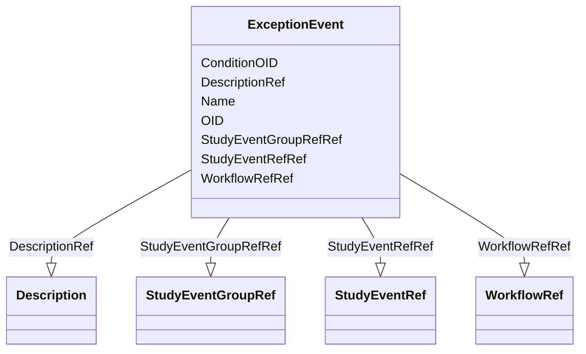

# Class: ExceptionEvent


_An ExceptionEvent describes an event that occurs suddenly in a study and that was not planned as part of the normal workflow of the study. Examples are adverse events, death of a subject not caused by an adverse event, etc._


URI: [odm:ExceptionEvent](http://www.cdisc.org/ns/odm/v2.0/ExceptionEvent)





<!-- no inheritance hierarchy -->


## Slots

| Name | Cardinality and Range | Description | Inheritance |
| ---  | --- | --- | --- |
| [OID](OID.md) | 1..1 <br/> [oid](oid.md) | Unique identifier of the version within the XML document. | direct |
| [Name](Name.md) | 1..1 <br/> [name](name.md) | General observation Sub Class. | direct |
| [ConditionOID](ConditionOID.md) | 0..1 <br/> [oidref](oidref.md) | Reference to a ConditionDef defining the condition under which the transition... | direct |
| [DescriptionRef](DescriptionRef.md) | 0..1 <br/> [Description](Description.md) | Description reference: A free-text description of the containing metadata com... | direct |
| [WorkflowRefRef](WorkflowRefRef.md) | 1..1 <br/> [WorkflowRef](WorkflowRef.md) | WorkflowRef reference: The WorkflowRef references a workflow definition | direct |
| [StudyEventGroupRefRef](StudyEventGroupRefRef.md) | 1..1 <br/> [StudyEventGroupRef](StudyEventGroupRef.md) | StudyEventGroupRef reference: This element references a StudyEventGroupDef as... | direct |
| [StudyEventRefRef](StudyEventRefRef.md) | 1..1 <br/> [StudyEventRef](StudyEventRef.md) | StudyEventRef reference: This element references a StudyEventDef as it occurs... | direct |


## See Also

* [https://wiki.cdisc.org/display/ODM2/ExceptionEvent](https://wiki.cdisc.org/display/ODM2/ExceptionEvent)

## Identifier and Mapping Information


### Schema Source


* from schema: http://www.cdisc.org/ns/odm/v2.0


## Mappings

| Mapping Type | Mapped Value |
| ---  | ---  |
| self | odm:ExceptionEvent |
| native | odm:ExceptionEvent |


## LinkML Source

<!-- TODO: investigate https://stackoverflow.com/questions/37606292/how-to-create-tabbed-code-blocks-in-mkdocs-or-sphinx -->

### Direct

<details>
```yaml
name: ExceptionEvent
description: An ExceptionEvent describes an event that occurs suddenly in a study
  and that was not planned as part of the normal workflow of the study. Examples are
  adverse events, death of a subject not caused by an adverse event, etc.
from_schema: http://www.cdisc.org/ns/odm/v2.0
see_also:
- https://wiki.cdisc.org/display/ODM2/ExceptionEvent
slots:
- OID
- Name
- ConditionOID
- DescriptionRef
- WorkflowRefRef
- StudyEventGroupRefRef
- StudyEventRefRef
slot_usage:
  OID:
    name: OID
    domain_of:
    - Study
    - MetaDataVersion
    - Standard
    - ValueListDef
    - WhereClauseDef
    - StudyEventGroupDef
    - StudyEventDef
    - ItemGroupDef
    - ItemDef
    - CodeList
    - MethodDef
    - ConditionDef
    - CommentDef
    - StudyIndication
    - StudyIntervention
    - StudyObjective
    - StudyEndPoint
    - StudyTargetPopulation
    - StudyEstimand
    - Arm
    - Epoch
    - StudyParameter
    - StudyTiming
    - TransitionTimingConstraint
    - AbsoluteTimingConstraint
    - RelativeTimingConstraint
    - DurationTimingConstraint
    - WorkflowDef
    - Transition
    - Branching
    - Criterion
    - ExceptionEvent
    - User
    - Organization
    - Location
    - SignatureDef
    - Query
    range: oid
    required: true
  Name:
    name: Name
    domain_of:
    - Alias
    - MetaDataVersion
    - Standard
    - StudyEventGroupDef
    - StudyEventDef
    - ItemGroupDef
    - Class
    - SubClass
    - SourceItem
    - Resource
    - ItemDef
    - CodeList
    - MethodDef
    - Parameter
    - ReturnValue
    - ConditionDef
    - StudyObjective
    - StudyEndPoint
    - StudyTargetPopulation
    - StudyEstimand
    - Arm
    - Epoch
    - StudyTiming
    - TransitionTimingConstraint
    - AbsoluteTimingConstraint
    - RelativeTimingConstraint
    - DurationTimingConstraint
    - WorkflowDef
    - Transition
    - Branching
    - Criterion
    - ExceptionEvent
    - Organization
    - Location
    - Query
    range: name
    required: true
  ConditionOID:
    name: ConditionOID
    domain_of:
    - TargetTransition
    - Criterion
    - ExceptionEvent
    range: oidref
  DescriptionRef:
    name: DescriptionRef
    domain_of:
    - Study
    - MetaDataVersion
    - ValueListDef
    - StudyEventGroupRef
    - StudyEventGroupDef
    - StudyEventDef
    - ItemGroupDef
    - Origin
    - ItemDef
    - CodeList
    - CodeListItem
    - MethodDef
    - ConditionDef
    - CommentDef
    - Protocol
    - StudyStructure
    - TrialPhase
    - StudyIndication
    - StudyIntervention
    - StudyObjective
    - StudyEndPoint
    - StudyTargetPopulation
    - StudyEstimand
    - IntercurrentEvent
    - SummaryMeasure
    - Arm
    - Epoch
    - TransitionTimingConstraint
    - AbsoluteTimingConstraint
    - RelativeTimingConstraint
    - DurationTimingConstraint
    - WorkflowDef
    - Criterion
    - ExceptionEvent
    - Organization
    - Location
    - ODMFileMetadata
    range: Description
    maximum_cardinality: 1
  WorkflowRefRef:
    name: WorkflowRefRef
    domain_of:
    - StudyEventGroupDef
    - StudyEventDef
    - ItemGroupDef
    - Protocol
    - StudyStructure
    - Arm
    - ExceptionEvent
    range: WorkflowRef
    required: true
    minimum_cardinality: 1
    maximum_cardinality: 1
  StudyEventGroupRefRef:
    name: StudyEventGroupRefRef
    domain_of:
    - StudyEventGroupDef
    - Protocol
    - ExceptionEvent
    range: StudyEventGroupRef
    required: true
    minimum_cardinality: 1
    maximum_cardinality: 1
  StudyEventRefRef:
    name: StudyEventRefRef
    domain_of:
    - StudyEventGroupDef
    - ExceptionEvent
    range: StudyEventRef
    required: true
    minimum_cardinality: 1
    maximum_cardinality: 1
class_uri: odm:ExceptionEvent

```
</details>

### Induced

<details>
```yaml
name: ExceptionEvent
description: An ExceptionEvent describes an event that occurs suddenly in a study
  and that was not planned as part of the normal workflow of the study. Examples are
  adverse events, death of a subject not caused by an adverse event, etc.
from_schema: http://www.cdisc.org/ns/odm/v2.0
see_also:
- https://wiki.cdisc.org/display/ODM2/ExceptionEvent
slot_usage:
  OID:
    name: OID
    domain_of:
    - Study
    - MetaDataVersion
    - Standard
    - ValueListDef
    - WhereClauseDef
    - StudyEventGroupDef
    - StudyEventDef
    - ItemGroupDef
    - ItemDef
    - CodeList
    - MethodDef
    - ConditionDef
    - CommentDef
    - StudyIndication
    - StudyIntervention
    - StudyObjective
    - StudyEndPoint
    - StudyTargetPopulation
    - StudyEstimand
    - Arm
    - Epoch
    - StudyParameter
    - StudyTiming
    - TransitionTimingConstraint
    - AbsoluteTimingConstraint
    - RelativeTimingConstraint
    - DurationTimingConstraint
    - WorkflowDef
    - Transition
    - Branching
    - Criterion
    - ExceptionEvent
    - User
    - Organization
    - Location
    - SignatureDef
    - Query
    range: oid
    required: true
  Name:
    name: Name
    domain_of:
    - Alias
    - MetaDataVersion
    - Standard
    - StudyEventGroupDef
    - StudyEventDef
    - ItemGroupDef
    - Class
    - SubClass
    - SourceItem
    - Resource
    - ItemDef
    - CodeList
    - MethodDef
    - Parameter
    - ReturnValue
    - ConditionDef
    - StudyObjective
    - StudyEndPoint
    - StudyTargetPopulation
    - StudyEstimand
    - Arm
    - Epoch
    - StudyTiming
    - TransitionTimingConstraint
    - AbsoluteTimingConstraint
    - RelativeTimingConstraint
    - DurationTimingConstraint
    - WorkflowDef
    - Transition
    - Branching
    - Criterion
    - ExceptionEvent
    - Organization
    - Location
    - Query
    range: name
    required: true
  ConditionOID:
    name: ConditionOID
    domain_of:
    - TargetTransition
    - Criterion
    - ExceptionEvent
    range: oidref
  DescriptionRef:
    name: DescriptionRef
    domain_of:
    - Study
    - MetaDataVersion
    - ValueListDef
    - StudyEventGroupRef
    - StudyEventGroupDef
    - StudyEventDef
    - ItemGroupDef
    - Origin
    - ItemDef
    - CodeList
    - CodeListItem
    - MethodDef
    - ConditionDef
    - CommentDef
    - Protocol
    - StudyStructure
    - TrialPhase
    - StudyIndication
    - StudyIntervention
    - StudyObjective
    - StudyEndPoint
    - StudyTargetPopulation
    - StudyEstimand
    - IntercurrentEvent
    - SummaryMeasure
    - Arm
    - Epoch
    - TransitionTimingConstraint
    - AbsoluteTimingConstraint
    - RelativeTimingConstraint
    - DurationTimingConstraint
    - WorkflowDef
    - Criterion
    - ExceptionEvent
    - Organization
    - Location
    - ODMFileMetadata
    range: Description
    maximum_cardinality: 1
  WorkflowRefRef:
    name: WorkflowRefRef
    domain_of:
    - StudyEventGroupDef
    - StudyEventDef
    - ItemGroupDef
    - Protocol
    - StudyStructure
    - Arm
    - ExceptionEvent
    range: WorkflowRef
    required: true
    minimum_cardinality: 1
    maximum_cardinality: 1
  StudyEventGroupRefRef:
    name: StudyEventGroupRefRef
    domain_of:
    - StudyEventGroupDef
    - Protocol
    - ExceptionEvent
    range: StudyEventGroupRef
    required: true
    minimum_cardinality: 1
    maximum_cardinality: 1
  StudyEventRefRef:
    name: StudyEventRefRef
    domain_of:
    - StudyEventGroupDef
    - ExceptionEvent
    range: StudyEventRef
    required: true
    minimum_cardinality: 1
    maximum_cardinality: 1
attributes:
  OID:
    name: OID
    description: Unique identifier of the version within the XML document.
    from_schema: http://www.cdisc.org/ns/odm/v2.0
    rank: 1000
    identifier: true
    alias: OID
    owner: ExceptionEvent
    domain_of:
    - Study
    - MetaDataVersion
    - Standard
    - ValueListDef
    - WhereClauseDef
    - StudyEventGroupDef
    - StudyEventDef
    - ItemGroupDef
    - ItemDef
    - CodeList
    - MethodDef
    - ConditionDef
    - CommentDef
    - StudyIndication
    - StudyIntervention
    - StudyObjective
    - StudyEndPoint
    - StudyTargetPopulation
    - StudyEstimand
    - Arm
    - Epoch
    - StudyParameter
    - StudyTiming
    - TransitionTimingConstraint
    - AbsoluteTimingConstraint
    - RelativeTimingConstraint
    - DurationTimingConstraint
    - WorkflowDef
    - Transition
    - Branching
    - Criterion
    - ExceptionEvent
    - User
    - Organization
    - Location
    - SignatureDef
    - Query
    range: oid
    required: true
  Name:
    name: Name
    description: General observation Sub Class.
    from_schema: http://www.cdisc.org/ns/odm/v2.0
    rank: 1000
    alias: Name
    owner: ExceptionEvent
    domain_of:
    - Alias
    - MetaDataVersion
    - Standard
    - StudyEventGroupDef
    - StudyEventDef
    - ItemGroupDef
    - Class
    - SubClass
    - SourceItem
    - Resource
    - ItemDef
    - CodeList
    - MethodDef
    - Parameter
    - ReturnValue
    - ConditionDef
    - StudyObjective
    - StudyEndPoint
    - StudyTargetPopulation
    - StudyEstimand
    - Arm
    - Epoch
    - StudyTiming
    - TransitionTimingConstraint
    - AbsoluteTimingConstraint
    - RelativeTimingConstraint
    - DurationTimingConstraint
    - WorkflowDef
    - Transition
    - Branching
    - Criterion
    - ExceptionEvent
    - Organization
    - Location
    - Query
    range: name
    required: true
  ConditionOID:
    name: ConditionOID
    description: Reference to a ConditionDef defining the condition under which the
      transition must be executed
    from_schema: http://www.cdisc.org/ns/odm/v2.0
    rank: 1000
    alias: ConditionOID
    owner: ExceptionEvent
    domain_of:
    - TargetTransition
    - Criterion
    - ExceptionEvent
    range: oidref
  DescriptionRef:
    name: DescriptionRef
    description: 'Description reference: A free-text description of the containing
      metadata component, unless restricted by Business Rules.'
    from_schema: http://www.cdisc.org/ns/odm/v2.0
    rank: 1000
    identifier: false
    alias: DescriptionRef
    owner: ExceptionEvent
    domain_of:
    - Study
    - MetaDataVersion
    - ValueListDef
    - StudyEventGroupRef
    - StudyEventGroupDef
    - StudyEventDef
    - ItemGroupDef
    - Origin
    - ItemDef
    - CodeList
    - CodeListItem
    - MethodDef
    - ConditionDef
    - CommentDef
    - Protocol
    - StudyStructure
    - TrialPhase
    - StudyIndication
    - StudyIntervention
    - StudyObjective
    - StudyEndPoint
    - StudyTargetPopulation
    - StudyEstimand
    - IntercurrentEvent
    - SummaryMeasure
    - Arm
    - Epoch
    - TransitionTimingConstraint
    - AbsoluteTimingConstraint
    - RelativeTimingConstraint
    - DurationTimingConstraint
    - WorkflowDef
    - Criterion
    - ExceptionEvent
    - Organization
    - Location
    - ODMFileMetadata
    range: Description
    maximum_cardinality: 1
  WorkflowRefRef:
    name: WorkflowRefRef
    description: 'WorkflowRef reference: The WorkflowRef references a workflow definition'
    from_schema: http://www.cdisc.org/ns/odm/v2.0
    rank: 1000
    identifier: false
    alias: WorkflowRefRef
    owner: ExceptionEvent
    domain_of:
    - StudyEventGroupDef
    - StudyEventDef
    - ItemGroupDef
    - Protocol
    - StudyStructure
    - Arm
    - ExceptionEvent
    range: WorkflowRef
    required: true
    minimum_cardinality: 1
    maximum_cardinality: 1
  StudyEventGroupRefRef:
    name: StudyEventGroupRefRef
    description: 'StudyEventGroupRef reference: This element references a StudyEventGroupDef
      as it occurs within a specific version of a study. The list of StudyEventGroupRefs
      identifies the types of study group events that are allowed to occur within
      the study.'
    from_schema: http://www.cdisc.org/ns/odm/v2.0
    rank: 1000
    identifier: false
    alias: StudyEventGroupRefRef
    owner: ExceptionEvent
    domain_of:
    - StudyEventGroupDef
    - Protocol
    - ExceptionEvent
    range: StudyEventGroupRef
    required: true
    minimum_cardinality: 1
    maximum_cardinality: 1
  StudyEventRefRef:
    name: StudyEventRefRef
    description: 'StudyEventRef reference: This element references a StudyEventDef
      as it occurs within a specific version of a study. The list of StudyEventRefs
      identifies the types of study events that are allowed to occur within the study.'
    from_schema: http://www.cdisc.org/ns/odm/v2.0
    rank: 1000
    identifier: false
    alias: StudyEventRefRef
    owner: ExceptionEvent
    domain_of:
    - StudyEventGroupDef
    - ExceptionEvent
    range: StudyEventRef
    required: true
    minimum_cardinality: 1
    maximum_cardinality: 1
class_uri: odm:ExceptionEvent

```
</details>