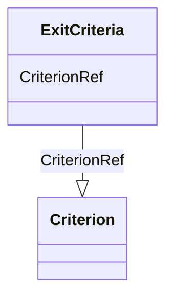

# Class: ExitCriteria


URI: [odm:ExitCriteria](http://www.cdisc.org/ns/odm/v2.0/ExitCriteria)





<!-- no inheritance hierarchy -->


## Slots

| Name | Cardinality and Range | Description | Inheritance |
| ---  | --- | --- | --- |
| [CriterionRef](CriterionRef.md) | 0..* <br/> [Criterion](Criterion.md) | Criterion reference: The Criterion represents either an inclusion or an exclu... | direct |


## See Also

* [https://wiki.cdisc.org/display/ODM2/ExitCriteria](https://wiki.cdisc.org/display/ODM2/ExitCriteria)

## Identifier and Mapping Information


### Schema Source


* from schema: http://www.cdisc.org/ns/odm/v2.0


## Mappings

| Mapping Type | Mapped Value |
| ---  | ---  |
| self | odm:ExitCriteria |
| native | odm:ExitCriteria |


## LinkML Source

<!-- TODO: investigate https://stackoverflow.com/questions/37606292/how-to-create-tabbed-code-blocks-in-mkdocs-or-sphinx -->

### Direct

<details>
```yaml
name: ExitCriteria
from_schema: http://www.cdisc.org/ns/odm/v2.0
see_also:
- https://wiki.cdisc.org/display/ODM2/ExitCriteria
slots:
- CriterionRef
slot_usage:
  CriterionRef:
    name: CriterionRef
    multivalued: true
    domain_of:
    - InclusionCriteria
    - ExclusionCriteria
    - EntryCriteria
    - ExitCriteria
    range: Criterion
    inlined: true
    inlined_as_list: true
class_uri: odm:ExitCriteria

```
</details>

### Induced

<details>
```yaml
name: ExitCriteria
from_schema: http://www.cdisc.org/ns/odm/v2.0
see_also:
- https://wiki.cdisc.org/display/ODM2/ExitCriteria
slot_usage:
  CriterionRef:
    name: CriterionRef
    multivalued: true
    domain_of:
    - InclusionCriteria
    - ExclusionCriteria
    - EntryCriteria
    - ExitCriteria
    range: Criterion
    inlined: true
    inlined_as_list: true
attributes:
  CriterionRef:
    name: CriterionRef
    description: 'Criterion reference: The Criterion represents either an inclusion
      or an exclusion criterion, depending on the parent element (i.e., InclusionCriteria,
      ExclusionCriteria).'
    from_schema: http://www.cdisc.org/ns/odm/v2.0
    rank: 1000
    multivalued: true
    identifier: false
    alias: CriterionRef
    owner: ExitCriteria
    domain_of:
    - InclusionCriteria
    - ExclusionCriteria
    - EntryCriteria
    - ExitCriteria
    range: Criterion
    inlined: true
    inlined_as_list: true
class_uri: odm:ExitCriteria

```
</details>