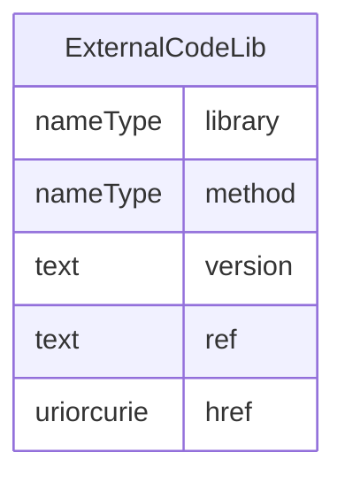

# Class: ExternalCodeLib

_The ExternalCodeLib element references a FormalExpression in an external code library, such as a file or GitHub. The intention is to make it possible to reference existing code libraries where the code is maintained as well as making it simpler to include longer, more complex FormalExpressions. The Library attribute provides the name of the external library, whereas ref or href provides a reference to the repository that can be used to retrieve the code. The Method attribute provides the name of the method in the file referenced for cases where multiple methods are provided in the source code file. The Version element provides the version of the external FormalExpression code referenced._


URI: [odm:ExternalCodeLib](http://www.cdisc.org/ns/odm/v2.0/ExternalCodeLib)





<!-- no inheritance hierarchy -->


## Slots

| Name | Cardinality* and Range | Description | Inheritance |
| ---  | --- | --- | --- |
| [library](library.md) | 1..1 <br/> [nameType](nameType.md) | The name of the external library containing the FormalExpression. | direct |
| [method](method.md) | 0..1 <br/> [nameType](nameType.md) | The name of the method or function that contains the FormalExpression code. | direct |
| [version](version.md) | 0..1 <br/> [text](text.md) | The version of the code contained in the external library. | direct |
| [ref](ref.md) | 0..1 <br/> [text](text.md) | Reference to a local instance (e.g. file) of the external library containing ... | direct |
| [href](href.md) | 0..1 <br/> [uriorcurie](uriorcurie.md) | URL of an external code external library such as GitHub or Bitbucket. | direct |

_* See [LinkML documentation](https://linkml.io/linkml/schemas/slots.html#slot-cardinality) for cardinality definitions._


## Usages

| used by | used in | type | used |
| ---  | --- | --- | --- |
| [FormalExpression](FormalExpression.md) | [externalCodeLib](externalCodeLib.md) | range | [ExternalCodeLib](ExternalCodeLib.md) |


## See Also

* [https://wiki.cdisc.org/display/PUB/ExternalCodeLib](https://wiki.cdisc.org/display/PUB/ExternalCodeLib)

## Identifier and Mapping Information


### Schema Source


* from schema: http://www.cdisc.org/ns/odm/v2.0


## Mappings

| Mapping Type | Mapped Value |
| ---  | ---  |
| self | odm:ExternalCodeLib |
| native | odm:ExternalCodeLib |


## LinkML Source

<!-- TODO: investigate https://stackoverflow.com/questions/37606292/how-to-create-tabbed-code-blocks-in-mkdocs-or-sphinx -->

### Direct

<details>
```yaml
name: ExternalCodeLib
description: The ExternalCodeLib element references a FormalExpression in an external
  code library, such as a file or GitHub. The intention is to make it possible to
  reference existing code libraries where the code is maintained as well as making
  it simpler to include longer, more complex FormalExpressions. The Library attribute
  provides the name of the external library, whereas ref or href provides a reference
  to the repository that can be used to retrieve the code. The Method attribute provides
  the name of the method in the file referenced for cases where multiple methods are
  provided in the source code file. The Version element provides the version of the
  external FormalExpression code referenced.
from_schema: http://www.cdisc.org/ns/odm/v2.0
see_also:
- https://wiki.cdisc.org/display/PUB/ExternalCodeLib
rank: 1000
slots:
- library
- method
- version
- ref
- href
slot_usage:
  library:
    name: library
    description: The name of the external library containing the FormalExpression.
    comments:
    - 'Required

      range: text'
    domain_of:
    - ExternalCodeLib
    range: nameType
    required: true
  method:
    name: method
    description: The name of the method or function that contains the FormalExpression
      code.
    comments:
    - 'Optional

      range: text'
    domain_of:
    - ExternalCodeLib
    range: nameType
  version:
    name: version
    description: The version of the code contained in the external library.
    comments:
    - 'Optional

      range: text'
    domain_of:
    - Standard
    - ExternalCodeLib
    range: text
  ref:
    name: ref
    description: Reference to a local instance (e.g. file) of the external library
      containing the FormalExpression code.
    comments:
    - 'Optional

      range: text'
    domain_of:
    - ExternalCodeLib
    - Coding
    range: text
  href:
    name: href
    description: URL of an external code external library such as GitHub or Bitbucket.
    comments:
    - 'Optional

      range: URI'
    domain_of:
    - Leaf
    - Include
    - ExternalCodeLib
    - Image
    - Coding
    range: uriorcurie
class_uri: odm:ExternalCodeLib

```
</details>

### Induced

<details>
```yaml
name: ExternalCodeLib
description: The ExternalCodeLib element references a FormalExpression in an external
  code library, such as a file or GitHub. The intention is to make it possible to
  reference existing code libraries where the code is maintained as well as making
  it simpler to include longer, more complex FormalExpressions. The Library attribute
  provides the name of the external library, whereas ref or href provides a reference
  to the repository that can be used to retrieve the code. The Method attribute provides
  the name of the method in the file referenced for cases where multiple methods are
  provided in the source code file. The Version element provides the version of the
  external FormalExpression code referenced.
from_schema: http://www.cdisc.org/ns/odm/v2.0
see_also:
- https://wiki.cdisc.org/display/PUB/ExternalCodeLib
rank: 1000
slot_usage:
  library:
    name: library
    description: The name of the external library containing the FormalExpression.
    comments:
    - 'Required

      range: text'
    domain_of:
    - ExternalCodeLib
    range: nameType
    required: true
  method:
    name: method
    description: The name of the method or function that contains the FormalExpression
      code.
    comments:
    - 'Optional

      range: text'
    domain_of:
    - ExternalCodeLib
    range: nameType
  version:
    name: version
    description: The version of the code contained in the external library.
    comments:
    - 'Optional

      range: text'
    domain_of:
    - Standard
    - ExternalCodeLib
    range: text
  ref:
    name: ref
    description: Reference to a local instance (e.g. file) of the external library
      containing the FormalExpression code.
    comments:
    - 'Optional

      range: text'
    domain_of:
    - ExternalCodeLib
    - Coding
    range: text
  href:
    name: href
    description: URL of an external code external library such as GitHub or Bitbucket.
    comments:
    - 'Optional

      range: URI'
    domain_of:
    - Leaf
    - Include
    - ExternalCodeLib
    - Image
    - Coding
    range: uriorcurie
attributes:
  library:
    name: library
    description: The name of the external library containing the FormalExpression.
    comments:
    - 'Required

      range: text'
    from_schema: http://www.cdisc.org/ns/odm/v2.0
    rank: 1000
    alias: library
    owner: ExternalCodeLib
    domain_of:
    - ExternalCodeLib
    range: nameType
    required: true
  method:
    name: method
    description: The name of the method or function that contains the FormalExpression
      code.
    comments:
    - 'Optional

      range: text'
    from_schema: http://www.cdisc.org/ns/odm/v2.0
    rank: 1000
    alias: method
    owner: ExternalCodeLib
    domain_of:
    - ExternalCodeLib
    range: nameType
  version:
    name: version
    description: The version of the code contained in the external library.
    comments:
    - 'Optional

      range: text'
    from_schema: http://www.cdisc.org/ns/odm/v2.0
    rank: 1000
    alias: version
    owner: ExternalCodeLib
    domain_of:
    - Standard
    - ExternalCodeLib
    range: text
  ref:
    name: ref
    description: Reference to a local instance (e.g. file) of the external library
      containing the FormalExpression code.
    comments:
    - 'Optional

      range: text'
    from_schema: http://www.cdisc.org/ns/odm/v2.0
    rank: 1000
    alias: ref
    owner: ExternalCodeLib
    domain_of:
    - ExternalCodeLib
    - Coding
    range: text
  href:
    name: href
    description: URL of an external code external library such as GitHub or Bitbucket.
    comments:
    - 'Optional

      range: URI'
    from_schema: http://www.cdisc.org/ns/odm/v2.0
    rank: 1000
    alias: href
    owner: ExternalCodeLib
    domain_of:
    - Leaf
    - Include
    - ExternalCodeLib
    - Image
    - Coding
    range: uriorcurie
class_uri: odm:ExternalCodeLib

```
</details>