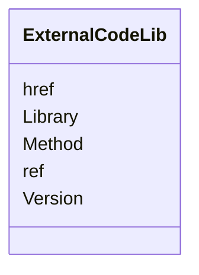

# Class: ExternalCodeLib


URI: [odm:ExternalCodeLib](http://www.cdisc.org/ns/odm/v2.0/ExternalCodeLib)





<!-- no inheritance hierarchy -->


## Slots

| Name | Cardinality and Range | Description | Inheritance |
| ---  | --- | --- | --- |
| [Library](Library.md) | 1..1 <br/> [Name](Name.md) |  | direct |
| [Method](Method.md) | 0..1 <br/> [Name](Name.md) |  | direct |
| [Version](Version.md) | 0..1 <br/> [Text](Text.md) | Version of Standard | direct |
| [ref](ref.md) | 0..1 <br/> [Text](Text.md) |  | direct |
| [href](href.md) | 0..1 <br/> [Uriorcurie](Uriorcurie.md) | URL that can be used to identify the location of a document or dataset file r... | direct |


## Usages

| used by | used in | type | used |
| ---  | --- | --- | --- |
| [FormalExpression](FormalExpression.md) | [ExternalCodeLibRef](ExternalCodeLibRef.md) | range | [ExternalCodeLib](ExternalCodeLib.md) |


## See Also

* [https://wiki.cdisc.org/display/ODM2/ExternalCodeLib](https://wiki.cdisc.org/display/ODM2/ExternalCodeLib)

## Identifier and Mapping Information


### Schema Source


* from schema: http://www.cdisc.org/ns/odm/v2.0


## Mappings

| Mapping Type | Mapped Value |
| ---  | ---  |
| self | odm:ExternalCodeLib |
| native | odm:ExternalCodeLib |


## LinkML Source

<!-- TODO: investigate https://stackoverflow.com/questions/37606292/how-to-create-tabbed-code-blocks-in-mkdocs-or-sphinx -->

### Direct

<details>
```yaml
name: ExternalCodeLib
from_schema: http://www.cdisc.org/ns/odm/v2.0
see_also:
- https://wiki.cdisc.org/display/ODM2/ExternalCodeLib
slots:
- Library
- Method
- Version
- ref
- href
slot_usage:
  Library:
    name: Library
    domain_of:
    - ExternalCodeLib
    range: name
    required: true
  Method:
    name: Method
    domain_of:
    - ExternalCodeLib
    range: name
  Version:
    name: Version
    domain_of:
    - Standard
    - ExternalCodeLib
    range: text
  ref:
    name: ref
    domain_of:
    - ExternalCodeLib
    - Coding
    range: text
  href:
    name: href
    domain_of:
    - leaf
    - Include
    - ExternalCodeLib
    - Image
    - Coding
    range: uriorcurie
class_uri: odm:ExternalCodeLib

```
</details>

### Induced

<details>
```yaml
name: ExternalCodeLib
from_schema: http://www.cdisc.org/ns/odm/v2.0
see_also:
- https://wiki.cdisc.org/display/ODM2/ExternalCodeLib
slot_usage:
  Library:
    name: Library
    domain_of:
    - ExternalCodeLib
    range: name
    required: true
  Method:
    name: Method
    domain_of:
    - ExternalCodeLib
    range: name
  Version:
    name: Version
    domain_of:
    - Standard
    - ExternalCodeLib
    range: text
  ref:
    name: ref
    domain_of:
    - ExternalCodeLib
    - Coding
    range: text
  href:
    name: href
    domain_of:
    - leaf
    - Include
    - ExternalCodeLib
    - Image
    - Coding
    range: uriorcurie
attributes:
  Library:
    name: Library
    from_schema: http://www.cdisc.org/ns/odm/v2.0
    rank: 1000
    alias: Library
    owner: ExternalCodeLib
    domain_of:
    - ExternalCodeLib
    range: name
    required: true
  Method:
    name: Method
    from_schema: http://www.cdisc.org/ns/odm/v2.0
    rank: 1000
    alias: Method
    owner: ExternalCodeLib
    domain_of:
    - ExternalCodeLib
    range: name
  Version:
    name: Version
    description: Version of Standard.
    from_schema: http://www.cdisc.org/ns/odm/v2.0
    rank: 1000
    alias: Version
    owner: ExternalCodeLib
    domain_of:
    - Standard
    - ExternalCodeLib
    range: text
  ref:
    name: ref
    from_schema: http://www.cdisc.org/ns/odm/v2.0
    rank: 1000
    alias: ref
    owner: ExternalCodeLib
    domain_of:
    - ExternalCodeLib
    - Coding
    range: text
  href:
    name: href
    description: URL that can be used to identify the location of a document or dataset
      file relative to the folder containing the ODM file.
    from_schema: http://www.cdisc.org/ns/odm/v2.0
    rank: 1000
    alias: href
    owner: ExternalCodeLib
    domain_of:
    - leaf
    - Include
    - ExternalCodeLib
    - Image
    - Coding
    range: uriorcurie
class_uri: odm:ExternalCodeLib

```
</details>