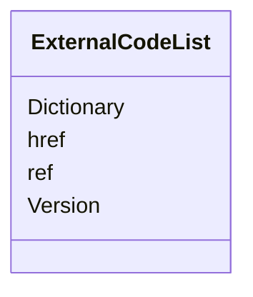

# Class: ExternalCodeList


URI: [odm:ExternalCodeList](http://www.cdisc.org/ns/odm/v2.0/ExternalCodeList)





<!-- no inheritance hierarchy -->


## Slots

| Name | Cardinality and Range | Description | Inheritance |
| ---  | --- | --- | --- |
| [Dictionary](Dictionary.md) | 0..1 <br/> [DictionaryNameType](DictionaryNameType.md) |  | direct |
| [Version](Version.md) | 0..1 <br/> [Text](Text.md) | Version of Standard | direct |
| [href](href.md) | 0..1 <br/> [Uriorcurie](Uriorcurie.md) | URL that can be used to identify the location of a document or dataset file r... | direct |
| [ref](ref.md) | 0..1 <br/> [Text](Text.md) |  | direct |


## Usages

| used by | used in | type | used |
| ---  | --- | --- | --- |
| [CodeList](CodeList.md) | [ExternalCodeListRef](ExternalCodeListRef.md) | range | [ExternalCodeList](ExternalCodeList.md) |


## Identifier and Mapping Information


### Schema Source


* from schema: http://www.cdisc.org/ns/odm/v2.0


## Mappings

| Mapping Type | Mapped Value |
| ---  | ---  |
| self | odm:ExternalCodeList |
| native | odm:ExternalCodeList |


## LinkML Source

<!-- TODO: investigate https://stackoverflow.com/questions/37606292/how-to-create-tabbed-code-blocks-in-mkdocs-or-sphinx -->

### Direct

<details>
```yaml
name: ExternalCodeList
from_schema: http://www.cdisc.org/ns/odm/v2.0
slots:
- Dictionary
- Version
- href
- ref
slot_usage:
  Dictionary:
    name: Dictionary
    domain_of:
    - ExternalCodeList
    range: DictionaryNameType
    required: false
  Version:
    name: Version
    domain_of:
    - ExternalCodeList
    - ExternalCodeLib
    - Standard
    range: text
    required: false
  href:
    name: href
    domain_of:
    - leaf
    - Include
    - ExternalCodeList
    - ExternalCodeLib
    - Image
    - Coding
    range: uriorcurie
    required: false
  ref:
    name: ref
    domain_of:
    - ExternalCodeList
    - ExternalCodeLib
    range: text
    required: false
class_uri: odm:ExternalCodeList

```
</details>

### Induced

<details>
```yaml
name: ExternalCodeList
from_schema: http://www.cdisc.org/ns/odm/v2.0
slot_usage:
  Dictionary:
    name: Dictionary
    domain_of:
    - ExternalCodeList
    range: DictionaryNameType
    required: false
  Version:
    name: Version
    domain_of:
    - ExternalCodeList
    - ExternalCodeLib
    - Standard
    range: text
    required: false
  href:
    name: href
    domain_of:
    - leaf
    - Include
    - ExternalCodeList
    - ExternalCodeLib
    - Image
    - Coding
    range: uriorcurie
    required: false
  ref:
    name: ref
    domain_of:
    - ExternalCodeList
    - ExternalCodeLib
    range: text
    required: false
attributes:
  Dictionary:
    name: Dictionary
    from_schema: http://www.cdisc.org/ns/odm/v2.0
    rank: 1000
    alias: Dictionary
    owner: ExternalCodeList
    domain_of:
    - ExternalCodeList
    range: DictionaryNameType
    required: false
  Version:
    name: Version
    description: Version of Standard.
    from_schema: http://www.cdisc.org/ns/odm/v2.0
    rank: 1000
    alias: Version
    owner: ExternalCodeList
    domain_of:
    - ExternalCodeList
    - ExternalCodeLib
    - Standard
    range: text
    required: false
  href:
    name: href
    description: URL that can be used to identify the location of a document or dataset
      file relative to the folder containing the ODM file.
    from_schema: http://www.cdisc.org/ns/odm/v2.0
    rank: 1000
    alias: href
    owner: ExternalCodeList
    domain_of:
    - leaf
    - Include
    - ExternalCodeList
    - ExternalCodeLib
    - Image
    - Coding
    range: uriorcurie
    required: false
  ref:
    name: ref
    from_schema: http://www.cdisc.org/ns/odm/v2.0
    rank: 1000
    alias: ref
    owner: ExternalCodeList
    domain_of:
    - ExternalCodeList
    - ExternalCodeLib
    range: text
    required: false
class_uri: odm:ExternalCodeList

```
</details>