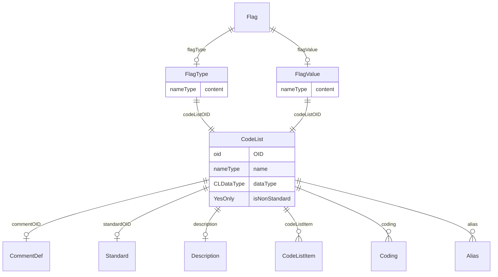

# Class: Flag

_A machine-processable annotation._


URI: [odm:Flag](http://www.cdisc.org/ns/odm/v2.0/Flag)





<!-- no inheritance hierarchy -->


## Slots

| Name | Cardinality* and Range | Description | Inheritance |
| ---  | --- | --- | --- |
| [flagValue](flagValue.md) | 0..1 <br/> [FlagValue](FlagValue.md) | FlagValue reference: The value of the flag. The meaning of this value is typi... | direct |
| [flagType](flagType.md) | 0..1 <br/> [FlagType](FlagType.md) | FlagType reference: The type of flag. This determines the purpose and semanti... | direct |

_* See [LinkML documentation](https://linkml.io/linkml/schemas/slots.html#slot-cardinality) for cardinality definitions._


## Usages

| used by | used in | type | used |
| ---  | --- | --- | --- |
| [Annotation](Annotation.md) | [flag](flag.md) | range | [Flag](Flag.md) |


## See Also

* [https://wiki.cdisc.org/display/PUB/Flag](https://wiki.cdisc.org/display/PUB/Flag)

## Identifier and Mapping Information


### Schema Source


* from schema: http://www.cdisc.org/ns/odm/v2.0


## Mappings

| Mapping Type | Mapped Value |
| ---  | ---  |
| self | odm:Flag |
| native | odm:Flag |


## LinkML Source

<!-- TODO: investigate https://stackoverflow.com/questions/37606292/how-to-create-tabbed-code-blocks-in-mkdocs-or-sphinx -->

### Direct

<details>
```yaml
name: Flag
description: A machine-processable annotation.
from_schema: http://www.cdisc.org/ns/odm/v2.0
see_also:
- https://wiki.cdisc.org/display/PUB/Flag
rank: 1000
slots:
- flagValue
- flagType
slot_usage:
  flagValue:
    name: flagValue
    domain_of:
    - Flag
    range: FlagValue
    maximum_cardinality: 1
  flagType:
    name: flagType
    domain_of:
    - Flag
    range: FlagType
    maximum_cardinality: 1
class_uri: odm:Flag

```
</details>

### Induced

<details>
```yaml
name: Flag
description: A machine-processable annotation.
from_schema: http://www.cdisc.org/ns/odm/v2.0
see_also:
- https://wiki.cdisc.org/display/PUB/Flag
rank: 1000
slot_usage:
  flagValue:
    name: flagValue
    domain_of:
    - Flag
    range: FlagValue
    maximum_cardinality: 1
  flagType:
    name: flagType
    domain_of:
    - Flag
    range: FlagType
    maximum_cardinality: 1
attributes:
  flagValue:
    name: flagValue
    description: 'FlagValue reference: The value of the flag. The meaning of this
      value is typically dependent on the associated FlagType. The actual value must
      be a member of the referenced CodeList'
    from_schema: http://www.cdisc.org/ns/odm/v2.0
    rank: 1000
    alias: flagValue
    owner: Flag
    domain_of:
    - Flag
    range: FlagValue
    maximum_cardinality: 1
  flagType:
    name: flagType
    description: 'FlagType reference: The type of flag. This determines the purpose
      and semantics of the flag.'
    from_schema: http://www.cdisc.org/ns/odm/v2.0
    rank: 1000
    alias: flagType
    owner: Flag
    domain_of:
    - Flag
    range: FlagType
    maximum_cardinality: 1
class_uri: odm:Flag

```
</details>