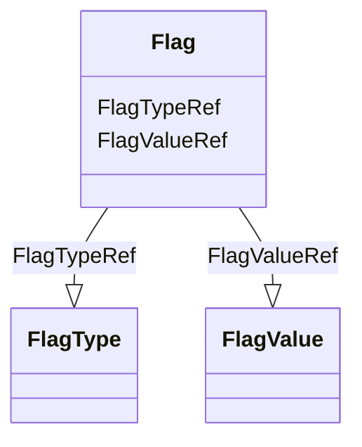

# Class: Flag


URI: [odm:Flag](http://www.cdisc.org/ns/odm/v2.0/Flag)





<!-- no inheritance hierarchy -->


## Slots

| Name | Cardinality and Range | Description | Inheritance |
| ---  | --- | --- | --- |
| [FlagValueRef](FlagValueRef.md) | 1..1 <br/> [FlagValue](FlagValue.md) |  | direct |
| [FlagTypeRef](FlagTypeRef.md) | 0..1 <br/> [FlagType](FlagType.md) |  | direct |


## Usages

| used by | used in | type | used |
| ---  | --- | --- | --- |
| [Annotation](Annotation.md) | [FlagRef](FlagRef.md) | range | [Flag](Flag.md) |


## See Also

* [https://wiki.cdisc.org/display/ODM2/Flag](https://wiki.cdisc.org/display/ODM2/Flag)

## Identifier and Mapping Information


### Schema Source


* from schema: http://www.cdisc.org/ns/odm/v2.0


## Mappings

| Mapping Type | Mapped Value |
| ---  | ---  |
| self | odm:Flag |
| native | odm:Flag |


## LinkML Source

<!-- TODO: investigate https://stackoverflow.com/questions/37606292/how-to-create-tabbed-code-blocks-in-mkdocs-or-sphinx -->

### Direct

<details>
```yaml
name: Flag
from_schema: http://www.cdisc.org/ns/odm/v2.0
see_also:
- https://wiki.cdisc.org/display/ODM2/Flag
slots:
- FlagValueRef
- FlagTypeRef
slot_usage:
  FlagValueRef:
    name: FlagValueRef
    domain_of:
    - Flag
    range: FlagValue
    required: true
    minimum_cardinality: 1
    maximum_cardinality: 1
  FlagTypeRef:
    name: FlagTypeRef
    domain_of:
    - Flag
    range: FlagType
    maximum_cardinality: 1
class_uri: odm:Flag

```
</details>

### Induced

<details>
```yaml
name: Flag
from_schema: http://www.cdisc.org/ns/odm/v2.0
see_also:
- https://wiki.cdisc.org/display/ODM2/Flag
slot_usage:
  FlagValueRef:
    name: FlagValueRef
    domain_of:
    - Flag
    range: FlagValue
    required: true
    minimum_cardinality: 1
    maximum_cardinality: 1
  FlagTypeRef:
    name: FlagTypeRef
    domain_of:
    - Flag
    range: FlagType
    maximum_cardinality: 1
attributes:
  FlagValueRef:
    name: FlagValueRef
    from_schema: http://www.cdisc.org/ns/odm/v2.0
    rank: 1000
    alias: FlagValueRef
    owner: Flag
    domain_of:
    - Flag
    range: FlagValue
    required: true
    minimum_cardinality: 1
    maximum_cardinality: 1
  FlagTypeRef:
    name: FlagTypeRef
    from_schema: http://www.cdisc.org/ns/odm/v2.0
    rank: 1000
    alias: FlagTypeRef
    owner: Flag
    domain_of:
    - Flag
    range: FlagType
    maximum_cardinality: 1
class_uri: odm:Flag

```
</details>