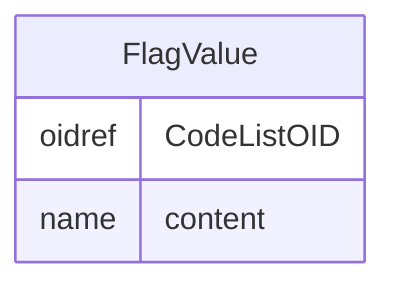

# Class: FlagValue

_The value of the flag. The meaning of this value is typically dependent on the associated FlagType. The actual value must be a member of the referenced CodeList_


URI: [odm:FlagValue](http://www.cdisc.org/ns/odm/v2.0/FlagValue)





<!-- no inheritance hierarchy -->


## Slots

| Name | Cardinality* and Range | Description | Inheritance |
| ---  | --- | --- | --- |
| [CodeListOID](CodeListOID.md) | 1..1 <br/> [oidref](oidref.md) | Reference to the CodeList definition. | direct |
| [content](content.md) | 0..1 <br/> [name](name.md) | multi-line text content from between XML tags | direct |

_* See [LinkML documentation](https://linkml.io/linkml/schemas/slots.html#slot-cardinality) for cardinality definitions._


## Usages

| used by | used in | type | used |
| ---  | --- | --- | --- |
| [Flag](Flag.md) | [FlagValueRef](FlagValueRef.md) | range | [FlagValue](FlagValue.md) |


## See Also

* [https://wiki.cdisc.org/display/ODM2/FlagValue](https://wiki.cdisc.org/display/ODM2/FlagValue)

## Identifier and Mapping Information


### Schema Source


* from schema: http://www.cdisc.org/ns/odm/v2.0


## Mappings

| Mapping Type | Mapped Value |
| ---  | ---  |
| self | odm:FlagValue |
| native | odm:FlagValue |


## LinkML Source

<!-- TODO: investigate https://stackoverflow.com/questions/37606292/how-to-create-tabbed-code-blocks-in-mkdocs-or-sphinx -->

### Direct

<details>
```yaml
name: FlagValue
description: The value of the flag. The meaning of this value is typically dependent
  on the associated FlagType. The actual value must be a member of the referenced
  CodeList
from_schema: http://www.cdisc.org/ns/odm/v2.0
see_also:
- https://wiki.cdisc.org/display/ODM2/FlagValue
rank: 1000
slots:
- CodeListOID
- content
slot_usage:
  CodeListOID:
    name: CodeListOID
    description: Reference to the CodeList definition.
    comments:
    - 'Required

      range: oidref

      The valid values for a FlagValue are provided by the study sponsor. Must match
      the OID for a CodeList element in the Study/MetaDataVersion.'
    domain_of:
    - CodeListRef
    - FlagValue
    - FlagType
    range: oidref
    required: true
  content:
    name: content
    domain_of:
    - TranslatedText
    - Title
    - CheckValue
    - Code
    - WorkflowEnd
    - UserName
    - Prefix
    - Suffix
    - FullName
    - GivenName
    - FamilyName
    - StreetName
    - HouseNumber
    - City
    - StateProv
    - Country
    - PostalCode
    - OtherText
    - Meaning
    - LegalReason
    - DateTimeStamp
    - ReasonForChange
    - SourceID
    - FlagValue
    - FlagType
    - Value
    range: name
class_uri: odm:FlagValue

```
</details>

### Induced

<details>
```yaml
name: FlagValue
description: The value of the flag. The meaning of this value is typically dependent
  on the associated FlagType. The actual value must be a member of the referenced
  CodeList
from_schema: http://www.cdisc.org/ns/odm/v2.0
see_also:
- https://wiki.cdisc.org/display/ODM2/FlagValue
rank: 1000
slot_usage:
  CodeListOID:
    name: CodeListOID
    description: Reference to the CodeList definition.
    comments:
    - 'Required

      range: oidref

      The valid values for a FlagValue are provided by the study sponsor. Must match
      the OID for a CodeList element in the Study/MetaDataVersion.'
    domain_of:
    - CodeListRef
    - FlagValue
    - FlagType
    range: oidref
    required: true
  content:
    name: content
    domain_of:
    - TranslatedText
    - Title
    - CheckValue
    - Code
    - WorkflowEnd
    - UserName
    - Prefix
    - Suffix
    - FullName
    - GivenName
    - FamilyName
    - StreetName
    - HouseNumber
    - City
    - StateProv
    - Country
    - PostalCode
    - OtherText
    - Meaning
    - LegalReason
    - DateTimeStamp
    - ReasonForChange
    - SourceID
    - FlagValue
    - FlagType
    - Value
    range: name
attributes:
  CodeListOID:
    name: CodeListOID
    description: Reference to the CodeList definition.
    comments:
    - 'Required

      range: oidref

      The valid values for a FlagValue are provided by the study sponsor. Must match
      the OID for a CodeList element in the Study/MetaDataVersion.'
    from_schema: http://www.cdisc.org/ns/odm/v2.0
    rank: 1000
    alias: CodeListOID
    owner: FlagValue
    domain_of:
    - CodeListRef
    - FlagValue
    - FlagType
    range: oidref
    required: true
  content:
    name: content
    description: multi-line text content from between XML tags
    from_schema: http://www.cdisc.org/ns/odm/v2.0
    rank: 1000
    alias: content
    owner: FlagValue
    domain_of:
    - TranslatedText
    - Title
    - CheckValue
    - Code
    - WorkflowEnd
    - UserName
    - Prefix
    - Suffix
    - FullName
    - GivenName
    - FamilyName
    - StreetName
    - HouseNumber
    - City
    - StateProv
    - Country
    - PostalCode
    - OtherText
    - Meaning
    - LegalReason
    - DateTimeStamp
    - ReasonForChange
    - SourceID
    - FlagValue
    - FlagType
    - Value
    range: name
    inlined: true
class_uri: odm:FlagValue

```
</details>