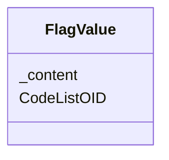

# Class: FlagValue


URI: [odm:FlagValue](http://www.cdisc.org/ns/odm/v2.0/FlagValue)





<!-- no inheritance hierarchy -->


## Slots

| Name | Cardinality and Range | Description | Inheritance |
| ---  | --- | --- | --- |
| [CodeListOID](CodeListOID.md) | 1..1 <br/> [Oidref](Oidref.md) |  | direct |
| [_content](_content.md) | 0..1 <br/> [Name](Name.md) | multi-line text content from between XML tags | direct |


## Usages

| used by | used in | type | used |
| ---  | --- | --- | --- |
| [Flag](Flag.md) | [FlagValueRef](FlagValueRef.md) | range | [FlagValue](FlagValue.md) |


## See Also

* [https://wiki.cdisc.org/display/ODM2/FlagValue](https://wiki.cdisc.org/display/ODM2/FlagValue)

## Identifier and Mapping Information


### Schema Source


* from schema: http://www.cdisc.org/ns/odm/v2.0


## Mappings

| Mapping Type | Mapped Value |
| ---  | ---  |
| self | odm:FlagValue |
| native | odm:FlagValue |


## LinkML Source

<!-- TODO: investigate https://stackoverflow.com/questions/37606292/how-to-create-tabbed-code-blocks-in-mkdocs-or-sphinx -->

### Direct

<details>
```yaml
name: FlagValue
from_schema: http://www.cdisc.org/ns/odm/v2.0
see_also:
- https://wiki.cdisc.org/display/ODM2/FlagValue
slots:
- CodeListOID
- _content
slot_usage:
  CodeListOID:
    name: CodeListOID
    domain_of:
    - CodeListRef
    - FlagValue
    - FlagType
    range: oidref
    required: true
  _content:
    name: _content
    domain_of:
    - TranslatedText
    - CheckValue
    - Code
    - WorkflowEnd
    - UserName
    - Prefix
    - Suffix
    - FullName
    - GivenName
    - FamilyName
    - StreetName
    - HouseNumber
    - City
    - StateProv
    - Country
    - PostalCode
    - OtherText
    - Meaning
    - LegalReason
    - DateTimeStamp
    - ReasonForChange
    - SourceID
    - FlagValue
    - FlagType
    - Value
    range: name
class_uri: odm:FlagValue

```
</details>

### Induced

<details>
```yaml
name: FlagValue
from_schema: http://www.cdisc.org/ns/odm/v2.0
see_also:
- https://wiki.cdisc.org/display/ODM2/FlagValue
slot_usage:
  CodeListOID:
    name: CodeListOID
    domain_of:
    - CodeListRef
    - FlagValue
    - FlagType
    range: oidref
    required: true
  _content:
    name: _content
    domain_of:
    - TranslatedText
    - CheckValue
    - Code
    - WorkflowEnd
    - UserName
    - Prefix
    - Suffix
    - FullName
    - GivenName
    - FamilyName
    - StreetName
    - HouseNumber
    - City
    - StateProv
    - Country
    - PostalCode
    - OtherText
    - Meaning
    - LegalReason
    - DateTimeStamp
    - ReasonForChange
    - SourceID
    - FlagValue
    - FlagType
    - Value
    range: name
attributes:
  CodeListOID:
    name: CodeListOID
    from_schema: http://www.cdisc.org/ns/odm/v2.0
    rank: 1000
    alias: CodeListOID
    owner: FlagValue
    domain_of:
    - CodeListRef
    - FlagValue
    - FlagType
    range: oidref
    required: true
  _content:
    name: _content
    description: multi-line text content from between XML tags
    from_schema: http://www.cdisc.org/ns/odm/v2.0
    rank: 1000
    alias: _content
    owner: FlagValue
    domain_of:
    - TranslatedText
    - CheckValue
    - Code
    - WorkflowEnd
    - UserName
    - Prefix
    - Suffix
    - FullName
    - GivenName
    - FamilyName
    - StreetName
    - HouseNumber
    - City
    - StateProv
    - Country
    - PostalCode
    - OtherText
    - Meaning
    - LegalReason
    - DateTimeStamp
    - ReasonForChange
    - SourceID
    - FlagValue
    - FlagType
    - Value
    range: name
    inlined: true
class_uri: odm:FlagValue

```
</details>